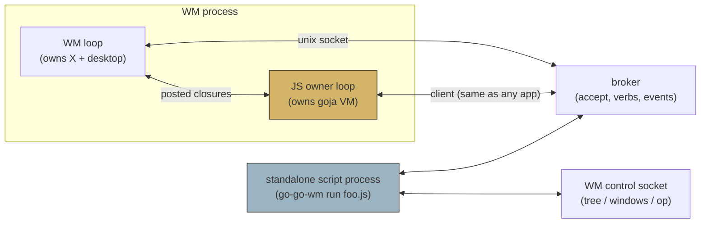

# WM scripting DSL design: modules, primitives, script kinds

## Executive Summary

GGWM-001 built the window manager so that every mutation is a serializable
`wmcore.Op`, every state change is a broker event, every action is a
registered verb, and every interactive read is an accept session. That was
decision D5, made explicitly so that scripting would be bindings, not
surgery. This ticket adds the bindings: a go-go-goja JavaScript layer that
turns the WM into "a grabbag of WM lego blocks".

The design follows three patterns from the knowledge base
([[widget-dsl]] and [[go-go-goja]] MOCs and their tribal notes):

1. **Owner-thread discipline** (`Research/KB/Tribal/goja-execution-model`):
   the goja VM gets its own owning goroutine; the WM loop and the JS loop
   exchange posted closures; blocking work (accepts!) settles Promises back
   on the VM thread. The WM already speaks this pattern (`WM.Post`).
2. **Data-only vs host-access split**
   (`Tribal/data-only-vs-host-access-module-split`): `wm` and `pbui` are
   host-access modules, installed explicitly per script kind; a config
   script gets less than a daemon, a sandboxed "theme function" gets
   nothing but data.
3. **DSL → normalized config → compiled plan**
   (`Tribal/dsl-normalized-config-compiled-plan`): declarative inputs
   (layout recipes, placement rules) are normalized and validated in Go,
   compiled to Op sequences, and only then executed. The runtime never
   sees raw script output.

Two native modules carry the whole surface: **`wm`** (the layout half:
ops, queries, events, keybindings, rules, recipes) and **`pbui`** (the
presentation half: accept, answer, verbs, print, emit, present). JS owns
*composition* — which ops, which verbs, what reacts to what; Go owns state,
validation, X, and the broker, exactly as the DSL design guide prescribes.

## Problem statement: what scripts are for

The point of the prototype's design was that the shell is programmable the
way a Genera Listener was: the environment's own vocabulary (objects,
accepts, verbs) is available to user code. Concretely, scripts exist to
let the user do six kinds of things without writing Go:

| # | script kind | example | lifetime | needs |
|---|---|---|---|---|
| S1 | **one-shot macro** | "split the focused tile 2:1 and open a terminal below" | runs and exits | wm ops |
| S2 | **startup config (rc.js)** | keybindings, named workspaces, placement rules, spawn defaults | evaluated at WM start | wm ops + binds + rules |
| S3 | **verb pack** | give every `<git-commit>` a "Show in terminal" verb backed by `git show` | daemon (verb owner) | pbui verbs + exec |
| S4 | **command** | "Palette…": accept two colors, print a five-step gradient of live swatches | daemon or macro | pbui accept/print |
| S5 | **agent / automation** | route new browser windows to the "web" workspace; log every accepted object to a file | daemon (event subscriber) | wm events + ops |
| S6 | **scripted app** | a pomodoro tile; a project switcher that builds a whole dev layout | daemon, later with UI surface | everything; later `ui` |

The REPL (`go-go-wm repl`) is not a seventh kind — it is kinds S1–S5
executed interactively, using go-go-goja's existing session machinery
(`pkg/replapi`, IIFE rewriting, profiles).

## Where scripting attaches

The architecture from GGWM-001 gives exactly three seams, and all three
should exist, because they serve different script kinds:



**A1 — in-process runtime (`rc.js` + `go-go-wm repl`).** One goja VM
inside the WM process, on its own owner goroutine (never the WM loop: a
slow script must not freeze the compositor of record). `wm.*` calls post
closures into the WM loop and settle Promises back; keybindings are the
one primitive that *requires* this attachment point, since key grabs live
in the WM. This is where S1 (via repl), S2, and S5 run by default.

**A2 — standalone script processes (`go-go-wm run script.js`).** The same
modules, but `wm` is backed by the control socket and `pbui` by a broker
client connection — a script is a peer of the demo apps, symmetric by
decision D2 (the broker never grants side channels). S3, S4, S6 run here;
a crashed script cannot take the WM down, and its verbs vanish cleanly on
disconnect because verb ownership already dies with the connection.

**A3 — one-shot (`go-go-wm run --once macro.js`).** A2 without staying
resident: run to completion (awaiting pending Promises), exit. S1's
scripted form.

The decisive property: **the API is identical across attachment points.**
A script developed in the REPL runs unchanged as a daemon, because both
`wm` implementations speak the same Op/query vocabulary and both `pbui`
implementations speak the same wire protocol. Only capability defaults
differ (see below).

## The module surface

### `require("wm")` — the layout half

Everything is sugar over two primitives that already exist:
`apply(op) → result` and `events → callbacks`.

| primitive | signature | notes |
|---|---|---|
| `wm.tree()` | `() → Desktop` (JSON) | the `{"q":"tree"}` query |
| `wm.windows()` | `() → WindowInfo[]` | the `{"q":"windows"}` query |
| `wm.apply(op)` | `(Op) → Result` | the escape hatch; everything below compiles to this |
| `wm.focused()` | `() → leafId` | |
| `wm.split(leaf?, dir, opts?)` | → new leaf id | `opts.ratio` applies a follow-up set-ratio |
| `wm.close(leaf)` / `wm.setRatio(split, r)` / `wm.swap(a,b)` / `wm.moveSplit(from,to,zone)` | | 1:1 with Ops |
| `wm.workspace(name)` | fluent: `.switch()`, `.rename()`, `.clone()`, `.remove()` | creates on first use |
| `wm.spawn(cmd, opts?)` | → pid | host-access; the Mod4-Return path |
| `wm.on(event, fn)` / `wm.off(id)` | event bus subscription | fn runs on the JS owner loop |
| `wm.bind(combo, fn)` | keybinding → JS | **A1 only** |
| `wm.rule({match, actions})` | placement rule | normalized + compiled, see below |
| `wm.layout(name, spec)` / `wm.applyLayout(name)` | named recipes | normalized + compiled |

### `require("pbui")` — the presentation half

A thin, promise-shaped skin over `pkg/pbui/client`:

| primitive | signature | notes |
|---|---|---|
| `pbui.accept(ptypes, prompt)` | `→ Promise<Object\|null>` | null = cancelled; the Promise settles on the JS owner loop |
| `pbui.answer(obj, session?)` | | for scripted pickers |
| `pbui.cancel()` | | Escape, mechanized |
| `pbui.verb({id, label, ptypes, accepts?}, fn)` | registers + owns the verb; `fn(obj)` runs on verb.invoke | |
| `pbui.menu(obj, x?, y?)` | pop the type-directed menu | |
| `pbui.print(...segs)` | segments: strings or `{ptype, value}` | the listener.print event |
| `pbui.emit(event, data)` / `pbui.on(event, fn)` | event bus | |
| `pbui.object(ptype, value, label?)` / `pbui.uri(obj)` / `pbui.parse(uri)` | object/URI helpers (data-only) | |
| `pbui.link(obj, text?)` | OSC 8 string (data-only) | for scripts that print to terminals |

Deliberate omissions, per the DSL guide's "smallest JavaScript shape":
no raw socket access, no X handles, no frame/pixel access. When scripted
*surfaces* arrive (S6's UI), they will be a `ui` module producing the
existing Region IR — the widget-dsl pattern applied literally: JS authors
intent (`ui.button(...)`, `ui.chips(...)`), Go normalizes to `[]apps.Region`,
the existing hosts render. That is a later phase; the IR already exists.

### Declarative parts: normalize, then compile

`wm.rule` and `wm.layout` accept declarative specs, and the tribal rule
applies: never execute raw user input. A rule like

```javascript
wm.rule({ match: { class: /firefox/i }, workspace: "web", focus: false });
```

is normalized in Go (defaults filled, regex compiled, unknown keys
rejected with errors *at registration time*) into a validated matcher, and
its effect is compiled to Op sequences at match time. A layout spec

```javascript
wm.layout("dev", {
  split: "row", ratio: 1/3,
  a: { app: "builtin:listener" },
  b: { split: "col", ratio: 2/3, a: { spawn: "kitty" }, b: { app: "builtin:trace" } },
});
```

normalizes into a plan — a tree-shaped list of split-leaf / set-leaf-app /
spawn steps with validated ratios — and `applyLayout` executes the plan
through `wmcore.Apply`. Validation errors surface when the script defines
the layout, not when a window happens to map.

## Runtime architecture and safety

The invariants, restated as this project's law (they are the six working
rules of the go-go-goja KB, specialized):

1. **One VM, one owner goroutine.** All goja access happens on the JS
   owner loop. `wm.on` / `pbui.verb` / Promise settlements are closures
   posted to it — never called from the WM loop, a broker reader, or a
   worker directly.
2. **The WM loop never runs JS.** In A1, `wm.apply` posts an op-closure
   to the WM loop and the result travels back as a settled Promise (or a
   synchronous return for queries, which post-and-wait with a deadline).
   A pathological script slows only itself.
3. **Accepts never block a loop.** `pbui.accept` starts the broker request
   on a worker goroutine and settles the Promise on the VM thread — the
   Node-like-Primitives async-module pattern verbatim.
4. **JSON at the boundary.** Objects crossing the seam are the wire types
   (`Op`, `Object`, `Verb`, events) — no `goja.Value` retained by Go, no
   Go pointers leaked to JS. Fluent builders (`wm.workspace(...)`) keep
   their state in Go.
5. **Capabilities are installed, not ambient.** `pbui.object/uri/link`
   are data-only and always present. `wm.spawn` and `exec` are
   host-access and off by default for A2 scripts unless `--allow-exec`;
   rc.js (A1) gets them because the user already trusts the WM binary.
6. **Errors are events.** A throwing verb handler or event callback
   rejects/logs to the event bus (`script.error`) and the trace tile —
   visible where everything else is visible — rather than killing the VM.

## Design decisions

### Decision: two modules (`wm`, `pbui`), not one `desktop` module

- **Context:** the system has two halves with different backends (control
  socket vs broker) and different capability weights.
- **Decision:** mirror the architecture: `wm` = layout/ops/events-of-ops,
  `pbui` = objects/accept/verbs. A script that only registers verbs never
  links layout control.
- **Consequences:** two small docs, two capability switches; a composed
  `require("wm")` + `require("pbui")` script is still trivial.
- **Status:** accepted

### Decision: in-process runtime is a *separate* owner loop, not the WM loop

- **Context:** goja is single-threaded; the WM loop must never stall.
- **Options:** run JS on the WM loop between X events (simple, but a
  `while(true)` freezes the display); separate owner loop with posted
  closures (the tribal pattern).
- **Decision:** separate loop; post-and-settle in both directions.
- **Consequences:** queries from JS are async or bounded-wait; keybinding
  handlers get queued not inlined — acceptable, humans are slow.
- **Status:** accepted

### Decision: standalone scripts are broker/IPC clients with zero new protocol

- **Context:** D2 (GGWM-001) made the WM a peer on its own protocol.
- **Decision:** `go-go-wm run` wires the same modules to `client.Client` +
  `wmx11.QueryIPC`. No new messages; verb lifetime = connection lifetime.
- **Consequences:** scripts are exactly as powerful as Go demo apps; the
  protocol remains the single contract to fuzz and version.
- **Status:** accepted

### Decision: promise-based accept, callback-based verbs/events

- **Context:** accept is a one-shot rendezvous (the prototype awaited it);
  verbs and events are streams.
- **Decision:** `await pbui.accept(...)` / `pbui.verb(..., fn)` /
  `wm.on(..., fn)`. Matches both the prototype's mental model and goja's
  Promise support; sequential multi-accept commands read as straight-line
  async code, which is the whole point of accept.
- **Status:** accepted

### Decision: declarative rule/layout specs go through normalize→compile

- **Context:** tribal pattern; validation errors must precede execution.
- **Decision:** Go-side normalizers with hard errors at definition time;
  compiled plans of Ops; plans inspectable via `wm.layouts()` for tests.
- **Status:** accepted

### Decision: xgoja provider packaging deferred, shape preserved

- **Context:** the KB composes generated binaries from provider packages.
- **Decision:** implement modules as ordinary `modules.NativeModule`s
  (init + `modules.Register`) with constructor-injected capabilities, so
  wrapping them as xgoja providers later is packaging, not redesign.
- **Status:** accepted

## Implementation phases

1. **P1 — `pbui` module + `go-go-wm run [--once]`** (A2/A3 first: no VM
   inside the WM yet, everything testable against a bare broker). Engine
   from `go-go-goja/pkg/engine`; module in `pkg/jsmod/pbuimod`.
2. **P2 — `wm` module over the control socket** (queries, apply, sugar,
   events via broker subscription). Integration test: a script builds a
   layout in Xvfb, assertions via `wm.tree()` itself.
3. **P3 — in-process runtime**: JS owner loop in the WM, `--rc` flag,
   `wm.bind`, capability wiring; `go-go-wm repl` reusing `pkg/replapi`
   against the same in-process VM (A1) or a standalone one (A2).
4. **P4 — rules + layouts** (normalize→compile), `script.error` events,
   docs + example scripts shipped under `examples/scripts/`.
5. **P5 (later ticket) — `ui` module**: scripted surfaces emitting Region
   IR into an xapp host; xgoja provider packaging.

## Canonical examples

The examples below are the acceptance bar for the API's feel; they live in
`examples/scripts/` once P1–P4 land. (Shown in ascending order of
ambition; see the ticket index for the full set.)

`golden.js` — S1 macro:

```javascript
const wm = require("wm");
const leaf = wm.focused();
const below = wm.split(leaf, "col", { ratio: 2/3 });
wm.spawn("kitty", { leaf: below });
```

`rc.js` — S2 config (excerpt):

```javascript
const wm = require("wm");
["code", "web", "chat"].forEach((n) => wm.workspace(n));
wm.rule({ match: { class: /firefox/i }, workspace: "web" });
wm.bind("Mod4-p", async () => {
  const pbui = require("pbui");
  const c = await pbui.accept(["color"], "PICK — a color for the root");
  if (c) wm.setRootColor(c.value);          // illustrative future primitive
});
```

`git-verbs.js` — S3 verb pack:

```javascript
const pbui = require("pbui");
const exec = require("exec");               // host-access, --allow-exec
pbui.verb({ id: "git.show", label: "Show commit", ptypes: ["git-commit"] },
  async (obj) => {
    const out = await exec.run("git", ["show", "--stat", obj.value]);
    pbui.print({ ptype: "git-commit", value: obj.value }, " → " + out.stdout.split("\n")[0]);
  });
```

`palette.js` — S4 accept-composing command, and `router.js` — S5 agent —
are given in full in the ticket index; the S6 `project-switcher.js` (accept
a `<directory>`, build a dev layout, register a session verb) is the
end-to-end target that exercises every primitive at once.

## Risks and open questions

1. **Reentrancy:** a verb handler that calls `pbui.accept` re-enters the
   accept machinery while a menu interaction is mid-flight — the broker's
   supersede semantics cover it, but the REPL UX needs care.
2. **Slow-script backpressure** on the event bus: the client already drops
   for slow consumers; scripts should get a `wm.on(..., {queue: N})` knob
   rather than silent unbounded growth.
3. **Keybinding conflicts** between rc.js and built-ins: last-bind-wins
   plus a `wm.binds()` query, or explicit override flag?
4. **Capability granularity for A2:** per-script flags now
   (`--allow-exec`, `--allow-spawn`); a Capsule-Lab-style permission
   manifest later?
5. **How much sugar:** the fluent `wm.workspace()` is justified by
   invariants (name-or-create); resist builder-izing everything the Op
   vocabulary already states clearly.

## References

- GGWM-001 design docs 01/02 (this repo, `ttmp/2026/07/18/GGWM-001-…`) —
  D2 (broker symmetry) and D5 (ops-as-data) are the load-bearing priors.
- Vault MOCs: `Research/KB/Projects/go-go-goja.md`,
  `Research/KB/Projects/widget-dsl.md`.
- Tribal notes: `goja-execution-model` (owner thread, sessions),
  `data-only-vs-host-access-module-split`,
  `dsl-normalized-config-compiled-plan`.
- Articles: "Designing DSLs with go-go-goja" (JS owns composition, Go owns
  domain state), "Goja Fluent-Builder DSLs", jsverbs project report.
- Code: `go-go-goja/modules/common.go` (`NativeModule`, `Register`),
  `go-go-goja/pkg/engine`, `go-go-goja/pkg/replapi`.
