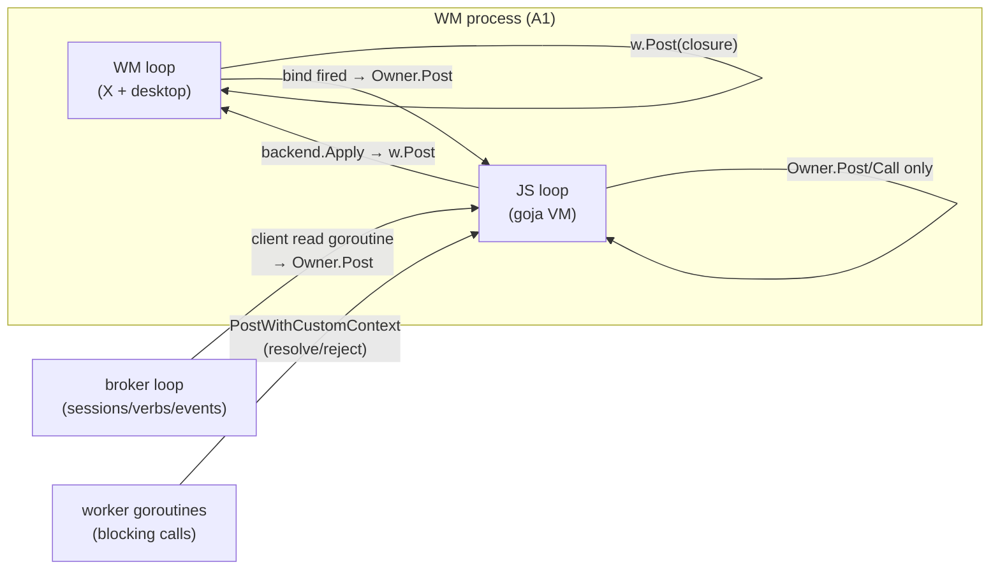

# Intern implementation guide: building the `wm` and `pbui` goja modules

## Executive summary

You are adding a JavaScript scripting layer to go-go-wm. Design doc 01 of
this ticket decided *what* to build: two native modules (`wm`, `pbui`),
three attachment points (in-WM runtime, standalone script processes,
one-shot macros), promise-based accept, and a normalize→compile pipeline
for declarative rules and layouts. This guide explains *how*: which
existing APIs you build on in both repositories, exactly which files you
create, the concurrency rules you must not break, and how each phase is
tested.

The essential prior fact: **everything you need already exists as a seam.**
GGWM-001 deliberately shaped the WM so that scripting is bindings, not
surgery (its decision D5). Your job is plumbing three existing Go surfaces
into a goja VM without violating thread ownership.

## How to read this guide

Parts I–II are background (the WM's seams; go-go-goja's runtime model) —
read them once, carefully. Parts III–V are the build plan (files, module
implementations, commands). Part VI is the concurrency contract — read it
twice. Parts VII–VIII are testing and the phased task list.

Repositories (both in the `go.work` workspace):

- WM: `/home/manuel/workspaces/2026-07-18/go-go-wm/go-go-wm`
- goja stack: `/home/manuel/workspaces/2026-07-18/go-go-wm/go-go-goja`

---

## Part I — The WM surfaces you are wrapping

You will not touch X11 code, broker internals, or the layout engine. You
wrap four existing surfaces. Read each referenced file before starting.

### I.1 Ops and `wmcore.Apply` — the mutation vocabulary

`pkg/wmcore/ops.go` defines the serializable `Op` struct (`op`, `node`,
`target`, `dir`, `zone`, `ratio`, `app`, `workspace`, `name` fields) and
eleven op names (`split-leaf`, `close-leaf`, `set-ratio`, `set-leaf-app`,
`swap-leaves`, `move-split`, `add-workspace`, `remove-workspace`,
`rename-workspace`, `clone-workspace`, `switch-workspace`). `Apply`
validates and executes; errors leave the desktop unchanged. **Every layout
primitive in the `wm` module compiles to these Ops** — you never mutate
the tree any other way.

### I.2 The WM control socket — queries and ops from outside

`pkg/wmx11/ipc.go` serves NDJSON on `$XDG_RUNTIME_DIR/go-go-wm.sock`:

```
{"q":"tree"}                 → {"ok":true,"data":{workspaces,current}}
{"q":"windows"}              → {"ok":true,"data":[WindowInfo…]}
{"q":"op","op":{Op…}}        → {"ok":true,"data":{new_leaf?,new_workspace?}}
```

`wmx11.QueryIPC(socket, req, resp)` is the client helper the standalone
`wm` backend uses. Requests are dispatched onto the WM loop via
`w.Post(...)` and answered synchronously — one request, one reply, per
connection line.

### I.3 The broker client — accept, verbs, events, print

`pkg/pbui/client/client.go` is the complete pbui participant API:

| Go method | JS primitive it backs |
|---|---|
| `Accept(ctx, ptypes, prompt) (*Object, error)` | `pbui.accept` (blocks; run in a goroutine) |
| `Answer(ctx, session, obj)` / `Cancel(ctx, session)` | `pbui.answer` / `pbui.cancel` |
| `RegisterVerbs(ctx, []Verb)` + `OnVerbRun(fn)` | `pbui.verb` |
| `Emit(ctx, event, data)` / `Events(ctx) <-chan *Msg` | `pbui.emit` / `pbui.on`, `wm.on` |
| `RequestMenu(ctx, obj, x, y)` | `pbui.menu` |
| `Hover(text)` | `pbui.doc` |

Callbacks (`OnVerbRun`, `OnAcceptMode`, …) fire on the client's read
goroutine — **never call into the VM from them directly** (Part VI).
`listener.print` is not a method: it is an `Emit("listener.print",
{segs:[…]})` convention (see `pkg/apps/xapp/xapp.go:segsToWire`).

### I.4 Object model helpers — data-only

`pkg/pbui/object.go` (`NewObject`, `ObjectToURI`, `ObjectFromURI`,
`TypeMatches`) and `pkg/pbui/present/present.go` (`Link`, `Face`) back the
data-only `pbui.object/uri/parse/link` primitives. They involve no I/O and
are safe in every capability profile.

---

## Part II — The go-go-goja runtime model

Everything below is current API, verified against the workspace checkout.

### II.1 Factory → Runtime → Owner → Loop

The modern entry point is the runtime factory
(`go-go-goja/pkg/engine/factory.go`):

```go
builder := engine.NewRuntimeFactoryBuilder(/* opts */)
builder.AddModule(engine.NativeModuleRegistrar{
    ModuleID: "wm", ModuleName: "wm", Loader: wmLoader,   // require.ModuleLoader
})
factory, err := builder.Build()
rt, err := factory.NewRuntime()   // → engine.Runtime
```

`engine.Runtime` bundles the four things you will use constantly:

- `rt.VM *goja.Runtime` — the interpreter. Single-threaded. Never touch it
  except on its owner.
- `rt.Loop *eventloop.EventLoop` — the goja_nodejs event loop. Started by
  `NewRuntime`; it is the goroutine that owns the VM and runs timers,
  Promise jobs, and posted closures.
- `rt.Owner runtimeowner.RuntimeOwner` — the marshaling API:
  `Owner.Call(ctx, opName, fn)` runs `fn(ctx, vm)` on the loop and returns
  its result; `Owner.Post(ctx, opName, fn)` schedules without waiting.
  This is the tribal owner-thread pattern, already built.
- `rt.Require` — resolves `require("wm")` to your loader.

The factory also installs `console`, `buffer`, `url`, timers, and (if
enabled) the **data-only default registry modules** — the capability split
from the KB is already a factory concept; host-access modules like yours
are added explicitly per profile.

### II.2 The promise settlement pattern (copy this exactly)

`go-go-goja/modules/fs/fs_async.go` is the canonical async native
function. The shape:

```go
func acceptAsync(vm *goja.Runtime, cl *client.Client, ptypes []string, prompt string) goja.Value {
    promise, resolve, reject := vm.NewPromise()          // on the VM thread
    services := runtimebridge.Load(vm)                    // Loop/Owner handle stored by the factory
    callCtx := services.LifetimeContext
    go func() {                                           // worker: blocking broker I/O
        obj, err := cl.Accept(callCtx, ptypes, prompt)
        if err != nil {
            _ = services.PostWithCustomContext(callCtx, "pbui.accept.reject",
                func(_ context.Context, vm *goja.Runtime) { _ = reject(vm.ToValue(err.Error())) })
            return
        }
        _ = services.PostWithCustomContext(callCtx, "pbui.accept.resolve",
            func(_ context.Context, vm *goja.Runtime) {
                if obj == nil { _ = resolve(goja.Null()); return }   // cancelled
                _ = resolve(vm.ToValue(objectToJS(obj)))
            })
    }()
    return vm.ToValue(promise)
}
```

Three rules are encoded here and apply to every async primitive you write:

1. `vm.NewPromise()` happens on the VM thread (inside a loader-installed
   function, which always runs there).
2. The blocking call happens in a fresh goroutine.
3. `resolve`/`reject` are only ever invoked from a closure posted back via
   `runtimebridge` services — never from the worker goroutine directly.

### II.3 Callbacks from Go into JS

Verb handlers and event subscriptions go the other direction: Go decides
*when*, JS supplies the function. Store the `goja.Callable`, and invoke it
only via `Owner.Post`:

```go
cl.OnVerbRun(func(verbID string, obj *pbui.Object) {   // broker read goroutine!
    _ = owner.Post(ctx, "pbui.verb."+verbID, func(_ context.Context, vm *goja.Runtime) {
        fn, ok := handlers[verbID]; if !ok { return }
        if _, err := fn(goja.Undefined(), vm.ToValue(objectToJS(obj))); err != nil {
            emitScriptError(cl, verbID, err)             // the script.error event
        }
    })
})
```

A `goja.Value` (including a Callable) belongs to one VM forever. Never
store one across runtimes, never call it off-loop.

### II.4 Sessions and the REPL (for P3)

`go-go-goja/pkg/replapi`, `pkg/replsession`, `pkg/repldb` implement REPL
sessions (profiles, IIFE cell rewriting so `let` bindings persist across
cells, replay-based restore). `go-go-wm repl` should *wrap* this API, not
reimplement it: construct the same factory (same modules, same
capabilities), then hand the runtime to a repl session. Read the tribal
note `goja-execution-model` in the parc vault before touching this —
especially the IIFE-capture and don't-block-the-owner rules.

---

## Part III — Package layout

New files, all in the WM repo:

```
pkg/jsmod/
  bridge.go            objectToJS / jsToObject / opFromJS: wire types ⇄ plain JS objects
  errors.go            script.error event emission helper
  pbuimod/
    module.go          loader; wires client.Client into the primitives
    accept.go          accept/answer/cancel (promise pattern)
    verbs.go           verb registration + callback dispatch
    data.go            object/uri/parse/link (data-only, no client needed)
  wmmod/
    module.go          loader; takes a Backend
    backend.go         Backend interface + ipcBackend (QueryIPC) 
    backend_inproc.go  inprocBackend (posts closures into *wmx11.WM)   [P3]
    sugar.go           split/close/swap/workspace()/… → Ops
    events.go          wm.on/off via broker subscription
    rules.go           rule + layout normalize→compile                  [P4]
pkg/cmds/
  run.go               `go-go-wm run [--once] script.js` (+ capability flags)
  repl.go              `go-go-wm repl`                                  [P3]
examples/scripts/
  golden.js  rc.js  git-verbs.js  palette.js  router.js  project-switcher.js
```

`pkg/jsmod/wmmod/backend.go` is the file that makes one API serve two
attachment points:

```go
type Backend interface {
    Tree(ctx context.Context) (json.RawMessage, error)
    Windows(ctx context.Context) ([]wmx11.WindowInfo, error)
    Apply(ctx context.Context, op wmcore.Op) (wmcore.Result, error)
    Bind(combo string, fire func()) error   // ErrUnsupported on ipcBackend
    Spawn(cmd string, opts SpawnOpts) error
}
```

`ipcBackend` implements it over `wmx11.QueryIPC` (A2/A3). `inprocBackend`
implements it by posting closures into the WM loop and waiting on a reply
channel (A1) — the same shape as `wmx11.dispatchIPC`, minus the socket.
The module code above the interface is identical in both worlds, which is
what makes "develop in the REPL, deploy as a daemon" true.

---

## Part IV — Module implementation notes

### IV.1 `pbuimod`

The loader is a standard `require.ModuleLoader`: populate `exports` with
functions closed over the `client.Client` and the owner services.

- **accept**: II.2 verbatim. Map `nil` object → `null` (cancelled), never
  a rejection — cancellation is a normal outcome in this system.
- **verb**: validate the descriptor in Go at registration time (id
  non-empty, ptypes non-empty — normalize-then-fail-early, the tribal
  rule); call `RegisterVerbs` on a worker; store the Callable in a map
  owned by the module; dispatch per II.3. Re-registration with the same id
  replaces the handler.
- **print**: accept varargs of strings and `{ptype, value}` objects,
  convert via `bridge.go`, `Emit("listener.print", {segs})` on a worker.
- **on(event, fn)**: one `Events(ctx)` subscription per module instance,
  fanned out to JS handlers on the loop. Buffer with a bounded queue
  (default 256) and emit `script.error` with a `dropped` count on
  overflow — never grow unboundedly, never block the read goroutine.
- **data.go** primitives take and return plain values; no services, no
  goroutines. They are also registered in the data-only profile.

### IV.2 `wmmod`

- **Queries** (`tree`, `windows`, `focused`): synchronous from the JS point
  of view but bounded — `Owner`-side they run `backend.X(ctx)` with a
  2-second deadline; a timeout throws a JS exception. (Queries are fast
  local socket round-trips; promises here would make every rc.js line
  `await` for no benefit. Mutations stay synchronous for the same reason —
  `apply` returns the Result or throws.)
- **Sugar**: pure translation to Ops in `sugar.go` — e.g.
  `split(leaf, dir, {ratio})` issues `split-leaf`, then optionally
  `set-ratio` on the *parent split* returned in the Result; look at how
  `pkg/wmx11/pbui.go:runVerb` does the same today.
- **`workspace(name)`**: the one fluent object, because it owns an
  invariant (find-by-name-or-create-on-first-use). Its methods
  (`.switch() .rename() .clone() .remove()`) each compile to one Op.
  State (the resolved id) lives in Go, per the DSL design guide.
- **bind** (A1 only): `inprocBackend.Bind` posts a
  `keybind.KeyPressFun(...).Connect` onto the WM loop; the `fire` closure
  posts back to the JS loop. `ipcBackend.Bind` returns a clear error
  naming the reason ("keybindings require the in-process runtime; put
  this in rc.js").

### IV.3 Rules and layouts (P4): normalize → compile → execute

Follow `Tribal/dsl-normalized-config-compiled-plan` strictly:

```
raw JS object → Normalize (Go)            → CompiledRule / LayoutPlan → Execute
                errors at *definition* time   inspectable, immutable      Ops only
```

Pseudocode for the layout normalizer:

```
normalizeLayout(spec):
    if spec has "app" or "spawn": return LeafStep(spec)      # validate app name / command here
    require spec.split ∈ {row, col}; ratio ∈ [0.1, 0.9] (default 0.5)
    return SplitStep(dir, ratio, normalizeLayout(spec.a), normalizeLayout(spec.b))

compile(plan, targetLeaf):
    walk plan depth-first; for each SplitStep emit split-leaf(+set-ratio);
    for each LeafStep emit set-leaf-app or record spawn(leaf) side effect
```

Rules: matchers compile regexes and reject unknown keys at
`wm.rule(...)` time; the agent that applies them is the module itself
subscribing to `window.managed` — a rule is sugar over S5, not a new WM
mechanism. Expose `wm.layouts()` / `wm.rules()` returning the normalized
forms so tests assert on plans without executing them.

---

## Part V — Commands

**`run.go`**: parse flags (`--socket`, `--wm-socket`, `--once`,
`--allow-exec`, `--allow-spawn`); build the factory with `pbuimod` +
`wmmod(ipcBackend)` (+ `exec` module from go-go-goja only under
`--allow-exec`); connect the broker client with the script's basename as
client `Name` (that name is verb ownership — document it); run the script
via `Owner.Call`; `--once` waits for the loop to drain pending jobs then
exits, daemon mode blocks until signal or broker disconnect.

**wm command extension (P3)**: a `--rc ~/.config/go-go-wm/rc.js` flag; the
WM constructs the JS runtime *after* `connectBroker()`, with
`wmmod(inprocBackend)` and its own broker client (a second connection —
scripts must go through the socket like everyone else, per D2), evaluates
rc.js, and keeps the runtime alive for keybinding callbacks.

**`repl.go` (P3)**: `pkg/replapi` session over the same factory;
`--attach` variant connects to a running WM's sockets (A2 semantics) so
you can drive your live desktop from a terminal.

---

## Part VI — The concurrency contract

Three event loops exist. Memorize the diagram; every bug in this ticket's
domain is a violation of one arrow.



The rules, as a checklist for review:

1. Every `goja.*` touch is on the JS loop (via loader execution,
   `Owner.Call`, or a posted closure). Grep for `vm.` outside those —
   any hit is a bug.
2. The WM loop never executes JS. It executes Ops posted by the JS side.
3. No loop blocks on another loop's work: WM→JS and JS→WM crossings are
   posts; only bounded-deadline `Call`s are allowed for queries.
4. Worker goroutines settle promises only through `runtimebridge`
   services.
5. A throwing JS handler produces a `script.error` event (visible in the
   trace tile, like everything else) — it never kills the VM or the WM.
6. Client callbacks (`OnVerbRun` etc.) run on the broker-client read
   goroutine; their bodies must be a single `Owner.Post`.

Failure modes to expect (specialized from the tribal note's "common
mistakes"): calling `resolve()` in the worker (intermittent panics under
load); `wm.bind` handlers doing sync queries with no deadline (deadlock:
JS waits on WM, WM waits on JS — the deadline plus post-only crossing
prevents the cycle); storing a Callable from an rc.js run and invoking it
after a future runtime restart (replay-restore semantics: rebind instead).

---

## Part VII — Testing strategy

Same philosophy as GGWM-001: logic without a display, X only for the
seams.

1. **`pbuimod` against a bare broker** (no X): start
   `broker.ListenAndServe` on a tmpdir socket, run scripts via a factory
   in-process, assert with a second Go client. Cases: accept resolves /
   cancel resolves null / verb round-trip / print appears as
   `listener.print` event / event-overflow emits `script.error`.
2. **`wmmod` unit**: fake `Backend` recording Ops — assert sugar compiles
   to the exact Op sequences; rules/layouts asserted on normalized plans
   (no execution). Property test: random sugar calls vs direct
   `wmcore.Apply` on a mirror desktop produce identical trees.
3. **Bridge fuzz**: `jsToObject`/`opFromJS` on arbitrary JS-shaped input
   (maps, weird numbers) — reject, never panic.
4. **A2 integration in Xvfb**: run the WM, execute
   `examples/scripts/golden.js` via `go-go-wm run --once`, assert with
   `wm.tree()` output itself (the script asserts its own postconditions
   and exits non-zero on failure — scripts as test harness).
5. **A1 smoke**: WM with `--rc testdata/rc-smoke.js` that binds a key and
   applies a layout; drive with xdotool; assert via control socket.
6. **Examples are fixtures**: everything in `examples/scripts/` runs in CI
   (the terminal-only ones against the bare broker; the layout ones in the
   Xvfb job).

---

## Part VIII — Phased plan (mirrors tasks.md)

- **P1 — `pbuimod` + `run`** (~2 days): bridge.go, pbuimod, run.go with
  capability flags, test suite 1+3, examples `git-verbs.js`, `palette.js`.
  Demo: palette.js against the live desktop.
- **P2 — `wmmod` over IPC** (~1–2 days): backend.go/ipcBackend, sugar,
  events, tests 2+4, examples `golden.js`, `router.js`. Demo: golden.js
  reshapes the Xvfb desktop.
- **P3 — in-process runtime + REPL** (~2–3 days): inprocBackend, `--rc`,
  `wm.bind`, repl.go on replapi, test 5, example `rc.js`. Demo: live
  REPL against your own session.
- **P4 — rules + layouts** (~1–2 days): rules.go normalize→compile,
  `script.error` plumbing, `project-switcher.js`, docs pass (`glaze help`
  topics for the module APIs).
- **P5 (separate ticket) — `ui` module + xgoja providers**: scripted
  surfaces emitting the existing `apps.Region` IR; provider packaging per
  the xgoja playbook.

## Open questions carried from design doc 01

Reentrancy of accept inside verb handlers (broker supersede covers it;
REPL UX needs a decision), backpressure knob shape (`{queue: N}` option
vs global), keybinding conflict policy, and whether A2 capability flags
grow into a Capsule-Lab-style manifest. None block P1.

## References

- This ticket: `design-doc/01-wm-scripting-dsl-design-modules-primitives-script-kinds.md`.
- GGWM-001 docs 01/02 (architecture, D2/D5, Region IR).
- WM code: `pkg/wmcore/ops.go`, `pkg/wmx11/ipc.go`,
  `pkg/pbui/client/client.go`, `pkg/pbui/object.go`, `pkg/apps/apps.go`.
- go-go-goja code: `pkg/engine/factory.go` (builder, Runtime, data-only
  defaults), `pkg/engine/module_specs.go` (`NativeModuleRegistrar`),
  `pkg/runtimeowner` (owner Call/Post), `pkg/runtimebridge`
  (`RuntimeServices`, `PostWithCustomContext`), `modules/fs/fs_async.go`
  (the promise pattern), `modules/common.go` (classic `NativeModule`),
  `pkg/replapi` (+`replsession`, `repldb`).
- Vault: `Research/KB/Tribal/goja-execution-model.md`,
  `data-only-vs-host-access-module-split.md`,
  `dsl-normalized-config-compiled-plan.md`; articles "Designing DSLs with
  go-go-goja", "Goja Fluent-Builder DSLs".
