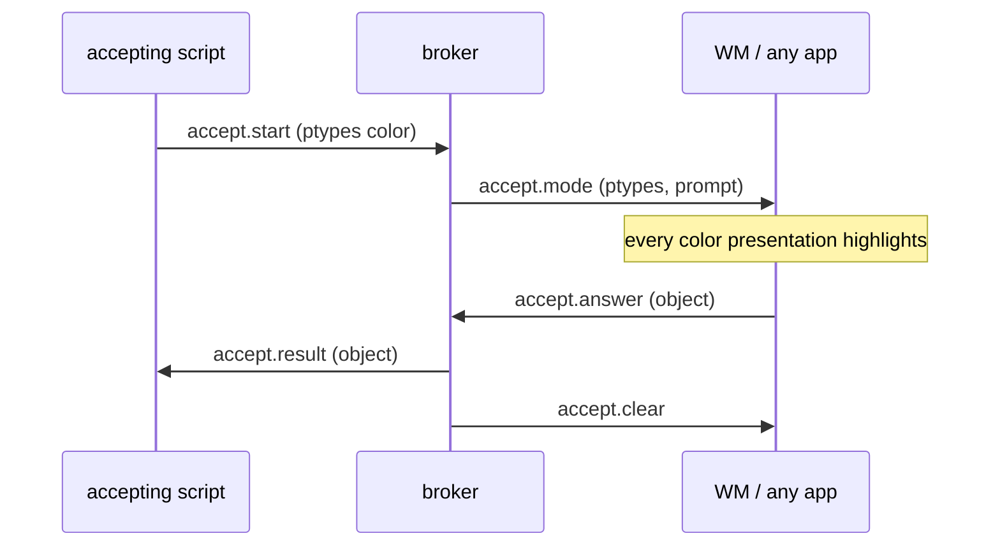
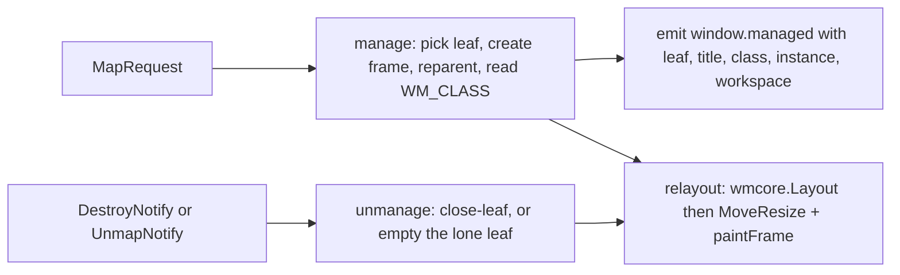
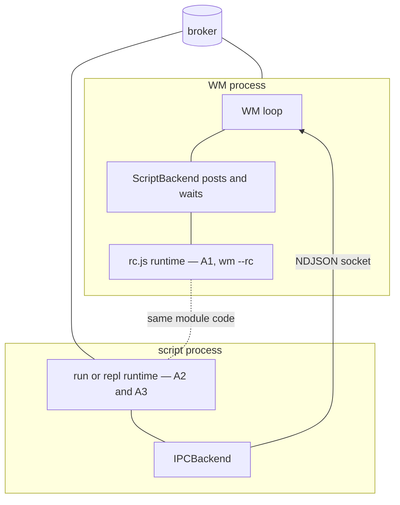

# go-go-wm from scratch — an intern's guide to the system

This guide explains the entire go-go-wm system to someone who has never
seen it: what it is, why each layer exists, how the layers talk to each
other, and how to change them safely. By the end you should be able to
trace a mouse click, a JavaScript call, or a keybinding through every
process and goroutine it crosses, and you should know which package a
given kind of change belongs in.

The repository is a single Go module producing a single binary,
`go-go-wm`, which contains a window manager, a message broker, several
terminal-side tools, a JavaScript runtime, and a set of demo
applications. Which of those a given process *is* depends only on the
subcommand it was started with.

## Part 0 — What this system is

go-go-wm is a **presentation-based** desktop for X11. The phrase means
something specific: every interesting piece of data on screen — a color,
a git commit hash, a file path, a window tile, a workspace chip — is not
just pixels but a **typed object** that the rest of the desktop can see,
click, and pass around. The idea comes from the Lisp machine lineage
(CLIM's presentation types); the implementation here is small, concrete,
and speaks JSON.

Three consequences follow, and they organize the whole codebase:

- Because objects are typed, a program can ask the desktop for "a
  color, from anywhere" and every color on screen — in any process —
  becomes clickable until one is chosen. This is the **accept**
  protocol, and it is the desktop's inter-process glue.
- Because objects are typed, right-clicking one can offer actions
  (**verbs**) registered by *other* processes, routed by type.
- Because the desktop needs a place where presentations, tiles, and
  input meet, the window manager itself is a first-class participant —
  it renders its bars and tiles out of the same drawing vocabulary and
  answers accepts with tile and workspace objects.

The package map, in dependency order (lower layers never import higher
ones):

| Package | Role | Depends on |
|---|---|---|
| `pkg/pbui` | typed objects, verbs, wire protocol | — |
| `pkg/pbui/broker`, `pkg/pbui/client` | the message broker and its client | pbui |
| `pkg/wmcore` | pure layout model: tree, ops, geometry | — |
| `pkg/draw` | theme palette + software rendering primitives | — |
| `pkg/apps`, `pkg/apps/uispec`, `pkg/apps/xapp` | app surfaces, region contract, spec IR, standalone window shell | pbui, draw |
| `pkg/wmx11` | the X11 window manager shell | wmcore, draw, apps, pbui |
| `pkg/jsmod`, `pkg/jsmod/{pbuimod,wmmod,uimod}` | the JavaScript native modules | pbui, wmcore, wmx11 (wmmod only), uispec |
| `pkg/cmds` | glazed CLI commands; all cross-layer wiring | everything |
| `pkg/xgojaprovider` | packaging of the JS modules for generated binaries | jsmod |

Keep this table in mind: the single most common review comment in this
repo is "that logic belongs one layer down."

## Part I — The typed-object substrate (`pkg/pbui`)

The atom of the system is `pbui.Object`
(`pkg/pbui/object.go:17`):

```go
type Object struct {
    Ptype string          `json:"ptype"` // "color", "git-commit", "tile", …
    Value json.RawMessage `json:"value"` // any JSON value
    Label string          `json:"label,omitempty"` // display face fallback
    Doc   string          `json:"doc,omitempty"`   // mouse-doc line text
}
```

A **ptype** is a slug (`[A-Za-z0-9._-]+`, enforced by `ValidPtype` at
every constructor). The restriction is not taste: objects travel as
`pbui://<ptype>/<encoded-value>` URIs through terminal hyperlinks, and
the ptype sits in the URI host position, where arbitrary bytes cannot
round-trip. This rule was added after a fuzzer produced a backslash
ptype that broke URI parsing (GGWM-002); the lesson generalizes:
**validate at the constructor, never downstream**.

A **verb** (`object.go:80`) is an action offered on ptypes:

```go
type Verb struct {
    ID      string   // "color.mix"
    Label   string   // "Mix with…  (accept a color)"
    Ptypes  []string // applies-to; ["any"] allowed
    Accepts []string // ptypes the verb will accept() when run
    Owner   string   // filled by the broker: the registering client
}
```

`Owner` is the routing key: when you pick "Mix with…" from a color's
menu, the broker sends `verb.run` to whichever process registered it.

## Part II — The broker (`pkg/pbui/broker`, `pkg/pbui/client`)

The broker is a Unix-socket daemon speaking newline-delimited JSON
(`pkg/pbui/wire.go`; frame limit 1 MiB, protocol version 1). Every
participant — WM, terminal tools, scripts, JS apps — connects as a
client with a name and roles. The message vocabulary is small; the
client→broker half and broker→client half are:

| client → broker | broker → client |
|---|---|
| `hello` | `welcome` |
| `register` (verbs) | `accept.mode` / `accept.clear` |
| `accept.start` / `accept.answer` / `accept.cancel` | `accept.result` |
| `verb.invoke` | `verb.run` |
| `menu.request` | `menu.show` |
| `doc.hover` | — |
| `event.emit` / `subscribe` | `event` |
| `query.verbs` | `verb.list` |
| — | `ok` / `error` |

The accept flow is the one to internalize, because it is the desktop's
defining interaction. One process asks; every process's presentations
of the right type light up; one click anywhere answers.



Two broker behaviors that bite newcomers:

- **Registration is an upsert** by (owner, verb id). Re-registering
  replaces; it does not stack (a GGWM-002 live-testing fix — before it,
  re-running a script duplicated its menu entries).
- **Events are broadcast, best-effort, unordered across clients.**
  Anything that needs ordering derives it from the single WM op stream,
  not from event arrival.

## Part III — The layout core (`pkg/wmcore`)

`wmcore` is a pure package: no X11, no JSON-RPC, no goroutines. It
models the desktop as data and mutations as data, which is the design
decision everything else leans on.

The model (`tree.go`, `desktop.go`):

- `Node` — a binary tree node: `Kind` is `Leaf` (carries `App`, the
  string saying what fills the tile) or `Split` (carries `Dir`
  row/col, `Ratio`, children `A`/`B`).
- `Workspace` — `{ID, Name, Root *Node}`.
- `Desktop` — `{Workspaces []Workspace, Current string}` plus id
  generators; serializes to JSON and back (`DeserializeDesktop` reseeds
  the id counters by scanning existing `n%d`/`ws%d` ids).

Every mutation is an **op** — a small serializable struct
(`ops.go:28-39`):

| op | fields | effect |
|---|---|---|
| `split-leaf` | Node, Dir, App | split a leaf; new leaf gets App |
| `close-leaf` | Node | remove a leaf, sibling fills the hole |
| `set-ratio` | Node, Ratio | move a divider |
| `set-leaf-app` | Node, App | change what fills a tile |
| `swap-leaves` | Node, Target | exchange two leaves' contents |
| `move-split` | Node, Target, Zone | edge-dock a leaf next to another |
| `move-leaf` | Node, Workspace, Target?, Dir? | move a leaf across workspaces, **keeping its id** |
| `add-workspace` | App | new workspace with one leaf |
| `remove-workspace` / `rename-workspace` / `clone-workspace` / `switch-workspace` | Workspace (+Name) | what the names say |

`wmcore.Apply(desktop, op) (Result, error)` is the only mutation entry
point. `Result` reports created ids (`NewLeaf`, `NewWorkspace`).

Why ops-as-data is worth the ceremony:

- The keyboard, the mouse, the IPC socket, and JavaScript all speak the
  same vocabulary, so testing any of them is testing all of them.
- Every op is emitted as an event, so the trace tile and the rule
  engine observe exactly what happened, in order.
- A recorded op stream replayed on a fresh desktop reproduces the same
  serialized tree — the replay property, asserted in
  `pkg/jsmod/wmmod/wmmod_test.go` (`TestReplayReproducesTree`).
- `move-leaf` keeps the leaf id, which is why a window's frame (keyed
  by leaf id in the WM) survives a cross-workspace move with zero X11
  code.

Geometry is also pure: `Layout(root, area, gap)` returns a
`map[NodeID]LayoutItem` of pixel rectangles (plus divider strips), and
`NeighborLeaf(root, area, gap, from, dir)` (`neighbor.go`, GGWM-004)
answers "which leaf is to the left of this one" from that same
geometry:

```
candidates = leaves whose rect lies strictly in direction dir
             AND overlaps the source on the cross axis
winner     = min edge-to-edge distance,
             tie-break: cross-axis center distance,
             final tie-break: topmost then leftmost   (determinism)
"" if none — the workspace edge
```

The final tie-break exists because Go map iteration is randomized; the
first version of the test was flaky on an exact two-way tie. **Any
function that scans a map and returns "the best" needs a total order.**

## Part IV — Rendering and themes (`pkg/draw`)

`pkg/draw` renders everything the WM itself draws — bars, title strips,
menus, builtin tiles, script surfaces — into plain `image.RGBA`, which
the X shell uploads via xgbutil. No compositor, no gradients: flat
fills, 1–2 px ink strokes, IBM Plex Mono (embedded via `go:embed`, with
fixed hinting so golden tests are deterministic across machines).

Since GGWM-004 the palette is a **theme**:

```go
type Theme struct {
    Name                                     string
    Paper, Pane, PaneAlt, Field              color.RGBA // surfaces
    Ink, Faint, Red, Sel                     color.RGBA // strokes, text, highlight
    Sage, Blue, Rose, Mustard, Lavender, Mint color.RGBA // accents
}
```

Three registered themes (`draw.Themes`, `draw.ThemeNames()`):

| slot | paper | light | dark |
|---|---|---|---|
| Paper (root) | `#e9e2d0` | `#ffffff` | `#1f1f1f` |
| Pane (tiles) | `#f5f0e3` | `#ffffff` | `#262626` |
| PaneAlt | `#efe9d9` | `#f2f2f2` | `#2e2e2e` |
| Field (inputs) | `#fbf8ef` | `#ffffff` | `#191919` |
| Ink | `#33302a` | `#1a1a1a` | `#e6e2da` |
| Faint | `#7a7365` | `#6e6e6e` | `#8a867e` |
| Sel (accept) | `#f4e6b8` | `#f6e9a8` | `#55482a` |
| Red | `#b0563f` | `#b0563f` | `#d07a5e` |

`light` is deliberately true white, not beige. `dark` anchors on
`#1f1f1f` — the background of the i3 setup this system replaces — and
its accents are darkened so the light ink keeps contrast on chips and
buttons. That contrast is a **test**, not a review comment:
`pkg/draw/theme_switch_test.go` requires a ≥60 luminance gap between
Ink and every surface/accent in every theme.

The mechanism is a palette swap into package-level vars:

- Every render path reads `draw.Paper`, `draw.Ink`, … **at paint
  time**. `draw.SetTheme(name)` reassigns them all and rebuilds
  `AppColors`; callers then repaint. Nothing is threaded through call
  signatures.
- The contract on `SetTheme` is documented on the var block: **call it
  only from the goroutine that owns rendering** in that process, then
  repaint. Paint paths read the vars without locks.

Two traps were found while building this, and both are the kind you
should look for whenever globals meet late-binding:

1. **Init-time copies defeat the swap.** Three tables captured color
   *values* at package init (`draw.AppColors`, `uispec`'s tone map,
   the trace-chip tone map). A swap changed the vars but not the
   copies. All three became paint-time lookups (`uispec.tone(name)`,
   `apps.traceTone(event)`).
2. **Two writers tear the palette.** In the rc.js process the WM loop
   swaps the palette, *and* the broker echoes a `theme.changed` event
   that a fan goroutine also handled by calling `SetTheme` — two
   goroutines interleaving fourteen variable writes produced a desktop
   with paper surfaces and dark accents (screenshot 01 in the diary
   shows the torn frame). The fix is structural: in-process, the event
   handler only repaints (`followThemeChanges(..., swapPalette=false)`
   in `pkg/cmds/run.go`); only out-of-process runtimes swap on the
   event.

## Part V — The X11 shell (`pkg/wmx11`)

### The shape

`wmx11` is a **reparenting** window manager: for every client window it
creates a frame window, reparents the client into it at offset
`(BorderW, TitleH)`, and draws the title strip and border on the frame.
"Being" the WM is one X call: selecting `SubstructureRedirect` on the
root (`wm.go:becomeWM`) — only one client may, so a second WM fails
fast.

State lives in one struct (`wm.go:91`): the `wmcore.Desktop`, a
`frames` map from leaf id to frame (client window id, frame window,
title, WM_CLASS, rect, click regions), reverse maps by client and frame
window, the focused leaf, accept/menu/drag state, and the script-tile
registry.

### The one-goroutine rule

Everything above is owned by a single goroutine — the WM loop
(`wm.go:Run`):

```go
for {
    select {
    case <-pingBefore:  <-pingAfter   // one X event, dispatched to handlers
    case fn := <-w.ops: fn()          // posted closure from anywhere
    case <-ctx.Done():  …
    }
}
```

External inputs — IPC requests, broker messages, script backends —
never touch WM state directly; they `w.Post(func(){…})` a closure and
(if they need an answer) wait on a channel. Read
`dispatchIPC` (`ipc.go`) once and you have seen the pattern every
caller uses. This is the same discipline the JS runtime uses for its
VM (Part VI), which is why the two compose without locks.

### The window lifecycle



`manage` (`manage.go:52`) picks a leaf (an empty "launcher" leaf if one
exists, else it splits the focused leaf), wraps the client, adds it to
the save-set (so clients survive a WM crash), reads the title *and*
WM_CLASS (`icccm.WmClassGet` — class and instance ride the
`window.managed` event and the `windows` query since GGWM-004, which is
what class-based placement rules match on).

`relayout` (`manage.go`) is the reconciliation function: compute
`wmcore.Layout` for the current workspace, move/resize every visible
frame, unmap frames on other workspaces, repaint. It is called after
every op (`afterOp`), which also refocuses after `switch-workspace`
onto a leaf of the new workspace.

### Focus, and a lesson about X11

`w.focus(leaf)` sets `w.focused`, calls `SetInputFocus` on the client,
and repaints both affected frames. Builtin tiles have no client
(`f.client == 0`), and the original code focused window 0 anyway.
Window 0 is `None`: **`SetInputFocus(None)` makes the server discard
keyboard processing, which silently kills even root-grabbed
keybindings.** The desktop looked alive — mouse fine, IPC fine — but
every hotkey was dead. The fix focuses the frame window instead
(`manage.go:focus`). Diagnosis technique worth remembering: `kill
-QUIT` the process and read the goroutine dump; here it proved both
event loops were healthy, which relocated the suspicion from "deadlock"
to "X server state".

### The control socket

The IPC surface (`ipc.go`) is NDJSON over a Unix socket
(`$GO_GO_WM_SOCKET`, default `$XDG_RUNTIME_DIR/go-go-wm.sock`):

| request | response data |
|---|---|
| `{"q":"tree"}` | the serialized Desktop |
| `{"q":"windows"}` | `[{leaf, client, title, class, instance, workspace, rect, focused}]` |
| `{"q":"op","op":{…}}` | the op `Result` |
| `{"q":"theme"}` | `{theme, available}` |
| `{"q":"set-theme","theme":"dark"}` | same, after swap+repaint+`theme.changed` |
| `{"q":"focus","target":"left\|right\|up\|down\|next\|prev\|<leaf>"}` | focused leaf id |
| `{"q":"move","dir":"left\|…"}` | focused leaf id |

Everything a test wants to assert is a one-line socket query. The
`scripts/rc-smoke.sh` and `scripts/examples-smoke.sh` suites are built
entirely on this.

### Builtin and scripted tiles

A leaf's `App` string selects what fills it: `""` (launcher),
`win` (a real client), `builtin:trace` / `builtin:listener` / … (WM-
rendered apps from `pkg/apps`), or `script:<name>` — a surface rendered
from a JavaScript app's last snapshot (`scripttiles.go`, GGWM-003).
One caution from that ticket: `paintFrame` re-derives the frame title
on every paint, so title/color logic for a tile kind must live in
`paintFrame`, not only where the tile is opened.

## Part VI — The scripting layer (`pkg/jsmod`, `pkg/cmds`)

### The runtime model

Scripts run in goja (a Go JavaScript engine) via go-go-goja, which adds
an event loop and an owner: **all VM access happens on one goroutine**,
and foreign goroutines post closures — exactly the WM's discipline.
The concurrency contract, stated once and enforced everywhere:

1. Every goja touch happens on the JS loop.
2. The WM loop never executes JavaScript.
3. Every crossing between loops is a posted closure.
4. Only queries use bounded waits (2 s) across loops; nothing waits
   unbounded.
5. Worker goroutines settle promises only via posted resolvers.
6. A callback fired on a foreign loop does exactly one thing: post.

### Three attachment points, one API



The `wm` module never knows which world it is in: it talks to a
`Backend` interface (`pkg/jsmod/wmmod/backend.go`):

```go
type Backend interface {
    Tree(ctx) (*wmcore.Desktop, error)
    Windows(ctx) ([]wmx11.WindowInfo, error)
    Apply(ctx, wmcore.Op) (wmcore.Result, error)
    Bind(combo string, fire func()) error   // in-process only
    Theme(ctx) (wmx11.ThemeInfo, error)
    SetTheme(ctx, name string) error
    Focus(ctx, target string) (string, error)
    Move(ctx, dir string) (string, error)
}
```

`IPCBackend` serves standalone scripts (`go-go-wm run script.js`) and
the REPL over the control socket; `wmx11.ScriptBackend` serves the
in-process rc file (`go-go-wm wm --rc rc.js`) by posting onto the WM
loop. The practical workflow this buys: **develop in the REPL, deploy
in rc.js — the API is character-for-character identical**, except
`wm.bind`, which only the in-process runtime can honor (the IPC backend
throws an error that tells you to move the code to rc.js).

### The module APIs

`require("wm")` (`pkg/jsmod/wmmod/module.go`):

| call | meaning |
|---|---|
| `tree()`, `windows()`, `focused()`, `leaves(ws?)` | queries (wire field names via `jsmod.ToPlain`) |
| `apply(op)` | raw op escape hatch |
| `split(leaf, dir, {ratio?, app?})`, `close`, `setApp`, `setRatio`, `swap`, `moveSplit`, `moveLeaf` | op sugar |
| `workspace(name)` | fluent find-or-create: `.switch() .rename() .remove() .clone() .adopt(leaf) .apply(layout)` |
| `on(event, fn)`, `bind(combo, fn)` | events; keys (rc.js only) |
| `layout(name, spec)`, `layouts()`, `rule({title?/class?, workspace, dir?})`, `rules()` | declarative recipes, normalized at definition time |
| `theme(name?)`, `themes()` | current / switch / list (GGWM-004) |
| `focus(target)`, `move(dir)` | directional navigation (GGWM-004) |
| `exec(cmdline)` | spawn `sh -c`, fire-and-forget (GGWM-004; rc.js always, `run`/`repl` behind `--allow-exec`) |

`require("pbui")`: `object/uri/parse/link` (data-only),
`accept(ptypes, opts) → Promise` (cancellation resolves `null` — it is
an outcome, not an error), `answer`, `verb` (definition-time
validation; re-registration replaces), `print(segments…)`, `emit/on`,
`menu`, `hover`.

`require("ui")` (GGWM-003): `row/text/hint/object/button` builders and
`app({name, title, render, actions, verbs, onKey})` returning a handle
with `.show()` (standalone X window), `.tile()` (WM-painted tile,
rc.js only; returns the `script:<name>` app string you place with an
ordinary `wm.split`), `.refresh()`. The renderer only ever reads the
last normalized snapshot under a mutex; handlers re-render on the JS
loop and post the new snapshot — no render path calls JavaScript.

### Events: the fan

One process holds exactly one broker event subscription, shared by all
modules through `jsmod.EventFan`: a read goroutine feeds a bounded
queue (keep-oldest, drop-and-count-newest, coalesced wakeups); a
drainer runs **Go subscribers** (the rule engine, theme following)
inline and posts **one batch per wake** to the JS loop for JavaScript
subscribers. Rules (`wm.rule`) are Go subscribers on purpose: matching
a window title/class and issuing a `move-leaf` needs no VM at all.

## Part VII — Case study: porting an i3 config (GGWM-004)

`examples/scripts/i3.js` reproduces a real ~350-line i3 config. The
port is a good case study because it forced exactly three API
extensions — and everything else fell out of machinery that already
existed.

What mapped directly:

- `bindsym $mod+…` → `wm.bind("Mod4-…", fn)`.
- Numbered workspaces → pre-create `wm.workspace("1")…("9")` at boot
  (i3 creates on demand; pre-creating makes names, bar chips, and
  rules agree from the start), then `wm.workspace(n).switch()` /
  `.adopt(focused)` for switch / move / move-and-follow.
- `workspace_auto_back_and_forth` → ten lines of JS state on
  `wm.on("switch-workspace")` — no WM feature needed, because every op
  is an event.
- `assign [class="Slack"] 8` → `wm.rule({class: /Slack/, workspace:
  "8"})`, once `window.managed` carried WM_CLASS.
- `client.background #1f1f1f` → `--theme dark` (same anchor color).

What forced extensions: `exec` (i3 configs are mostly launcher
bindings), directional `focus`/`move` (needs geometry, hence
`wmcore.NeighborLeaf`), and class rules (needs WM_CLASS on the event).
Each extension went in at the bottom-most layer that could own it, then
rode the existing seams upward: op/geometry in `wmcore`, WM behavior in
`wmx11`, IPC queries, `Backend` methods, module exports — one
straight line you can follow in commit `0461cee`.

What was deliberately not ported: floating, scratchpad, tabbed/stacked
layouts, i3 modes (grabbing bare letters globally would swallow
application keystrokes), multi-output pinning. The header of `i3.js`
carries the full mapping table including these rows, so nobody
rediscovers the gaps.

The port also surfaced one WM-design requirement worth stating as a
rule: **a config that owns the keyboard needs the WM to not own it
first.** The built-in bindings (Mod4-1..9, Mod4-Shift-q, …) would
double-fire alongside rc.js bindings on the same combos — pressing
"kill window" would also shut the WM down. Hence
`--no-default-binds`: the WM keeps only Escape (modal accept/menu
cancellation), and the rc file binds everything else.

Three real bugs came out of live-testing this part — the double-grab
above, the `SetInputFocus(None)` keyboard kill (Part V), and the torn
palette (Part IV). All three share a root: state that two parties
believe they own. When you extend this system, the first question is
always "who owns this word of state, and on which goroutine".

## Part VIII — Working on the system

### Build, test, verify

```bash
go build ./... && go test ./...        # pure layers: seconds, no X
gofmt -l pkg/ && go vet ./...
scripts/rc-smoke.sh                    # rc.js + keybinding E2E (Xvfb)
scripts/examples-smoke.sh              # every example is a fixture (9 stages)
```

The development loop for anything visual:

```bash
Xvfb :79 -screen 0 1280x800x24 &       # or Xephyr :1 for a visible window
go-go-wm wm --display :79 --embedded-broker --theme dark \
  --no-default-binds --rc examples/scripts/i3.js &
DISPLAY=:79 xterm &                    # feed it windows
echo '{"q":"windows"}' | nc -U "$GO_GO_WM_SOCKET"   # ask what it believes
DISPLAY=:79 import -window root shot.png            # look at it
```

Assert colors with pixel sampling, not eyeballs — downscaled
screenshots hide theme differences (twice now: the accept highlight in
GGWM-003, the torn palette here).

One shell trap documented in every diary since GGWM-002, because it
keeps costing sessions: `pkill -f PATTERN` matches the *outer shell's
own eval string* whenever the pattern text appears anywhere in the
compound command. Kill commands live in a script file invoked by
nothing but its path.

### Adding a WM feature end-to-end (the checklist)

Using "directional focus" as the worked example:

1. **Pure logic in `wmcore`** — `NeighborLeaf` + table-driven tests
   (deterministic tie-breaks; no X, no goroutines).
2. **WM behavior in `wmx11`** — `focusTarget`/`moveDir` on the WM
   loop (`theme.go`), reusing existing mechanisms (`w.focus`,
   `swapFrames`).
3. **IPC** — a query case in `dispatchIPC` + request fields.
4. **Backend seam** — method on `wmmod.Backend`, implemented by
   `IPCBackend` (socket) and `ScriptBackend` (posts).
5. **Module export** — `wm.focus(...)` in `wmmod/module.go`; update
   the fake backend in `wmmod` tests and the help topic
   (`pkg/doc/topics/wm-module.md`).
6. **Fixture** — extend `examples-smoke.sh` or an example script so
   the feature is exercised in CI forever.

Adding a theme is steps 1 and 6 only: a `Theme` literal in
`draw.Themes` plus `ThemeNames()`, and the swap/contrast tests pick it
up automatically.

### Where things are

| you want to change… | look in |
|---|---|
| object/verb semantics, URIs | `pkg/pbui/object.go` |
| broker routing, accept sessions | `pkg/pbui/broker/broker.go` |
| tree ops, geometry, navigation | `pkg/wmcore/{ops,layout,neighbor}.go` |
| colors, themes, fonts, drawing | `pkg/draw/theme.go` |
| frames, focus, relayout, WM_CLASS | `pkg/wmx11/manage.go` |
| keybindings, clicks, drags | `pkg/wmx11/input.go` |
| control socket | `pkg/wmx11/ipc.go` |
| theme/focus WM entry points | `pkg/wmx11/theme.go` |
| script-tile registry | `pkg/wmx11/scripttiles.go` |
| JS `wm` module + rules | `pkg/jsmod/wmmod/` |
| JS `pbui` module + promises | `pkg/jsmod/pbuimod/` |
| JS `ui` module + snapshots | `pkg/jsmod/uimod/`, `pkg/apps/uispec/` |
| event fan | `pkg/jsmod/eventfan.go`, `queue.go` |
| CLI wiring, runtimes, themes-follow | `pkg/cmds/{wm,run,repl,rc}.go` |
| example configs | `examples/scripts/` (all CI fixtures) |
| embedded help | `pkg/doc/topics/` (`glaze help wm-module`) |

## Closing

The system is four disciplines wearing one binary: typed objects on a
broker, ops on a pure tree, paint-time palette reads, and one-goroutine
ownership on both sides of the JS boundary. Every bug story in this
guide — duplicated verbs, torn palettes, dead keyboards, flaky
tie-breaks — is a violation of one of the four, found by a test or a
live probe and then pinned by one. When your change follows the
disciplines, the seams (ops, Backend, IPC, events) do most of the work
for you; when it fights them, the diaries in GGWM-001 through GGWM-004
show exactly how it will lose.

Related reading, in order: GGWM-001 design doc (the WM and PBUI
foundations), GGWM-002 design doc + diary (the scripting layer),
GGWM-003 (ui module and script tiles), and this ticket's design-doc/01
(themes and the i3 port decisions).
