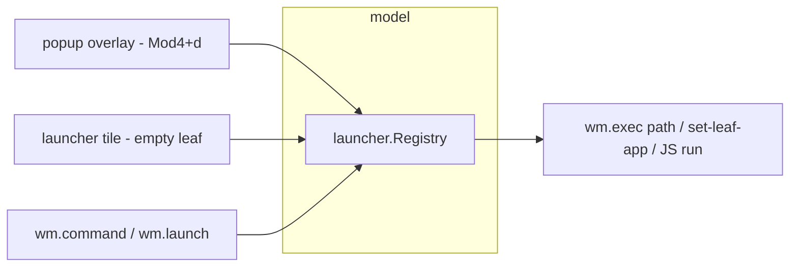

# The launcher

The empty-tile surface today (`renderLauncher`,
`pkg/apps/builtin.go:131`) offers four buttons — the built-in apps —
and a hint to press Mod4-Return. The user's i3 workflow starts programs
with `$mod+d` into a fuzzy finder. Between those two states lies a
subsystem this guide designs: a **command registry** that knows what
can be launched, two **surfaces** that let a human pick from it, and a
set of **PBUI obligations** that make launching more than string
execution — because in this desktop, a launchable command is a typed
object like everything else, which means scripts can accept() one,
verbs can attach to one, and a launcher entry can appear in any tile
that prints one.

## Part I — What exists to build on

Five pieces of machinery carry most of the weight; know them before
designing anything new.

- **Execution.** `wm.exec` (GGWM-004) already solves process spawning:
  `sh -c`, DISPLAY forced, fire-and-forget, children reaped. The
  launcher does not spawn processes; it *composes command lines* and
  hands them to this one path.
- **Popup windows.** The verb menu (`pkg/wmx11/pbui.go`) is an
  override-redirect window painted with `pkg/draw`, carrying click
  regions, closed by outside-click or Escape. The launcher popup is
  the same species with a text filter attached.
- **Surface IR.** `uispec` (GGWM-003) renders rows of
  text/object/button/hint segments with the full click contract, for
  both WM-painted tiles and standalone windows. Launcher lists are
  uispec rows.
- **The presentation substrate.** `pbui.Object{Ptype, Value, Label,
  Doc}` plus broker verbs and accepts. One new ptype (`command`)
  plugs launching into menus, accepts, and scripting with no new
  protocol.
- **Rules.** `wm.rule` moves windows by class at map time — which is
  how "launch Firefox on workspace web" composes out of existing
  parts instead of being a launcher feature.

## Part II — The command registry (`pkg/launcher`)

The registry is a pure Go package: no X, no broker, fully unit-tested.

```go
type Command struct {
    ID       string   // "app:firefox", "builtin:trace", "script:deploy"
    Label    string   // "Firefox"
    Exec     string   // shell command line ("" for non-exec kinds)
    Kind     Kind     // App | Builtin | Script | Recent
    Terminal bool     // .desktop Terminal=true → wrap in cfg.Spawn
    Keywords []string // extra match terms (from .desktop Keywords/Categories)
    Doc      string   // one-line description (Comment=)
}

type Registry struct { ... }
func (r *Registry) All() []Command
func (r *Registry) Match(query string) []Scored   // fuzzy, frecency-weighted
func (r *Registry) Bump(id string)                // record a launch (frecency)
```

### Sources

1. **XDG desktop entries.** Scan `$XDG_DATA_DIRS/applications` and
   `~/.local/share/applications` for `*.desktop`; parse the
   `[Desktop Entry]` group: `Name`, `Exec` (strip `%f/%u/%F/%U` field
   codes), `Terminal`, `Comment`, `Keywords`, `Categories`,
   `NoDisplay=true` → skip, `Hidden=true` → skip. The parser is ~100
   lines and table-tested against fixture files; no icon loading
   (this WM draws text and tones, not icons — entries get a stable
   accent color by hashing the ID, the `leafColor` trick).
2. **Builtins.** `builtin:trace`, `builtin:listener`, … from the
   existing `apps` vocabulary — launching one sets the target leaf's
   app rather than spawning a process.
3. **Script-registered commands.** `wm.command({id, label, run})`
   registers a JS function under `script:<id>`; the run callback fires
   on the JS loop via the same single-post discipline as verbs. This
   is how "open my project workspace" (a project-switcher layout) gets
   a launcher entry.
4. **Frecency.** A small JSON state file
   (`$XDG_STATE_HOME/go-go-wm/launcher.json`) maps command ID →
   {count, lastUsed}; the classic frecency score
   (count weighted by recency buckets) breaks ties and orders the
   empty-query listing. Writing is debounced and best-effort — losing
   it costs nothing but ordering.

### Matching

Fuzzy matching is a pure function with a test table, not a dependency:
subsequence match over `Label` + `Keywords` + `ID`, scored by
(consecutive-run length, word-boundary hits, match position,
label length), then multiplied into frecency. Roughly:

```
score(query, cmd):
    best = -∞
    for field in [label, keywords..., id]:
        s = subsequence score with bonuses:
              +3 per boundary-start hit, +2 per consecutive char,
              -0.1 per unmatched leading char
        best = max(best, s * fieldWeight)
    return best * (1 + log1p(frecency(cmd)))
```

The registry rescans .desktop directories on demand with an mtime
check, not a watcher — a launcher that is one keystroke stale is fine;
a file-watcher goroutine is complexity with no user.

## Part III — Two surfaces, one model



### The popup (`$mod+d`)

An override-redirect window, centered, ~640×420, stacked with the
menus (above floats — see GGWM-007's stacking table). Contents, top to
bottom: a text field (the `draw.Field` look already used by the todo
demo), then up to N result rows — each row a uispec-style line: accent
chip, label, dimmed doc, kind tag. Interaction:

- printable keys append to the query; Backspace deletes; Up/Down move
  the selection; Enter launches the selection; Escape closes.
  Mod4+d while open closes (toggle).
- every visible row is also a click region (click = launch) and a
  presentation: right-click opens the verb menu for its `command`
  object.
- launching closes the popup, `Bump`s frecency, and routes by kind:
  `App` → the exec path (wrapped in the terminal command when
  `Terminal`), `Builtin` → `set-leaf-app` on the focused leaf if it is
  empty, else split-and-set, `Script` → post to the owning runtime.

The popup's keyboard is the easy case: an override-redirect window can
take input focus directly (`SetInputFocus` on it while open, restore
on close), and its KeyPress events arrive on its own window — no grabs
needed beyond what exists.

### The launcher tile

The empty-leaf surface becomes a persistent, smaller version of the
same thing: query line + top results + the builtin buttons it has
today. Unlike the popup, a tile is a frame the WM paints — and frames
do not receive keyboard input today. That gap is a substrate this
ticket must build and the rich REPL (GGWM-009) inherits:

**Keyboard input for WM surfaces (the shared substrate).** When the
focused leaf's frame is a builtin/scripted surface (client == 0), the
WM sets input focus to the frame window (already done since the
SetInputFocus(None) fix) and the frame selects KeyPress in its event
mask (one bit added at creation). A new `handleFrameKey(f, keysym,
string)` decodes the event via `keybind.LookupString` and routes it to
the focused surface's key handler — the same seam `uimod` already has
for scripted apps (`dispatchKey`), extended to builtin surfaces with a
`KeyHandler` capability. Global Mod4 grabs still win (grabs fire before
focus delivery), so WM bindings are unaffected. The design rule:
**typed input goes to the focused surface; chords with the WM modifier
never do.**

### PBUI obligations of the `command` ptype

- `pbui://command/app:firefox` round-trips like any object; a launcher
  entry printed into a listener (`pbui.print`) is launchable from
  there.
- Default verbs, registered by the WM: `command.launch`,
  `command.launch-here` (into the focused empty leaf, builtins only),
  `command.edit` (open the .desktop file in $EDITOR via exec).
- `accept("command")` turns every visible launcher row into an answer
  — a script can ask "pick a program" and the popup doubles as the
  picker (`launcher.open({accept: true})` opens it in accept mode,
  where Enter answers instead of launches).

## Part IV — Scripting surface

```js
wm.command({ id: "proj-wm", label: "go-go-wm workspace",
             doc: "layout + editor + terminal",
             run() { wm.workspace("go-go-wm").switch().apply("dev"); } });
wm.launch("app:firefox");                 // by id
wm.launch("firefox --private-window");    // raw exec fallback
launcher.open();                          // the popup, from JS
const cmd = await pbui.accept("command"); // any launcher surface answers
```

`wm.launch` and `wm.command` live in wmmod (they compose registry +
exec); `launcher.open` is a WM-side IPC/backend call because the popup
is WM-owned. Registration from a script daemon (A2) routes over the
broker like verbs do — the registry entry carries the owner, and the
run callback is a `verb.run`-style dispatch. In-process (rc.js) it is
a direct function post.

## Part V — Decision records

**L-D1 — One registry, many surfaces.** The popup, the tile, the JS
API, and accepts all read the same `launcher.Registry`; no surface owns
data. Consequence: match quality and frecency improve everywhere at
once, and tests target the pure package. *proposed.*

**L-D2 — No icons, no themes of their own.** Entries render as accent
chips + text in the existing paper/ink vocabulary. Icon loading (PNG/
SVG themes, caches) is the single most expensive feature of launchers
like rofi and buys nothing in a text-first aesthetic. *proposed.*

**L-D3 — The keyboard substrate is general, not launcher-private.**
Frame KeyPress routing (`KeyHandler` on builtin surfaces) is designed
here because the launcher tile needs it first, but it is a WM
capability: the rich REPL, future text inputs in scripted tiles, and
the todo demo all sit behind the same seam. *proposed.*

**L-D4 — Launch composition over launch features.** "Launch on
workspace 3" is not a launcher option; it is a rule
(`wm.rule({class: /firefox/i, workspace: "3"})`) or a script command.
The launcher's job ends at starting the process. *proposed.*

## Part VI — Phases and tests

- **L1 — registry.** .desktop parser (fixture-tested), fuzzy scorer
  (table-tested: boundary bonuses, ordering stability), frecency
  store, builtin + script sources. Pure Go; no X.
- **L2 — popup.** Overlay window, query editing, selection, launch
  routing, Mod4+d binding (default + i3.js). E2E: xdotool types
  "fire", asserts the filtered row via a `{"q":"launcher"}` debug
  query, Enter, asserts the process appeared (testable with a fixture
  .desktop entry pointing at `touch marker`).
- **L3 — keyboard substrate + tile.** Frame KeyPress mask + routing;
  launcher tile v2 replacing `renderLauncher`; typed filtering in the
  tile. E2E: focus empty tile, type, assert surface content via
  screenshot region or a debug query.
- **L4 — PBUI integration.** `command` ptype + verbs + accept mode;
  `wm.command`/`wm.launch`; frecency bumps asserted.

## Risks and open questions

- `Exec=` field codes beyond stripping (%c, %k) and DBusActivatable
  entries are ignored in v1; acceptable for a personal launcher,
  recorded here so nobody mistakes it for spec compliance.
- Key routing must never swallow the WM chords: grabs fire first by X
  semantics, but the E2E suite must assert it (type "d" into the tile
  while Mod4+d is bound).
- Script-registered commands from A2 daemons die with their process;
  the registry drops entries on broker disconnect (same as verbs).
  Stale-entry UX beyond that is unhandled.
- The popup in accept mode overlaps GGWM-009's "REPL as picker"
  ideas; if both land, the accept-mode popup should become the
  standard accept prompt surface — noted for the REPL design.
