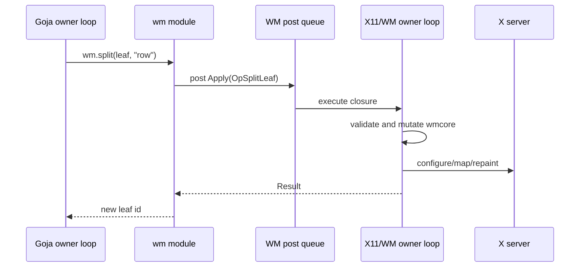
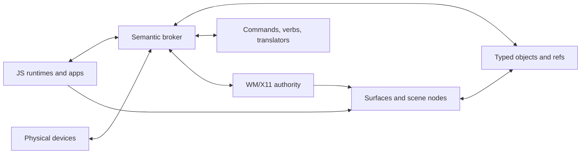
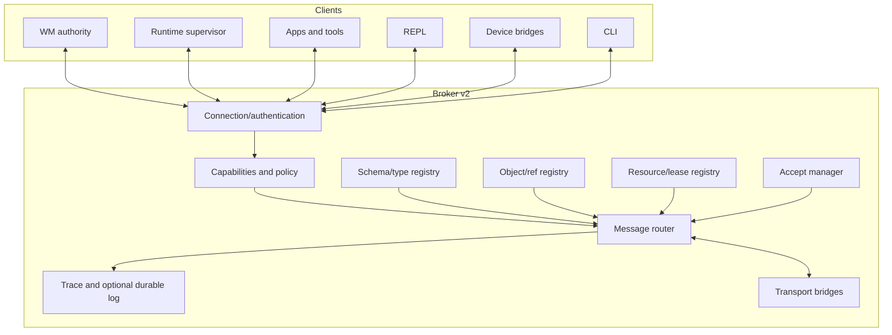
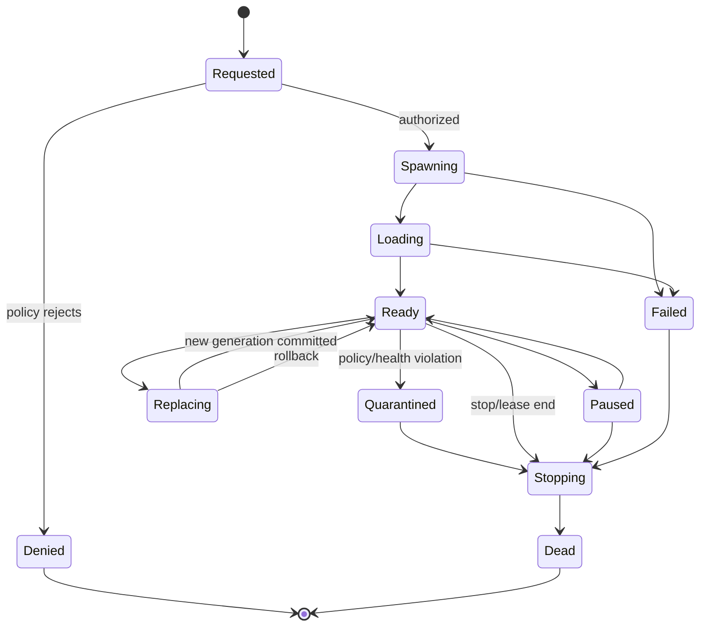
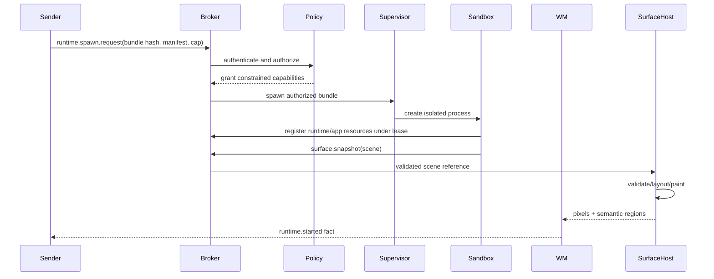
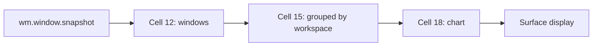
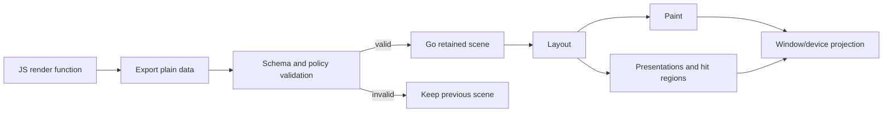
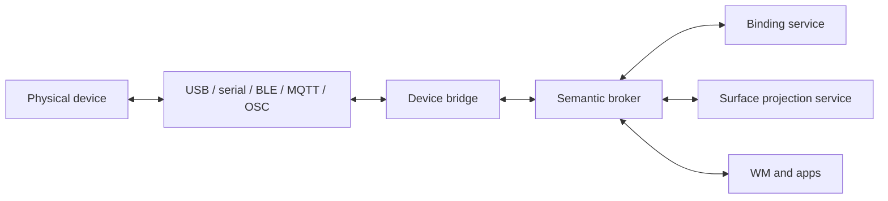

# From Window Manager to Programmable Presentation Operating Environment

## Architecture, research, and implementation guide for `go-go-wm`

**Status:** research and design proposal  
**Prepared:** 2026-07-22  
**Audience:** new developers, interns, maintainers, runtime authors, UI researchers  
**Primary code baseline:** [`go-go-wm` commit `5b73c9f`](https://github.com/go-go-golems/go-go-wm/tree/5b73c9f37c97538f6767ecdc3ece4fb599932377)  
**Related baselines:** [`go-go-goja` commit `cd1429f`](https://github.com/go-go-golems/go-go-goja/tree/cd1429f95e24156a98ff976fa63b484ee2d35e9c), [`go-go-os-frontend` commit `88a9054`](https://github.com/go-go-golems/go-go-os-frontend/tree/88a905467d0ed69264f0f14cb0e595b2ad356b60)

> **Thesis**
>
> `go-go-wm` should evolve from a scriptable X11 window manager into a **programmable presentation operating environment**: a local semantic object space in which windows, transient tools, REPL results, commands, devices, and applications communicate through typed presentations, explicit capabilities, inspectable messages, and leased resources.
>
> JavaScript should remain the language for composition and live authoring. Go should remain the authority for state, validation, rendering, resource ownership, X11 access, security policy, and lifecycle.

---

## Contents

1. [Executive conclusions](#1-executive-conclusions)
2. [How to read this document](#2-how-to-read-this-document)
3. [Research and code baseline](#3-research-and-code-baseline)
4. [Foundations: the forgotten interaction model](#4-foundations-the-forgotten-interaction-model)
5. [What `go-go-wm` already is](#5-what-go-go-wm-already-is)
6. [The north-star system model](#6-the-north-star-system-model)
7. [Broker v2: a semantic kernel](#7-broker-v2-a-semantic-kernel)
8. [Executing JavaScript safely](#8-executing-javascript-safely)
9. [The REPL as an operating-system building block](#9-the-repl-as-an-operating-system-building-block)
10. [Transient applications and HyperCard-style authoring](#10-transient-applications-and-hypercard-style-authoring)
11. [A retained semantic scene and widget DSL](#11-a-retained-semantic-scene-and-widget-dsl)
12. [The event and device mesh](#12-the-event-and-device-mesh)
13. [Implementation roadmap](#13-implementation-roadmap)
14. [Threat model and failure analysis](#14-threat-model-and-failure-analysis)
15. [Testing and observability](#15-testing-and-observability)
16. [Intern learning path and labs](#16-intern-learning-path-and-labs)
17. [Design laws](#17-design-laws)
18. [Glossary](#18-glossary)
19. [Annotated references](#19-annotated-references)

---

# 1. Executive conclusions

The current implementation already contains the difficult seeds of the larger system:

- a pure, serializable window-layout operation language;
- a single-owner X11 and WM state loop;
- a separately owned Goja runtime loop;
- typed presentation objects and type-directed verbs;
- a broker-mediated accept operation;
- JavaScript-defined commands, rules, layouts, standalone apps, and in-process tiles;
- declarative UI snapshots that can be painted without entering JavaScript;
- a rich REPL in which returned JavaScript values become typed desktop objects;
- explicit runtime lifetime and shutdown machinery in `go-go-goja`;
- a clear precedent in `go-go-os-frontend` for per-session sandboxes, capability-checked effects, runtime surface packs, live authoring, and HyperCard-like sessions.

That means the next step is not “add more widget functions.” The next step is to make the implicit operating-system concepts explicit.

## 1.1 Recommended architecture in one page

### Recommendation 1 — Treat the broker as a semantic kernel

The broker should own:

- authenticated principals;
- scoped capabilities;
- resource leases;
- schemas and message contracts;
- typed object references;
- presentation-type relationships and translators;
- accept-session arbitration;
- command, query, event, snapshot, and stream routing;
- provenance, correlation, causation, and trace metadata;
- optional durable recording and replay.

It should **not** own X11, render pixels, or execute arbitrary application code.

### Recommendation 2 — Generalize every script-created side effect into a leased resource

A runtime can currently create verbs, launcher commands, subscriptions, tiles, keybindings, timers, and windows through different mechanisms. These should all use one resource model:

```text
principal + capability + resource descriptor + lease + cleanup
```

When a runtime disconnects, is replaced, loses permission, or exceeds policy, the broker or owning subsystem can revoke every resource deterministically.

### Recommendation 3 — Separate immutable values from live object references

A presentation currently contains a type and JSON value. Keep that form for immutable, portable data.

Add a second form for live objects:

```text
value:  inline, immutable, copyable
ref:    stable identity, authority-owned, revisioned, leased
```

A file path, color, number, or dataset can be a value. A running app, REPL cell, managed window, device, document buffer, or task can be a reference.

### Recommendation 4 — Use three JavaScript trust tiers

1. **Trusted in-process Goja** for `rc.js`, core configuration, and code with the same trust as the WM process.
2. **Constrained runtime sessions** for user-authored code that is expected to be benign but should receive only selected modules and capabilities.
3. **Out-of-process sandboxes** for broker-delivered, generated, third-party, or otherwise untrusted code.

A Goja runtime inside the WM process is a concurrency boundary and API boundary. It is not a hostile-code security boundary.

### Recommendation 5 — Make the rich REPL the system shell, object memory, debugger, and app factory

A cell should be more than source plus text output. It should be a durable, typed, inspectable object containing:

- source and hash;
- runtime and capability set;
- dependencies;
- reads, writes, and effects;
- console records;
- result values and live references;
- multiple presentations;
- provenance and traces;
- leases created by evaluation;
- replay, undo, promotion, and export operations.

This turns the REPL into the primary place where a user can inspect, compose, repair, and extend the environment.

### Recommendation 6 — Define transient apps as app capsules

A transient app should be data with an explicit lifecycle:

```text
manifest + packages + state + surfaces + handlers + capabilities + lifetime
```

It may live for one command, one surface, one workspace, one session, or durably. It can be created from a file, a REPL cell, a broker request, an artifact, or another app.

### Recommendation 7 — Evolve `uispec` into a retained, keyed semantic scene

Keep the current invariant that JavaScript never runs in the paint path. Replace the flat row/segment ceiling with a versioned scene tree whose nodes are validated and rendered by Go-owned surface packs.

Charts, tables, graph nodes, timeline entries, text spans, and visual marks should remain typed presentations. The basketball prototype demonstrates why: the useful unit is not “a scatter-plot pixel,” but “a player presentation rendered as a bubble.”

### Recommendation 8 — Treat physical devices as semantic projections and controllers

An e-ink tablet, rotary encoder, button deck, or LED matrix should join as a device principal exposing properties, actions, events, and display constraints.

Devices should not receive app-specific callbacks or arbitrary code. They should receive semantic projections and emit typed events that are translated into capability-checked commands.

## 1.2 The central invariant

The most important design rule already visible in the code is:

```text
JavaScript composes intent.
Go owns authority.
```

More concretely:

- JavaScript may describe a layout.
- Go validates and compiles it into `wmcore.Op` values.
- JavaScript may return a scene.
- Go validates, stores, lays out, paints, and hit-tests it.
- JavaScript may request a mutation.
- A Go authority verifies identity, capability, preconditions, and ownership.
- JavaScript may subscribe to events.
- Go delivers them by posting onto the runtime owner loop.
- JavaScript may create a resource.
- Go assigns a lease and guarantees cleanup.
- JavaScript may be interrupted.
- Native host calls must still be cancellable, bounded, and independently enforceable.

This is the architecture to deepen, not weaken.

## 1.3 What not to do

Several tempting shortcuts would undermine the system:

- Do not send source code in a generic event and implicitly execute it.
- Do not expose the X socket or X authority to an untrusted sandbox.
- Do not let arbitrary runtimes claim the name or role `wm`.
- Do not use a human-readable client name as a security identity.
- Do not share Goja values or function references between runtimes.
- Do not call JavaScript from the X11 loop or paint path.
- Do not make every event durable.
- Do not make every message best-effort.
- Do not let a runtime create a long-lived command, keybinding, surface, timer, or subscription without an owner and revocable lease.
- Do not reduce presentation types to decorative tags over generic JSON.
- Do not let a renderer turn semantic chart marks into inert pixels.
- Do not claim that module whitelisting alone makes in-process code safe against a malicious script.

---

# 2. How to read this document

This document distinguishes three kinds of statements:

> **Current**
>
> Behavior observed in the reviewed code or dated project records.

> **Recommendation**
>
> A proposed architecture or API. Names and schemas are sketches, not compatibility promises.

> **Invariant**
>
> A property that should remain true across implementation choices.

For a first pass, read Sections 1, 5, 6, 7, 8, 9, and 13. They establish the current system, target model, broker, sandbox, REPL, and implementation sequence.

For implementation work, start with the specific phase in Section 13 and follow its prerequisites, package boundaries, tests, and exit criteria.

For historical context, Section 4 explains why concepts such as presentations, input contexts, message paths, live objects, and actionable text matter. It deliberately extracts mechanisms rather than visual nostalgia.

---

# 3. Research and code baseline

## 3.1 Records reviewed

The repository’s dated design record from July 18–20, 2026 contains the complete construction sequence leading to the current merged system.

| Record | Date path | Main contribution |
|---|---:|---|
| GGWM-001 | 2026-07-18 | split-tree X11 WM, PBUI broker, typed presentations, accept, verbs, Kitty integration |
| GGWM-002 | 2026-07-18 | Goja scripting architecture, attachment points, `wm`/`pbui` modules, rules and layouts |
| GGWM-003 | 2026-07-18 | JavaScript-defined presentation surfaces, declarative UI IR, in-process script tiles |
| GGWM-004 | 2026-07-19 | themes, paper/light/dark styling, i3-derived JavaScript configuration |
| GGWM-005 | 2026-07-19 | rendering profiling, fast fills/uploads, drag throttling |
| GGWM-006 | 2026-07-19 | MIT-SHM shared-pixmap upload path |
| GGWM-007 | 2026-07-19 | floating transient/dialog layer and focus/stacking semantics |
| GGWM-008 | 2026-07-19 | application launcher, command registry, script-owned launcher entries |
| GGWM-009 | 2026-07-19 | rich notebook REPL, typed values, views, `Out[n]`, PBUI-native outputs |
| GGWM-010 | 2026-07-19 | review remediation, concurrency, security, CI, lifecycle findings |
| GGWM-011 | 2026-07-20 | explicit fullscreen and focus state owners; behavior-preserving refactor |

The linked PARC note service was not directly retrievable in the research environment. The corresponding repository records under `ttmp/2026/07/18`, `ttmp/2026/07/19`, and `ttmp/2026/07/20`, together with the resulting code at the fixed commit above, were used as the authoritative evidence.

## 3.2 Code paths reviewed closely

The analysis follows the actual ownership and message paths rather than only public APIs:

- `pkg/wmcore`: pure layout tree and serializable operations;
- `pkg/wmx11`: X11 ownership, event loop, frames, focus, fullscreen, transients, script tiles, broker integration;
- `pkg/pbui`: objects, verbs, protocol, broker, client, presentation links;
- `pkg/jsmod`: runtime bridge, event fan-out, queueing, `wm`, `pbui`, and `ui` modules;
- `pkg/apps`, `pkg/apps/uispec`, `pkg/apps/xapp`: surface model, declarative IR, standalone host;
- `pkg/repl` and `pkg/cmds/replui.go`: rich values, cells, views, evaluation capture, serialized execution;
- `pkg/launcher`: command registry and launcher model;
- `go-go-goja/pkg/engine`, runtime ownership, module middleware, lifetime and interruption;
- `go-go-os-frontend/packages/os-scripting`, HyperCard REPL, runtime broker, QuickJS service, runtime packs, and capability-routed intents.

## 3.3 Prototype sources reviewed

Two self-contained prototypes are important because they show the intended interaction grammar more directly than a package diagram:

### The original PBUI shell sketch

The sketch established:

- typed presentations embedded throughout app output;
- a global accept mode that can select an object in any tile or workspace;
- type-directed context menus;
- mouse documentation;
- a split tree and workspace model;
- singleton app state with multiple live views;
- apps communicating through shared semantic objects and shell-mediated interactions rather than direct component calls.

### The basketball prototype

The basketball version shows how the same primitives scale into a richer analytical environment:

- player, team, and game presentations;
- linked leaders, shot chart, radar, trend, efficiency, standings, watchlist, inspector, and trace views;
- scatter-plot bubbles that remain player objects;
- trend points that remain game objects;
- table entries that remain team or player objects;
- a watchlist that stores typed values and re-presents them;
- cross-surface accept workflows for compare, chart, watch, and swap;
- an explicit event trace as a first-class developer surface.

The critical lesson is not the sports domain. It is this:

> **Every visual representation of a domain object should preserve a route back to that object’s type, identity, documentation, verbs, and accept behavior.**

---

# 4. Foundations: the forgotten interaction model

Modern desktop UI is usually organized around applications, windows, widgets, and callbacks. The systems inspiring `go-go-wm` used a different center of gravity: **live objects, semantic output, messages, and tools that can inspect or transform other tools.**

## 4.1 Presentations: output with semantics attached

In CLIM, a presentation is not merely a styled value. It joins:

1. an application object;
2. a presentation type;
3. a visual representation;
4. an output record that remembers where and how the object was presented;
5. input-context rules that determine whether it is currently acceptable;
6. translators or commands that can consume it.

That design collapses several mechanisms that are separate in most toolkits:

- rendering;
- hit testing;
- drag or selection eligibility;
- type-directed command discovery;
- contextual help;
- cross-command argument acquisition.

`go-go-wm` already has a compact approximation:

```go
type Object struct {
    Ptype string
    Value json.RawMessage
    Label string
    Doc   string
}
```

A rendered `apps.Region` connects pixels back to an object or action. The broker connects the object to accepts and verbs.

The next step is to add the pieces needed for scale:

- stable presentation IDs;
- nested presentation records;
- live object references;
- type hierarchy and translator graph;
- scoped input contexts;
- provenance;
- presentation invalidation and revision.

### Why input context matters

A color chip may be clickable at all times, but it becomes specially eligible when a command is accepting a color. That is more powerful than a generic click handler because the producer of the color does not need to know the consumer.

The producer says:

```text
“This region presents a color.”
```

The consumer says:

```text
“I am accepting a color.”
```

The presentation system composes them.

This is the deepest interoperability mechanism in the current design.

## 4.2 Smalltalk: a live system made of inspectable objects

The transferable Smalltalk ideas are not beige windows or a particular browser layout. They are:

- the running system is made of objects that can be inspected;
- tools are built from the same object model as applications;
- messages are the universal interaction mechanism;
- code can be changed while the system is alive;
- browsers, inspectors, debuggers, workspaces, and transcripts are normal parts of the environment;
- source changes and runtime objects remain connected.

For `go-go-wm`, this suggests:

- every app, runtime, window, surface, cell, device, capability, lease, and message should be inspectable;
- the inspector should expose live state and history, not only JSON dumps;
- code that created a resource should be reachable from the resource;
- runtime errors should link to cells, messages, objects, and traces;
- changing a handler should produce a new generation with rollback, not an opaque process restart;
- development tools should themselves be PBUI citizens.

The target is not a single monolithic Smalltalk image. The target is a distributed live object environment with explicit process and security boundaries.

## 4.3 Morphic: directness and liveness

Morphic pushed live editing and direct manipulation further by making visible structures inspectable and editable in place.

The relevant lessons are:

- visual structure should be reified;
- selection should reveal object structure and available operations;
- layout and containment should be inspectable;
- an authoring mode can coexist with use mode;
- the result of editing should remain live.

For `go-go-wm`, a scene inspector should be able to answer:

- Which runtime produced this node?
- Which surface and scene revision contain it?
- What typed presentation does it expose?
- Which handler receives this event?
- Which layout constraints produced this rectangle?
- Which capability allows the handler’s effect?
- Which source cell or bundle defined it?
- Can I patch, replace, disable, or copy it?

Morphic is therefore an argument for a retained semantic scene, not for allowing arbitrary scripts to paint directly into the WM.

## 4.4 HyperCard: stacks, message paths, and end-user authoring

HyperCard combined:

- persistent cards;
- shared backgrounds;
- named fields and buttons;
- scripts attached to objects;
- a message path that searched from local object toward broader scopes;
- a mode in which users could edit both content and behavior.

The mechanism maps naturally to app capsules:

| HyperCard concept | Proposed `go-go-wm` concept |
|---|---|
| stack | app capsule or runtime session |
| card | named surface plus surface state |
| background | shared surface pack, layout, or app-level handler |
| button/field script | named handler in the app capsule |
| message path | explicit, inspectable handler chain |
| Home stack | launcher/library, without ambient authority |
| HyperTalk | JavaScript plus declarative DSLs |
| browse mode | use mode |
| author mode | scene/source/handler editing mode |

The message path should not become uncontrolled event bubbling. It should be explicit data:

```json
{
  "handlerChain": [
    "node:save-button",
    "surface:editor",
    "app:notes",
    "workspace:project",
    "system:default"
  ],
  "stopPolicy": "first-handled"
}
```

Each scope must still satisfy capability policy.

## 4.5 Acme: text as a command surface

Acme demonstrates that text can be both content and control. A command does not need to live behind a toolbar icon if its name, argument, and target can be selected or executed directly.

This fits presentation-based UI especially well:

- a path presentation can offer open, reveal, diff, copy, or watch;
- a command presentation can be executed or inspected;
- a symbol presentation can open definition, references, docs, or tests;
- an event name can subscribe, trace, or emit a sample;
- a ptype name can open its schema, translators, producers, and consumers.

The REPL, trace viewer, docs, and source editor should all render actionable text spans as presentations.

## 4.6 Constraint-based interfaces: relationships rather than callback chains

Constraint-based systems such as ThingLab explored interfaces in which relationships are declared and maintained.

Useful applications in `go-go-wm` include:

- keep a developer console at a minimum width;
- align a physical e-ink view with the currently focused workspace;
- bind a plot selection and table selection to the same object set;
- make a status light reflect a predicate over system state;
- express a layout recipe as a plan rather than a sequence of imperative resizes;
- derive views from shared semantic state.

Constraints should compile into plans owned by Go. They should not create an unbounded reactive graph inside the paint loop.

## 4.7 The *Diamond Age* as a product-design lens

The Young Lady’s Illustrated Primer is useful as a design lens rather than a technical specification. It suggests an environment that is:

- contextual;
- adaptive;
- capable of explaining itself;
- spread across multiple forms of interaction;
- able to turn knowledge into manipulable artifacts;
- able to generate a temporary interface appropriate to the current task;
- pedagogical without requiring a separate “help application.”

Translated into engineering requirements:

- every object should expose documentation and examples;
- every command should be inspectable before execution;
- the system should be able to synthesize a task-specific surface;
- a generated surface should preserve provenance and permissions;
- physical devices should be projections of the same semantic environment;
- the REPL should teach the object and message model while being used.

## 4.8 Adopt the mechanism, not the visual costume

The goal is not to reproduce a Symbolics, Smalltalk-80, or classic Mac desktop pixel for pixel.

Adopt:

- semantic output;
- live inspectability;
- object messaging;
- type-directed operations;
- authoring in the running system;
- cards and reusable backgrounds;
- actionable text;
- direct manipulation of reified structure;
- constraint and dataflow concepts;
- explicit traces and history.

Do not inherit:

- unrestricted global authority;
- a single trusted image assumption;
- accidental modality;
- fixed-resolution visual conventions;
- hidden fallback chains;
- unbounded scripting in event or paint paths;
- process boundaries that are invisible to security policy.

---

# 5. What `go-go-wm` already is

## 5.1 One binary, several roles

The repository exposes one command tree that can run as:

- an X11 window manager;
- an embedded or standalone PBUI broker;
- a presentation/query/accept client;
- a JavaScript runner;
- a terminal or graphical REPL;
- a host for standalone JavaScript presentation apps.

The useful architectural fact is not the single binary. It is that the same operation and object vocabularies cross process boundaries.

## 5.2 The pure layout core

`wmcore.Op` is a serializable mutation language:

```go
type Op struct {
    Op        string
    Workspace string
    Node      NodeID
    Target    NodeID
    Dir       Dir
    Zone      Zone
    Ratio     float64
    App       string
    Name      string
}
```

Operations include split, close, ratio, app assignment, swap, move, workspace creation, rename, clone, and switch.

This is a major asset because keyboard gestures, mouse gestures, IPC, scripts, tests, record/replay, and future automation can share one vocabulary.

> **Invariant**
>
> Every mutation of pure desktop layout state should remain expressible as validated serializable data.

The same principle should be expanded to focus, surfaces, runtime resources, device bindings, and app lifecycle without forcing all of them into `wmcore.Op`. Each authority should have its own explicit operation language.

## 5.3 Single-owner state

The current design has two critical owner loops:

- the WM/X11 loop owns X resources and window-manager state;
- the Goja runtime owner owns the JavaScript VM.

Crossing either boundary requires a posted closure or message. This is the correct model.



This prevents two common classes of bug:

- entering Goja from arbitrary goroutines;
- mutating X11 or focus state from broker and worker goroutines.

The GGWM-011 focus/fullscreen refactor reinforces the general rule: invariants become safer when one explicit state owner answers all reads and performs all writes.

## 5.4 Presentation objects, accepts, and verbs

The current PBUI protocol supports:

- client hello and role declaration;
- verb registration;
- one pending accept;
- accept answer or cancel;
- menu request and show;
- verb invocation and routing;
- mouse documentation;
- event emission and subscription;
- verb queries.

The WM joins as the privileged presentation shell. It renders accept mode, highlights compatible regions, opens object menus, and registers tile/workspace verbs.

A particularly important composition already exists:

```text
Verb: “swap this tile with…”
    -> starts another accept for a tile
    -> user selects any tile
    -> WM applies the swap
```

A verb can therefore acquire another typed argument. Broker v2 should generalize this into multi-argument commands and nested input contexts.

## 5.5 JavaScript attachment points

The scripting architecture supports three useful modes:

| Mode | Attachment | Appropriate use |
|---|---|---|
| in-process startup | WM process | trusted configuration, keybindings, embedded tiles |
| standalone daemon/session | broker + WM IPC | apps, long-lived automation, development |
| one-shot run | broker + WM IPC | commands, scripts, transformations |

The stated workflow—develop in the REPL, deploy in `rc.js`—is strong because the APIs are mostly shared.

The important distinction is authority:

- in-process code can register root-window key grabs and may be allowed to execute processes;
- standalone code can request supported WM operations over IPC;
- future untrusted code should receive a narrower broker capability surface.

## 5.6 JavaScript-defined UI without JavaScript paint callbacks

`ui.app` evaluates `render()` on the JavaScript owner loop, validates the exported rows through `uispec.Normalize`, and stores a Go snapshot.

Painting reads only the snapshot:

```text
JavaScript state
    -> render()
    -> exported plain data
    -> validation
    -> immutable/current Go snapshot
    -> Go layout + paint + regions
```

Actions post back to the JavaScript loop, execute a handler, produce a new snapshot, and request repaint.

This is exactly the right shape for a larger scene system.

> **Invariant**
>
> Rendering, hit testing, layout, and X11 painting must never require entering a JavaScript runtime.

## 5.7 Scripted tiles and standalone apps

A JavaScript app can currently become:

- a standalone X client through `app.show()`;
- an embedded WM-painted tile through `app.tile()`.

The same state and declarative snapshot can feed both surfaces. Redraw hooks are tracked per surface so one app can repaint all active projections.

This is already a primitive form of “one object, multiple views.”

The missing pieces are:

- registration leases;
- unregister and generation replacement;
- persistent app identity;
- explicit surface identity;
- state persistence;
- per-surface capabilities;
- a remote tile/surface protocol for out-of-process sandboxes.

## 5.8 Rules and layouts are normalized plans

JavaScript layout and rule DSLs validate at definition time and compile to ordinary operations.

This pattern should be reused:

```text
author-friendly DSL
    -> normalized inspectable plan
    -> policy and precondition checks
    -> authority-specific operations
    -> traceable execution
```

It is preferable to storing opaque callbacks for everything.

## 5.9 The rich REPL already produces desktop objects

The current graphical REPL has:

- numbered input/output cells;
- persistent raw result history through `Out(n)` and `$_`;
- captured console output;
- serialized evaluation to prevent interleaved capture;
- derived views for numbers, colors, strings, arrays, series, palettes, datasets, and JSON;
- opt-in `__pbui__()` descriptors;
- multiple named views;
- fold and view controls;
- PBUI object chips on outputs;
- verbs such as inserting or copying an output as input;
- broker events when a cell finishes.

This is substantially more than a terminal prompt. It is the foundation of a system shell.

## 5.10 `go-go-goja` already has explicit runtime ownership and lifetime

A runtime bundles:

- the Goja VM;
- module loader;
- event loop;
- runtime owner;
- runtime-scoped values;
- lifetime context;
- closers.

Shutdown cancels the lifetime, waits for owner-loop quiescence, interrupts active JavaScript when needed, runs closers, removes runtime services, shuts down the owner, and stops the loop.

Module middleware can select safe modules, an allowlist, a denylist, or a transformed set.

These mechanisms are necessary but not sufficient for hostile code:

- the VM shares the host process;
- a native module is ambient authority once exposed;
- `Interrupt` does not stop a native Go function that blocks;
- resource limits are process-wide unless an external boundary is introduced.

## 5.11 Lessons from `go-go-os-frontend`

The frontend experiments provide several concepts that transfer directly:

1. **Runtime bundles are data.** A bundle declares packages, surfaces, metadata, and capabilities.
2. **Runtime sessions have identity and ownership.** A broker can spawn, list, attach, inspect, and dispose sessions.
3. **Attached sessions may be read-only.** Inspection and mutation are separate permissions.
4. **Surface types are registered host renderers.** A VM returns structured data; the host validates and renders it.
5. **Higher-level packs compose over a base UI pack.** For example, Kanban is a semantic pack, not handwritten arbitrary host code.
6. **Effects are validated actions.** The VM dispatches intents; the host checks capability policy and routes them.
7. **Runtime limits are explicit.** Memory, stack, load, render, and event budgets are part of the service.
8. **The HyperCard REPL can define or replace surfaces and handlers live.**
9. **Artifacts retain source, runtime surface identity, pack identity, and edit/open operations.**

The native WM can adopt these concepts without adopting the React implementation.

## 5.12 Current strengths and current limits

### Strengths to preserve

- pure state where possible;
- one owner per mutable authority;
- serializable operation vocabularies;
- declarative, validated snapshots;
- no JavaScript in paint or X callbacks;
- explicit runtime close;
- semantic objects rather than app-specific drag payloads;
- type-directed verbs and accepts;
- app state independent of a particular surface;
- event traces as a developer concept.

### Prototype limits to address

| Area | Current limit | Consequence |
|---|---|---|
| identity | client name and roles are self-declared | spoofing and confused-deputy risk |
| accepts | one global pending session | no nesting, seats, workspace scope, or concurrent workflows |
| messages | one broad optional-field struct | weak contracts and versioning |
| events | best-effort queue | critical state can be dropped |
| ownership | resources tied inconsistently to names or runtime memory | leaks and stale registrations |
| types | flat ptype strings | no subtyping, schemas, translators, or discovery |
| objects | inline JSON only | no stable live identity or revisions |
| tracing | event sequence only | weak correlation, causation, and provenance |
| sandbox | in-process module selection | not a hostile-code boundary |
| script tiles | in-process registration only | no remote/sandbox surface host |
| REPL | rich views but limited durable cell metadata | weak replay, effects, dependency, and provenance model |
| UI IR | rows and segments | limited composition, focus, scroll, charts, editors, and retained structure |
| device integration | no common model | adapters become app-specific RPCs |

---

# 6. The north-star system model

## 6.1 The environment is a typed object and action graph

The larger system can be described as four connected graphs:

1. **Object graph** — values and live references.
2. **Action graph** — verbs, commands, translators, handlers, and effects.
3. **Presentation graph** — surfaces and scene nodes that project objects.
4. **Runtime/device graph** — principals that compute, display, or control parts of the environment.

Windows remain important, but they are projections and resource containers rather than the top-level abstraction.



## 6.2 Core entities

### Principal

An authenticated actor:

- WM process;
- broker;
- runtime;
- application capsule;
- REPL user/session;
- local CLI;
- device;
- bridge;
- administrative service.

A principal has a server-issued identity. A label such as `wm` or `repl` is metadata, not identity.

### Capability

An unforgeable authorization to perform an action on a resource, optionally constrained by:

- workspace;
- object type;
- object ID;
- operation;
- rate;
- count;
- duration;
- network destination;
- filesystem subtree;
- device;
- user-presence requirement.

### Lease

A revocable lifetime record for a resource or authority. A lease may expire, be explicitly closed, be revoked by policy, or end with its owner connection/runtime.

### Value

An immutable, serializable typed payload.

Examples:

- color;
- number;
- path;
- command descriptor;
- dataset snapshot;
- layout plan;
- scene snapshot.

### Object reference

A stable identity owned by an authority.

Examples:

- managed window;
- text buffer;
- runtime;
- app capsule;
- REPL cell;
- live query;
- device;
- workspace;
- task.

A reference does not imply permission. A capability determines which operations may be used on it.

### Presentation

A projection of a value or reference into a surface, with:

- presentation type;
- object/value target;
- label and docs;
- bounds or structural node;
- current input-context eligibility;
- source surface and revision;
- optional parent presentation;
- available translators and verbs.

### Verb

A discoverable action applicable to one or more presentation types.

### Translator

A typed conversion or input interpretation:

```text
source type -> target type
```

A translator may be pure or effectful and may require capabilities.

### Surface

A named projection of app or system state, rendered through a host-owned surface type.

A surface is not necessarily a process or a window. It may appear:

- in a tiled frame;
- as a transient;
- in the REPL;
- on an e-ink device;
- as a launcher preview;
- in an inspector;
- as a remote browser view.

### App capsule

A versioned bundle of state, surfaces, handlers, packages, capabilities, provenance, and lifetime.

### Runtime

An execution container that can host one or more app capsules or REPL cells. It has an identity, owner, policy, resource budget, and lifecycle.

### Cell

A durable execution record and presentation object. It may produce values, refs, displays, messages, and leased effects.

### Device

A principal with declared properties, actions, events, and rendering/input constraints.

## 6.3 Surface is a projection, not an application boundary

The same live object can have several projections:

```text
runtime session
  ├── tiled developer dashboard
  ├── transient picker
  ├── REPL result view
  ├── e-ink summary
  └── LED status projection
```

Each surface can use a different renderer pack and interaction budget while referring to the same typed objects.

## 6.4 Authority remains local and explicit

Each mutable domain has one authority:

| Domain | Authority |
|---|---|
| layout tree | `wmcore` through WM owner |
| X windows, focus, fullscreen, grabs | WM/X11 owner |
| broker identities, capabilities, routes, leases | broker |
| JavaScript heap and callbacks | runtime owner |
| app domain state | app runtime or explicit state service |
| durable artifacts | artifact store |
| device connection state | device bridge |
| scene layout and paint state | Go renderer host |

Cross-authority operations are messages or posted calls with explicit failure.

## 6.5 Inspectability is a system requirement

Every core entity should support a standard description:

```json
{
  "id": "runtime:01J...",
  "kind": "runtime",
  "label": "scratchpad",
  "owner": "principal:user/local",
  "createdAt": "...",
  "generation": 4,
  "state": "ready",
  "capabilities": ["cap:..."],
  "leases": ["lease:..."],
  "surfaces": ["surface:..."],
  "source": {
    "kind": "repl-cell",
    "id": "cell:42",
    "hash": "sha256:..."
  }
}
```

The inspector should be able to traverse from any entity to:

- owner;
- source;
- current state;
- schema;
- capabilities;
- leases;
- messages;
- traces;
- dependents;
- presentations;
- replacement history.


---

# 7. Broker v2: a semantic kernel

## 7.1 Why the broker should become the semantic kernel

The current broker proves the value of process-independent presentation semantics. It already coordinates accepts, verbs, menus, documentation, and events.

As the system grows, three problems converge at the broker boundary:

1. **Who is asking?**
2. **What exactly are they allowed to do?**
3. **What typed object, resource, or event are they referring to?**

Those are operating-environment questions. Solving them separately in every app or native module would create inconsistent security and lifecycle behavior.

The broker should therefore become the local semantic kernel. This does not mean a monolithic process with every feature. It means the broker is the authority for identities, contracts, routes, and resource relationships.



The internal components may initially live in one Go package and process. Their responsibilities should still be modeled separately.

## 7.2 Preserve the useful properties of protocol v1

Protocol v1 has several virtues:

- NDJSON is easy to inspect with standard tools;
- request and event messages are readable;
- the broker is small;
- client callbacks are explicit;
- queues prevent one slow consumer from blocking the broker owner;
- local Unix sockets are a good default;
- the semantic operations are independent of X11.

Broker v2 should preserve those properties while replacing accidental global state and self-asserted authority.

## 7.3 A common semantic envelope

Use a versioned envelope inspired by CloudEvents, but specialized for local command and object semantics.

```json
{
  "spec": "ggwm.message/2",
  "id": "01J3S7H0FQPV1M2P5M2Y7D2D80",
  "kind": "command",
  "type": "wm.tile.split.request",
  "source": "principal:runtime/01J3S6Z...",
  "subject": "object:wm.tile/l-17",
  "time": "2026-07-22T18:42:11.201Z",
  "schema": "ggwm://schema/wm.tile.split.request/1",
  "correlationId": "01J3S7G...",
  "causationId": "01J3S7F...",
  "traceparent": "00-4bf92f3577b34da6a3ce929d0e0e4736-00f067aa0ba902b7-01",
  "deadline": "2026-07-22T18:42:13.201Z",
  "qos": "control",
  "replyTo": "inbox:principal:runtime/01J3S6Z.../01J3S7H...",
  "capability": "cap:01J3S72...",
  "data": {
    "direction": "row",
    "app": ""
  }
}
```

### Required fields

| Field | Meaning |
|---|---|
| `spec` | envelope family and major version |
| `id` | globally unique message ID |
| `kind` | command, query, reply, fact, snapshot, stream, or control |
| `type` | domain-specific semantic message name |
| `source` | authenticated principal, assigned by broker |
| `time` | broker-observed or validated source time |
| `data` | schema-validated payload |

### Common optional fields

| Field | Meaning |
|---|---|
| `subject` | typed resource or object primarily affected |
| `schema` | exact payload schema identifier |
| `correlationId` | groups a request/reply or workflow |
| `causationId` | immediate message that caused this message |
| `traceparent` | distributed trace context |
| `deadline` | latest acceptable processing time |
| `qos` | delivery lane |
| `replyTo` | broker-issued reply route |
| `capability` | authority presented for the requested operation |
| `idempotencyKey` | deduplicates a command |
| `expectedRevision` | optimistic concurrency precondition |
| `extensions` | namespaced optional metadata |

The broker must overwrite `source` with the authenticated principal. It must not trust a source supplied by the client.

## 7.4 Message kinds have different semantics

Do not use one delivery policy for all traffic.

| Kind | Meaning | Typical delivery | Reply |
|---|---|---|---|
| `command` | request that an authority change state | reliable, bounded, deduplicated where needed | success/error |
| `query` | request a current value or description | reliable, deadline-bound | value/error |
| `reply` | result of command or query | reliable until request expires | none |
| `fact` | statement that something happened | transient or durable by schema | none |
| `snapshot` | current state that supersedes older state | conflated/latest-wins | none |
| `stream.open` | establish a flow | reliable | accepted/error |
| `stream.item` | one item in a flow | credit/backpressure policy | optional ack |
| `stream.close` | terminate a flow | reliable | optional |
| `control` | lease, capability, routing, or lifecycle protocol | reliable and prioritized | varies |

### Naming rule

Commands are imperative requests:

```text
wm.tile.split.request
runtime.stop.request
surface.open.request
device.led.set.request
```

Facts are past tense:

```text
wm.tile.split
runtime.stopped
surface.opened
device.connected
```

Snapshots describe state:

```text
wm.desktop.snapshot
runtime.resources.snapshot
device.status.snapshot
```

This prevents an event from being mistaken for a command and makes audit logs readable.

## 7.5 Identity and authentication

### Current problem

A client currently declares a name and list of roles. That is useful metadata but cannot be the root of trust. Two clients can claim the same name, and a script can claim a privileged role.

### Local Unix-socket identity

For local clients, the broker should derive a connection principal from operating-system credentials:

- peer process ID;
- user ID;
- group ID;
- executable metadata where available;
- broker-issued connection ID.

On Linux, Unix peer credentials can support this. The principal record can then be enriched by policy:

```json
{
  "id": "principal:process/01J...",
  "connection": "conn:01J...",
  "uid": 1000,
  "gid": 1000,
  "pid": 43122,
  "label": "repl",
  "claims": ["interactive-user"],
  "authenticatedBy": "unix-peer"
}
```

The client-provided name remains a label.

### Service identities

Core services should authenticate through one of:

- a broker-created socket inherited by the child;
- a one-time bootstrap token;
- a protected service token;
- a supervised child relationship;
- a signed local service manifest.

The WM’s privilege should arise from its authenticated service identity, not from `roles: ["wm"]`.

### Remote identities

Remote access should be introduced only through an explicit gateway. The gateway may use mutually authenticated TLS, SSH, Noise, or another reviewed mechanism. The remote principal must remain distinct from the gateway principal.

## 7.6 Capabilities, not global roles

Roles are coarse labels. Capabilities are concrete authority.

A capability might be:

```json
{
  "id": "cap:01J3S72Y7Q2H...",
  "principal": "principal:runtime/01J3S6Z...",
  "allows": [
    {
      "action": "wm.tile.split",
      "resource": "object:wm.workspace/ws-2"
    },
    {
      "action": "surface.open",
      "resource": "app:local.player-comparator/*"
    }
  ],
  "constraints": {
    "workspace": "ws-2",
    "maxResources": 4,
    "maxPerMinute": 20,
    "requiresVisibleUser": true
  },
  "lease": "lease:01J3S72Z...",
  "expiresAt": "2026-07-22T22:00:00Z"
}
```

### Properties

A broker capability should be:

- random and unguessable;
- bound to a principal;
- scoped to actions and resources;
- attenuable into a narrower capability;
- revocable;
- optionally expiring;
- inspectable without revealing its bearer token in ordinary UI;
- unusable after owner or lease termination.

### Powerbox requests

When a runtime needs new authority, it should ask the system, not search ambient globals.

```json
{
  "kind": "command",
  "type": "capability.request",
  "data": {
    "actions": ["pbui.object.read"],
    "selector": {
      "ptypes": ["player"],
      "scope": "workspace:current"
    },
    "reason": "Choose two players to compare"
  }
}
```

The shell opens a trusted chooser. The user selects objects or scope. The broker returns a constrained capability.

This is a generalization of PBUI accept:

- accept obtains a typed value or reference;
- powerbox obtains authority over the selected value, reference, or scope.

## 7.7 Leases and the generalized resource registry

Every long-lived effect needs an owner and cleanup path.

### Resource descriptor

```json
{
  "id": "resource:verb/color.darken/01J...",
  "kind": "pbui.verb",
  "owner": "principal:runtime/01J...",
  "lease": "lease:01J...",
  "generation": 3,
  "descriptor": {
    "id": "local.js-colors/color.darken",
    "label": "Darken",
    "ptypes": ["color"],
    "handler": "handler:color.darken"
  }
}
```

### Resource kinds

The same registry can track:

- verbs;
- launcher commands;
- subscriptions;
- object providers;
- surfaces;
- app capsules;
- keybindings;
- timers;
- device bindings;
- clipboard offers;
- file watches;
- background tasks;
- inspectors;
- stream producers;
- translator registrations.

### Lease termination

A lease ends when:

- the runtime closes;
- the connection disappears;
- an explicit close request succeeds;
- an expiry time is reached;
- a parent lease ends;
- policy revokes it;
- the resource is replaced by a newer generation;
- the user disables the app.

Cleanup must be idempotent.

### Why this matters

The current remote launcher command path already approximates resource ownership: the WM records the broker client owner and removes commands on disconnect. Generalizing this pattern eliminates a large class of stale callback and duplicate-registration bugs.

## 7.8 Schema registry and generated contracts

Every message payload, object value, scene type, resource descriptor, and device affordance should have a versioned schema.

Use JSON Schema 2020-12 as the first contract language because it is:

- mature;
- language-neutral;
- compatible with JSON payloads already in use;
- suitable for validation, docs, examples, and code generation.

A schema record should contain:

```json
{
  "id": "ggwm://schema/wm.tile.split.request/1",
  "type": "wm.tile.split.request",
  "version": 1,
  "compatibility": "backward",
  "jsonSchema": {},
  "examples": [],
  "documentation": "doc:wm.tile.split",
  "owner": "service:wm"
}
```

### Registry rules

- Schema IDs are immutable.
- A new incompatible payload gets a new major schema version.
- Unknown required fields fail validation.
- Extensions are namespaced.
- Limits are part of validation: string length, array length, nesting depth, object count, byte size.
- The broker validates envelopes before routing.
- The receiving authority validates domain invariants again.
- Go and TypeScript bindings are generated where valuable, but schemas remain the cross-language contract.

### Semantic contexts

JSON-LD contexts may be useful at interoperability or knowledge-graph boundaries. They should not complicate the fast local core. A bridge can attach or translate semantic context when exporting objects.

## 7.9 Values and live object references

### Inline value

```json
{
  "form": "value",
  "ptype": "color",
  "schema": "ggwm://ptype/color/1",
  "value": "#5a7a58",
  "label": "sage",
  "doc": "Theme accent"
}
```

Properties:

- immutable;
- copied by value;
- portable between runtimes and devices;
- hashable;
- safe to persist if policy permits.

### Live reference

```json
{
  "form": "ref",
  "ptype": "wm.window",
  "ref": "object:wm.window/0x04a0000c",
  "revision": 18,
  "label": "Editor — broker.go",
  "doc": "Managed X11 client",
  "lease": "lease:view/01J..."
}
```

Properties:

- stable identity;
- state owned by an authority;
- current snapshot available by query;
- operations discovered through verbs or schema;
- may expire;
- may expose revision and change stream;
- permission is separate from knowledge of the ID.

### Reference operations

Standard operations should include:

- `describe`;
- `snapshot`;
- `watch`;
- `presentations`;
- `verbs`;
- `source`;
- `history`;
- `release`.

Not every object supports every operation.

## 7.10 Presentation types and translator graph

A flat ptype string is a good prototype. A larger system needs a registry.

### Type descriptor

```json
{
  "id": "ptype:player/1",
  "name": "player",
  "version": 1,
  "schema": "ggwm://ptype/player/1",
  "parents": ["entity", "searchable"],
  "defaultPresentation": "chip",
  "documentation": "doc:ptype/player"
}
```

### Matching

Type matching should consider:

- exact type;
- declared parent types;
- `any`;
- explicit unions;
- schema compatibility where declared;
- translator availability.

Do not infer compatibility from arbitrary JSON shape at runtime.

### Translators

A translator is a registered typed edge:

```json
{
  "id": "translator:path-to-file-ref/1",
  "from": "path",
  "to": "file",
  "mode": "effectful",
  "cost": 10,
  "requires": ["fs.resolve"],
  "handler": "service:file-index"
}
```

Examples:

- path → file reference;
- window → process;
- process → log stream;
- dataset → table surface;
- dataset → chart surface;
- player → team;
- command text → command object;
- color → CSS color string;
- REPL cell → app capsule;
- app capsule → startup package.

The broker can rank routes by:

- exact match first;
- pure before effectful;
- lower cost;
- user preference;
- local authority;
- freshness;
- required capability availability.

A translator path should be previewable before execution.

## 7.11 Accept v2: scoped input contexts

The current single global accept works because there is one seat and one modal workflow. It becomes limiting once multiple runtimes, devices, workspaces, and nested verbs participate.

### Accept-session descriptor

```json
{
  "id": "accept:01J...",
  "requester": "principal:runtime/01J...",
  "scope": {
    "seat": "seat:default",
    "workspace": "ws-2",
    "surfaces": ["surface:*"]
  },
  "ptypes": ["player"],
  "cardinality": {
    "min": 2,
    "max": 2
  },
  "prompt": "Choose two players to compare",
  "priority": 20,
  "deadline": "2026-07-22T18:43:00Z",
  "nesting": {
    "parent": "accept:01J-outer",
    "resumeParent": true
  },
  "policy": {
    "allowTranslate": true,
    "allowRemoteDevices": false
  }
}
```

### Required semantics

- The answer must name the exact session.
- Cancellation has a reason.
- A session is owned by a principal and lease.
- The shell displays which operation is requesting input.
- Nested sessions form a stack within an attention scope.
- Higher-priority trusted system prompts may suspend lower-priority sessions.
- Sessions can accept one, many, or an ordered tuple of arguments.
- The broker can answer immediately from a supplied value if it matches.
- Translation is explicit and traceable.
- A remote device may participate only if the session policy permits it.
- On requester death, the session is cancelled automatically.
- On presentation disappearance, existing selected values remain valid only if they are values or live refs with valid leases.

### Input contexts, not global modality

A compatible presentation can be highlighted differently per seat or device. The WM may still have one local pointer and keyboard seat, but the protocol should not encode that limitation globally.

## 7.12 Commands, preconditions, transactions, and undo

### Command request

A state-changing command should support:

- capability;
- deadline;
- idempotency key;
- expected resource revision;
- dry-run flag;
- transaction ID;
- human-readable reason.

### Command reply

```json
{
  "kind": "reply",
  "type": "wm.tile.split.reply",
  "correlationId": "01J...",
  "data": {
    "status": "committed",
    "result": {
      "newLeaf": "l-18"
    },
    "revisions": {
      "object:wm.desktop": 394
    },
    "undo": "undo:01J..."
  }
}
```

### Batch and transaction

`wm.apply([op, ...])` already demonstrates the value of a batch: one reconcile after a burst.

Broker v2 should distinguish:

- a batch of commands sent together;
- an atomic transaction within one authority;
- a saga spanning several authorities.

For one authority:

```json
{
  "type": "wm.transaction.request",
  "data": {
    "preconditions": [
      {"resource": "object:wm.desktop", "revision": 393}
    ],
    "ops": [
      {"op": "add-workspace"},
      {"op": "rename-workspace", "name": "incident"},
      {"op": "switch-workspace"}
    ],
    "dryRun": false
  }
}
```

Cross-authority atomicity should not be implied. Use explicit compensations and report partial failure.

### Undo

Undo is authority-specific:

- pure layout operations can often generate inverse operations;
- opening a process may be compensatable by closing it, but not logically reversible;
- sending a notification is not reversible;
- writing a file needs revision-aware storage or backup;
- a device action may be physically irreversible.

An undo token should describe its scope, expiration, preconditions, and whether it is exact or compensating.

## 7.13 Delivery lanes, backpressure, and durability

A single bounded best-effort queue is inappropriate for all classes.

### Recommended lanes

#### Control lane

For:

- commands;
- replies;
- capabilities;
- leases;
- lifecycle;
- accept protocol;
- resource registration.

Properties:

- prioritized;
- bounded;
- reliable within the lifetime of the connection;
- explicit failure on overflow;
- deadlines;
- no silent drop.

#### State lane

For snapshots such as:

- focused object;
- pointer documentation;
- current theme;
- current workspace;
- device status;
- scene revision.

Properties:

- latest value supersedes older values;
- keyed conflation;
- resumable with a fresh snapshot.

#### Interaction lane

For:

- pointer motion;
- hover transitions;
- drag previews;
- encoder deltas;
- high-rate visual feedback.

Properties:

- best effort;
- rate limited;
- coalesced;
- no durable recording by default.

#### Fact lane

For important occurrences:

- runtime started/stopped;
- command committed;
- cell completed;
- capability granted/revoked;
- app installed;
- device paired;
- security denial.

Properties:

- optionally durable by schema or policy;
- replayable;
- correlated with commands and traces.

#### Artifact lane

For:

- source bundles;
- scene snapshots;
- datasets;
- images/blobs;
- logs;
- exports.

Properties:

- content-addressed blob storage;
- messages carry references and metadata;
- independent size and retention policy.

### Slow consumers

The broker should expose:

- per-principal queue depth;
- dropped/coalesced counts;
- oldest message age;
- stream credits;
- rate-limit state.

Policy can:

- conflate;
- pause;
- reject new work;
- revoke a subscription;
- disconnect a pathological client.

It should never silently drop a command or lease revocation.

## 7.14 Correlation, causation, and trace

A programmable environment must explain why something happened.

A typical chain is:

```text
physical button event
  -> binding matched
  -> command request
  -> capability check
  -> WM operation
  -> desktop revision
  -> window configure
  -> scene repaint
  -> device status update
```

Every step should share a trace and carry immediate causation.

### Standard trace questions

The inspector should answer:

- What command changed this workspace?
- Which cell or handler issued it?
- Which user or device initiated the workflow?
- Which capability authorized it?
- Which translator ran?
- Which messages were emitted?
- Which resources were created?
- How long did each authority take?
- Was anything retried, coalesced, or dropped?
- Which current state revision contains the result?

W3C Trace Context is a suitable wire format for trace propagation. OpenTelemetry conventions can guide spans and metrics, but the semantic message IDs and object revisions remain domain data.

## 7.15 Durable log and replay

Not every message belongs in an event log. Record selected facts and committed command summaries.

### Useful durable records

- runtime/app generation lifecycle;
- capability grants and revocations;
- command commit summaries;
- REPL cell records;
- resource registrations and lease endings;
- schema changes;
- durable object revisions;
- user-authored source/artifact hashes;
- device pairing and policy changes.

### Do not durably record by default

- pointer motion;
- hover;
- every paint;
- raw keystrokes;
- secrets;
- full clipboard contents;
- high-rate sensor data;
- large payloads already stored as artifacts.

### Replay modes

1. **Audit replay** — reconstruct why a result occurred.
2. **Model replay** — feed pure operations into a test model.
3. **UI trace replay** — reproduce messages against fake surfaces.
4. **Recovery replay** — restore durable registrations or app state.
5. **Counterfactual replay** — dry-run the same commands under new policy or code.

The existing pure `wmcore.Op` model is especially suited to deterministic model replay.

## 7.16 Broker API families

A coherent v2 API can be organized into families:

```text
principal.*
capability.*
lease.*
resource.*
schema.*
ptype.*
translator.*
object.*
presentation.*
accept.*
verb.*
command.*
query.*
event.*
snapshot.*
stream.*
runtime.*
app.*
surface.*
device.*
artifact.*
trace.*
```

This structure is more discoverable than accumulating unrelated message strings.

## 7.17 End-to-end example: a generated comparator app

1. A REPL cell returns a proposed player-comparator app capsule.
2. The REPL presents the capsule as `app.capsule`.
3. The user invokes **Run transiently**.
4. The runtime supervisor verifies source hash and manifest.
5. The capability manager grants:
   - read selected `player` values;
   - open one surface owned by this app;
   - no filesystem, process, network, or X access.
6. The runtime starts in a sandbox and registers its app resource under a lease.
7. The app starts an accept session for two players.
8. The WM highlights player presentations across compatible surfaces.
9. The user clicks two scatter-plot bubbles.
10. The broker returns two typed values or refs.
11. The app returns a scene containing a radar comparison.
12. Go validates and paints the scene.
13. Each radar label and data mark remains a presentation.
14. Closing the surface ends the surface-scoped lease.
15. The broker unregisters handlers, subscriptions, and object refs.
16. The runtime exits when no leases remain.
17. The complete workflow remains inspectable through one trace.

## 7.18 Migration from protocol v1

Do not replace v1 in one step.

### Stage A — envelope adapter

Wrap v1 messages internally in v2 envelopes. Existing clients still speak v1.

### Stage B — server-issued connection identities

Assign every connection a principal ID while retaining names as labels.

### Stage C — resource registry

Route verb and command registration through leases. Keep compatibility cleanup for v1 names.

### Stage D — typed control APIs

Introduce v2 accept, capability, lease, and object APIs.

### Stage E — dual client library

The Go client supports both protocols behind interfaces. New code targets v2.

### Stage F — bridge and deprecation

Run a v1 compatibility bridge. Record v1 use. Remove implicit privileged roles only after core services authenticate through v2.

---

# 8. Executing JavaScript safely

## 8.1 The first rule: code is not an ordinary event payload

A generic event bus should carry facts and requests. It should not turn every subscriber into a remote code execution endpoint.

Source code may cross the broker only through explicit, capability-checked message types such as:

```text
runtime.bundle.install.request
runtime.spawn.request
runtime.eval.request
runtime.patch.request
runtime.stop.request
```

Each request targets the runtime supervisor or a specific writable runtime session. Generic messages such as `event.emit` must never trigger evaluation based on a field named `code`.

## 8.2 Distinguish concurrency safety from security isolation

The current Goja owner loop solves concurrency:

- only one goroutine enters a VM;
- native callbacks post work;
- shutdown waits and interrupts;
- render paths use snapshots.

It does not solve malicious-code isolation:

- the script shares the process address space;
- a bug in an exposed native module can affect the host;
- a blocking native function can outlive a JavaScript interrupt;
- memory pressure affects the process;
- a script may exercise expensive host APIs;
- any exposed filesystem, process, network, or X handle is ambient authority.

Therefore, document each runtime class honestly.

## 8.3 Three trust tiers

### Tier 0 — trusted in-process configuration

Examples:

- `rc.js`;
- core WM keybindings;
- built-in system scripts;
- locally reviewed startup configuration.

Properties:

- runs in the WM process;
- can receive the in-process `ScriptBackend`;
- may register root key grabs;
- may receive process execution;
- failure can affect the WM;
- same trust level as native configuration.

Use explicit warnings and source provenance. Do not call this a sandbox.

### Tier 1 — constrained in-process session

Examples:

- personal REPL scratch work;
- locally generated code under direct supervision;
- development sessions.

Properties:

- separate Goja runtime owner;
- selected native modules;
- broker capabilities;
- deadlines and cooperative cancellation;
- no direct WM pointer;
- still shares process memory and failure domain.

This is useful for responsiveness and development, but it assumes benign code.

### Tier 2 — out-of-process sandbox

Examples:

- source received over the broker;
- third-party app capsules;
- generated code;
- code from external devices;
- code opened from untrusted artifacts;
- persistent automations with broad event exposure.

Properties:

- dedicated process or worker pool slot;
- no X socket or X authority;
- no host filesystem, home directory, secrets, network, or process spawning by default;
- only broker proxy APIs;
- operating-system resource limits;
- process-level termination;
- explicit bundle manifest and capability grant.

This is the default for “execute JavaScript sent over the broker.”

### Tier 3 — optional WebAssembly component sandbox

For selected future workloads, WebAssembly components may offer:

- explicit imports/exports;
- fuel or epoch interruption;
- memory limits;
- portable packages;
- language diversity.

This is an optional execution backend, not a reason to redesign the semantic API. App capsules should target capabilities and surface contracts independent of Goja, QuickJS, or Wasmtime.

## 8.4 Bundle and evaluation manifests

A runtime must know what it is being asked to execute.

### App-bundle manifest

```json
{
  "apiVersion": "ggwm.app/1",
  "id": "local.player-comparator",
  "version": "1.2.0",
  "entry": "main.js",
  "sourceHash": "sha256:4ec...",
  "packages": [
    "pbui.v2",
    "ui.scene.v2",
    "chart.v1"
  ],
  "requestedCapabilities": [
    {
      "action": "pbui.accept",
      "constraints": {"ptypes": ["player"], "maxCardinality": 2}
    },
    {
      "action": "surface.open",
      "constraints": {"owner": "self", "max": 1}
    }
  ],
  "lifetime": "surface",
  "limits": {
    "memoryBytes": 33554432,
    "cpuMillisPerEvent": 100,
    "maxSceneNodes": 5000,
    "maxSubscriptions": 32
  },
  "provenance": {
    "kind": "repl-cell",
    "id": "cell:42",
    "author": "principal:user/local"
  }
}
```

### Evaluation request

```json
{
  "kind": "command",
  "type": "runtime.eval.request",
  "subject": "runtime:01J...",
  "capability": "cap:runtime.eval/01J...",
  "data": {
    "mode": "cell",
    "source": "wm.tree()",
    "filename": "repl://session/main/cell/42.js",
    "sourceHash": "sha256:...",
    "resultPolicy": "rich-value",
    "effectPolicy": "record"
  }
}
```

### Required checks

- envelope and payload schema;
- source size;
- source hash;
- target runtime state;
- caller authority;
- runtime writability;
- requested package availability;
- capability policy;
- source provenance;
- user-presence requirement;
- resource budget.

## 8.5 Runtime supervisor

Introduce a Go-owned runtime supervisor separate from individual runtimes.

### Responsibilities

- authenticate spawn/eval/patch/stop requests;
- choose execution tier and backend;
- construct module/capability endowments;
- create process or runtime;
- monitor health and budgets;
- proxy broker APIs;
- register runtime and app resources;
- collect console, errors, traces, and artifacts;
- terminate or quarantine runtimes;
- perform generation replacement;
- guarantee cleanup.

### State machine



Every transition should emit a fact with cause and trace.

## 8.6 Out-of-process sandbox boundary

A practical Linux sandbox should combine defenses. No single mechanism is sufficient.

### Process identity

- dedicated unprivileged UID or a constrained service account;
- no supplemental privileged groups;
- `no_new_privs`;
- sanitized environment;
- controlled working directory;
- no inherited file descriptors except explicit broker channels and standard streams.

### Namespaces

Where available and appropriate:

- user namespace;
- mount namespace;
- PID namespace;
- network namespace;
- IPC namespace.

Namespaces isolate views of resources. They are not a complete access-control policy.

### Filesystem

Default:

- empty or minimal read-only root;
- no home directory;
- no SSH agents;
- no credential stores;
- no arbitrary `/proc`;
- no Xauthority;
- no Wayland socket;
- no D-Bus session socket.

Use Landlock or another reviewed policy to restrict any intentionally exposed paths. File access should preferably be broker-mediated through capabilities and object refs.

### System calls

Use seccomp to reduce the syscall surface. Seccomp must be treated as one layer, not as “the sandbox.”

### Resource control

Use cgroup v2 and process limits for:

- memory;
- CPU;
- process count;
- open files;
- output bytes;
- wall-clock lifetime where appropriate.

### Network

Default-deny network namespace. Network access is provided through a broker service that enforces destination, protocol, rate, and audit policy.

### X11

Never mount or forward:

- `/tmp/.X11-unix`;
- `DISPLAY`;
- Xauthority credentials;
- an inherited X connection.

A client connected to the X server can often observe or affect resources far beyond its own window. The sandbox should return semantic scenes to a trusted host instead.

### Process termination

The supervisor must be able to terminate the process even when:

- JavaScript does not yield;
- a native proxy blocks;
- a module crashes;
- the runtime exceeds memory;
- shutdown hooks fail.

## 8.7 Capability endowments instead of ambient modules

`go-go-goja` module middleware is a useful selection mechanism. The security-facing API should go further.

Instead of:

```js
const fs = require("fs");
```

provide an attenuated object:

```js
const projectFiles = requireCapability("fs.project");

await projectFiles.read("README.md");
```

The capability object is created by the host for a specific grant:

```text
root: /home/user/src/go-go-wm
operations: read, list
patterns: *.go, *.md
maxBytesPerRead: 1 MiB
write: false
watch: false
expires: runtime lease
```

### Object-capability properties

- possession is required to invoke;
- there is no ambient global lookup for stronger authority;
- a capability can be passed to another object only if policy permits;
- attenuation creates a narrower child;
- revocation is observable;
- every call is attributable to a principal and capability.

This approach follows the principle of least authority and fits the broker resource model.

## 8.8 Native modules become broker proxies

For Tier 2, the runtime should not load native modules that directly touch host resources.

A proxy module:

1. validates JavaScript arguments locally;
2. serializes a typed broker command;
3. includes the caller’s capability;
4. waits asynchronously for reply;
5. converts the result to plain runtime data;
6. never exposes Go pointers or file descriptors.

Example:

```js
const wm = require("wm.v2");

const result = await wm.apply({
  op: "split-leaf",
  node: "l-17",
  dir: "row"
});
```

Internally:

```text
JS promise
  -> runtime proxy
  -> broker command
  -> capability check
  -> WM authority
  -> WM owner loop
  -> result reply
  -> runtime owner loop
  -> promise resolution
```

Synchronous local socket calls are convenient for trusted configuration. Sandboxed APIs should prefer promises so a slow authority does not block the runtime owner and so deadlines and cancellation remain explicit.

## 8.9 Accessing existing JavaScript applications

Different JavaScript runtimes must not share heap objects, closures, or Goja values.

They interact through public semantic interfaces:

- typed values;
- live object references;
- verbs;
- commands;
- queries;
- event subscriptions;
- streams;
- shared durable objects;
- app-declared services.

### App service descriptor

```json
{
  "id": "service:app/inventory/query",
  "owner": "app:inventory",
  "methods": {
    "search": {
      "input": "ggwm://schema/inventory.search/1",
      "output": "ggwm://schema/inventory.results/1",
      "effect": "read"
    },
    "reserve": {
      "input": "ggwm://schema/inventory.reserve/1",
      "output": "ggwm://schema/inventory.reservation/1",
      "effect": "write",
      "requires": ["inventory.reserve"]
    }
  }
}
```

A generated app can call the service if granted a capability. The inventory app may be written in JavaScript, Go, or another language; the caller does not care.

### Shared state

When two apps need shared mutable state, choose an explicit owner:

- one app provides a service;
- a broker state object owns the record;
- a durable database service owns it;
- a collaboration service owns a CRDT or document.

Do not use hidden globals as cross-app integration.

## 8.10 Time, interruption, and cancellation

Goja documents two important constraints:

- a runtime must be entered by one goroutine at a time;
- `Runtime.Interrupt` interrupts JavaScript execution but cannot preempt arbitrary native Go code.

Therefore:

- every native/proxy call accepts a context or deadline;
- native work runs outside the runtime owner when it may block;
- promise settlement is posted back to the owner;
- runtime shutdown cancels lifetime contexts;
- the supervisor has an independent process kill deadline;
- message replies after cancellation are ignored or recorded as late;
- handlers have CPU and wall budgets;
- high-rate events are coalesced before entering JavaScript.

A runtime should expose cancellation to code:

```js
app.on("search", async (ctx) => {
  const rows = await inventory.search(ctx.args.query, {
    signal: ctx.signal
  });
  return state.update({ rows });
});
```

## 8.11 Runtime generations and hot replacement

Live authoring requires replacement without accumulating stale resources.

### Generation model

```text
app:notes
  generation 7 — active
  generation 6 — retired, rollback candidate
  generation 5 — archived
```

A replacement flow:

1. parse and validate new source;
2. start a new runtime generation with temporary leases;
3. load packages;
4. restore or migrate state;
5. render and validate initial surfaces;
6. run health checks;
7. atomically switch public routes and surfaces;
8. revoke old generation leases;
9. retain source and state checkpoint for rollback.

If the new generation fails before commit, the previous generation remains active.

### State migration

State migration is explicit:

```js
export function migrate(oldState, fromVersion) {
  if (fromVersion === 1) {
    return {...oldState, filters: []};
  }
  return oldState;
}
```

The host validates that exported state is serializable and within limits.

## 8.12 Consent and trusted chrome

A sandbox can request authority, but only trusted shell surfaces should represent the grant.

A powerbox prompt must show:

- requesting app and source;
- requested action;
- target object or scope;
- duration;
- data exposure;
- whether the action is one-shot or persistent;
- consequences;
- current trust tier;
- audit link.

The app must not be able to draw an indistinguishable fake permission prompt. Trusted chrome needs a reserved visual and input path owned by the WM/shell.

## 8.13 Quarantine and failure behavior

A runtime can be quarantined for:

- repeated timeout;
- memory violation;
- malformed scenes;
- message flood;
- unauthorized operation attempts;
- crash loop;
- invalid state migration;
- suspicious capability probing.

Quarantine should:

- suspend event delivery;
- revoke effect capabilities;
- preserve inspectable logs and source;
- replace surfaces with a trusted failure presentation;
- offer restart, inspect, disable, or delete;
- avoid automatic restart loops.

## 8.14 Optional WebAssembly backend

A future WebAssembly component backend is useful when:

- packages need stronger language-neutral ABI boundaries;
- deterministic resource accounting is important;
- third-party extensions should avoid native host modules;
- computation is heavier than UI composition.

The app contract should remain:

```text
manifest
state
surface render input/output
handler input/output
broker capability calls
```

That lets Goja, QuickJS, and Wasmtime coexist behind the runtime supervisor.

## 8.15 Safe broker-delivered code flow



At no point does untrusted code receive X11 access or execute in the WM paint loop.


---

# 9. The REPL as an operating-system building block

## 9.1 The REPL should be the primary live interface to the system

In a conventional desktop, the shell launches applications and manipulates files. In a live presentation environment, the REPL can do more:

- query the running object graph;
- create and transform typed objects;
- invoke commands;
- inspect plans before committing;
- subscribe to live state;
- render multiple views of a value;
- create transient surfaces and applications;
- attach to existing runtimes;
- inspect message traces;
- patch handlers;
- promote experiments into startup configuration;
- recover or repair the environment.

The existing rich REPL already proves the central interaction: a value returned by JavaScript can become a desktop presentation with several views and verbs.

## 9.2 Current foundation

| Current feature | Larger role |
|---|---|
| persistent Goja session | live workspace |
| `Out(n)` and `$_` | object memory |
| console capture | transcript |
| derived `series`, `dataset`, `palette`, and other ptypes | automatic presentation selection |
| `__pbui__()` | custom display protocol |
| named views | multiple representations |
| serialized evaluation queue | deterministic cell order |
| cell completion event | workflow integration |
| PBUI verbs on output | system-wide composability |
| declarative snapshots | safe display boundary |

The recommendation is to retain the kernel and make the cell, display, effect, and provenance models explicit.

## 9.3 A cell is a durable typed object

### Proposed cell record

```json
{
  "id": "cell:repl-main/42",
  "session": "repl-session:main",
  "number": 42,
  "runtime": "runtime:01J...",
  "generation": 1,
  "source": "wm.tree()",
  "sourceHash": "sha256:...",
  "filename": "repl://main/42.js",
  "mode": "expression",
  "status": "complete",
  "submittedAt": "...",
  "startedAt": "...",
  "completedAt": "...",
  "dependencies": ["cell:repl-main/37"],
  "reads": ["object:wm.desktop"],
  "writes": [],
  "effects": [],
  "console": [],
  "result": "value:sha256:...",
  "displays": ["display:cell-42/main"],
  "trace": "trace:...",
  "capabilitySnapshot": "artifact:cap-set/...",
  "leases": []
}
```

A cell record should be serializable and inspectable even after its runtime exits.

### Cell statuses

```text
draft
queued
running
complete
error
cancelled
stale
blocked
quarantined
```

`stale` means dependencies changed and the result may no longer represent current state. It must not imply automatic rerun.

## 9.4 Multiple representations and live display IDs

Jupyter’s display model demonstrates a useful separation:

- the result value;
- one or more representations;
- a display identity that can be updated.

A `go-go-wm` display record can be PBUI-native:

```json
{
  "id": "display:cell-42/main",
  "cell": "cell:repl-main/42",
  "revision": 7,
  "representations": [
    {
      "type": "ui.scene.v2",
      "artifact": "artifact:scene/sha256:..."
    },
    {
      "type": "table.v1",
      "artifact": "artifact:table/sha256:..."
    },
    {
      "type": "application/json",
      "artifact": "artifact:json/sha256:..."
    }
  ],
  "preferred": "ui.scene.v2"
}
```

### Display operations

- choose view;
- open in a tile;
- open transiently;
- pin to workspace;
- project to device;
- export;
- inspect raw value;
- inspect source;
- watch for updates;
- freeze current revision;
- compare with another display.

### Live updates

A long-running computation or subscription can update a display by ID without replacing the cell:

```js
const display = repl.display(ui.progress({value: 0}));

for (let i = 0; i <= 100; i++) {
  await work(i);
  display.update(ui.progress({value: i}));
}
```

The host validates every update, increments the display revision, and repaints projections. The display lease ends with the cell, runtime, or explicit `close()`.

## 9.5 Rich values should be a protocol, not a special-case function

The current `__pbui__()` hook is an effective experiment. Generalize it into a versioned rich-value descriptor.

```js
class QueryResult {
  constructor(rows) {
    this.rows = rows;
  }

  [Symbol.for("ggwm.present")]() {
    return {
      apiVersion: "ggwm.rich-value/1",
      ptype: "dataset",
      summary: `${this.rows.length} rows`,
      raw: this.rows,
      views: [
        {
          id: "table",
          type: "table.v1",
          value: {
            columns: ["name", "status"],
            rows: this.rows
          }
        },
        {
          id: "json",
          type: "json.v1",
          value: this.rows
        }
      ],
      input: {
        language: "javascript",
        source: JSON.stringify(this.rows)
      }
    };
  }
}
```

The host should:

- call the hook only on the runtime owner;
- validate the descriptor;
- cap size and depth;
- store plain exported data;
- preserve a raw fallback;
- record hook errors without losing the result;
- never retain a runtime object as the display model.

## 9.6 Results can be values or live references

`Out(42)` currently returns the runtime’s raw value. Add explicit APIs:

```js
Out(42)          // raw in-session value, current behavior
Cell(42)         // cell reference
Result(42)       // serializable typed result descriptor
Display(42)      // primary display reference
```

Across runtime or process boundaries, use the serializable result or live broker reference. Do not attempt to transfer the Goja value.

## 9.7 Effect recording

A cell that only computes a number differs fundamentally from a cell that:

- changes the layout;
- opens a surface;
- registers a verb;
- starts a timer;
- writes a file;
- launches a process;
- pairs a device.

The REPL should record effects as first-class objects.

```json
{
  "id": "effect:cell-42/1",
  "kind": "command",
  "message": "01J...",
  "authority": "service:wm",
  "operation": "wm.tile.split",
  "status": "committed",
  "subject": "object:wm.tile/l-17",
  "result": "object:wm.tile/l-18",
  "undo": "undo:01J...",
  "trace": "trace:..."
}
```

### Effect verbs

- inspect;
- show command;
- show authorization;
- show before/after;
- undo;
- retry;
- replay as dry run;
- copy as code;
- convert to automation;
- mute similar effects.

## 9.8 Plan, dry-run, commit

The REPL should make state-changing work reviewable.

```js
const plan = os.plan(() => {
  const ws = wm.workspace.ensure("incident");
  wm.layout.apply(ws, "incident-response");
  devices.project("device:desk/eink", dashboard.summary());
});

plan.inspect();
await plan.commit();
```

Conceptually, `os.plan` records proposed broker commands rather than immediately sending them.

A plan contains:

- commands;
- dependencies;
- required capabilities;
- preconditions;
- estimated resources;
- reversibility;
- warnings;
- preview presentations.

The host can render a diff:

```text
Workspace:
  + incident

Layout:
  + editor | terminal / trace

Device:
  e-ink projection -> incident summary

Capabilities:
  wm.workspace.create
  wm.layout.apply
  device.project:device:desk/eink
```

Not every JavaScript API can be safely captured this way. APIs should declare whether they support planning.

## 9.9 Undo and replay from the REPL

Suggested verbs on a cell:

- **Replay in same runtime**
- **Replay in fresh sandbox**
- **Replay as dry run**
- **Replay with current code**
- **Replay with original code**
- **Undo reversible effects**
- **Compensate effects**
- **Fork before this cell**
- **Export trace fixture**

A replay must clearly distinguish:

- deterministic pure computation;
- current-state query;
- effectful command;
- external nondeterminism;
- clock or random input;
- device input;
- network response.

The runtime can inject recorded clocks and random seeds for test replay, but it must not pretend that external effects are deterministic.

## 9.10 Opt-in reactive cells

Reactive notebooks are useful, but automatic rerun of effectful cells is dangerous.

### Dependency declaration

```js
const windows = repl.watch(
  "windows",
  () => wm.windows(),
  {dependsOn: ["event:wm.window.snapshot"]}
);
```

or:

```js
repl.cell({
  id: "focused-summary",
  dependsOn: [objectRef("wm.focus")],
  effect: "pure",
  run() {
    return summarize(wm.focusedSnapshot());
  }
});
```

### Rules

- Pure cells may auto-rerun.
- Query cells may auto-rerun with rate limits.
- Effectful cells become stale but require explicit confirmation.
- Cycles are rejected or require an explicit fixed-point operator.
- A dependency update coalesces repeated triggers.
- Cell status displays why it is stale.
- The dependency graph is inspectable.
- A user can pause a reactive subgraph.
- Replay records the triggering revision.



## 9.11 Attach to live runtimes

The `go-go-os-frontend` HyperCard REPL distinguishes spawned writable sessions from attached read-only sessions. Adopt that distinction.

### Read-only attachment

Can:

- list globals and modules;
- inspect app metadata;
- inspect state snapshots;
- render a surface;
- inspect handlers and source metadata;
- subscribe to console, errors, messages, and resource changes.

Cannot:

- evaluate code;
- replace handlers;
- mutate app state;
- grant capabilities;
- create resources.

### Writable attachment

Requires a capability and can:

- evaluate source;
- define or replace a surface;
- replace a handler;
- patch state through a declared migration;
- create a new generation;
- pause or stop the runtime.

The UI must clearly identify the attached runtime and write authority.

## 9.12 The REPL as app factory

A cell can return an app capsule:

```js
const app = defineApp({
  manifest: {
    id: "scratch.window-lens",
    version: "1",
    packages: ["ui.scene.v2", "pbui.v2"],
    lifetime: "surface",
    capabilities: [
      {action: "wm.windows.read"}
    ]
  },

  state: {
    query: ""
  },

  surfaces: {
    main: {
      type: "ui.scene.v2",
      render(ctx) {
        const rows = ctx.system.windows
          .filter(w => w.title.includes(ctx.state.query));

        return ui.column({
          key: "root",
          children: [
            ui.input({
              key: "query",
              value: ctx.state.query,
              onChange: "set-query"
            }),
            ui.table({
              key: "windows",
              columns: ["title", "workspace"],
              rows: rows.map(w => ({
                key: w.ref,
                cells: [
                  ui.presentation(w, {view: "label"}),
                  ui.text(w.workspace)
                ]
              }))
            })
          ]
        });
      }
    }
  },

  handlers: {
    "set-query"(ctx) {
      ctx.state.update({query: ctx.args.value});
    }
  }
});

app
```

The result is presented as `app.capsule` with verbs:

- Run once
- Open transiently
- Pin to workspace
- Inspect manifest
- Inspect requested capabilities
- Edit source
- Export bundle
- Promote to startup
- Test in fresh sandbox
- Sign
- Share

## 9.13 The REPL as protocol inspector

Because all important work crosses typed messages, the REPL can query the protocol itself:

```js
broker.schemas("wm.*")
broker.resources({owner: runtime.current()})
broker.trace(lastEffect())
broker.watch("runtime.error")
broker.explain(messageId)
```

Useful rich views:

- message sequence timeline;
- capability decision tree;
- resource lease table;
- object-reference graph;
- schema browser;
- translator route graph;
- queue/backpressure dashboard;
- runtime owner-loop activity;
- scene node inspector;
- WM operation before/after tree.

## 9.14 The REPL as debugger

A runtime debugger should expose:

- source and source maps;
- current generation;
- pending promises;
- owner queue length;
- active native/proxy calls;
- timers;
- subscriptions;
- resource leases;
- latest console and error records;
- event handler durations;
- last valid scene;
- rejected scenes;
- capability denials;
- memory and CPU budget;
- process status for Tier 2.

Debugging operations are themselves capability-checked. Reading local variables from a runtime is more sensitive than reading public app state.

## 9.15 Promotion and boot

Experiments should move into durable configuration through an explicit path.

### Promotion targets

- startup script fragment;
- app capsule package;
- reusable DSL package;
- launcher command;
- rule or layout plan;
- device binding;
- test fixture;
- documentation example.

### Promotion record

```json
{
  "sourceCell": "cell:repl-main/42",
  "sourceHash": "sha256:...",
  "target": "startup-package:local/dev-tools",
  "reviewedCapabilities": ["wm.bind", "wm.layout.apply"],
  "tests": ["test:startup/dev-tools"],
  "createdAt": "...",
  "createdBy": "principal:user/local"
}
```

Boot should load versioned packages with clear failure isolation. A failing optional package should not make the WM unstartable.

## 9.16 Persistence model

Persist separately:

- cell metadata;
- source;
- result artifacts;
- display artifacts;
- effect records;
- traces;
- runtime/app source bundles;
- user annotations;
- pinned live references where restorable.

Do not blindly serialize the Goja heap. Durable state should be explicit, versioned, and migratable.

## 9.17 REPL UX as presentations

Every part of the notebook can participate in PBUI:

| Element | Ptype |
|---|---|
| cell number | `repl.cell` |
| runtime badge | `runtime` |
| capability badge | `capability` |
| console event | `log.event` |
| error | `runtime.error` |
| effect | `effect` |
| trace link | `trace` |
| result | result-specific ptype |
| view tab | `display.view` |
| source symbol | `code.symbol` |

This allows system-wide verbs such as:

- inspect cell dependencies;
- watch this object;
- open trace;
- use as input;
- compare revisions;
- promote;
- export;
- revoke effect;
- show on device.

## 9.18 REPL failure rules

- An evaluation error does not destroy earlier cells.
- A display-hook error falls back to derived/raw views.
- A malformed scene keeps the previous valid scene.
- A timed-out Tier 1 runtime may be interrupted; a stuck Tier 2 process may be killed.
- A late broker reply is recorded but does not revive a cancelled cell.
- A cell that creates resources remains linked to their leases.
- Closing a notebook does not silently destroy durable promoted apps.
- Reopening a notebook does not silently restore ambient authority.
- Secrets are redacted from stored source, results, traces, and capability snapshots according to policy.

---

# 10. Transient applications and HyperCard-style authoring

## 10.1 What a transient app is

A transient app is not merely a temporary window. It is a small, explicit program object created for a task and destroyed according to policy.

Examples:

- choose two objects and compare them;
- inspect a broker trace;
- edit one device binding;
- approve a capability request;
- display a temporary incident dashboard;
- turn a dataset into an interactive chart;
- guide an intern through a debugging procedure;
- collect a structured response;
- preview a layout plan;
- control a physical device for one session.

## 10.2 App capsule contract

```js
export default defineApp({
  manifest: {
    apiVersion: "ggwm.app/1",
    id: "local.player-comparator",
    version: "1.0.0",
    title: "Player Comparator",
    packages: ["ui.scene.v2", "chart.v1", "pbui.v2"],
    requestedCapabilities: [
      {
        action: "pbui.accept",
        constraints: {ptypes: ["player"], maxCardinality: 2}
      },
      {
        action: "surface.open",
        constraints: {owner: "self", max: 1}
      }
    ],
    lifetime: "surface"
  },

  initialState: {
    left: null,
    right: null
  },

  surfaces: {
    main: {
      type: "ui.scene.v2",
      render(ctx) {
        return renderComparison(ctx.state);
      }
    }
  },

  handlers: {
    async choose(ctx) {
      const [left, right] = await ctx.pbui.acceptMany(
        ["player"],
        {count: 2, prompt: "Choose two players"}
      );
      ctx.state.update({left, right});
    }
  }
});
```

The capsule is plain source plus a validated manifest. The runtime host supplies packages and capabilities.

## 10.3 Lifetime modes

| Lifetime | Ends when | Typical use |
|---|---|---|
| `evaluation` | creating cell or command completes | pure transformer, preview |
| `action` | one handler workflow completes | chooser, confirmation |
| `surface` | last surface closes | transient tool |
| `workspace` | owning workspace closes or releases it | project dashboard |
| `session` | user/runtime session ends | scratch app |
| `lease` | explicit lease ends | automation or service |
| `durable` | user uninstalls/disables it | normal installed app |

A shorter lifetime can be promoted to a longer one after review. The reverse transition should cleanly revoke resources.

## 10.4 State classes

An app may have several kinds of state:

### Runtime-local ephemeral state

- temporary input;
- animation progress;
- cached computation;
- pending selection.

Lost on runtime termination.

### Surface-host interaction state

- focus;
- hover;
- scroll offset;
- selection anchor;
- open menu;
- composition/input-method state.

Owned by the trusted host and keyed by scene node identity.

### App domain state

- selected players;
- document content;
- filters;
- task list;
- device mapping.

Owned by the app runtime or a declared state service. May be checkpointed.

### Durable external state

- files;
- database records;
- broker objects;
- artifacts;
- device configuration.

Owned by external authorities and accessed through capabilities.

Keeping these classes distinct avoids forcing every keystroke through durable app state or hiding domain data inside renderer internals.

## 10.5 Cards, backgrounds, and stacks

A useful native mapping is:

```text
app capsule / runtime session
  ├── shared app state
  ├── shared packages and styles
  ├── app-level handlers
  ├── surface: home
  ├── surface: detail
  ├── surface: editor
  └── surface: help
```

A reusable “background” becomes a component or surface pack that supplies:

- common scene structure;
- navigation;
- standard handlers;
- theme tokens;
- slots for card-specific content;
- schemas for card state.

Example:

```js
const notebookBackground = backgrounds.define({
  id: "notebook.v1",
  slots: ["title", "body", "footer"],
  handlers: {
    back(ctx) {
      ctx.navigation.back();
    }
  }
});

surfaces: {
  note: notebookBackground.card({
    stateSchema: NoteState,
    renderSlots(ctx) {
      return {
        title: ui.text(ctx.state.title),
        body: editor.document(ctx.state.documentRef),
        footer: ui.status(ctx.state.saved ? "Saved" : "Modified")
      };
    }
  })
}
```

## 10.6 Explicit message path

A handler resolution chain can be useful for reusable backgrounds and app defaults, but it must be visible.

### Suggested scopes

1. scene node;
2. surface;
3. app;
4. optional workspace automation;
5. system default.

### Handler result

```js
return {
  handled: true,
  effects: [...]
};
```

or:

```js
return {
  handled: false,
  continue: true
};
```

The trace records each attempted scope. A handler cannot acquire stronger capability by falling through to a broader scope.

## 10.7 Author mode

Every transient app can expose a trusted author mode if source and policy allow it.

Author mode may show:

- scene tree;
- node keys and types;
- current state;
- handler names;
- event payload schemas;
- source location;
- package docs;
- requested and granted capabilities;
- last render duration;
- scene validation errors;
- live presentation regions;
- message trace.

Editing creates a new generation. The old generation remains rollback-capable until the new one commits.

## 10.8 Templates and factories

The system can provide high-level factories for common transient apps:

```js
apps.picker({
  ptypes: ["file"],
  query: files.search,
  preview: filePreview
});

apps.form({
  title: "Create workspace",
  schema: WorkspaceCreateSchema,
  onSubmit: "create"
});

apps.inspect({
  object: selected,
  views: ["summary", "json", "history", "trace"]
});

apps.dashboard({
  sources: [builds.watch(), devices.watch()],
  layout: "status-grid"
});
```

Factories return app capsules, not privileged host widgets. They remain inspectable and can be exported as source.

## 10.9 Apps on demand from data

A powerful pattern is:

```text
typed value
  -> choose presentation or app factory
  -> request minimal capabilities
  -> instantiate transient capsule
  -> operate on value/ref
  -> close and release
```

Examples:

- dataset → table/chart explorer;
- trace → timeline/graph explorer;
- schema → form editor;
- object set → comparison board;
- device → controller surface;
- command plan → review/commit surface;
- app capsule → manifest/security inspector.

The factory itself is a translator or verb registered for a ptype.

## 10.10 App-to-app composition

App composition should use typed services and objects.

```js
const inventory = await services.connect("service:app/inventory/query");

const results = await inventory.search({
  query: state.query,
  limit: 50
});

return ui.table({
  rows: results.items.map(item => ({
    key: item.ref,
    cells: [
      ui.presentation(item),
      ui.text(item.location)
    ]
  }))
});
```

The caller receives only service methods allowed by its capability. It does not import the other app’s internal JavaScript module or state object.

## 10.11 Provenance and trust

Every capsule should display:

- source kind;
- author/principal;
- source hash;
- signature if present;
- parent artifact or cell;
- generation;
- package versions;
- requested capabilities;
- granted capabilities;
- current runtime tier;
- install/run history.

A generated app should not be visually indistinguishable from a reviewed installed app. Trust metadata belongs in shell chrome.

## 10.12 Sharing and installation

A capsule can be shared as:

```text
manifest.json
main.js
optional modules
schemas
tests
documentation
example state
signature/provenance
```

Installation should:

1. inspect and validate manifest;
2. resolve packages;
3. show capabilities;
4. run tests in a fresh sandbox;
5. render sample surfaces;
6. store immutable source artifact;
7. create a disabled or enabled app record;
8. grant only reviewed capabilities;
9. support update and rollback.

## 10.13 Example transient workflow: “explain this window”

1. User invokes **Explain this window** on a `wm.window` presentation.
2. The shell grants a one-shot read capability for that window ref.
3. A transient inspector capsule is spawned.
4. It queries:
   - X11 properties exposed by the WM authority;
   - process metadata exposed by a process service;
   - workspace and focus history;
   - registered verbs;
   - recent messages and traces.
5. It renders summary, properties, timeline, and related objects.
6. Every process, workspace, class, path, and event in the view is a presentation.
7. The app has no direct X or `/proc` access.
8. Closing the surface ends its lease and runtime.

This is the desired combination of Smalltalk inspector, CLIM presentation semantics, and modern isolation.

---

# 11. A retained semantic scene and widget DSL

## 11.1 Where `uispec` is strong

The current row/segment IR has excellent properties:

- plain exported data;
- definition-time validation;
- pure Go representation;
- no Goja dependency in the renderer;
- text, hints, buttons, objects, tables, images, and fields;
- semantic regions for objects and actions;
- previous snapshot retained after render failure;
- theme resolution at paint time.

It is an appropriate first IR.

## 11.2 Where it reaches its ceiling

A richer environment needs:

- nested layout;
- stable node identity;
- scroll containers;
- focus navigation;
- forms;
- lists and virtualization;
- overlays and portals;
- split panes;
- trees and graphs;
- chart marks;
- editor surfaces;
- semantic text spans;
- accessibility metadata;
- device-specific projections;
- incremental layout and repaint;
- reusable component and domain packs.

Adding every feature as another flat segment kind will make validation, layout, and interaction brittle.

## 11.3 `ui.scene.v2`

Define a versioned keyed tree.

```json
{
  "apiVersion": "ui.scene/2",
  "root": {
    "type": "column",
    "key": "root",
    "props": {
      "gap": 8,
      "padding": 12
    },
    "children": [
      {
        "type": "text",
        "key": "title",
        "props": {
          "text": "Runtime resources",
          "role": "heading",
          "level": 1
        }
      },
      {
        "type": "table",
        "key": "resources",
        "props": {
          "columns": [
            {"id": "kind", "label": "Kind"},
            {"id": "owner", "label": "Owner"},
            {"id": "lease", "label": "Lease"}
          ],
          "rows": []
        }
      }
    ]
  }
}
```

### Universal node fields

```text
type
key
props
children
presentation
events
semantics
style tokens
```

Not every node needs all fields.

### Keys

A key is stable within a surface. It lets the host preserve:

- focus;
- scroll;
- selection;
- text composition;
- hover;
- cached layout;
- paint fragments;
- device projection identity.

Duplicate keys are a validation error.

## 11.4 Scene snapshots and diffs

The simplest v2 implementation can still replace the full scene snapshot.

Later, the runtime may send a validated diff:

```json
{
  "baseRevision": 17,
  "ops": [
    {
      "op": "replace-props",
      "key": "counter",
      "props": {"text": "42"}
    },
    {
      "op": "insert-child",
      "parent": "rows",
      "index": 3,
      "node": {}
    }
  ]
}
```

The host applies the diff to its Go-owned retained tree and validates the result before making it current.

> **Invariant**
>
> A runtime never receives a mutable pointer into the host scene tree. It submits snapshots or declarative patches.

## 11.5 Surface packs

Separate the VM-side construction API from the Go-side validator/renderer.

### Pack descriptor

```json
{
  "id": "chart.v1",
  "version": "1.0.0",
  "sceneTypes": ["chart.scatter", "chart.line", "chart.axis", "chart.legend"],
  "schemas": ["ggwm://scene/chart.scatter/1"],
  "dependencies": ["ui.scene.v2"],
  "renderer": "service:renderer/chart-v1",
  "documentation": "doc:pack/chart-v1"
}
```

### Initial pack families

#### `ui.scene.v2`

- text;
- rich text;
- row/column/grid/stack;
- scroll;
- button;
- input;
- checkbox/radio/select;
- table;
- list/tree;
- tabs;
- overlay;
- divider;
- status;
- presentation wrapper.

#### `data.v1`

- schema view;
- record view;
- dataset table;
- pivot/group view;
- diff view;
- pagination and filtering.

#### `chart.v1`

- scatter;
- line;
- bar;
- sparkline;
- axis;
- legend;
- brush;
- selection;
- semantic marks.

#### `graph.v1`

- nodes;
- edges;
- layout hints;
- typed graph selections;
- expansion actions.

#### `editor.v1`

- text buffer projection;
- cursor/selection;
- diagnostics;
- symbols;
- code actions;
- incremental edit protocol.

#### `timeline.v1`

- traces;
- logs;
- cell history;
- runtime generations;
- event causation.

#### `repl.v1`

- cells;
- displays;
- console;
- source input;
- dependency state.

Higher-level domain packs can depend on these, as the `go-go-os-frontend` Kanban pack depends on the base UI pack.

## 11.6 Semantic visual marks

The basketball prototype provides the key requirement.

### Wrong model

```text
scatter plot -> raster image
```

The user can see a player bubble but cannot:

- inspect the player;
- accept it;
- invoke player verbs;
- add it to a watchlist;
- compare it;
- see mouse documentation;
- project it to another surface.

### Correct model

```js
chart.scatter({
  key: "efficiency",
  x: "minutes",
  y: "efficiency",
  data: players,
  marks: players.map(player => ({
    key: player.id,
    x: player.minutes,
    y: player.efficiency,
    radius: scaleUsage(player.usage),
    presentation: pbui.ref(player.ref, {
      ptype: "player",
      label: player.name
    })
  }))
});
```

The Go chart renderer:

1. validates the data;
2. computes scales and layout;
3. paints marks;
4. creates semantic hit regions per mark;
5. attaches the presentation;
6. supports keyboard selection and accept highlighting;
7. emits named event payloads containing values or refs.

The same rule applies to:

- trend points;
- bars;
- heatmap cells;
- graph nodes and edges;
- map features;
- timeline spans;
- log tokens;
- editor symbols;
- table rows and cells.

## 11.7 Event references, not runtime callbacks in the scene

A scene node contains a handler reference:

```json
{
  "type": "button",
  "key": "refresh",
  "props": {"label": "Refresh"},
  "events": {
    "activate": {
      "handler": "refresh",
      "payload": {"source": "toolbar"}
    }
  }
}
```

On activation:

1. host verifies the node and current scene revision;
2. host emits a typed surface event;
3. broker/runtime routes it to the app generation;
4. JavaScript handler runs on its owner;
5. handler emits state changes/effects;
6. render produces a new scene;
7. host validates and swaps it.

Stale events include the scene revision. The runtime can reject or reconcile them.

## 11.8 Host-owned interaction state

The host should own ephemeral interaction mechanics:

- focus ring;
- pointer capture;
- hover;
- scroll;
- drag threshold;
- keyboard navigation;
- text composition;
- selection anchor;
- menu placement;
- caret blink;
- viewport virtualization.

The runtime receives semantic events:

```json
{
  "type": "surface.event",
  "data": {
    "surface": "surface:...",
    "sceneRevision": 18,
    "node": "query",
    "event": "change",
    "args": {
      "value": "broker"
    }
  }
}
```

This prevents every script from reimplementing low-level input and avoids high-rate JavaScript callbacks.

## 11.9 Domain state remains runtime-owned

A form input has two layers:

- host keeps composition and caret state;
- app state owns the committed field value.

The host may debounce `change` events and send `commit` on Enter or focus loss according to node policy.

## 11.10 Layout model

Start with deterministic layout primitives:

- row and column;
- grid;
- stack/overlay;
- fixed/min/max/preferred sizes;
- flex/grow/shrink;
- alignment;
- padding/gap;
- scroll;
- aspect ratio.

Add explicit constraints where they provide real value:

```json
{
  "constraints": [
    {"left": "plot.width", "op": ">=", "right": 320},
    {"left": "sidebar.width", "op": "=", "right": 240},
    {"left": "plot.height", "op": "=", "right": "sidebar.height"}
  ]
}
```

Constraints are validated, bounded, and solved in Go. Avoid arbitrary script expressions in layout.

## 11.11 Focus and keyboard navigation

Each node can declare:

- focusability;
- tab order hints;
- directional navigation group;
- keyboard shortcuts local to the surface;
- default action;
- escape action;
- semantic role.

The shell remains the authority for global grabs. A surface receives only keys routed to it.

## 11.12 Presentation nesting

A table row may present a `player`, while a cell presents a `team`, and a text span presents a `stat.metric`.

The scene should preserve nesting:

```text
table presentation: dataset
  row presentation: player
    cell presentation: team
      text
```

When several presentations overlap, selection policy considers:

- deepest compatible presentation;
- explicit priority;
- current accept type;
- user cycling;
- pointer location;
- accessibility focus.

The inspector can display the presentation stack under the pointer.

## 11.13 Text as semantic structure

Rich text should support typed spans:

```js
ui.richText({
  key: "trace-line",
  spans: [
    ui.text("runtime "),
    ui.presentation(runtimeRef, {view: "label"}),
    ui.text(" emitted "),
    ui.presentation("wm.tile.split", {ptype: "event.type"}),
    ui.text(" for "),
    ui.presentation(tileRef, {view: "label"})
  ]
});
```

This brings Acme-like actionable text into logs, docs, source, and traces.

## 11.14 Images and blobs

The current rule that JavaScript supplies data rather than pixels is valuable for charts and standard views.

For arbitrary images:

- runtime writes or receives a content-addressed blob through a capability;
- scene references the blob ID;
- host validates format, dimensions, size, and decode budget;
- host owns decode and rendering;
- image metadata may contain presentations for regions if supplied through a separate schema.

Do not let a sandbox pass a host memory pointer or arbitrary native image object.

## 11.15 Validation and resource limits

A scene validator should enforce:

- allowed node types for granted packs;
- schema versions;
- maximum node count;
- maximum depth;
- maximum text length;
- maximum table cells;
- maximum mark count;
- maximum blob size;
- bounded numeric values;
- valid keys;
- valid handler names;
- valid presentation descriptors;
- no unknown required properties;
- style token allowlist;
- layout constraint limits.

Malformed scenes do not replace the last valid scene.

## 11.16 Incremental rendering

The retained tree permits:

- key-based diff;
- layout cache;
- dirty rectangles;
- paint-fragment cache;
- text measurement cache;
- chart geometry cache;
- device-specific diff generation.

These optimizations preserve the GGWM-005 and GGWM-006 lesson: profile each stage and optimize the actual bottleneck.

## 11.17 Device-specific rendering profiles

A surface can be projected using a profile:

```json
{
  "id": "profile:eink-1280x930-mono",
  "packs": ["ui.scene.v2", "data.v1"],
  "constraints": {
    "colorDepth": 1,
    "animations": false,
    "minFontPx": 18,
    "maxRefreshHz": 1,
    "supportsPointer": false,
    "supportsTouch": true
  }
}
```

The runtime does not need to send device pixels. The host adapts the same semantic scene or requests a named compact surface.

## 11.18 Compatibility path from `uispec`

Implement an adapter:

```text
uispec.Spec
  -> ui.scene.v2 snapshot
```

Mapping:

- row → `row`;
- text/hint → `text` with token;
- object → `presentation`;
- button → `button`;
- table → `table`;
- field → `input`;
- image → `blob/image` or Go-only render node.

This allows current apps and REPL views to run while scene v2 develops.

## 11.19 Renderer pipeline



## 11.20 Example: semantic trend chart

```js
return chart.line({
  key: "game-trend",
  xAxis: {field: "date", type: "time"},
  yAxis: {field: "points", type: "number"},
  series: [{
    key: player.id,
    label: player.name,
    points: games.map(game => ({
      key: game.ref,
      x: game.date,
      y: game.points,
      presentation: pbui.ref(game.ref, {
        ptype: "game",
        label: `${game.opponent} — ${game.points}`
      })
    }))
  }],
  events: {
    select: {handler: "select-game"}
  }
});
```

The output is simultaneously:

- a chart;
- a collection of game presentations;
- a source of accept answers;
- an entry point to game verbs;
- a keyboard-navigable set;
- a possible e-ink projection.

---

# 12. The event and device mesh

## 12.1 A device is another principal, not a special callback

Physical interfaces become manageable when modeled with the same concepts as software clients:

- authenticated identity;
- declared capabilities;
- properties;
- actions;
- events;
- resource leases;
- schemas;
- traces;
- projections.

A device does not need to understand window-manager internals.

## 12.2 Device descriptor

Use a Thing Description–like model:

```json
{
  "apiVersion": "ggwm.device/1",
  "id": "device:desk/left-knob",
  "class": "rotary-controller",
  "label": "Left desk knob",
  "principal": "principal:device/01J...",
  "properties": {
    "online": {
      "schema": {"type": "boolean"},
      "readOnly": true
    },
    "position": {
      "schema": {"type": "number"},
      "readOnly": true
    },
    "led": {
      "schema": {
        "type": "object",
        "properties": {
          "r": {"type": "integer", "minimum": 0, "maximum": 255},
          "g": {"type": "integer", "minimum": 0, "maximum": 255},
          "b": {"type": "integer", "minimum": 0, "maximum": 255}
        }
      }
    }
  },
  "actions": {
    "setLed": {
      "input": "ggwm://schema/device.rgb/1"
    }
  },
  "events": {
    "delta": {
      "data": {
        "type": "integer",
        "minimum": -32,
        "maximum": 32
      }
    },
    "press": {
      "data": {
        "type": "object"
      }
    }
  },
  "display": null
}
```

An e-ink device descriptor adds:

- dimensions;
- color depth;
- refresh modes;
- partial-refresh support;
- touch/button inputs;
- supported scene packs;
- offline cache capacity.

## 12.3 Device bridge architecture

A bridge owns transport-specific details and exposes semantic device objects to the broker.



The bridge:

- authenticates or pairs the device;
- validates firmware/protocol version;
- translates wire packets to schemas;
- applies rate limits;
- reports connection state;
- maintains last-known properties;
- sends actions;
- owns device resource leases;
- never grants the device more broker authority than policy allows.

## 12.4 Raw events and semantic commands are separate

A rotary encoder emits:

```json
{
  "kind": "fact",
  "type": "device.rotary.delta",
  "subject": "device:desk/left-knob",
  "qos": "interaction",
  "data": {
    "delta": 1,
    "pressed": false
  }
}
```

A binding service may translate it into:

```json
{
  "kind": "command",
  "type": "wm.focus.move.request",
  "subject": "object:wm.desktop",
  "data": {
    "direction": "next"
  }
}
```

The device itself does not receive `wm.focus` authority. The binding resource owns the capability used for translation.

## 12.5 Bindings are declarative leased resources

```js
const binding = devices.bind({
  id: "desk-knob-focus",
  device: "device:desk/left-knob",
  event: "delta",
  scope: {
    seat: "seat:default",
    when: {mode: "normal"}
  },
  map(event) {
    return {
      command: "wm.focus.move.request",
      data: {
        direction: event.delta > 0 ? "next" : "prev",
        repeat: Math.abs(event.delta)
      }
    };
  },
  requestedCapabilities: [
    {action: "wm.focus.move", resource: "object:wm.desktop"}
  ],
  lifetime: "session"
});
```

For untrusted runtimes, `map` should compile to a normalized mapping plan or run in the sandbox. A simple mapping DSL can cover most physical controls without invoking JavaScript per detent.

```json
{
  "input": "device.rotary.delta",
  "condition": {"path": "data.delta", "op": ">", "value": 0},
  "output": {
    "type": "wm.focus.move.request",
    "data": {"direction": "next"}
  }
}
```

## 12.6 Attention contexts

Physical controls need an explicit context model.

A binding can be scoped to:

- global trusted system mode;
- seat;
- workspace;
- focused surface;
- active accept session;
- selected object type;
- application;
- device mode/layer.

The active context is an inspectable object. Avoid hidden “whatever app last touched the knob” ownership.

## 12.7 E-ink companion surface

An e-ink tablet is best used for low-refresh, persistent information:

- current workspace and focus;
- active accept prompt;
- task or incident summary;
- REPL cell output;
- command review;
- documentation;
- watchlist;
- system health;
- notifications requiring acknowledgement.

### Projection flow

1. An app or user requests projection of a surface or object.
2. Policy checks authority over the device.
3. The projection service selects a compatible scene view.
4. The renderer applies the device profile.
5. The bridge computes a full or partial update.
6. The device reports completion and battery/status.
7. The projection resource remains under a lease.
8. Updates are rate limited and conflated.

### Accept participation

During an accept, the e-ink surface may display:

- requester;
- prompt;
- required type;
- selected values;
- cancel action;
- compatible objects in its current projection.

It should not become an automatic remote input source unless the accept policy includes the device and user presence is established.

## 12.8 Rotary encoder use cases

- focus next/previous presentation;
- move through REPL cells;
- change selected view;
- adjust split ratio;
- scrub a timeline;
- change chart scale;
- scroll;
- cycle workspaces;
- choose from a command list;
- adjust a numeric parameter during an active accept.

Fine-grained actions such as ratio adjustment should use a transaction or coalesced state command rather than emitting a full durable fact for every detent.

## 12.9 Button and LED use cases

A button resource can bind to a capability-scoped command:

```text
button: build
  press -> command.build.request(project ref)
  LED:
    off      idle
    amber    running
    green    succeeded
    red      failed
```

The LED reflects a semantic property or query, not a direct callback from the build app.

A projection definition:

```json
{
  "device": "device:desk/build-button",
  "property": "led",
  "source": {
    "object": "object:build/go-go-wm",
    "path": "status"
  },
  "mapping": {
    "idle": [0, 0, 0],
    "running": [255, 160, 0],
    "success": [0, 255, 0],
    "failure": [255, 0, 0]
  }
}
```

## 12.10 LED matrix use cases

An LED matrix can show compact projections:

- workspace number;
- current mode;
- build state;
- queue depth;
- unread count;
- timer;
- simple sparkline;
- active accept type;
- runtime health.

The source remains a typed object or snapshot. The matrix renderer is a device surface pack.

## 12.11 Transport choices

The semantic broker should not depend on one external transport. Bridges adapt transports.

| Transport | Best fit | Relevant properties |
|---|---|---|
| Unix socket | local core services and apps | peer credentials, low latency, inspectable |
| NATS | service mesh, edge nodes, request/reply, subject routing | hierarchical subjects, request/reply, optional JetStream durability, leaf nodes |
| MQTT 5 | constrained/intermittent devices | QoS, retained state, session expiry, response topic, correlation data |
| OSC | expressive low-latency controls | hierarchical addresses, typed arguments, bundles, timetags |
| WebSocket | browser or remote UI gateway | ubiquitous, bidirectional, gateway-authenticated |
| USB/serial/HID/BLE | direct hardware | bridge owns framing, pairing, retries, device policy |

### Local core

Keep local authority on the Unix-socket broker. External transports should connect through bridges so they cannot bypass local identity, capability, schema, and trace policy.

### NATS

NATS is attractive for:

- multi-process services;
- location-transparent subjects;
- request/reply;
- remote edge nodes;
- observability;
- optional durable consumers.

Do not expose the raw internal subject namespace directly to untrusted clients. The bridge maps authorized semantic messages.

### MQTT 5

MQTT is attractive for:

- battery-powered devices;
- intermittent connectivity;
- retained last-known state;
- explicit QoS;
- device session expiry;
- request/reply through response topics and correlation data.

The bridge should prevent retained command messages from unexpectedly replaying destructive actions. Retained messages are appropriate for desired state and snapshots, not arbitrary imperative commands.

### OSC

OSC is attractive for:

- knobs, sliders, control surfaces;
- musical or media controllers;
- high-resolution values;
- time-tagged bundles;
- local low-latency interaction.

OSC has no built-in authorization model suitable for the semantic core. Terminate it at a trusted bridge.

## 12.12 Offline and partition behavior

A device descriptor should declare policies:

- cache last surface;
- blank on disconnect;
- continue local mapping;
- queue input;
- reject input;
- expire capability after offline interval;
- reconcile desired state on reconnect.

Commands from an offline queue need:

- original event time;
- expiry;
- idempotency;
- user-presence policy;
- current precondition check.

A button press from hours ago should not launch a current destructive action after reconnection.

## 12.13 Device security

Threats include:

- spoofed device;
- stolen device;
- malicious firmware;
- replayed packets;
- flood;
- physical accidental activation;
- misleading stale display;
- capability escalation through a bridge;
- privacy leakage on ambient displays.

Mitigations:

- per-device identity and pairing;
- short-lived or scoped credentials;
- bridge-side schema validation;
- rate limits;
- signed firmware where available;
- explicit online/stale indicators;
- user-presence requirements;
- command expiry;
- physical confirmation for dangerous actions;
- device-specific capability policies;
- audit and revoke operations;
- no arbitrary code upload through ordinary device events.

## 12.14 Example mesh workflow: incident mode

1. A build-failure fact arrives.
2. An automation proposes an incident workspace plan.
3. The user reviews and commits it in the REPL.
4. The WM creates and lays out the workspace.
5. A transient incident dashboard app starts.
6. The e-ink tablet shows the runbook and active alerts.
7. A rotary encoder scrubs the trace timeline.
8. A button acknowledges the selected alert.
9. An LED matrix displays incident severity.
10. All device actions, app commands, and WM mutations share one trace.
11. Closing incident mode ends workspace-scoped bindings and projections.
12. Durable facts and the REPL plan remain as an audit artifact.

## 12.15 The mesh is still one semantic environment

The physical and software surfaces are not separate applications connected by ad hoc APIs. They are projections and controllers over the same:

- typed objects;
- commands;
- capabilities;
- resources;
- traces;
- presentation types;
- app capsules.

That is what turns a collection of devices into an interface mesh rather than a home-automation bus attached to a window manager.


# 13. Implementation roadmap

This roadmap is dependency-ordered, not calendar-ordered. Each phase should leave the system usable, preserve the current single-owner concurrency model, and add tests before broadening authority.

The safest sequence is:

```text
protocol vocabulary
      ↓
identity and capabilities
      ↓
leased resources and scoped interaction
      ↓
sandboxed runtime supervision
      ↓
REPL and app capsules
      ↓
retained scene packs
      ↓
device bridges
      ↓
hardening and migration
```

The order matters. A sandbox without a capability model merely moves ambient authority into another process. A rich scene system without resource ownership creates uncollectable surfaces and handlers. A device mesh without principal identity turns physical input into an unaudited remote-control channel.

## 13.1 Proposed package map

The exact names may change, but the ownership boundaries should be visible in the Go package graph.

```text
pkg/
├── pbui/
│   ├── v1/                  existing compatibility protocol
│   └── v2/
│       ├── envelope/        message metadata and canonical encoding
│       ├── schema/          schema registry, validation, version negotiation
│       ├── principal/       authenticated connection identity
│       ├── capability/      grants, attenuation, checks, audit
│       ├── lease/           expiry, renew, revoke, owner cleanup
│       ├── resource/        commands, verbs, surfaces, refs, subscriptions
│       ├── object/          values, refs, ptypes, revisions, translators
│       ├── accept/          scoped sessions and attention arbitration
│       ├── router/          command/query/event/stream routing and QoS
│       └── trace/           correlation, causation, trace records, replay
│
├── runtime/
│   ├── supervisor/          runtime process lifecycle and restart policy
│   ├── manifest/            code hash, packages, capabilities, limits
│   ├── policy/              trust tier and launch policy
│   ├── proxy/               broker-backed host endowments
│   ├── inproc/              trusted Goja attachment
│   └── process/             out-of-process Goja worker
│
├── scene/
│   ├── model/               ui.scene.v2 node types
│   ├── validate/            structural and resource-budget validation
│   ├── diff/                keyed snapshot reconciliation
│   ├── host/                focus, selection, scroll, pointer state
│   ├── render/              common rendering interfaces
│   └── packs/
│       ├── base/
│       ├── data/
│       ├── chart/
│       ├── graph/
│       ├── editor/
│       ├── timeline/
│       └── repl/
│
├── repl/
│   ├── cell/                durable cell records and statuses
│   ├── display/             rich displays and display IDs
│   ├── effect/              captured effects and plans
│   ├── artifact/            promotion/export/provenance
│   ├── store/               session persistence and recovery
│   └── surface/             PBUI presentation of the notebook
│
├── capsule/
│   ├── manifest/            transient app contract
│   ├── state/               state class and migration helpers
│   ├── registry/            active capsule and generation registry
│   └── author/              HyperCard-style live authoring operations
│
└── device/
    ├── model/               thing/device descriptor
    ├── bridge/              protocol adapters
    ├── binding/             leased physical-control mappings
    ├── projection/          scene-to-device projections
    └── simulator/           deterministic virtual devices for tests
```

Two compatibility adapters are important:

- `v1client → v2broker`, translating current PBUI messages into a constrained v2 profile;
- `uispec.Spec → scene.v2`, allowing the current row/segment IR to remain usable while richer packs arrive.

A compatibility layer is safer than a flag day and gives trace tools one place to expose semantic loss during translation.

## 13.2 Phase 0 — Write the architectural contracts before adding authority

### Goal

Make the invariants testable and the vocabulary stable enough for parallel work.

### Deliverables

1. Architecture decision records for:
   - trusted versus sandboxed runtimes;
   - broker identity;
   - capability and lease ownership;
   - value versus reference objects;
   - message classes and delivery guarantees;
   - scene snapshots and event references;
   - X11 authority isolation;
   - protocol versioning and migration.
2. A canonical list of mutable domains and their owners:
   - desktop/layout state → WM loop;
   - X frames/focus/fullscreen → WM loop;
   - broker registries/sessions → broker owner;
   - one JavaScript heap → one runtime owner;
   - scene host state → surface host;
   - device connection state → device bridge;
   - durable notebook records → REPL store.
3. Golden trace fixtures for current flows:
   - connect and register verbs;
   - accept a color;
   - invoke a verb;
   - split a tile;
   - launch a script command;
   - render and activate a script tile;
   - evaluate a rich REPL cell;
   - disconnect a command owner.
4. A terminology document defining:
   - principal;
   - capability;
   - resource;
   - lease;
   - value;
   - reference;
   - presentation type;
   - command;
   - fact;
   - stream;
   - surface;
   - capsule;
   - runtime generation.

### Tests

- Existing `go test -race ./...` remains green.
- Current protocol traces are captured deterministically.
- A test enumerates every public mutation entry point and its owning loop.
- A static review confirms that no render callback enters Goja.
- A static review confirms that external broker clients cannot reach X through an accidental imported backend.

### Exit criteria

A new developer can answer, for every planned API: “Who owns this state?”, “What authority is needed?”, “What cleans it up?”, and “What trace proves it happened?”

## 13.3 Phase 1 — Introduce the v2 envelope and schema registry

### Goal

Create a versioned, inspectable protocol without changing current application behavior.

### Deliverables

Define a small common envelope:

```json
{
  "specversion": "2.0",
  "id": "01J...",
  "type": "pbui.command.invoke.v1",
  "source": "principal:runtime/notes@gen-3",
  "subject": "resource:command/notes.capture",
  "time": "2026-07-22T18:14:04.231Z",
  "correlation": "01J...",
  "causation": "01J...",
  "traceparent": "00-...-...-01",
  "schema": "schema:pbui.command.invoke@1",
  "content_type": "application/json",
  "deadline": "2026-07-22T18:14:06Z",
  "data": {}
}
```

The envelope should have:

- canonical field names;
- bounded string and payload sizes;
- explicit versioning;
- a message ID;
- source principal assigned by the broker, never trusted from client input;
- optional subject;
- correlation and causation;
- tracing metadata;
- content type;
- schema identity;
- deadline or expiry where meaningful.

Create a schema registry with operations such as:

```text
schema.register
schema.get
schema.list
schema.validate
schema.compatibility.check
```

Initially, schemas can be embedded in trusted binaries and addressed by stable IDs. Dynamic registration should require a capability and should not silently replace an existing version.

Define distinct top-level message classes:

```text
command.request / command.result / command.error
query.request   / query.result
event.fact
snapshot.publish
stream.open / stream.item / stream.close
resource.create / renew / revoke / ended
```

The distinction is behavioral:

- a command asks an authority to change something;
- a query asks for a current answer;
- a fact states that something happened;
- a snapshot states current replaceable state;
- a stream has ordering and lifecycle.

### Compatibility bridge

Map v1 frames into v2:

| Current v1 frame | v2 interpretation |
|---|---|
| `event.emit` | `event.fact`, marked `legacy-untrusted-name` |
| `accept.start` | `command.request` to the accept authority |
| `accept.answer` | `command.request` scoped to one accept resource |
| `verb.invoke` | `command.request` targeting a verb resource |
| `query.verbs` | `query.request` |
| `doc.hover` | replaceable `snapshot.publish` on a hover-status subject |
| `register` | `resource.create` for verb registrations |

The bridge should surface warnings when v1 cannot express v2 semantics, such as authenticated identity, lease duration, or delivery policy.

### Tests

- Fuzz every frame decoder.
- Reject duplicate or contradictory envelope fields.
- Reject payloads over configured limits before allocating unbounded structures.
- Round-trip canonical JSON.
- Validate every built-in message against a schema.
- Golden-test v1-to-v2 translations.
- Test forwards-compatible unknown optional fields and reject unknown required semantics.

### Exit criteria

Every broker action can be represented in v2 and inspected as a typed envelope, while current v1 clients still work through an adapter.

## 13.4 Phase 2 — Add authenticated principals and capabilities

### Goal

Stop treating client-selected names and roles as authority.

### Deliverables

When a local client connects, the broker derives a principal from transport credentials and launch context. On Unix sockets this can include peer process credentials, broker-issued runtime identity, and an installation policy. A client may propose a display name, but the broker assigns the authoritative principal ID.

Example:

```json
{
  "principal_id": "principal:runtime/7f31...",
  "display_name": "notes",
  "kind": "runtime",
  "pid": 24811,
  "uid": 1000,
  "trust_tier": "sandboxed",
  "generation": 3
}
```

Introduce capabilities as explicit grants:

```json
{
  "capability_id": "cap:01J...",
  "holder": "principal:runtime/7f31...",
  "action": "wm.layout.apply",
  "scope": {
    "workspace": "workspace:dev",
    "operations": ["split-leaf", "set-ratio", "set-leaf-app"]
  },
  "constraints": {
    "max_ops": 32,
    "expires_at": "2026-07-22T20:00:00Z",
    "interactive_confirmation": false
  }
}
```

Capabilities should support attenuation: code can pass a narrower grant to another runtime without inventing more authority.

Implement a powerbox-style request flow:

1. Runtime requests a capability by semantic purpose.
2. Broker/policy resolves whether it can be granted automatically.
3. If user choice is required, trusted chrome presents candidate resources.
4. The user selects and confirms.
5. The broker issues a scoped, revocable grant.
6. The decision is recorded with provenance.

Initial capability families:

- `broker.event.publish`
- `broker.event.subscribe`
- `broker.query`
- `presentation.type.register`
- `verb.register`
- `command.register`
- `accept.start`
- `accept.answer`
- `scene.surface.create`
- `wm.query`
- `wm.layout.apply`
- `wm.focus.change`
- `wm.window.inspect`
- `process.launch`
- `filesystem.read`
- `filesystem.write`
- `network.connect`
- `device.bind`
- `runtime.spawn`
- `runtime.attach.read`
- `runtime.attach.write`

Avoid one broad `wm` capability. Authority should correspond to operations and scopes that can be explained to a user and tested independently.

### Trusted chrome

Capability prompts, runtime identity, sandbox status, and destructive confirmations must be rendered by a trusted host surface, visually distinct from script-owned content. A script may describe why it wants authority, but cannot draw the final approval control.

### Tests

- A client claiming role `wm` is still denied privileged operations.
- Two clients with the same display name remain distinct principals.
- A capability cannot be widened by changing request payload fields.
- Revoked, expired, wrong-holder, wrong-scope, and wrong-action grants fail.
- Attenuation never increases authority.
- Every denial produces a stable reason code and audit record.
- Capability prompts cannot be answered by an untrusted surface pretending to be chrome.

### Exit criteria

No privileged broker operation depends on a client-provided role string or human-readable name.

## 13.5 Phase 3 — Generalize resources, leases, references, and scoped accepts

### Goal

Give every long-lived script-created effect an owner and deterministic cleanup.

### Deliverables

Implement a common resource record:

```json
{
  "resource_id": "resource:verb/01J...",
  "kind": "verb",
  "owner": "principal:runtime/7f31...",
  "generation": 3,
  "lease": "lease:01J...",
  "state": "active",
  "created_by": "message:01J...",
  "descriptor": {}
}
```

A lease has:

- owner;
- resource set;
- start;
- expiry or lifetime condition;
- renewal policy;
- revocation reason;
- parent lease, when nested;
- idempotent cleanup status.

Migrate these resources first:

- registered verbs;
- launcher commands;
- subscriptions;
- accept sessions;
- script surfaces;
- script tiles;
- timers;
- runtime-created keybindings.

Then introduce live references:

```json
{
  "ptype": "wm.window",
  "ref": "ref:window/0e94...",
  "revision": 17,
  "authority": "principal:wm",
  "lease": "lease:01J...",
  "label": "Editor — go-go-wm",
  "summary": {
    "workspace": "dev",
    "focused": true
  }
}
```

Operations on the reference are routed to its authority. The broker does not expose a Go pointer or JavaScript object identity.

### Scoped accept v2

Replace the one-global-accept model with resources that declare:

- requester;
- target seat or attention context;
- accepted presentation types;
- optional predicates;
- prompt;
- cardinality;
- deadline;
- arbitration priority;
- allowed source surfaces or device classes;
- exclusivity;
- cancellation policy.

Example:

```json
{
  "kind": "accept-session",
  "seat": "seat:primary",
  "ptypes": ["color"],
  "cardinality": {"min": 1, "max": 3},
  "predicate": {"schema": "schema:color.constraint@1", "data": {"contrast_against": "#ffffff"}},
  "scope": {"workspace": "workspace:design"},
  "expires_in_ms": 30000
}
```

The broker arbitrates conflicting sessions. It must never allow one runtime to steal every click merely because it was last to call `accept()`.

### Tests

- Disconnecting a runtime removes all resources owned by that principal generation.
- Reconnecting with the same display name does not inherit old leases.
- Revocation is idempotent.
- Parent lease revocation cascades.
- A stale live reference fails with `REF_REVOKED` or `REVISION_CONFLICT`, not undefined behavior.
- Two accept sessions on different seats can coexist.
- Conflicting accepts on one seat follow explicit arbitration.
- A late answer after expiry is rejected.
- Script-tile unregister removes handlers and repaints a placeholder without entering JS.

### Exit criteria

The resource inspector can answer: “What has this runtime created, when does it end, and what will revoking it remove?”

## 13.6 Phase 4 — Build the out-of-process runtime supervisor

### Goal

Execute broker-delivered or third-party JavaScript without giving it the WM process, X connection, filesystem, network, or native module authority by default.

### Deliverables

Create a runtime manifest:

```yaml
apiVersion: runtime.pbui/v1
kind: JavaScriptRuntime
metadata:
  name: incident-helper
spec:
  code:
    digest: sha256:...
    entry: main.js
  engine: goja
  packages:
    - ui
    - pbui-values
  capabilities:
    request:
      - action: wm.query
      - action: scene.surface.create
      - action: accept.start
  limits:
    wallTimeMs: 500
    cpuTimeMs: 250
    memoryBytes: 67108864
    maxResources: 128
    maxSceneNodes: 5000
    maxMessageBytes: 1048576
  lifetime:
    mode: command
```

The supervisor should:

1. validate the manifest;
2. hash and record code;
3. compute policy;
4. start a worker process with a fresh principal;
5. create a private broker proxy channel;
6. provide only approved endowments;
7. enforce process and protocol budgets;
8. collect structured console, errors, effects, and traces;
9. terminate and revoke the generation as one operation.

The worker should have no inherited `DISPLAY`, no X authentication, no broad environment, no ambient home directory, no direct broker credential with more authority than its proxy, and no native `exec`, `fs`, or network module unless explicitly granted.

Native functions exposed to the worker must be:

- cancellable;
- deadline-aware;
- bounded;
- schema-validating;
- independent of Goja interruption;
- routed through an authority that rechecks capabilities.

### Initial worker API

Prefer value-oriented, promise-based proxy modules:

```js
const wm = require("wm");
const ui = require("ui");
const broker = require("broker");

const snapshot = await wm.snapshot();
const surface = await ui.createSurface({...});
const accepted = await broker.accept({ ptypes: ["wm.window"] });
```

A proxy module does not hold a direct `*WM`, X connection, filesystem handle, or arbitrary Go callback. It serializes a typed request to the relevant authority.

### Tests

- The sandbox process cannot connect to X.
- It cannot read the user home directory unless granted.
- It cannot open network sockets unless granted.
- CPU, memory, wall-time, message, resource, and scene budgets terminate or reject predictably.
- Interrupting JavaScript plus killing the worker always completes cleanup.
- A native proxy that hangs cannot hang the broker or WM loop.
- A runtime crash revokes resources and records a final trace.
- Restart creates a new generation and cannot reuse stale capability handles accidentally.

### Exit criteria

A generated script received over the broker can create a constrained surface and query allowed WM state, while tests prove it cannot obtain X authority or unrelated host access.

## 13.7 Phase 5 — Upgrade the REPL into a durable system console

### Goal

Make evaluation, effects, resources, and promotion first-class and inspectable.

### Deliverables

Add the proposed cell record, display IDs, effect records, and plan/commit mode from Section 9.

A minimal durable cell contains:

```text
cell identity
source and source hash
runtime generation
capability snapshot
start/end/status
console records
result values/references
display records
commands requested
facts observed
resources created
trace root
provenance
```

Implement:

- live display update by stable ID;
- multiple named views;
- “show raw envelope,” “show trace,” and “show capabilities” views;
- plan mode for WM mutations;
- explicit commit;
- captured undo metadata where the authority supports it;
- read-only and writable runtime attachment;
- resource and lease presentations;
- cell promotion into command, script, app capsule, rule, layout, or startup fragment;
- session persistence and recovery;
- generation-aware `Out[n]` references;
- stale-result indicators when a live ref has changed or been revoked.

### Compatibility

Preserve current `Out(n)`, `$_`, rich derivation, `__pbui__`, and cell serial evaluation. Store the old result representation as one display adapter.

### Tests

- A cell cannot execute twice because expression capture falls back incorrectly.
- Console output remains attributed to the correct cell.
- Effects are recorded before results are presented.
- A planned layout shows a pure preview and applies only after commit.
- Reopening a session distinguishes immutable values from unavailable live refs.
- Promotion copies code and declared dependencies but not ambient hidden authority.
- Reactive cells with effects never auto-run without explicit policy.

### Exit criteria

A developer can reproduce the complete story of a cell: what code ran, under which authority, what it read, what it changed, what it created, and how to promote or revoke it.

## 13.8 Phase 6 — Introduce `ui.scene.v2` and semantic packs

### Goal

Support richer applications without putting JavaScript in layout, painting, or hit testing.

### Deliverables

Implement:

- keyed retained scene nodes;
- structural validation;
- pack registration and version negotiation;
- scene resource budgets;
- host-owned focus, selection, scroll, hover, and pointer capture;
- event references to runtime handlers;
- incremental snapshot replacement or diff application;
- nested presentation objects;
- accessible labels and keyboard navigation;
- compatibility conversion from `uispec`.

Start with the base pack and one richer pack. A good first pair is:

1. `ui.scene.v2` for text, rows, columns, buttons, fields, tabs, lists, panels, overlays, and presentations;
2. `data.v1` for virtualized tables, schemas, filtering, selection, and typed cells.

Then add `chart.v1`, ensuring every mark can carry a presentation object.

### Tests

- Invalid nodes never replace the last valid snapshot.
- Duplicate keys fail with a useful path.
- Scene limits reject deep, broad, oversized, or cyclic imported data.
- A chart bubble remains hit-testable as its typed domain object.
- Keyboard focus order is deterministic.
- Host interaction state survives compatible rerenders.
- Theme changes repaint snapshots without running JS.
- Renderer fuzzing never panics on validated or invalid input.
- Device profiles can degrade the same scene without changing domain handlers.

### Exit criteria

The basketball-style linked dashboard can be expressed with semantic chart marks, tables, controls, and details while preserving PBUI verbs and accepts on every domain object.

## 13.9 Phase 7 — Add app capsules and HyperCard-style authoring

### Goal

Make transient applications easy to create, edit, inspect, share, and expire.

### Deliverables

Implement the capsule manifest and lifecycle modes from Section 10.

Add author operations:

```text
capsule.spawn
capsule.inspect
capsule.clone
capsule.edit.surface
capsule.edit.handler
capsule.preview
capsule.commit-generation
capsule.rollback-generation
capsule.export
capsule.dispose
```

Create a trusted author surface with:

- stack/card/surface navigator;
- scene inspector;
- handler editor;
- state viewer;
- capability viewer;
- event simulator;
- trace timeline;
- preview window;
- generation switcher;
- “promote from REPL cell” and “open code in editor” actions.

Allow an app to be generated from an existing presentation:

```text
presentation + template + capabilities + lifetime → app capsule
```

Examples:

- dataset → explorer;
- log stream → incident console;
- directory → file triage surface;
- `wm.window` ref → inspector/controller;
- device descriptor → control panel;
- trace root → timeline and causality explorer.

### Tests

- Preview uses a separate generation and cannot mutate production state unless granted.
- Handler replacement keeps the previous generation available for rollback.
- Workspace-lifetime capsules end when the workspace closes.
- Parent-command capsules end when their initiating command ends.
- Export includes code, package versions, schemas, declared capabilities, and provenance.
- Import never silently grants capabilities from the source environment.

### Exit criteria

A new developer can build a useful transient desktop tool from the REPL, open it, modify a handler live, inspect its trace, and export it without writing Go.

## 13.10 Phase 8 — Add device descriptors, bridges, bindings, and projections

### Goal

Extend the semantic environment to physical controllers and displays without creating transport-specific authority paths.

### Deliverables

Implement:

- device principal enrollment;
- Thing-Description-like device descriptors;
- device properties, actions, events, and display profiles;
- bridge API;
- raw-input normalization;
- leased semantic bindings;
- attention-context participation;
- scene projection profiles;
- offline and stale-state policy;
- simulator devices.

Start locally with:

- a virtual rotary encoder;
- a four-button deck;
- a monochrome e-ink profile;
- a small LED matrix profile.

The simulator should expose deterministic controls in a development surface and emit the same normalized events as real bridges.

### Tests

- Replayed button events outside their expiry are rejected.
- A disconnected device loses or suspends bindings according to policy.
- A stale display visibly marks itself stale.
- A bridge cannot publish as another device principal.
- Device input cannot bypass capability checks by naming a command directly.
- Rate limits and debounce policy work under event storms.
- The same semantic projection renders in X, e-ink simulation, and terminal fallback.
- Device revocation removes active bindings and projections.

### Exit criteria

A physical or simulated control can focus a window, scrub a trace, answer an allowed accept, and display semantic state through the same broker trace and capability rules as software surfaces.

## 13.11 Phase 9 — Harden, measure, and migrate

### Goal

Make the new architecture the default without abandoning current scripts.

### Deliverables

- v2-native clients for WM, REPL, runtime supervisor, and device bridge;
- protocol conformance suite;
- schema and type generation;
- policy configuration and audit tooling;
- resource/lease inspector;
- capability and powerbox UI;
- trace timeline and replay tools;
- load and chaos tests;
- migration documentation;
- deprecation warnings for identity-by-name, unleased resources, and one-global-accept;
- conversion helpers for current scripts;
- explicit unsupported-feature errors in the v1 adapter;
- recovery procedures for broker, runtime, and durable-store failures.

### Exit criteria

New code uses principals, capabilities, leases, schemas, and v2 messages by default. Existing v1 scripts remain operational within a clearly documented compatibility profile. No compatibility path grants more authority than the v1 client previously had.

## 13.12 Suggested first vertical slice

The most useful first end-to-end slice is not the entire protocol. It is:

> **Spawn one sandboxed transient inspector from the REPL, grant it read-only access to one selected window, render a semantic surface, and revoke everything when the surface closes.**

That slice exercises:

- a principal;
- a capability request;
- a trusted selection prompt;
- a live `wm.window` reference;
- a runtime process;
- a broker proxy;
- a scene;
- an app capsule;
- a lease;
- a trace;
- REPL provenance;
- cleanup.

It avoids write authority initially, yet proves the architecture across all critical boundaries.

## 13.13 Definition of done for any new programmable feature

Before merging a feature that lets scripts or devices create behavior, answer these questions:

| Question | Required evidence |
|---|---|
| Who is the principal? | Broker-assigned identity in tests and traces |
| What authority is required? | Named capability and scope |
| Who owns mutable state? | One package/loop/type documented |
| What resource is created? | Resource descriptor and stable ID |
| What ends it? | Lease, explicit dispose, parent lifetime, or process death |
| What is serialized? | Versioned schema |
| What can be dropped? | Explicit delivery lane and rationale |
| What is bounded? | Payload, queue, CPU, memory, node, and resource limits |
| How is it observed? | Correlation/trace and inspector view |
| How does failure look? | Stable error, previous valid state, cleanup behavior |
| How is it tested negatively? | Denied authority and abuse-case tests |
| How does v1 behave? | Adapter behavior or explicit incompatibility |

A feature that cannot answer these questions is still a prototype, regardless of how polished its UI appears.

# 14. Threat model and failure analysis

This section assumes that some scripts, broker clients, devices, documents, and generated app bundles may be malicious; others may merely be buggy, stale, compromised, or confused.

The purpose is not to eliminate all risk. It is to keep failure inside the smallest possible authority and make every boundary inspectable.

## 14.1 Assets and trust boundaries

### High-value assets

- the WM process and X11 authority;
- keyboard focus and global input grabs;
- managed application windows;
- user files, credentials, environment, and network identity;
- broker registries and routing policy;
- capability grants;
- durable REPL history and traces;
- device commands;
- user attention and trusted approval chrome;
- startup configuration;
- code-signing or package-trust metadata.

### Trust boundaries

```text
untrusted script
      │
      ▼
runtime worker process
      │ typed proxy messages
      ▼
broker identity/capability boundary
      │ authority-specific commands
      ├──────────────► WM owner loop / X11
      ├──────────────► filesystem authority
      ├──────────────► process launcher
      ├──────────────► device bridge
      └──────────────► scene host

external device/network
      │ transport authentication + bridge validation
      ▼
device principal
      │ typed events/commands
      ▼
same broker boundary
```

The in-process `rc.js` path sits inside the WM trust boundary. It must be labeled as such. It is not a fallback sandbox.

## 14.2 Threat and mitigation matrix

| Threat | Failure mode | Primary mitigations |
|---|---|---|
| Malicious JavaScript | Infinite loop, memory growth, protocol flood, exploit attempt | Out-of-process worker, CPU/memory/wall limits, message budgets, kill + lease revocation |
| Blocking native host call | Goja interrupt does not regain control while native Go code blocks | No direct ambient host calls; context-aware proxies; authority deadlines; worker kill; bounded queues |
| Identity spoofing | Client says `name:"wm"` or claims privileged role | Broker-assigned principal from transport/launch context; names are labels only |
| Confused deputy | Low-authority script tricks a privileged service into acting on an unscoped object | Capability check at the final authority; target scope encoded in grant; no trust in upstream “already checked” claims |
| Capability leakage | Grant copied to unrelated runtime or persisted beyond intended lifetime | Holder binding, attenuation, expiry, non-exportable handles where possible, trace, revocation |
| Ambient X authority | Sandbox reads input, injects events, manipulates arbitrary windows | No `DISPLAY`, no X cookie, no direct X module; WM proxy exposes narrow semantic operations |
| UI spoofing | Script draws fake permission prompt or fake system status | Trusted chrome, reserved visual treatment, unforgeable principal/capability indicators, host-rendered confirmations |
| Resource leak | Runtime leaves commands, verbs, timers, tiles, or subscriptions after crash | Every resource has owner generation and lease; disconnect/revoke cleanup; inspector |
| Queue flood | Slow consumer or producer exhausts memory or starves critical traffic | Per-lane bounded queues, rate limits, flow control, quotas, disconnect policy, replaceable snapshots |
| Critical-message loss | Best-effort drop loses command result, revocation, or accept outcome | Reliable request/result lanes; acknowledgements; idempotency; never share drop queue with telemetry |
| Replay/stale command | Old button press or retried request performs a current action | Unique IDs, expiry, replay cache, idempotency keys, preconditions, current revision checks |
| Schema bomb | Huge/deep data causes excessive validation or allocation | Size/depth/item limits before and during validation; streaming decode; schema complexity limits |
| Scene bomb | Deep tree, huge text, expensive table/chart overwhelms host | Node/depth/text/mark/image budgets; virtualization; render deadlines; keep previous valid snapshot |
| Reference use after revoke | App acts on closed window/device/runtime | Lease and revision checks; typed `REF_REVOKED`; no raw pointers |
| Device spoof/replay | Remote sender imitates a paired button deck | Device credentials, bridge principal assignment, sequence/nonce, expiry, pairing, revoke |
| Compromised bridge | Bridge has broad broker authority and emits arbitrary commands | Bridge only creates device principals and normalized events; final command capability checked at target authority |
| Trace leaks secrets | Payloads, paths, tokens, or user content are stored durably | Field classification, redaction, payload hashing, opt-in capture, retention policy, protected trace store |
| Durable log privacy | Replay history becomes surveillance or credential archive | Separate operational facts from content, configurable retention, encryption/access policy, deletion and export controls |
| Runtime crash loop | Repeated restart consumes resources and flashes UI | Backoff, restart budget, quarantine, generation status surface, manual resume |
| Bad hot reload | New generation corrupts state or leaves duplicate resources | Staged generation, migration validation, atomic switch, generation-scoped leases, rollback |
| Accept hijacking | Runtime monopolizes user clicks or hides another prompt | Seat-scoped arbitration, priority policy, trusted banner/chrome, timeout, cancellation, capability quota |
| Verb/command squatting | Runtime registers confusing or colliding IDs | Resource IDs separate from labels; namespace policy; owner display in UI; duplicate-resolution rules |
| Event-name injection | Generic event string triggers privileged behavior | Facts never imply execution; explicit command resource and capability required |
| Supply-chain package | Runtime pack or native module contains malicious code | Version pinning, digest, signature/trust metadata, minimal host packs, review; untrusted logic remains in worker |
| Renderer bug | Valid scene exploits host renderer | Small validated pack implementations, fuzzing, memory-safe Go, crash isolation where warranted, last-good snapshot |
| X11 client hostility | Managed X client abuses protocol or global X trust | Preserve narrow WM handling; consider X security mechanisms where applicable; do not treat X as a safe multi-tenant boundary |
| Startup-script error | Trusted `rc.js` breaks core interaction | Safe mode, staged load, last-known-good configuration, startup trace, recovery key chord |

## 14.3 Abuse case: source code sent in an ordinary event

### Unsafe design

```json
{
  "type": "event",
  "event": "run.js",
  "data": {"source": "wm.exec('...')"}
}
```

A listener executes `data.source`.

This collapses four distinct concerns:

- transport;
- code provenance;
- runtime creation;
- authority grant;
- user consent.

Any publisher who can emit the event may obtain the listener's authority.

### Safe design

1. A sender creates a `runtime.spawn.request` command.
2. The command names a code artifact by digest.
3. The broker derives the sender principal.
4. Policy resolves requested runtime packages and capabilities.
5. Trusted chrome asks for any required consent.
6. A supervisor starts a new constrained generation.
7. The code receives only granted broker proxies.
8. Every resource is leased to that generation.
9. Completion or failure ends the command and revokes its resources.

The generic event bus may announce `runtime.started` or `runtime.failed`. It does not execute code.

## 14.4 Abuse case: fake WM identity

A malicious client sends:

```json
{"t":"hello","name":"wm","roles":["wm"]}
```

In v1, those fields are descriptive but can become dangerous if routing or cleanup assumes uniqueness.

In v2:

- the broker sets `principal_id`;
- launch policy identifies the real WM principal;
- only that principal receives the capability to own `wm.*` resources;
- display name collisions are harmless;
- UI shows both display name and verified kind when authority matters.

## 14.5 Abuse case: sandbox inherits `DISPLAY`

Even with no `wm` native module, a process that inherits the X display and credentials may use another X client library or shell tool to manipulate the session.

Therefore:

- unset `DISPLAY`;
- remove X authentication material;
- use a minimal environment;
- prevent filesystem access to credential paths;
- do not mount the X socket into a stronger container boundary;
- verify in an integration test that connection fails;
- expose only broker-mediated WM operations.

This is a foundational requirement, not hardening polish.

## 14.6 Abuse case: stale physical input

A wireless button is pressed while disconnected. Hours later the bridge reconnects and flushes its queue. The old “approve” event now targets a different prompt.

Required defenses:

- event ID;
- device sequence;
- original device time;
- bridge receive time;
- expiry;
- attention-context ID;
- target revision;
- command precondition;
- user-presence policy.

An expired input becomes an observable rejected fact. It is never silently applied to the current context.

## 14.7 Abuse case: resource registration flood

A script registers tens of thousands of verbs, subscriptions, surfaces, and timers.

Defenses:

- capability constraints include resource counts;
- per-kind and total quotas;
- descriptors have size limits;
- registration is rate-limited;
- resources are visible as one runtime generation;
- exceeding policy returns a stable error;
- repeated abuse can quarantine the runtime;
- revocation cleans the entire generation efficiently without one unbounded operation on the WM loop.

## 14.8 Abuse case: expensive valid scene

A scene may be structurally valid but costly:

- 500,000 table rows;
- 50,000 chart marks;
- multi-megabyte text nodes;
- deeply nested layout;
- rapidly changing snapshots.

Validation must include resource accounting, not only shape. Packs should use virtualized or sampled representations and require explicit paging/streaming for large data.

The scene host should keep:

- the last valid snapshot;
- the last render duration;
- validation diagnostics;
- rejected revision metadata;
- a visible degraded/error presentation.

A bad update must not blank or crash the whole environment.

## 14.9 Abuse case: capability confused deputy through a shared app

App A has a reference to a sensitive document. App B can call A's public service. B asks A to “export this ref,” hoping A will use its own filesystem authority.

The service boundary must specify:

- caller principal;
- accepted input ptypes;
- whether delegated references are permitted;
- which capability is used;
- whether authority comes from caller, callee, or an explicit jointly held grant;
- output classification;
- audit metadata.

Default rule:

> A service should use the caller's authority for caller-requested effects unless its contract explicitly declares a narrow service-owned power.

## 14.10 Failure containment rules

### Broker failure

- WM remains able to manage windows with presentation features degraded.
- Current scenes remain visible where possible.
- Clients expose disconnected state.
- No client should retry in an unbounded tight loop.
- On broker restart, resources are either reconstructed from authoritative owners or treated as ended; they are not guessed from stale names.

### Runtime failure

- last valid scene may remain with a clear “runtime stopped” state;
- actions are disabled;
- generation resources are revoked;
- trace and console survive;
- restart is policy-driven;
- state migration is explicit.

### WM failure

- runtime and broker cannot pretend WM commands succeeded;
- pending commands fail with authority-unavailable errors;
- device controls display unavailable state;
- durable REPL cells preserve attempted plans and errors.

### Renderer failure

- contain to one surface where possible;
- show a host-owned error presentation;
- preserve the underlying app state;
- make scene and error inspectable;
- avoid calling runtime code during recovery.

### Device bridge failure

- bindings suspend or revoke according to policy;
- displays become stale;
- device commands stop;
- software UI remains authoritative;
- reconnect creates a new bridge connection identity and reconciles state explicitly.

## 14.11 Defensive defaults

For new sandboxed runtimes, defaults should be:

```text
no X
no process execution
no filesystem
no network
no device control
no global keybindings
no startup persistence
no writable runtime attachment
no durable event subscription
no unbounded streams
no capability inheritance by name
short command lifetime
bounded resources
read-only broker inspection only when explicitly granted
```

Convenience belongs in trusted templates and user-approved capability bundles, not ambient runtime authority.

# 15. Testing and observability

A programmable environment cannot be made reliable only through end-to-end UI tests. Most safety comes from pure models, explicit invariants, protocol conformance, and negative tests at authority boundaries.

## 15.1 Test pyramid

### Layer 1 — Pure model tests

Keep as much logic as possible free of X, Goja, sockets, and clocks:

- `wmcore` operations;
- focus/fullscreen decision state;
- capability matching and attenuation;
- lease state transitions;
- resource ownership;
- accept arbitration;
- schema compatibility;
- scene validation;
- scene diffing;
- device binding resolution;
- replay and idempotency decisions;
- REPL cell state transitions.

Use injected clocks and deterministic ID generators.

### Layer 2 — Property and fuzz tests

Good fuzz targets include:

- protocol decoders;
- schema validators;
- presentation objects;
- ptype matching and translator paths;
- resource create/renew/revoke sequences;
- accept start/answer/cancel/expiry sequences;
- capability attenuation;
- scene trees and diffs;
- table/chart data;
- device event decoding;
- REPL rich descriptors;
- v1/v2 adapters.

Useful properties:

- revocation is idempotent;
- attenuation never expands scope;
- a resource cannot be active without an active owner lease;
- a command result matches exactly one request;
- duplicate idempotent commands do not apply twice;
- an invalid scene never replaces the last valid scene;
- no accepted object violates the session predicate;
- a reference authority never changes silently;
- replay preserves order within a declared ordered stream;
- values survive encode/decode without gaining authority.

### Layer 3 — Owner-loop and race tests

Exercise:

- WM `Post` and shutdown;
- runtime owner `Call`/`Post`/`WaitIdle`;
- broker connection readers and writers;
- event fan subscription and unsubscribe;
- resource cleanup during disconnect;
- runtime replacement while events arrive;
- scene update while a host interaction is active;
- device disconnect while a command is in flight.

Run with `-race`. Add assertions that all state mutation occurs on the designated owner. Where practical, use debug owner tokens that panic on wrong-loop access in tests.

### Layer 4 — Broker integration tests

Run a real Unix-socket broker with deterministic clients:

- principal assignment;
- capability grant and denial;
- resource lifecycle;
- command/query/fact routing;
- request cancellation and deadlines;
- backpressure;
- reconnect;
- lease expiry;
- accept arbitration;
- trace propagation;
- v1 compatibility.

Tests should assert both client-visible behavior and broker registry state.

### Layer 5 — Runtime sandbox tests

Start the actual worker process and prove:

- missing X access;
- missing filesystem/network/process access by default;
- selected proxy access works;
- limits terminate work;
- code hash and manifest appear in provenance;
- crash and kill revoke resources;
- stale generation messages are rejected;
- native proxy timeouts do not wedge the worker supervisor;
- console and errors remain bounded.

These are security regression tests and should run in CI where the platform supports the required isolation. Platform-specific isolation can have a smaller local unit suite plus a Linux integration lane.

### Layer 6 — Renderer and X11 tests

Use a virtual display for:

- window manage/unmanage;
- focus/fullscreen/float invariants;
- script tile registration and removal;
- scene painting;
- hit testing;
- menu and accept highlighting;
- theme change;
- transient placement;
- runtime failure placeholder;
- no JavaScript call during repaint.

Golden images can help, but semantic assertions are more stable:

- regions correspond to presentations;
- focus order;
- object hit targets;
- trusted chrome separation;
- last-good snapshot behavior.

### Layer 7 — Device simulation

A deterministic simulator should test:

- encoder deltas;
- button press/release/hold;
- debounce;
- disconnect/reconnect;
- stale clocks;
- packet replay;
- display constraints;
- e-ink partial refresh policy;
- LED matrix frame coalescing;
- capability-revoked command attempts.

Use the exact bridge normalization path planned for hardware.

### Layer 8 — Chaos and recovery

Inject:

- broker restart;
- runtime kill;
- WM control socket timeout;
- dropped best-effort facts;
- delayed command results;
- duplicate messages;
- out-of-order stream items where the transport permits;
- disk-full durable store;
- invalid schema rollout;
- renderer panic in one pack;
- device bridge partition;
- capability revocation mid-command.

The test passes when failure is bounded, visible, and recoverable—not merely when no process exits.

## 15.2 System invariants to encode

At minimum, keep executable tests for these invariants:

1. The WM/X state has one mutable owner.
2. A Goja heap has one mutable owner.
3. The paint path never calls JavaScript.
4. An untrusted runtime has no X authority.
5. A principal ID is broker-assigned.
6. A client name is not a security identity.
7. Every long-lived script resource has an owner generation and lease.
8. Every privileged command is checked by the final authority.
9. A capability cannot be widened by delegation.
10. A revoked resource cannot be invoked.
11. Command outcomes are not delivered on a lossy telemetry path.
12. A generic fact never directly means “execute this source.”
13. Invalid scene updates preserve the previous valid snapshot.
14. Critical queues are bounded and have explicit overflow behavior.
15. Accept answers are scoped to an active session and attention context.
16. Live references are revisioned and authority-owned.
17. Runtime replacement does not duplicate resources.
18. Shutdown and cleanup are idempotent.
19. Device input is subject to expiry and capability checks.
20. A REPL cell records its effects and runtime generation.

## 15.3 Golden semantic traces

Golden traces should be human-readable test fixtures. Example:

```yaml
- type: connection.opened
  principal: principal:runtime/test
- type: capability.granted
  action: scene.surface.create
- type: resource.created
  kind: surface
  resource: resource:surface/test
- type: scene.snapshot.accepted
  revision: 1
- type: presentation.activated
  ptype: color
  value: "#5a7a58"
- type: command.requested
  command: color.apply
- type: command.completed
- type: resource.revoked
  reason: surface-closed
- type: runtime.ended
```

Golden traces serve three purposes:

- protocol regression;
- intern education;
- design review.

They expose causality better than screenshots.

## 15.4 Observability surfaces

Observability should itself use PBUI presentations, verbs, and accepts.

### Broker inspector

Shows:

- connections and verified principals;
- capabilities;
- resources and leases;
- subscriptions;
- accept sessions;
- queue depths;
- schema versions;
- recent denials;
- routing errors.

Objects should be live references with verbs such as:

- inspect owner;
- show trace;
- revoke;
- renew;
- filter events;
- open schema;
- copy principal ID.

### Runtime inspector

Shows:

- manifest and code digest;
- trust tier;
- generation;
- packages/endowments;
- capabilities;
- resource count;
- CPU/memory/queue budgets;
- console;
- current surfaces;
- last error;
- restart/quarantine state.

### Scene inspector

Shows:

- node tree;
- keys;
- pack versions;
- validation cost;
- node/mark/text/blob budgets;
- host interaction state;
- presentation regions;
- event references;
- rejected update diagnostics;
- last render duration.

A developer should be able to select a visual element on screen and inspect the scene node, presentation object, handler reference, runtime generation, and trace that produced it.

### Trace timeline

The original shell and basketball prototype demonstrate the usefulness of a visible event history. The production trace view should support:

- time;
- source principal;
- type;
- subject;
- correlation;
- causation;
- duration;
- status;
- schema;
- redaction indicator;
- payload summary;
- expansion;
- replay eligibility.

Selecting an event should reveal related messages as a causality graph, not only a flat chronological list.

### Capability explorer

Shows grants as a graph:

```text
grant source → holder → action → scope → resource use
```

It should make attenuation visible and explain denials in plain language.

### Device dashboard

Shows:

- verified device identity;
- bridge;
- online/stale status;
- descriptors;
- bindings;
- last input;
- command rejection;
- display projection;
- firmware/trust metadata where known;
- revoke and test actions.

## 15.5 Structured diagnostics

Errors should use stable machine-readable fields:

```json
{
  "code": "CAPABILITY_SCOPE_DENIED",
  "message": "runtime may inspect only the selected window",
  "operation": "wm.window.inspect",
  "principal": "principal:runtime/7f31...",
  "resource": "ref:window/other",
  "correlation": "01J...",
  "retryable": false,
  "details": {
    "allowed_refs": ["ref:window/selected"]
  }
}
```

Do not force clients to parse English strings to decide whether to retry, request consent, refresh a reference, or fix a schema.

## 15.6 Metrics and budgets

Metrics should answer operational questions, not create an indiscriminate telemetry stream.

Recommended groups:

### Broker

- active principals by kind;
- resources and leases by kind;
- grant/deny counts by action;
- command latency and failure;
- queue depth, coalescing, and drops by lane;
- active accepts;
- expired messages;
- schema-validation cost;
- reconnects.

### Runtime

- active generations;
- starts, stops, crashes, quarantines;
- evaluation duration;
- interrupts and kills;
- proxy call latency;
- memory and CPU budget usage;
- resource quota use;
- scene rejection.

### Scene/render

- accepted/rejected snapshots;
- nodes, marks, text bytes, image bytes;
- layout and render duration;
- last-good fallback count;
- hit-test region count;
- repaint causes.

### REPL

- cell status and duration;
- plan versus committed operations;
- resource creation;
- stale references;
- promotion operations;
- persistence errors.

### Devices

- online/stale devices;
- input rate;
- rejected/expired/replayed events;
- projection latency;
- reconnects;
- display update coalescing.

Initial limits should be configuration, not hard-coded folklore. Establish defaults after measuring current workloads. Every limit must have:

- a documented purpose;
- an observable current value;
- a stable rejection behavior;
- a way to increase it in a trusted policy;
- a test at and beyond the boundary.

## 15.7 Debug mode versus production mode

Debug mode may retain more payload detail, scene history, and traces. Production mode should default to:

- bounded retention;
- redacted secrets;
- sampled high-volume facts;
- full retention for security denials and resource lifecycle;
- no arbitrary source or result payload logging without policy;
- explicit user-visible recording state for sensitive sessions.

Debug visibility must not become an accidental data-exfiltration capability for sandboxed code.

## 15.8 Performance methodology

Measure complete semantic paths:

```text
physical input
→ bridge normalization
→ broker routing
→ authority command
→ fact/snapshot
→ scene update
→ paint/display
```

and:

```text
REPL submit
→ runtime evaluation
→ proxy calls
→ result export
→ rich derivation
→ scene validation
→ paint
```

Separate:

- queue wait;
- runtime compute;
- authority compute;
- schema validation;
- scene layout;
- pixel upload;
- display refresh.

This prevents optimizing the X image upload while a blocking native proxy or oversized scene dominates end-to-end latency.

## 15.9 Documentation as an executable interface

Generate developer documentation from:

- message schemas;
- capability descriptors;
- surface-pack schemas;
- device descriptors;
- module descriptors;
- command and verb resources.

The REPL's completion and help system should consume the same metadata. Documentation drift then becomes a testable schema-generation diff rather than a manually maintained wiki problem.


# 16. Intern learning path and labs

The fastest way to understand this system is to trace one semantic action across every authority boundary, then add one small feature without violating those boundaries.

The learning path below is cumulative. Each lab produces an inspectable artifact rather than only “working code.”

## 16.1 Orientation: the five models to hold at once

A new developer should be able to draw these five models from memory:

1. **Desktop model** — workspaces, split trees, leaves, frames, floats, focus, fullscreen.
2. **Presentation model** — typed objects, ptypes, verbs, accepts, views, regions.
3. **Runtime model** — Goja heap, owner loop, native modules, snapshots, lifecycle.
4. **Broker model** — principals, messages, resources, leases, capabilities, traces.
5. **Surface model** — domain state, runtime handlers, scene snapshot, host interaction state, pixels/regions.

The key is not to merge them mentally. A leaf is not an X window. A presentation is not a widget. A JavaScript object is not a broker reference. A scene is not application state. A client name is not a principal.

## 16.2 Suggested reading order for a new developer

1. `pkg/wmcore/ops.go`
2. the pure tree and desktop types in `pkg/wmcore`
3. `pkg/wmx11/scripting.go`
4. `pkg/jsmod/bridge.go`, `queue.go`, and `eventfan.go`
5. `pkg/jsmod/wmmod`
6. `pkg/pbui/object.go`, `wire.go`, broker, and client
7. `pkg/apps/uispec/uispec.go`
8. `pkg/jsmod/uimod/app.go`
9. `pkg/repl/value.go`, `derive.go`, and `session.go`
10. `pkg/cmds/replui.go`
11. the GGWM-001 through GGWM-011 records
12. the original shell and basketball sketches

Read code in that order because it moves from pure state to authority boundaries, then to protocol, UI, and live scripting.

## 16.3 Lab 1 — Trace one split from JavaScript to X11

### Objective

Understand why a serializable operation language is the center of the WM rather than a convenience wrapper.

### Task

Run or test:

```js
wm.split(wm.focused(), "row", { app: "terminal" })
```

Trace:

1. JavaScript call;
2. `wmmod` argument normalization;
3. `wmcore.Op`;
4. backend call;
5. owner-loop handoff;
6. `wmcore.Apply`;
7. reconcile;
8. frame creation or placeholder painting;
9. emitted fact/trace.

### Required evidence

Produce:

- a sequence diagram;
- the exact `Op` JSON;
- the owner goroutine at each step;
- the mutation preconditions;
- the resulting desktop serialization;
- the failure returned for a nonexistent leaf.

### Extension

Add a dry-run helper that applies the operation to a cloned desktop and returns a diff without touching X.

### Lesson

A good scripting API compiles to a small authoritative vocabulary. It does not create a second mutation path.

## 16.4 Lab 2 — Add one typed presentation and verb

### Objective

Understand the difference between data display and a presentation object.

### Task

Add a `process` presentation:

```json
{
  "ptype": "process",
  "value": {"pid": 24811, "name": "go-go-wm"}
}
```

Add:

- a renderer/summary;
- documentation text;
- an `Inspect process` verb;
- a `Copy PID` verb;
- a sample surface;
- an accept flow for `process`.

### Required evidence

- Clicking the object during a matching accept resolves the accept.
- Right-click lists applicable verbs.
- The same object works in a table cell or REPL result.
- Invalid payloads fail at creation or schema validation.
- The UI remains meaningful if no process-specific verb provider is connected.

### Extension

Define whether `process` is a value or a live reference. Explain the authority and staleness consequences.

### Lesson

The type is not a CSS class. It is the rendezvous point among renderers, verbs, accepts, translators, documentation, and authority.

## 16.5 Lab 3 — Reproduce and then eliminate global accept contention

### Objective

Understand input contexts and attention arbitration.

### Task

Using the current protocol, start two accepts and record current behavior. Then implement a pure model for scoped accept sessions with:

- session ID;
- seat;
- accepted ptypes;
- priority;
- start time;
- expiry;
- requester;
- state.

Do not change X11 first. Test the arbitration model independently.

### Required evidence

- deterministic arbitration table;
- cancellation and timeout tests;
- late-answer rejection;
- two nonconflicting seats operating simultaneously;
- trace showing why one conflicting session is pending, active, or denied.

### Extension

Add a predicate such as “accept a `color` with sufficient contrast” and decide which authority validates it.

### Lesson

An accept operation is a first-class input context, not a global boolean.

## 16.6 Lab 4 — Convert launcher commands to leased resources

### Objective

Generalize an existing remote ownership mechanism.

### Task

Model every script command as:

```text
resource + owner principal + generation + lease + descriptor
```

Replace cleanup-by-client-name with cleanup-by-owner-generation.

### Required evidence

- two runtimes with the same display name can register separate commands;
- disconnecting one removes only its command;
- reconnecting does not inherit the old command;
- revocation is idempotent;
- the launcher displays owner identity in an inspection view;
- invoking a command during owner teardown returns a stable error.

### Extension

Use the same resource interface for one verb or subscription.

### Lesson

The command registry is an early instance of a general resource system.

## 16.7 Lab 5 — Add one v2 schema and generated client type

### Objective

Learn protocol evolution and validation.

### Task

Define a versioned schema for `wm.layout.apply` or `scene.snapshot.publish`.

Generate or hand-write:

- Go request/result types;
- JavaScript/TypeScript declarations;
- validation;
- documentation entry;
- REPL completion metadata.

### Required evidence

- valid round trip;
- unknown optional field behavior;
- invalid required field error with JSON path;
- payload budget test;
- v1 adapter mapping;
- compatibility test between schema versions.

### Extension

Add an AsyncAPI document or equivalent generated protocol catalog for the message.

### Lesson

One source of protocol truth can drive runtime safety, clients, docs, and interactive help.

## 16.8 Lab 6 — Add a semantic scene node

### Objective

Understand host-rendered semantic scenes.

### Task

Add a `meter` node to a test scene pack:

```json
{
  "kind": "meter",
  "key": "cpu",
  "value": 0.72,
  "min": 0,
  "max": 1,
  "label": "CPU",
  "presentation": {
    "ptype": "metric.sample",
    "value": {"name": "cpu", "value": 0.72}
  },
  "onActivate": {"handler": "inspectMetric"}
}
```

The host renders, lays out, and hit-tests it. JavaScript supplies data and a handler name.

### Required evidence

- validation for range and keys;
- keyboard focus;
- activation routes to the runtime owner loop;
- the mark answers an accept for `metric.sample`;
- theme change repaints without JavaScript;
- invalid update preserves the last valid meter.

### Extension

Project the same meter to a text-only or LED-matrix profile.

### Lesson

A visual mark should remain a semantic object across renderers.

## 16.9 Lab 7 — Add one rich REPL display with provenance

### Objective

Understand the REPL as an object-producing system.

### Task

Create a result type for a WM snapshot or trace span with:

- collapsed summary;
- table/tree view;
- raw JSON view;
- provenance view;
- applicable verbs;
- stable display ID.

### Required evidence

- output is a real PBUI presentation;
- changing views does not re-evaluate the cell;
- live display update changes the existing output;
- reopening the session shows immutable data even if live refs are unavailable;
- the provenance view identifies runtime generation and source cell.

### Extension

Add “promote to app” or “open trace timeline.”

### Lesson

Evaluation output is a durable, typed artifact—not terminal text.

## 16.10 Lab 8 — Build a transient window inspector capsule

### Objective

Exercise the proposed vertical slice.

### Task

From a REPL cell:

1. request selection of one `wm.window`;
2. receive a scoped live reference;
3. spawn a transient sandboxed capsule;
4. render title, class, workspace, geometry, focus state, and recent facts;
5. expose only read operations initially;
6. end the capsule when its surface closes.

### Required evidence

- trusted selection chrome;
- capability restricted to the selected window;
- sandbox has no X access;
- scene is host-validated;
- resource inspector shows runtime, surface, subscription, and reference leases;
- closing the surface revokes all resources;
- trace ties selection, runtime spawn, scene creation, and cleanup together.

### Extension

Add a separately confirmed `focus this window` command.

### Lesson

Small tools can be created on demand without giving generated code ambient desktop authority.

## 16.11 Lab 9 — Create an app-to-app semantic service

### Objective

Avoid shared JavaScript heaps and direct callback sharing.

### Task

Have a notes app publish a service:

```text
notes.capture
input:  string | wm.window | trace.span
output: note.ref
```

A second app discovers and invokes it over the broker.

### Required evidence

- service descriptor with owner and schema;
- caller identity reaches the callee;
- capability decision is explicit;
- input is a value or broker ref, never a Goja object;
- callee crash returns a typed failure;
- service removal follows lease cleanup;
- no runtime value crosses heaps.

### Extension

Add a translator from `wm.window` to a note template and show the path in the type graph.

### Lesson

The broker should connect semantic contracts, not implementation-language object graphs.

## 16.12 Lab 10 — Build a deterministic device simulator

### Objective

Understand the physical interface mesh without hardware variance.

### Task

Create a simulator with:

- one rotary encoder;
- two buttons;
- one 32×8 monochrome matrix;
- online/offline toggle;
- adjustable clock skew;
- packet replay control.

Map:

- encoder → trace timeline scrub;
- button A → activate selected presentation;
- button B → cancel current attention context;
- matrix → selected trace category and status.

### Required evidence

- descriptor and principal;
- normalized raw events;
- leased bindings;
- command capability checks;
- expiry and replay rejection;
- stale display indicator;
- full trace across simulator, broker, target authority, and projection.

### Extension

Replace the simulator transport with MQTT or a serial bridge without changing semantic bindings.

### Lesson

Transport adapters end at normalized device semantics. They do not define OS behavior.

## 16.13 Lab 11 — Implement negative capability tests

### Objective

Learn to prove absence of authority.

### Task

For one sandbox manifest, write tests that attempt:

- X connection;
- home-directory read;
- network connection;
- process spawn;
- ungranted WM mutation;
- use of another runtime's capability;
- invocation after revocation;
- stale reference operation;
- fake principal fields.

### Required evidence

Each attempt fails with:

- the correct boundary;
- stable error code;
- trace/audit record;
- no leaked resource;
- no WM or broker instability.

### Lesson

A security claim without a negative test is only an intention.

## 16.14 Lab 12 — Add a causality view

### Objective

Make distributed behavior understandable.

### Task

Render messages as a causality graph using correlation and causation:

```text
button event
  └─ command request
       ├─ capability check
       ├─ WM operation
       ├─ window-focused fact
       └─ device projection update
```

Every node should be a presentation with verbs:

- inspect envelope;
- inspect principal;
- inspect schema;
- replay when eligible;
- copy correlation ID.

### Required evidence

- graph built from recorded trace data;
- cycles or missing parents handled;
- redacted payloads remain useful;
- high-volume facts can be collapsed;
- selecting a node highlights related resource changes.

### Lesson

Inspectability is part of the interaction model, not only diagnostics for maintainers.

## 16.15 Capstone — “Workspace instrument”

Build a complete small environment for one project:

- a declarative workspace layout;
- a project status capsule;
- a REPL notebook;
- a typed build-result presentation;
- verbs to inspect logs and open files;
- a transient failure triage app;
- an e-ink or simulated companion view;
- encoder navigation;
- leased resources;
- a capability policy;
- a trace and replay story;
- exportable app capsule.

The capstone is complete when another developer can install it, inspect all authority, reproduce one workflow from a trace, and remove it without restarting the WM.

# 17. Design laws

These laws condense the document into review rules. They are intentionally stricter than ordinary application guidelines because this system lets code reshape the user's operating environment.

## Law 1 — One mutable owner per domain

Every mutable state domain has one authoritative owner loop or process. Other components send requests or publish snapshots.

## Law 2 — JavaScript composes; Go authorizes

JavaScript may express intent, data, rules, handlers, and scenes. Go authorities validate scope, own resources, mutate system state, render, and clean up.

## Law 3 — Never enter JavaScript from the X or paint path

Painting and X event handling operate on Go-owned snapshots and post work to the runtime owner. They never call a Goja function synchronously.

## Law 4 — In-process code is trusted code

Module filtering improves API discipline. It does not turn a Goja heap inside the WM process into a hostile-code sandbox.

## Law 5 — Untrusted code receives no X authority

No `DISPLAY`, no X credentials, no X socket, and no indirect general-purpose host primitive that recreates them.

## Law 6 — Code execution is an explicit protocol

Source code is a versioned artifact launched through a runtime supervisor with provenance, policy, limits, capabilities, and lifetime. Generic events never imply evaluation.

## Law 7 — Names are labels, not identity

A principal is assigned by an authority. Display names, app names, command IDs, and roles are never sufficient for authentication or cleanup.

## Law 8 — Every effect has a principal, capability, and trace

A privileged operation without all three is unauditable ambient authority.

## Law 9 — Every long-lived effect is a leased resource

Commands, verbs, surfaces, subscriptions, timers, bindings, references, and accepts have an owner generation and deterministic end condition.

## Law 10 — Values are copied; live objects are referenced

Portable immutable data is serialized inline. Live objects remain with an authority and are represented by revisioned, revocable references.

## Law 11 — A reference is not a pointer

It grants no in-process memory access and carries no language-runtime identity. Operations route through its authority.

## Law 12 — Messages are typed and versioned

Important behavior is not inferred from an unstructured event name plus arbitrary JSON.

## Law 13 — Commands, facts, snapshots, and streams are distinct

They have different authority, delivery, ordering, retry, expiry, and observability semantics.

## Law 14 — Critical traffic never shares a lossy lane with telemetry

Command outcomes, revocations, accept results, and resource transitions require reliable bounded handling.

## Law 15 — Everything is bounded

Payloads, nesting, queues, streams, resources, cells, scenes, marks, images, runtime time, memory, and retries all have policy limits.

## Law 16 — Failure preserves the last valid presentation

A bad render, scene, or runtime update does not replace working content with an empty or partially invalid state.

## Law 17 — Visual marks remain semantic

A table row, chart point, graph node, text span, timeline entry, and device indicator can carry a presentation object and participate in verbs and accepts.

## Law 18 — Accepts are scoped input contexts

They belong to a requester, attention context, type constraint, lifetime, and arbitration policy. They are not a global mode bit.

## Law 19 — Host interaction state is not app domain state

Focus, hover, pointer capture, scroll, text composition, and selection mechanics belong to the surface host unless the domain explicitly needs the resulting semantic value.

## Law 20 — Handler lookup never escalates authority

HyperCard-style fallthrough may find behavior in a card, background, stack, or system layer, but the handler executes with explicit authority—not the union of every layer's powers.

## Law 21 — External transports terminate at a bridge

MQTT, NATS, OSC, serial, WebSocket, and device-specific protocols normalize identity and messages. They do not bypass broker policy or directly mutate the WM.

## Law 22 — Reactive computation is pure by default

Cells or handlers with effects do not rerun automatically unless an explicit, visible policy permits it.

## Law 23 — Hot reload creates a generation

Replacement is staged, state migration is validated, resources are generation-scoped, and rollback remains possible.

## Law 24 — Revocation and shutdown are idempotent

Cleanup can be attempted repeatedly and concurrently without duplicating effects or resurrecting resources.

## Law 25 — Compatibility narrows; it never grants

A v1 adapter may omit new features or apply conservative defaults. It must not fabricate identity, durability, or authority that the old client did not possess.

## Law 26 — Trusted chrome is unforgeable in function and visibly distinct

Scripts can request consent. They cannot render the final system authorization control.

## Law 27 — The final authority checks the capability

Intermediaries may preflight. The component that owns the mutable resource makes the decisive check.

## Law 28 — Provenance travels with generated artifacts

A cell, app capsule, scene, code bundle, or device mapping records where it came from, which versions it used, and which authority it requested.

## Law 29 — Inspectability is a product feature

Principals, grants, resources, leases, schemas, scenes, references, traces, and device bindings must have user-facing presentations and verbs.

## Law 30 — Prefer a small semantic core over many privileged conveniences

New DSL sugar should normalize to existing messages, resources, and operations whenever possible. A feature that needs a new authority path requires exceptional justification.

# 18. Glossary

## Accept

A request for the user or another authorized participant to supply a presentation matching one or more types and constraints. In v2 it is a scoped, leased input-context resource.

## Action

An overloaded word. In this document, prefer **command** for a request to change authoritative state and **handler event** for a surface interaction. Use “action” only in APIs that already define it precisely.

## App capsule

A portable definition of a transient or durable scripted application: manifest, code/packages, state, surfaces, handlers, capabilities, provenance, and lifetime.

## Attention context

A seat- or device-scoped context describing which prompt, modal interaction, selection, or transient workflow currently has user attention.

## Attenuation

Producing a narrower capability from a broader one without increasing authority.

## Authority

The component that owns a mutable resource and decides whether an operation is valid. Examples include the WM loop, broker registry, scene host, filesystem service, or device bridge.

## Backpressure

A producer/consumer policy that prevents unbounded queues by slowing, rejecting, coalescing, sampling, or disconnecting according to message semantics.

## Broker

The semantic routing and registry service connecting principals, capabilities, resources, presentations, commands, facts, queries, snapshots, and streams.

## Capability

An explicit, scoped, revocable grant to perform a named operation on a defined set of resources under constraints.

## Card

A HyperCard-inspired named surface and handler scope inside an app capsule or stack.

## Causation

The message or operation that directly caused another message. Distinct from correlation, which groups a larger workflow.

## Cell

A durable REPL evaluation record containing source, runtime generation, result displays, effects, resources, provenance, and traces.

## Command

A request to an authority to change state or perform an effect. It has an outcome, deadline, idempotency policy, and capability requirement.

## Correlation

An identifier grouping messages that belong to one higher-level workflow.

## Declarative scene

A validated data tree describing a surface. The host owns layout, rendering, hit testing, and interaction mechanics.

## Device bridge

A trusted adapter that authenticates or identifies devices, normalizes transport messages, enforces transport limits, and connects device principals to the broker.

## Display ID

A stable identity for a REPL or app display that can be updated without creating a new output object.

## Effect

An externally observable operation such as mutating WM state, writing a file, launching a process, publishing a command, or creating a resource.

## Endowment

A capability-bearing API object or module provided to a runtime. It is preferable to ambient global authority.

## Event fact

A typed statement that something happened. It is not itself a command and must not implicitly execute code.

## Generation

One concrete runtime or app implementation instance. Hot reload creates a new generation rather than mutating identity invisibly.

## Golden trace

A deterministic fixture recording the semantic messages and resource transitions of a workflow.

## Handler reference

A scene event target naming runtime-owned behavior. The scene carries a name or stable handler ID, not a callable function.

## Host interaction state

UI mechanics owned by the renderer/host: focus, hover, pointer capture, scroll position, text composition, transient selection, and related state.

## Idempotency key

An identity used by an authority to ensure that a retried command does not apply the same effect more than once.

## Input context

A mode in which specific presentation types or gestures are meaningful as input. CLIM-style accepts are one form.

## Lease

The lifecycle record tying resources to an owner, expiry, parent lifetime, and revocation behavior.

## Live reference

A revocable, revisioned identity for an authority-owned object such as a managed window, running app, document buffer, device, or REPL cell.

## Message class

The semantic category of a message: command, result, query, fact, snapshot, stream operation, or resource lifecycle.

## Native module

A Go-implemented API exposed to JavaScript. In a sandboxed architecture it should usually be a narrow broker proxy, not direct ambient host access.

## Object capability

An authority model in which possessing an explicit reference grants a specific operation scope, avoiding global name-based authority.

## Owner loop

The one goroutine or event loop authorized to mutate a state domain.

## PBUI

Presentation-Based User Interface: an interaction model in which displayed values retain semantic types and can be accepted, acted upon, transformed, and rendered in multiple ways.

## Powerbox

Trusted UI and policy flow through which a runtime asks the user or system to select and grant a capability.

## Presentation

A typed semantic object plus a chosen rendering. It remains available for verbs, accepts, inspection, and alternate views.

## Presentation type (`ptype`)

A stable type identity used for rendering, verb applicability, accept matching, translation, validation, and documentation.

## Principal

An authenticated identity assigned by an authority to a connection, runtime generation, WM, service, user seat, bridge, or device.

## Projection

A device- or renderer-specific view of shared semantic state, often degraded according to display constraints.

## Provenance

Metadata describing where code, data, scenes, artifacts, and decisions came from: source cell, digest, principal, versions, trace, and user approval.

## Query

A request for current information that does not itself ask the authority to change state.

## Reactive cell

A cell with declared dependencies that may recompute when inputs change. Effectful reactive cells require explicit policy.

## Renderer pack / surface pack

A host-owned, versioned validator and renderer for a semantic scene family such as base UI, data tables, charts, graphs, editors, or timelines.

## Resource

A broker- or authority-registered long-lived entity such as a command, verb, surface, subscription, binding, timer, accept session, or live reference.

## Revision

A monotonically meaningful version of a live object or scene used to detect staleness and conflicts.

## Runtime broker

A service that creates, attaches to, lists, and disposes isolated runtime sessions and their surfaces.

## Runtime manifest

The declared code, packages, capabilities, limits, engine, provenance, and lifetime used to start a runtime generation.

## Sandbox

A security boundary that limits code through process isolation, denied ambient access, resource limits, and capability-mediated host APIs. A JavaScript heap alone is not sufficient.

## Scene snapshot

One validated revision of a retained declarative surface tree.

## Schema registry

The authority mapping stable schema IDs and versions to validation and compatibility rules.

## Seat

A logical user-input locus, usually a keyboard/pointer/display set, but potentially a remote or companion interaction context.

## Semantic mark

A visual chart/table/graph/timeline element that retains its domain presentation and interaction semantics.

## Snapshot

Replaceable current state for a subject. Unlike an event fact, an observer usually needs only the latest relevant revision.

## Stream

An ordered or partially ordered sequence with explicit open, item, flow-control, and close lifecycle.

## Surface

A renderable semantic UI endpoint hosted in a window, tile, overlay, REPL output, device projection, or other renderer.

## Trace

A causally linked record of messages and operations across principals and authorities.

## Translator

A registered conversion from one presentation type to another, subject to schema, cost, lossiness, and capability policy.

## Transient app

An application created for a bounded command, object, surface, workspace, session, or task rather than installed as a permanently running program.

## Trusted chrome

Host-rendered UI for identity, permission, sandbox status, destructive confirmation, and system control that script content cannot impersonate functionally.

## Value

Immutable, copyable, serializable data carried inline in messages. It has no continuing authority.

## Verb

An operation applicable to one or more presentation types and offered through a type-directed action mechanism.

## Widget DSL

The JavaScript authoring vocabulary that constructs semantic scene data. It should describe domain meaning and interaction contracts rather than issue drawing commands.

# 19. Annotated references

This section records the sources that informed the analysis. Internal links use fixed revisions where available so future code changes do not silently rewrite the evidence.

## 19.1 `go-go-wm` code and documentation

Primary baseline: [`go-go-wm` at `5b73c9f37c97538f6767ecdc3ece4fb599932377`](https://github.com/go-go-golems/go-go-wm/tree/5b73c9f37c97538f6767ecdc3ece4fb599932377).

### Core architecture

- [`README.md`](https://github.com/go-go-golems/go-go-wm/blob/5b73c9f37c97538f6767ecdc3ece4fb599932377/README.md) — repository entry point and runnable system overview.
- [`pkg/doc/topics/developer-guide.md`](https://github.com/go-go-golems/go-go-wm/blob/5b73c9f37c97538f6767ecdc3ece4fb599932377/pkg/doc/topics/developer-guide.md) — current architectural guide.
- [`pkg/doc/topics/js-api-reference.md`](https://github.com/go-go-golems/go-go-wm/blob/5b73c9f37c97538f6767ecdc3ece4fb599932377/pkg/doc/topics/js-api-reference.md) — script-facing module reference.
- [`pkg/doc/topics/pbui-module.md`](https://github.com/go-go-golems/go-go-wm/blob/5b73c9f37c97538f6767ecdc3ece4fb599932377/pkg/doc/topics/pbui-module.md) — presentation/broker JavaScript API.
- [`pkg/doc/topics/ui-module.md`](https://github.com/go-go-golems/go-go-wm/blob/5b73c9f37c97538f6767ecdc3ece4fb599932377/pkg/doc/topics/ui-module.md) — declarative script-app API.
- [`pkg/doc/topics/wm-module.md`](https://github.com/go-go-golems/go-go-wm/blob/5b73c9f37c97538f6767ecdc3ece4fb599932377/pkg/doc/topics/wm-module.md) — layout, query, command, rule, and event API.

### Pure WM model and operations

- [`pkg/wmcore/ops.go`](https://github.com/go-go-golems/go-go-wm/blob/5b73c9f37c97538f6767ecdc3ece4fb599932377/pkg/wmcore/ops.go) — the serializable mutation vocabulary. This is the main reason scripting can remain separate from X11 ownership.
- [`pkg/wmcore`](https://github.com/go-go-golems/go-go-wm/tree/5b73c9f37c97538f6767ecdc3ece4fb599932377/pkg/wmcore) — persistent split-tree and desktop model.

### PBUI protocol and broker

- [`pkg/pbui/object.go`](https://github.com/go-go-golems/go-go-wm/blob/5b73c9f37c97538f6767ecdc3ece4fb599932377/pkg/pbui/object.go) — current typed presentation object.
- [`pkg/pbui/wire.go`](https://github.com/go-go-golems/go-go-wm/blob/5b73c9f37c97538f6767ecdc3ece4fb599932377/pkg/pbui/wire.go) — current v1 NDJSON message vocabulary.
- [`pkg/pbui/broker/broker.go`](https://github.com/go-go-golems/go-go-wm/blob/5b73c9f37c97538f6767ecdc3ece4fb599932377/pkg/pbui/broker/broker.go) — verb ownership, global accept, event fanout, menus, and connection cleanup.
- [`pkg/pbui/client/client.go`](https://github.com/go-go-golems/go-go-wm/blob/5b73c9f37c97538f6767ecdc3ece4fb599932377/pkg/pbui/client/client.go) — request correlation, unsolicited handlers, and best-effort event delivery.

### JavaScript ownership and modules

- [`pkg/jsmod/bridge.go`](https://github.com/go-go-golems/go-go-wm/blob/5b73c9f37c97538f6767ecdc3ece4fb599932377/pkg/jsmod/bridge.go) — shared JavaScript bridge utilities.
- [`pkg/jsmod/queue.go`](https://github.com/go-go-golems/go-go-wm/blob/5b73c9f37c97538f6767ecdc3ece4fb599932377/pkg/jsmod/queue.go) — serialized work posting.
- [`pkg/jsmod/eventfan.go`](https://github.com/go-go-golems/go-go-wm/blob/5b73c9f37c97538f6767ecdc3ece4fb599932377/pkg/jsmod/eventfan.go) — one broker subscription pump with delivery onto the JavaScript owner.
- [`pkg/jsmod/pbuimod`](https://github.com/go-go-golems/go-go-wm/tree/5b73c9f37c97538f6767ecdc3ece4fb599932377/pkg/jsmod/pbuimod) — typed objects, accepts, verbs, printing, and events.
- [`pkg/jsmod/wmmod/module.go`](https://github.com/go-go-golems/go-go-wm/blob/5b73c9f37c97538f6767ecdc3ece4fb599932377/pkg/jsmod/wmmod/module.go) — script-facing queries and mutations.
- [`pkg/jsmod/wmmod/backend.go`](https://github.com/go-go-golems/go-go-wm/blob/5b73c9f37c97538f6767ecdc3ece4fb599932377/pkg/jsmod/wmmod/backend.go) — seam between in-process and IPC attachment.
- [`pkg/jsmod/wmmod/rules.go`](https://github.com/go-go-golems/go-go-wm/blob/5b73c9f37c97538f6767ecdc3ece4fb599932377/pkg/jsmod/wmmod/rules.go) — normalize-to-plan rules and layouts.
- [`pkg/jsmod/uimod/app.go`](https://github.com/go-go-golems/go-go-wm/blob/5b73c9f37c97538f6767ecdc3ece4fb599932377/pkg/jsmod/uimod/app.go) — JavaScript app state, snapshot rendering, action dispatch, and tile/window adapters.

### Declarative UI and rich REPL

- [`pkg/apps/uispec/uispec.go`](https://github.com/go-go-golems/go-go-wm/blob/5b73c9f37c97538f6767ecdc3ece4fb599932377/pkg/apps/uispec/uispec.go) — current pure normalized row/segment IR, renderer, and semantic regions.
- [`pkg/repl/value.go`](https://github.com/go-go-golems/go-go-wm/blob/5b73c9f37c97538f6767ecdc3ece4fb599932377/pkg/repl/value.go) — typed result and named-view model.
- [`pkg/repl/derive.go`](https://github.com/go-go-golems/go-go-wm/blob/5b73c9f37c97538f6767ecdc3ece4fb599932377/pkg/repl/derive.go) — automatic presentations for numbers, strings, colors, series, palettes, datasets, and JSON.
- [`pkg/repl/session.go`](https://github.com/go-go-golems/go-go-wm/blob/5b73c9f37c97538f6767ecdc3ece4fb599932377/pkg/repl/session.go) — cell state, history, folding, views, and PBUI output.
- [`pkg/cmds/replui.go`](https://github.com/go-go-golems/go-go-wm/blob/5b73c9f37c97538f6767ecdc3ece4fb599932377/pkg/cmds/replui.go) — Goja kernel integration, value capture, `__pbui__`, console attribution, serial evaluation, and xapp surface.

### X11 and scripted surfaces

- [`pkg/wmx11/scripting.go`](https://github.com/go-go-golems/go-go-wm/blob/5b73c9f37c97538f6767ecdc3ece4fb599932377/pkg/wmx11/scripting.go) — posts script operations onto the WM owner loop.
- [`pkg/wmx11/scripttiles.go`](https://github.com/go-go-golems/go-go-wm/blob/5b73c9f37c97538f6767ecdc3ece4fb599932377/pkg/wmx11/scripttiles.go) — VM-free script-tile snapshots and current registry limitations.
- [`pkg/wmx11/pbui.go`](https://github.com/go-go-golems/go-go-wm/blob/5b73c9f37c97538f6767ecdc3ece4fb599932377/pkg/wmx11/pbui.go) — WM participation in accepts, menus, mouse documentation, and type-directed verbs.

### Script examples

- [`examples/scripts/rc.js`](https://github.com/go-go-golems/go-go-wm/blob/5b73c9f37c97538f6767ecdc3ece4fb599932377/examples/scripts/rc.js) — trusted in-process configuration and the “develop in REPL, deploy in rc.js” goal.
- [`examples/scripts/rc-tile.js`](https://github.com/go-go-golems/go-go-wm/blob/5b73c9f37c97538f6767ecdc3ece4fb599932377/examples/scripts/rc-tile.js) — in-process JavaScript tile.
- [`examples/scripts/js-colors.js`](https://github.com/go-go-golems/go-go-wm/blob/5b73c9f37c97538f6767ecdc3ece4fb599932377/examples/scripts/js-colors.js) — standalone script app with presentations, verbs, and accept.
- [`examples/scripts/project-switcher.js`](https://github.com/go-go-golems/go-go-wm/blob/5b73c9f37c97538f6767ecdc3ece4fb599932377/examples/scripts/project-switcher.js) — declarative layout recipe compiled into ordinary operations.

## 19.2 Dated `go-go-wm` project records reviewed

The reviewed records span July 18–20, 2026 and cover the implementation chain that landed in the baseline merge.

- [`GGWM-001 — PBUI window manager`](https://github.com/go-go-golems/go-go-wm/tree/5b73c9f37c97538f6767ecdc3ece4fb599932377/ttmp/2026/07/18/GGWM-001-PBUI-WM--pbui-window-manager-in-go-split-tree-wm-presentation-broker-kitty-integration) — initial split-tree WM, broker, presentation model, and port from the self-contained sketch.
- [`GGWM-002 — Goja DSL`](https://github.com/go-go-golems/go-go-wm/tree/5b73c9f37c97538f6767ecdc3ece4fb599932377/ttmp/2026/07/18/GGWM-002-GOJA-DSL--go-go-goja-scripting-dsl-for-the-pbui-window-manager) — runtime attachment points, modules, rules, layouts, and script kinds.
- [`GGWM-003 — UI module`](https://github.com/go-go-golems/go-go-wm/tree/5b73c9f37c97538f6767ecdc3ece4fb599932377/ttmp/2026/07/18/GGWM-003-UI-MODULE--ui-scripting-module-js-defined-presentation-surfaces-region-ir-xgoja-provider) — JavaScript-defined apps, pure region IR, and script tiles.
- [`GGWM-004 — themes and i3-derived configuration`](https://github.com/go-go-golems/go-go-wm/tree/5b73c9f37c97538f6767ecdc3ece4fb599932377/ttmp/2026/07/19/GGWM-004-THEMES-I3--themes-paper-light-dark-and-an-i3-derived-js-config) — theming, configuration, and intern-oriented system explanation.
- [`GGWM-005 — rendering performance`](https://github.com/go-go-golems/go-go-wm/tree/5b73c9f37c97538f6767ecdc3ece4fb599932377/ttmp/2026/07/19/GGWM-005-PERF--rendering-performance-profiling-fast-fills-fast-x-upload-drag-throttling) — profiling and image upload/drag performance.
- [`GGWM-006 — MIT-SHM`](https://github.com/go-go-golems/go-go-wm/tree/5b73c9f37c97538f6767ecdc3ece4fb599932377/ttmp/2026/07/19/GGWM-006-XSHM--zero-copy-frame-uploads-via-mit-shm-shared-pixmaps) — shared-memory image upload path.
- [`GGWM-007 — transients`](https://github.com/go-go-golems/go-go-wm/tree/5b73c9f37c97538f6767ecdc3ece4fb599932377/ttmp/2026/07/19/GGWM-007-TRANSIENTS--transient-and-dialog-windows-a-floating-overlay-layer-for-the-tiling-wm) — floating dialog/transient layer and placement semantics.
- [`GGWM-008 — launcher`](https://github.com/go-go-golems/go-go-wm/tree/5b73c9f37c97538f6767ecdc3ece4fb599932377/ttmp/2026/07/19/GGWM-008-LAUNCHER--app-launcher-command-registry-popup-and-pbui-native-launching) — command registry, popup, built-ins, and remote script command ownership.
- [`GGWM-009 — rich REPL`](https://github.com/go-go-golems/go-go-wm/tree/5b73c9f37c97538f6767ecdc3ece4fb599932377/ttmp/2026/07/19/GGWM-009-RICH-REPL--a-rich-widget-pbui-repl-wolfram-style-values-as-live-presentations) — Wolfram-style cells, rich values, presentation outputs, and UI.
- [`GGWM-010 — PR review`](https://github.com/go-go-golems/go-go-wm/tree/5b73c9f37c97538f6767ecdc3ece4fb599932377/ttmp/2026/07/19/GGWM-010-PR1-REVIEW--pr-1-review-address-codex-review-comments-and-failing-ci-actions) — review findings, concurrency fixes, value correctness, and documented prototype limitations.
- [`GGWM-011 — focus/fullscreen state`](https://github.com/go-go-golems/go-go-wm/tree/5b73c9f37c97538f6767ecdc3ece4fb599932377/ttmp/2026/07/20/GGWM-011-FOCUS-FS--encapsulate-fullscreen-focus-state-patterns-a-b-from-pr-1-review) — unified focus ownership and fullscreen invariants.

The linked PARC note service was unavailable to the research environment during preparation. The repository's dated `ttmp` records and design documents were therefore used as the authoritative accessible copies of the project entries.

## 19.3 `go-go-goja`

Primary baseline: [`go-go-goja` at `cd1429f95e24156a98ff976fa63b484ee2d35e9c`](https://github.com/go-go-golems/go-go-goja/tree/cd1429f95e24156a98ff976fa63b484ee2d35e9c).

- [`README.md`](https://github.com/go-go-golems/go-go-goja/blob/cd1429f95e24156a98ff976fa63b484ee2d35e9c/README.md) — runtime factory, module composition, safe/allow-list middleware, REPL, and asynchronous-module ownership guidance.
- [`pkg/engine/runtime.go`](https://github.com/go-go-golems/go-go-goja/blob/cd1429f95e24156a98ff976fa63b484ee2d35e9c/pkg/engine/runtime.go) — explicit runtime lifecycle, closers, owner idle, interruption, and shutdown.
- [`pkg/engine/module_middleware.go`](https://github.com/go-go-golems/go-go-goja/blob/cd1429f95e24156a98ff976fa63b484ee2d35e9c/pkg/engine/module_middleware.go) — safe, only, exclude, add, and custom module selection.
- [`dop251/goja`](https://github.com/dop251/goja) — underlying ECMAScript runtime. Its goroutine confinement and interruption behavior are central to the owner-loop and sandbox discussion.

## 19.4 `go-go-os-frontend`

Primary baseline: [`go-go-os-frontend` at `88a905467d0ed69264f0f14cb0e595b2ad356b60`](https://github.com/go-go-golems/go-go-os-frontend/tree/88a905467d0ed69264f0f14cb0e595b2ad356b60).

- [`packages/os-scripting/README.md`](https://github.com/go-go-golems/go-go-os-frontend/blob/88a905467d0ed69264f0f14cb0e595b2ad356b60/packages/os-scripting/README.md) — QuickJS bundle-as-data model, session surfaces, packages, capabilities, and host-validated effects.
- [`packages/os-scripting/src/plugin-runtime/runtimeService.ts`](https://github.com/go-go-golems/go-go-os-frontend/blob/88a905467d0ed69264f0f14cb0e595b2ad356b60/packages/os-scripting/src/plugin-runtime/runtimeService.ts) — per-session limits, package installation, surface evaluation, action validation, live definition, and disposal.
- [`packages/os-scripting/src/repl/runtimeBroker.ts`](https://github.com/go-go-golems/go-go-os-frontend/blob/88a905467d0ed69264f0f14cb0e595b2ad356b60/packages/os-scripting/src/repl/runtimeBroker.ts) — spawn/list/attach/dispose runtime-session handle model.
- [`packages/os-scripting/src/repl/hypercardReplDriver.ts`](https://github.com/go-go-golems/go-go-os-frontend/blob/88a905467d0ed69264f0f14cb0e595b2ad356b60/packages/os-scripting/src/repl/hypercardReplDriver.ts) — interactive spawning, attaching, rendering, event dispatch, and live surface/handler definition.
- [`packages/os-scripting/src/runtime-host/pluginIntentRouting.ts`](https://github.com/go-go-golems/go-go-os-frontend/blob/88a905467d0ed69264f0f14cb0e595b2ad356b60/packages/os-scripting/src/runtime-host/pluginIntentRouting.ts) — validated runtime actions and system/domain capability routing.
- [`packages/os-ui-cards/README.md`](https://github.com/go-go-golems/go-go-os-frontend/blob/88a905467d0ed69264f0f14cb0e595b2ad356b60/packages/os-ui-cards/README.md) — semantic UI trees rendered by a host pack.
- [`packages/os-kanban/README.md`](https://github.com/go-go-golems/go-go-os-frontend/blob/88a905467d0ed69264f0f14cb0e595b2ad356b60/packages/os-kanban/README.md) — higher-level semantic surface pack layered over base UI.
- [`packages/os-widgets/README.md`](https://github.com/go-go-golems/go-go-os-frontend/blob/88a905467d0ed69264f0f14cb0e595b2ad356b60/packages/os-widgets/README.md) — catalog of richer reusable widgets and state helpers.
- [`packages/os-scripting/src/hypercard/timeline/hypercardCard.tsx`](https://github.com/go-go-golems/go-go-os-frontend/blob/88a905467d0ed69264f0f14cb0e595b2ad356b60/packages/os-scripting/src/hypercard/timeline/hypercardCard.tsx) — runtime surfaces as inspectable/editable artifacts.

The most transferable pattern is the strict separation among sandbox code, validated semantic surface trees, validated host effects, runtime-session ownership, and writable versus read-only attachment.

## 19.5 Original supplied sketches

- **PBUI shell sketch** — the self-contained prototype that established split-tree desktop behavior, presentation chips, verbs, accepts, trace visibility, workspace operations, and direct-manipulation experiments.
- **Basketball analytics sketch** — a particularly useful demonstration of linked semantic views: tables, scatter marks, trends, watchlists, details, and controls all operate over typed domain objects.
- **Textbook-authoring guidelines** — informed the foundational-first structure, why-before-how explanations, concrete traces, and intern labs in this document.

These sources are project attachments rather than stable public URLs. Their important architectural lessons are incorporated directly into Sections 4, 5, 9, 11, 12, and 16.

## 19.6 Historical interaction systems

- Alan Kay, [“The Early History of Smalltalk”](https://doi.org/10.1145/155360.155364) — history of Smalltalk as a personal dynamic medium, including objects, messaging, live programming, and the environment around the language.
- Daniel H. H. Ingalls, [“The Smalltalk-76 Programming System: Design and Implementation”](https://doi.org/10.1145/512760.512762) — implementation account of a live object system and its virtual machine.
- Rob Pike, [“Acme: A User Interface for Programmers”](https://9p.io/sys/doc/acme/acme.html) — actionable text, compositional commands, plumbing, and a programmer environment built from a small interaction grammar.
- Common Lisp Interface Manager documentation, [input contexts and accepting values](https://www.lispworks.com/reference/lww42/CLIM-W/html/climguide-93.htm) — direct historical precedent for type-directed input and presentation acceptance.
- Self Handbook, [Morphic](https://handbook.selflanguage.org/4.5/morphic.html) — live graphical objects, direct manipulation, composition, and inspectable UI structure.
- Alan Borning, [“The Programming Language Aspects of ThingLab, a Constraint-Oriented Simulation Laboratory”](https://doi.org/10.1145/357146.357147) — live constraint-based objects and an important reference for future relationship/constraint DSL work.
- Apple HyperCard documentation archive, [HyperCard and HyperTalk manuals](https://www.bitsavers.org/pdf/apple/mac/developer/Hypercard/) — cards, backgrounds, stacks, handler message paths, and end-user authoring.

The recommendation is not to imitate their pixels. It is to recover their mechanisms: live semantic objects, inspectable behavior, direct manipulation, message routing, type-directed interaction, and authoring inside the environment.

## 19.7 Messaging, schemas, and tracing

- [CloudEvents specification](https://github.com/cloudevents/spec/blob/main/cloudevents/spec.md) — useful model for a small common event envelope and extension attributes. PBUI still needs stronger command/resource semantics than CloudEvents alone provides.
- [JSON Schema Draft 2020-12](https://json-schema.org/draft/2020-12) — candidate basis for wire and scene validation, with project-specific resource budgets layered on top.
- [W3C Trace Context](https://www.w3.org/TR/trace-context/) — standard propagation format for distributed trace identity.
- [AsyncAPI 3.0 specification](https://www.asyncapi.com/docs/reference/specification/v3.0.0) — useful for generated protocol catalogs, channels, operations, and message documentation.
- [MQTT 5.0 specification](https://docs.oasis-open.org/mqtt/mqtt/v5.0/os/mqtt-v5.0-os.html) — relevant for constrained and intermittently connected device transports, retained state, QoS, sessions, and expiry.
- [W3C Web of Things Thing Description](https://www.w3.org/TR/wot-thing-description/) — useful vocabulary for properties, actions, events, forms, and device metadata.
- [NATS subjects](https://docs.nats.io/nats-concepts/subjects), [JetStream consumers](https://docs.nats.io/nats-concepts/jetstream/consumers), and [leaf nodes](https://docs.nats.io/running-a-nats-service/configuration/leafnodes) — references for subject routing, bounded consumers, durable delivery, and edge topologies. NATS would be an optional transport behind the local semantic model, not the model itself.
- [Open Sound Control 1.0](https://opensoundcontrol.stanford.edu/spec-1_0.html) — relevant for low-latency continuous control and musical/physical interfaces; it requires an authenticated bridge and semantic normalization.

## 19.8 Sandboxing and capability security

- Linux kernel documentation, [seccomp filter](https://www.kernel.org/doc/html/v5.9/userspace-api/seccomp_filter.html) — syscall filtering primitive. The documentation explicitly warns that seccomp alone is not a complete sandbox.
- Linux kernel documentation, [Landlock](https://docs.kernel.org/userspace-api/landlock.html) — unprivileged filesystem access control suitable as one layer in a worker-process sandbox.
- Linux kernel documentation, [cgroup v2](https://www.kernel.org/doc/html/v5.15/admin-guide/cgroup-v2.html) — resource accounting and control for worker processes.
- [Wasmtime security](https://docs.wasmtime.dev/security.html) and [epoch/fuel interruption](https://docs.wasmtime.dev/examples-interrupting-wasm.html) — reference for an optional future WebAssembly runtime tier with explicit host imports and deterministic interruption controls.
- [Agoric JavaScript programming guide](https://docs.agoric.com/guides/js-programming/) and [Endo/SES guide](https://docs.endojs.org/documents/guide.html) — hardened JavaScript and object-capability design references. The architectural lesson is explicit endowments and attenuated authority, whether or not SES is used directly.
- X.Org, [X Window System communication and trust model](https://www.x.org/guide/communication/) — background for why access to the X server is broad authority and unsuitable for an untrusted runtime.
- [X SECURITY extension specification](https://www.x.org/releases/X11R7.7/doc/xextproto/security.html) — historical mechanism for untrusted X clients. It may inform defense in depth, but broker-only semantic access remains the clearer default.

## 19.9 Rich computational documents

- [Jupyter messaging protocol](https://jupyter-client.readthedocs.io/en/latest/messaging.html) — display data, message correlation, and updateable display IDs are useful precedents for REPL display architecture.
- [marimo documentation](https://docs.marimo.io/) — reactive notebook model and explicit concern with stale hidden state. It is a useful comparison for opt-in dependency-aware cells.
- Wolfram notebook concepts — multiple rich representations, durable input/output cells, symbolic values, and live displays inform the current GGWM-009 direction. The proposed design keeps PBUI presentations and effects explicit rather than adopting a separate symbolic kernel.

## 19.10 Final synthesis

The sources converge on a consistent design:

- Smalltalk and Morphic contribute liveness, inspectability, and direct manipulation.
- Genera/CLIM contributes typed presentations, input contexts, and type-directed commands.
- HyperCard contributes transient end-user authoring, cards/stacks, and handler paths.
- Acme contributes actionable text and a compact compositional command environment.
- ThingLab contributes relationships and constraints as inspectable structures.
- Current messaging standards contribute envelopes, schemas, tracing, device descriptions, and delivery vocabulary.
- Capability systems contribute explicit, attenuated authority.
- `go-go-goja` contributes a disciplined owned runtime and composable native modules.
- `go-go-os-frontend` contributes sandboxed session bundles, surface packs, validated effects, live authoring, and runtime brokers.
- `go-go-wm` already contributes the essential unifying substrate: serializable WM operations, single-owner state, semantic presentations, script-defined surfaces, brokered verbs and accepts, and a rich object-producing REPL.

The novel step is to combine these into one local operating environment in which **everything visible can remain meaningful, everything programmable has explicit authority, and everything long-lived has an owner and a lifetime**.
