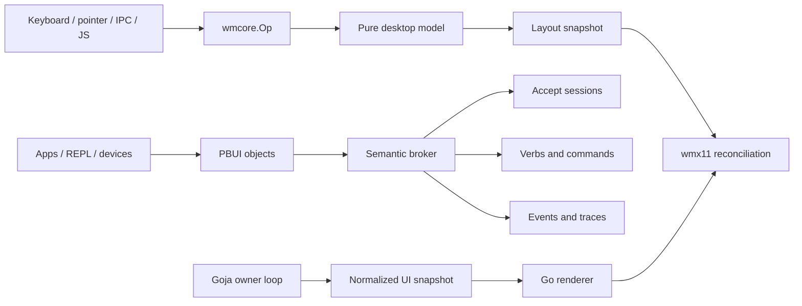
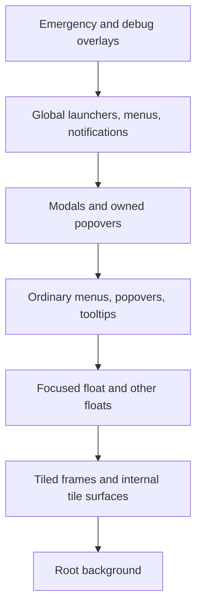
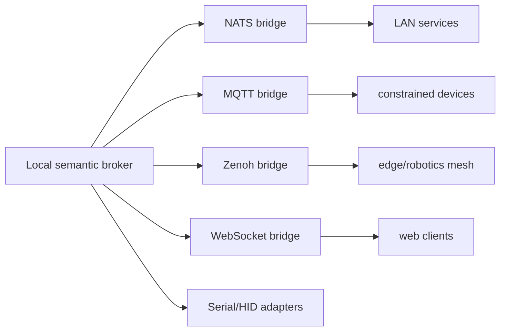
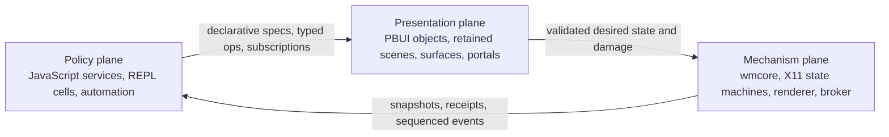
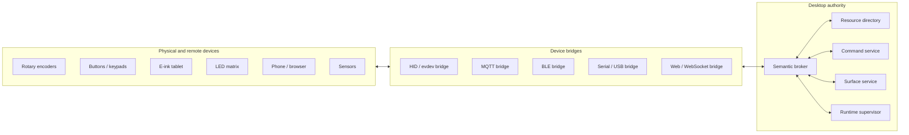
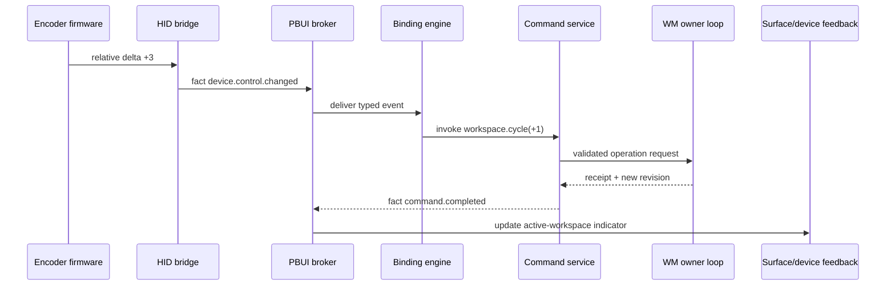
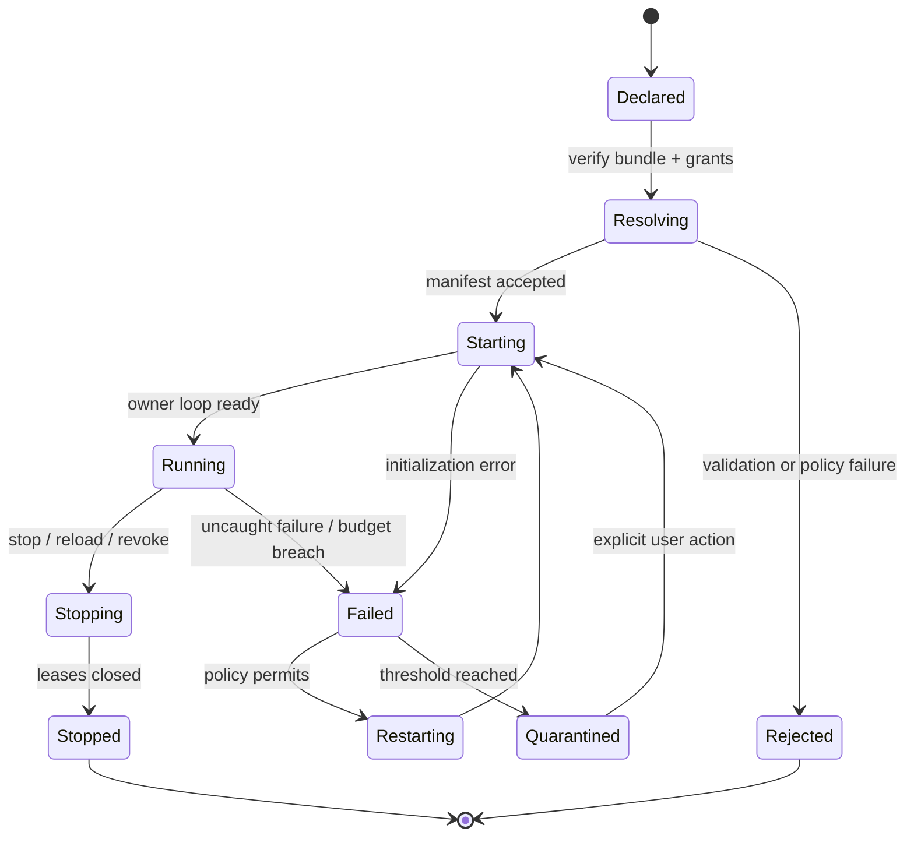

# The Programmable Semantic Desktop

## Extending `go-go-wm` with presentation-based UI, supervised JavaScript, transient applications, a rich REPL, and a physical interface mesh

**Status:** architecture and research report  
**As of:** 22 July 2026  
**Primary audience:** new contributors, interns, and researchers joining `go-go-wm`  
**Reviewed code baseline:** `go-go-golems/go-go-wm` around merge commit `5b73c9f37c97538f6767ecdc3ece4fb599932377`, together with `go-go-goja`, `go-go-os-frontend`, the eleven GGWM workspaces dated 18–20 July 2026, the supplied `pbui-shell` prototype, and the supplied basketball prototype.

---

## Abstract

`go-go-wm` is already more than a tiling window manager. It contains the beginning of a **semantic desktop kernel**:

- a pure, serializable desktop mutation vocabulary;
- typed presentations whose screen regions retain application meaning;
- a broker that coordinates object acceptance, verbs, and events across processes;
- a JavaScript runtime with explicit ownership and native modules;
- declarative JavaScript-defined surfaces rendered from immutable Go snapshots;
- and a REPL whose results become typed, multi-view desktop objects.

The next step is not to add an ever larger catalog of widgets. The next step is to make **objects, views, commands, runtimes, surfaces, and devices** first-class resources that can be inspected, composed, scripted, supervised, and addressed through one semantic protocol.

This report develops that architecture in detail. It explains the historical ideas behind it—Dynamic Windows, CLIM, Smalltalk, Self/Morphic, HyperCard, the Dynabook, and related Xerox PARC work—then connects them to current HCI research on malleable interfaces, interaction substrates, document-oriented end-user programming, contextual tools, local-first computational media, human–agent co-generation, and cross-device interaction.

The central recommendation is:

> Treat the REPL and JavaScript runtime not as configuration conveniences, but as the construction, inspection, and orchestration layer of the desktop. Treat the broker not as a message pipe, but as the typed semantic fabric through which applications, tools, agents, and physical devices participate in one inspectable world.

That recommendation has two equally important halves:

1. **Radical malleability at the semantic level.** A user can create a temporary app, add a view to an existing object type, bind a rotary encoder to a command, attach a live query to an e-ink surface, or turn a REPL result into a persistent tool.
2. **Strict containment at the authority level.** Scripts receive capabilities, handles, budgets, leases, and supervised lifetimes. They do not receive ambient access to X11, the broker socket, the filesystem, the network, or another runtime's Goja values.

The result is a desktop that can be changed while it is running without becoming irrecoverable.

---

## How to read this document

A new contributor should read the first three parts in order. They establish the vocabulary needed for the later protocol and runtime sections.

- **Part I** explains what exists now and which invariants must be preserved.
- **Part II** explains where the ideas came from and what current HCI research adds.
- **Part III** defines the semantic desktop kernel and its resource model.
- **Part IV** develops the retained presentation scene and scriptable UI architecture.
- **Part V** specifies the broker's richer semantic protocol.
- **Parts VI and VII** cover transient apps, sandboxed code delivery, runtime supervision, and the REPL as an operating-system shell.
- **Part VIII** extends the model across e-ink tablets, encoders, buttons, LED matrices, sensors, and other devices.
- **Part IX** turns the design into an implementation and research program.

Each substantial mechanism is introduced in four stages:

1. the user-visible problem;
2. the conceptual model;
3. the proposed wire or Go/JavaScript shape;
4. the failure modes and tests.

The code examples are architectural sketches. They are intended to make contracts concrete, not to prescribe every package name.

---

## Executive conclusions

### 1. The design target is a semantic desktop kernel

A conventional window manager primarily manages rectangles and input focus. `go-go-wm` can manage a richer set of desktop entities:

```text
ordinary WM                programmable semantic desktop
-----------                --------------------------------
window rectangle           surface with semantic ownership
key binding                typed command with capability checks
menu item                  verb applicable to presentation types
clipboard payload          object or live reference with provenance
launcher entry             command descriptor and invocation schema
configuration script       supervised runtime with leases and budgets
IPC message                typed fact, command, query, reply, or stream
widget                     retained scene node with semantic identity
external controller        device with properties, actions, and events
REPL result                typed object with views, verbs, history, and links
```

The word **kernel** does not imply that all of this belongs in a privileged process. It means that the system has a small, explicit semantic core whose operations can be implemented by multiple processes and transports.

### 2. Preserve the current separation of authorities

The current code contains three separations that should become constitutional rules:

1. **Durable desktop mutation goes through `wmcore.Op`.** Keyboard input, mouse input, IPC, JavaScript, and replay converge on the same pure operation path.
2. **Presentation semantics are separate from desktop geometry.** A `pbui.Object` and its applicable verbs do not need to know which X window currently displays them.
3. **Rendering consumes immutable normalized snapshots and never calls JavaScript.** JavaScript owns composition and semantic handlers; Go owns measurement, layout, painting, hit testing, and X-facing resource lifetimes.

The proposed architecture extends these rules rather than replacing them.

### 3. Make JavaScript runtimes supervised actors

One trusted `rc.js` runtime can configure the WM, but it must not become the universal execution environment. Long-lived tools, transient apps, remote code, and generated scripts need separate runtimes with:

- stable application identity and generation-specific runtime identity;
- an owner loop and bounded mailbox;
- a capability manifest;
- explicit resource and event budgets;
- leases for every registration and side effect;
- a startup/drain/stop/fail/quarantine lifecycle;
- structured logs and operation receipts;
- and a restart policy.

Untrusted code must run out of process. Goja's language isolation and interrupt mechanism are useful runtime controls, but Goja is not a hostile-code security boundary.

### 4. Make the REPL the desktop's construction and inspection language

The REPL should expose the desktop as values:

```javascript
const desktops = await wm.desktops.list();
const focused = await wm.focus.current();
const object = await pbui.inspect("pbui://object/player/lebron-james");
const trace = await events.query({ causation: focused.lastOp });
```

Every result should be eligible to carry:

- a presentation type;
- one or more contextual views;
- applicable verbs;
- source and causation metadata;
- a snapshot or a live reference;
- and an input form that can be inserted into a future cell.

A REPL cell can then create a surface, register a view, start a service, subscribe to an event stream, bind a device, or stage a transaction. The cell's resources remain visible and cancellable.

### 5. Deliver code as bundles and manifests, not privileged `eval`

The broker may transport a request to run JavaScript, but the safe primitive is not:

```json
{ "type": "eval", "code": "wm.closeAllWindows()" }
```

The safe primitive is closer to:

```json
{
  "type": "org.go-go.runtime.spawn.v1",
  "data": {
    "bundle": "sha256:9d6f...",
    "entry": "main.js",
    "profile": "transient-ui",
    "requestedCapabilities": [
      "surface.create:popover",
      "pbui.accept:player",
      "events.subscribe:stats.*"
    ],
    "lifetime": { "kind": "session", "ttlMs": 300000 },
    "limits": { "memoryMiB": 64, "cpuMsPerTurn": 20, "maxSurfaces": 2 }
  }
}
```

The runtime supervisor resolves and verifies the bundle, evaluates policy, grants a subset of requested capabilities, starts a new runtime generation, and returns a receipt.

### 6. Model transient apps as semantic sessions, not special windows

A transient application is a bounded computation with one or more surfaces. It may be:

- an accept prompt;
- a command palette;
- a temporary inspector;
- a calculation assembled from current objects;
- a HyperCard-like stack or card;
- a notification with actions;
- a projected e-ink panel;
- or a generated microtool that disappears after its task completes.

Its model, handlers, and resources can outlive one surface or be shown simultaneously in a tile, popup, REPL cell, and external device.

### 7. Upgrade the broker from topic fan-out to a semantic fabric

The broker should distinguish:

- **facts:** something happened;
- **commands:** a principal requests a state change;
- **queries:** a principal requests a snapshot or computation;
- **replies and receipts:** a request was accepted, rejected, applied, or failed;
- **streams:** an ordered result or observation sequence;
- **registrations:** a runtime provides a type, view, verb, command, or device;
- **leases and lifecycle:** a resource became available, renewed, drained, or disappeared.

A common envelope should carry identity, schema, source, subject, correlation, causation, trace context, principal, deadline, idempotency key, expected revision, and delivery class.

### 8. Extend the same ontology to physical devices

A rotary encoder is not merely a stream of integers. It is a device that advertises events and actions, has a location, may be bound to a focused semantic object, and should expose its current binding as an inspectable presentation.

An e-ink tablet is not merely a framebuffer. It is a surface with a refresh budget, partial-update constraints, latency characteristics, touch or pen events, and a projection policy.

The desktop mesh should therefore use the same concepts—descriptors, capabilities, schemas, leases, events, views, commands, and traces—across screen and physical endpoints.

### 9. The historical lesson is closure between use and construction

The most valuable shared property of Smalltalk, HyperCard, CLIM, and related systems is not a visual style. It is **closure between using an artifact and changing the system that presents or interprets it**.

`go-go-wm` should make that closure safe and explicit:

- use an object, then inspect its type and provenance;
- inspect it, then add a view or command;
- use a command repeatedly, then promote the sequence to a tool;
- create a temporary tool, then save it as a bundle;
- connect a device, then bind it by demonstration;
- observe a failure, then replay the causal event chain.

### 10. Novelty requires stronger observability, not weaker discipline

A malleable desktop must be more inspectable than an ordinary desktop because more of its behavior changes at runtime. The runtime inspector, object inspector, scene inspector, broker trace, lease browser, capability browser, and device graph are not optional developer extras. They are the means by which a live system remains understandable.

---

## A compact mental model for an intern

Imagine that the desktop is a theater.

- `wmcore` is the stage machinery. It knows how the set is divided and which durable move happened.
- `wmx11` is the stage crew. It owns X11 requests, focus, frames, and physical screen resources.
- PBUI objects are the actors' identities and roles. A painted face on screen is not the actor; it is one presentation of the actor.
- Views are costumes or camera angles for the same object.
- Verbs are actions that make sense for particular roles.
- The broker is the stage manager. It knows who registered which role, action, session, and observation.
- JavaScript runtimes are supervised visiting companies. They may construct scenes and react to semantic cues, but they do not operate the fly system directly.
- A surface is a stage, panel, popup, card, REPL output, or device endpoint where a scene is shown.
- The REPL is both rehearsal room and control desk. It can inspect the current cast, construct a temporary scene, register new behavior, and turn a successful experiment into a maintained production.

The metaphor stops being useful at one specific boundary: security. In code, every company must have explicit capabilities, every prop must have an owner, and every registration must have a lease that the supervisor can revoke.

---

## Design axioms

The rest of the report relies on the following axioms.

### Axiom 1: output should retain meaning

When the system displays a player, file, color, window, query, device, or operation, it should retain enough information to treat the displayed region as that thing later.

### Axiom 2: one object may have many views

A player may appear as a row, shot marker, trend line, radar polygon, compact chip, e-ink summary, or spoken phrase. View choice is contextual and must not change object identity.

### Axiom 3: direct manipulation and scripting are duals

A direct manipulation should be expressible as an operation or command. A repeated operation sequence should be promotable into a reusable command, script, or binding.

### Axiom 4: the host owns mechanics; scripts own intent

Scripts describe structure, state transitions, and semantic effects. Native code owns measurement, layout, paint, hit testing, X11, queues, cancellation, and enforcement.

### Axiom 5: ambient authority is a bug

A script receives only the handles and capabilities it needs. The absence of a capability must be enforced below the JavaScript API surface.

### Axiom 6: every asynchronous action yields evidence

A command returns a receipt. A runtime has a lifecycle record. An event has causation and trace metadata. A lease can be inspected. A dropped event increments a visible metric.

### Axiom 7: transient state and durable state are different

Pointer previews, hover, drag feedback, and intermediate generation can be latest-wins and lossy. Committed operations, capability grants, bundle identities, and user-authored app definitions must be exact and replayable.

### Axiom 8: every live extension must be removable

A script generation, app session, view registration, device binding, and subscription must have an owner and an idempotent cleanup path.

### Axiom 9: the recovery path must not depend on user scripts

There must always be an unscripted route to stop runtimes, revoke capabilities, inspect failures, restore a known configuration, and leave the WM cleanly.

### Axiom 10: generated interfaces must preserve structure

AI may propose task models, views, commands, or scene patches. It should not be the sole owner of opaque pixel output or unrestricted source rewrites. Generated changes should compile to inspectable structured operations.

# Part I. What exists now

## The architectural center of gravity

The recent workspaces look broad—tiling, transients, themes, launchers, shared pixmaps, scripting, and a notebook-like REPL—but they converge on a small number of architectural ideas.



The top path controls durable geometry. The middle path controls meaning and cross-application interaction. The bottom path lets scripts construct interfaces without entering the X-facing render loop.

A clean extension keeps those paths distinct and introduces explicit bridges:

- a semantic command can request a `wmcore.Op`;
- a rendered scene node can register a PBUI presentation and hit region;
- a runtime can own surfaces, verbs, subscriptions, and bindings through leases;
- a broker event can describe the receipt and resulting state revision of a desktop operation.

## Code-level findings that constrain the extension

### `wmcore.Op` is the durable mutation boundary

`pkg/wmcore/ops.go` defines a serializable operation vocabulary and funnels mutation through `Apply`. This is the right point for authorization, revision checks, idempotency, transaction staging, replay, undo metadata, and receipts. JavaScript should request operations; it should not be given methods that secretly mutate separate WM state.

A future command path should look like:

```go
type ApplyRequest struct {
    Op              wmcore.Op
    Principal       PrincipalID
    ExpectedVersion uint64
    IdempotencyKey  string
    CorrelationID   string
}

type ApplyReceipt struct {
    Status          ReceiptStatus
    OperationID     string
    PreviousVersion uint64
    NewVersion      uint64
    Events          []EventID
    Error            *Problem
}
```

The important addition is not another mutation API. It is evidence around the existing one.

### `pbui.Object` is currently value-oriented

The present object shape—presentation type, value, label, and documentation—is an effective portable minimum. It works for JSON-clean values and enables the broker to match objects to verbs and accept requests.

The next system needs two related object forms:

1. **value objects**, whose complete meaning travels in the message;
2. **live references**, whose identity, revision, owner, and snapshot travel in the message while mutations remain with the owner.

Do not overload a raw JSON value with hidden identity semantics. A file path string and a live editor buffer referring to that file are not the same kind of object.

### `jsmod.Bridge` already enforces the right Goja boundary

The bridge converts data outside the VM and schedules VM access through the runtime owner. `OpFromJS` normalizes and validates operations before the pure model applies them. This is the pattern every future native module should follow:

```text
JavaScript object
    -> export to plain Go value on owner loop
    -> normalize and validate outside VM
    -> perform asynchronous native work
    -> post settlement to owner loop
    -> resolve promise with plain value or opaque handle
```

A Goja value must never be stored in a broker record, passed to the WM goroutine, or used as a callback from an arbitrary goroutine.

### `eventfan` and the bounded queue expose the first backpressure policy

The current event fan performs one broker subscription, copies messages into a bounded queue, and posts batches to the owner loop. The bounded queue drops newest arrivals when full and records a drop count. This is much better than an unbounded goroutine-per-event design.

It is not yet a universal event policy. Different event classes require different behavior:

| Event class | Appropriate policy |
|---|---|
| pointer preview | latest value wins |
| key/button edge | ordered, bounded, do not silently coalesce |
| desktop operation fact | durable or recoverable from cursor |
| telemetry | sampled or aggregated |
| object revision | retained latest snapshot plus revision |
| audit/security | durable, append-only |
| animation tick | droppable and local |

The richer broker should let schemas declare a delivery class instead of making every subscriber infer one.

### `uimod` proves that VM-free rendering is practical

The current `ui` module normalizes a JavaScript-authored row/segment specification, stores a Go snapshot behind a mutex, and lets the renderer consume only that snapshot. Handler invocation is posted back to the owner loop. This makes the X loop independent from Goja latency and garbage collection.

The generalization should be a retained scene rather than callback-based immediate drawing. The contract remains:

```text
JS state + DSL
    -> normalized immutable scene snapshot
    -> native diff / measure / layout / paint / hit index
    -> semantic event with node and object identity
    -> JS handler on owner loop
    -> new scene snapshot
```

### The rich REPL is already a PBUI producer

`pkg/repl` deliberately avoids wrapping every result in a generic `repl-value` type. A numeric series becomes `series`, a table-like array becomes `dataset`, a color remains `color`, and each can expose multiple views. The output header is a real PBUI object, so desktop-wide verbs and accept compatibility apply to it.

That decision is foundational. The next REPL should preserve it when adding live references, asynchronous cells, transactions, subscriptions, app creation, and device bindings.

## Eleven workspaces, one trajectory

| Workspace | Date | Main contribution | Architectural consequence |
|---|---:|---|---|
| GGWM-001 PBUI-WM | 18 Jul | split-tree WM, broker, clients, apps, CLI | operations and presentation protocol become system primitives |
| GGWM-002 GOJA-DSL | 18 Jul | `wm` and `pbui` modules, runtime ownership, script kinds | scripts become clients of typed host services |
| GGWM-003 UI-MODULE | 18 Jul | JS-authored data-only UI specs and native render snapshots | scripts can build surfaces without drawing or touching X |
| GGWM-004 THEMES-I3 | 19 Jul | dynamic themes and an i3-derived JS configuration | high-level familiar configuration can compile to the same primitives |
| GGWM-005 PERF | 19 Jul | measured paint-path optimization | novel semantics must respect input and paint latency budgets |
| GGWM-006 XSHM | 19 Jul | shared pixmaps and operation batching | transport and commit batching are separate from semantic architecture |
| GGWM-007 TRANSIENTS | 19 Jul | floating dialog/transient layer | transient surfaces should not contaminate the pure tiling tree |
| GGWM-008 LAUNCHER | 19 Jul | command registry and popup/tile launch surfaces | commands deserve a schema and multiple views, not one hard-coded launcher |
| GGWM-009 RICH-REPL | 19 Jul | typed rich results and notebook surface | the REPL can be the semantic shell of the desktop |
| GGWM-010 PR1-REVIEW | 19 Jul | concurrency, correctness, and CI review | ownership invariants must be made explicit and testable |
| GGWM-011 FOCUS-FS | 20 Jul | focus/fullscreen state owners and pure decision helpers | related policy must live in explicit state machines rather than scattered fields |

The sequence matters. The project did not first build a large UI framework and then bolt scripting onto it. It built a small semantic protocol, a pure state core, and owner-loop boundaries. That is a better basis for experimentation than a conventional application toolkit.

---
## The semantic core inherited from the prototypes

The supplied `pbui-shell` prototype defines more than a visual style. It establishes the system's semantic contract:

- A presentation associates a presentation type, a value, a visual face, and interaction metadata.
- A pending `accept` changes the meaning of every compatible presentation across the desktop.
- A right-click menu is assembled from verbs applicable to the presentation type, regardless of which process registered them.
- A binary split tree owns tile geometry.
- Applications share a desktop-level world of output, inspection, and tracing rather than behaving as isolated rectangles.
- The same data can be rendered in different places while remaining the same live object.

This is close to the CLIM model. CLIM defines a presentation as an association among an object, a presentation type, and displayed output. Presentation types define how objects are presented and accepted and form an inheritance lattice. ([[H1]](#ref-h1), [[H2]](#ref-h2), [[H3]](#ref-h3)) go-go-wm translates that idea into JSON values, a broker, process ownership, and screen regions.

The basketball prototype adds an important requirement that the first prototype only hints at ([[P13]](#ref-p13)): a presentation is not necessarily a text chip. It may be a shot marker on a court, a point on a trend line, a radar polygon vertex, a bubble, a table cell, a team-color swatch, or a composite row. A future widget system must therefore allow a presentation wrapper around **any retained visual node or group**, with a precisely computed hit region and view-specific face.

HyperCard contributes a different but compatible lesson: interface objects carry scripts and participate in an event/message system. ([[H4]](#ref-h4)) The useful principle is not to copy HyperTalk syntax. It is to make the desktop inspectable and alterable at the level the user sees: bars, fields, menus, cards/surfaces, commands, and data objects. JavaScript should compose these elements without receiving raw XIDs or needing to implement window-system mechanics.

## Package boundaries and data flow

The current package structure is unusually good for a young WM:

| Package | Responsibility | Review assessment |
|---|---|---|
| `pkg/wmcore` | Pure desktop, split tree, operations, layout, neighbor queries | Strong foundation. Keep X11 and scripts out. |
| `pkg/wmx11` | Reparenting shell, frames, focus, floating, fullscreen, input, bars, menus, launcher, IPC | Correct owner-loop direction; currently carries too much immediate rendering policy. |
| `pkg/pbui` and broker/client | Typed objects, accepts, verbs, menus, event bus, wire protocol | Semantically distinctive and well factored. Needs richer type/view metadata over time. |
| `pkg/draw` | Theme and software drawing primitives, X image conversion | Testable and deterministic; should become a backend for retained layers rather than the public widget abstraction. |
| `pkg/apps` | Region/click contract and embedded app vocabulary | Useful bridge; flat regions and full-surface render functions are now the main limitation. |
| `pkg/apps/uispec` | Declarative row/segment IR | Correct direction; insufficient hierarchy, invalidation, state, and general hit semantics. |
| `pkg/apps/xapp` | Standalone X client shell for PBUI apps | Functional, but its full redraw/upload/destroy loop is a major performance gap. |
| `pkg/jsmod` | Goja bridges, event fan, queues, `wm`, `pbui`, and `ui` modules | Owner-loop and data normalization rules are strong. Needs generation/capability/surface orchestration for full UI scripting. |
| `pkg/xshm` | Shared-pixmap upload path | Valuable optimization, but current size-coupled lifetime makes interactive resizing expensive. |

The normal model-to-screen path is:

```text
input / IPC / JavaScript
        |
        v
    wmcore.Op
        |
        v
  Desktop mutation
        |
        v
 wmcore.Layout(area)
        |
        v
 X frame reconciliation + rendering
        |
        v
      X server
```

The PBUI semantic path is orthogonal:

```text
application or script registers verbs / emits objects
        |
        v
      broker
        |
        +---- accept mode broadcast ----> all surfaces highlight compatible objects
        |
        +---- menu query ----------------> verbs by type and owner
        |
        +---- verb.run ------------------> owning process / runtime
```

These two paths should remain orthogonal. Layout operations should not know about presentation menus; PBUI objects should not know about X rectangles. The surface layer is where they meet: a rendered presentation produces hit geometry and a broker object, while the WM supplies placement and input.

## What the 18-20 July project entries accomplished

The dated repository notes describe a rapid but coherent evolution.

### GGWM-001: the native system

The initial implementation translated the React sketch into a pure binary split engine, a PBUI broker and client protocol, a software-drawn reparenting WM, embedded applications, standalone demos, and CLI tools. The durable-operation design was established early. This is important: keyboard bindings, mouse actions, IPC, and JavaScript can all express the same mutation vocabulary.

### GGWM-002: scripting attachment points

The scripting design correctly separates three attachment points ([[P2]](#ref-p2)):

- In-process configuration in the WM process.
- Standalone scripts controlling the WM over IPC.
- An interactive REPL using the same modules.

The decisive concurrency rule is that goja has its own owner loop and the WM loop never executes JavaScript. Calls cross through posted closures and bounded waits. `accept` is promise-shaped because it is a one-shot rendezvous; verbs and events are callback streams. The `wm` and `pbui` modules are separated because they carry different authority.

### GGWM-003: the first declarative UI module

`uimod` introduced a normalized data-only specification, rendered by Go into an image and a list of regions. ([[P3]](#ref-p3)) Script handlers run on the JS loop, produce a new snapshot, and post a repaint. The render host reads only a mutex-protected normalized snapshot and never calls JavaScript. This is the most important invariant to preserve while expanding widget power.

### GGWM-004: themes, i3-derived configuration, and onboarding

The theme work centralized palette lookup and exposed a practical lesson: paint-time configuration must not be captured as init-time values, and palette mutation must have one writer. The i3-style JavaScript configuration demonstrated that the operation API can support a familiar workflow without parsing i3's configuration language.

### GGWM-005: measured paint-path improvements

The performance ticket used CPU profiles rather than intuition. ([[P5]](#ref-p5)) Before optimization, frame painting, pixel conversion, fills, duplicate Expose handling, and garbage collection dominated. The implementation changed fills to row copies, conversion to row-major traversal, cached frame images, reused Expose buffers, limited drag updates, and repainted only frames whose geometry changed. Recorded CPU time and startup time fell substantially.

### GGWM-006: shared pixmaps and batching

MIT-SHM shared pixmaps removed repeated PutImage transfer for frame buffers. ([[P6]](#ref-p6), [[X3]](#ref-x3)) Operation batching prevented repeated model-to-X reconciliation during multi-operation scripts. Parallel conversion and bar caching addressed remaining hot spots. Damage tracking was deliberately deferred.

### GGWM-007 through GGWM-009: missing desktop layers

The transient-window design correctly keeps floating dialogs out of the pure tiling tree. The launcher design introduces one command registry behind popup and tile surfaces. The rich REPL recognizes that PBUI already supplies the right ontology for rich values ([[P7]](#ref-p7), [[P8]](#ref-p8), [[P9]](#ref-p9)): a result should be a real `color`, `number`, `dataset`, or domain object, not a wrapper that loses desktop-wide verbs and accept compatibility.

### GGWM-010 and GGWM-011: correctness and state ownership

PR review exposed focus/fullscreen bugs caused by related state spread across raw fields and files. ([[P10]](#ref-p10), [[P11]](#ref-p11)) The follow-up created explicit `fullscreenState` and `focusState` owners and display-free decision functions. This is the right structural response. Similar ownership types should be introduced for interactive resize, surface stacking/input scope, and geometry policy.

## What is already architecturally strong

A performance review should not flatten the system into a list of problems. Several choices should be defended during refactoring.

### Pure layout and operations as data

`wmcore` can be fuzzed, property-tested, serialized, replayed, and queried without X. Keeping mutation in `Apply` makes behavior consistent across keyboard, mouse, IPC, scripts, and tests. The long-term opportunity is to distinguish durable operations from transient previews, not to abandon operations as data.

### Single-owner loops

Both the WM and goja runtime use owner loops. This allows asynchronous composition without pervasive locks and makes boundaries visible. Retained UI snapshots fit naturally into the same design.

### VM-free rendering

The current script-tile renderer reads a normalized snapshot and invokes no JavaScript. This protects the X loop from a runaway script, a slow promise, garbage collection in the VM, or reentrant UI calls. Every future widget and surface should obey the same rule.

### Broker symmetry

The WM participates in the same PBUI protocol as other processes. It does not secretly own a second type/action mechanism. This permits terminal presentations, standalone apps, scripts, bars, and REPL output to interoperate.

### Profiling before optimization

The project has already recorded before/after profiles and documented why each change matters. Preserve this discipline. The next phase should add latency and event-queue measurements, not replace profiling with architectural speculation.

### Recent focus/fullscreen encapsulation

The current `focusState` and `fullscreenState` make invariants testable without a display and give one owner to related state. Resize mode, preview state, and surface input scopes deserve analogous types.

## Current implementation risks

The main risks are not isolated bugs. They are boundaries that will become more expensive as widget power and surface count grow.

| Area | Current behavior | Consequence |
|---|---|---|
| Rendering | Immediate-mode full-surface `image.RGBA` output | Any small state change can repaint and upload all pixels. |
| Client frame | Decoration and content share a full frame-sized buffer | Ordinary client resize churns megabytes of decoration data that is mostly hidden by the child. |
| Resize model | Every preview applies a durable ratio operation | Allocation, event emission, and observers are coupled to pointer frequency. |
| Motion control | Time gate without a latest-state mailbox | Stale events can remain queued; latency can grow under load. |
| X resources | Shared surfaces are dimension-coupled and recreated on size change | SysV SHM, X pixmap, and checked-request churn occurs in the hottest interaction. |
| `xapp` | Full render plus new upload object on every ConfigureNotify | Managed PBUI clients double the total resize work. |
| `uispec` | Flat rows and segments | No general nesting, retained identity, clipping, scrolling protocol, modal focus, or fine invalidation. |
| Regions | Flat reverse linear scan | Adequate for small demos; expensive and semantically weak for tables/plots/large scenes. |
| Modal state | Separate booleans/pointers for menu, launcher, accept, drag | Input routing and focus restoration become increasingly ad hoc. |
| Accept styling | `repaintAllFrames` on mode transitions | A semantic overlay change triggers full rasterization of every frame. |
| Script lifecycle | Handler IDs are not a complete generation-stamped resource model | Hot reload can leave stale events or resources without a central surface generation contract. |
| Capabilities | Process/spawn checks exist, but UI authority is coarse | Global bars, input grabs, notifications, and overlays need explicit permission boundaries. |
| WM event emission | A new goroutine is started for each broker event | Bursts can convert event pressure into goroutine pressure and make ordering/backpressure implicit. |
| `xapp` posting | Queue overflow falls back to spawning a goroutine that waits to enqueue | A saturated UI loop can accumulate goroutines instead of applying an explicit drop/coalesce policy. |
| Broker/runtime queues | Different components locally drop new messages, drop writes, or preserve FIFO | Authoritative, interaction, preview, and telemetry events need different delivery contracts and visible loss accounting. |
| Batch operations | `ApplyBatch` stops at the first error after applying the successful prefix | Appropriate for trusted boot batches, but user-facing transactions need complete validation and atomic model commit semantics. |
| Script services | One rc runtime can own unrelated global side effects | Reload, failure, or queue stalls can disturb keybindings, bars, commands, and experimental code together. |

The rest of this document develops concrete replacements for these boundaries.

## What to borrow from other systems—and what not to copy

Reference implementations are most useful when reduced to the invariant or scheduling problem they solved. go-go-wm does not need to become i3, Sway, AwesomeWM, or Qtile. It should borrow their mature mechanisms while preserving its own PBUI semantics.

| System | Mechanism worth borrowing | Why it applies | What not to copy blindly |
|---|---|---|---|
| i3 ([[W1]](#ref-w1), [[W2]](#ref-w2)) | Drain pending drag events and keep the newest `MotionNotify`; graphical tiled resize moves a small helper bar and commits layout after release. | Directly addresses event age, overload, and slow clients in the current divider path. | i3's command/config surface is not the desired semantic UI model; PBUI requires richer objects and surfaces. |
| Sway ([[W5]](#ref-w5)) | Explicit pending/current state and transaction records; apply when participants are ready or a timeout expires; avoid duplicate configures. | Provides the right mental model for desired, pending, and applied desktop/surface state, even though X11 readiness differs from Wayland configure/ack. | Do not transplant Wayland protocol details or wait semantics into X11 unchanged. |
| AwesomeWM ([[W3]](#ref-w3), [[W4]](#ref-w4)) | A retained widget hierarchy with separate `layout_changed` and `redraw_needed` invalidation. | Demonstrates that content repaint and measure/layout invalidation must be distinct contracts for efficient scripted widgets. | Direct Lua widget objects and Cairo callbacks should not cross into go-go-wm's X/render hot path. Keep data-only snapshots. |
| Qtile ([[W6]](#ref-w6), [[W7]](#ref-w7)) | A command graph that separates object addressing from command execution; custom widgets run under documented event-loop rules and expose commands through one interface. | Useful for a stable WM object/handle model and for making the same operations available to keybindings, scripts, IPC, and the REPL. | Avoid exposing mutable implementation objects as the official API. Logical handles and serializable operations are safer. |
| CLIM/McCLIM ([[H1]](#ref-h1), [[H2]](#ref-h2), [[H3]](#ref-h3)) | Presentations associate typed objects with visible output; `accept`, presentation types, translators, and commands make output reusable as input. | This is the semantic core of PBUI and the right basis for menus, table cells, plot marks, REPL results, and cross-application workflows. | Do not require a Common Lisp stream/output-recording architecture internally. Preserve the semantics in a modern retained scene and broker protocol. |
| Smalltalk/HyperCard ([[H4]](#ref-h4)) | Inspectable live objects, messages/scripts attached to visible things, and an environment where authoring and use coexist. | Supports the goal that the REPL, inspectors, surfaces, and user automation form one malleable desktop rather than separate developer tools. | Do not make every pixel or application object an unrestricted mutable object in one global heap. Use ownership, capabilities, and process boundaries. |

The synthesis is:

- use i3's latest-state drag semantics and cheap preview;
- use Sway's explicit transaction/state staging;
- use AwesomeWM's invalidation distinctions;
- use Qtile's addressable command graph and external-control discipline;
- use CLIM's presentation semantics;
- use Smalltalk and HyperCard's inspectable, live authoring experience;
- implement all of it through go-go-wm's pure Go model, serialized operations, supervised Goja owners, retained PBUI scenes, and X11 mechanism layer.

This combination is novel, but none of its low-level correctness requirements are novel. That is an advantage: mature WM and UI mechanisms can carry the experimental semantic layer.

---
## Lessons from the `go-go-os-frontend` HyperCard runtime experiments

`go-go-os-frontend` is implemented in a different environment—React, Redux, and QuickJS rather than X11, Go, and Goja—but several of its later architectural corrections are directly relevant. The important material is not the visual HyperCard styling. It is the separation of runtime artifacts, runtime instances, surfaces, host action routing, and operator tooling.

### The vocabulary became more precise as the runtime grew

The current runtime concepts guide distinguishes:

```text
RuntimeBundle       immutable/app-authored source and metadata
RuntimePackage      installable VM-side API/DSL plus host integration
RuntimeSession      one running VM instance
RuntimeSurface      one renderable surface definition inside a session
RuntimeSurfaceType  the host validator and renderer for one surface tree kind
```

This vocabulary emerged because the earlier words “stack” and “card” collapsed too many concerns. The same warning applies to `go-go-wm`. “App” must not simultaneously mean source bundle, running Goja runtime, user session state, tile, popup, and broker identity. The model in this report deliberately preserves the same distinctions, then adds capability grants, generations, leases, and device projections.

The frontend guide also separates a **static half**—package definitions, source, documentation metadata, validators, renderers—from a **live half**—the VM, installed APIs, loaded bundle, surface state, and emitted actions. This is a useful build and security boundary:

- static artifacts can be hashed, signed, reviewed, documented, and cached;
- live sessions can be supervised, budgeted, stopped, and replaced;
- host validators/renderers are not supplied by an untrusted runtime;
- a session records exactly which static artifacts it instantiated.

For `go-go-wm`, this maps to immutable bundles and manifests on one side, and generation-scoped Goja runtimes/app sessions on the other.

### Runtime package installation is not surface interpretation

A particularly useful frontend invariant is that `packageIds` and a surface `packId` answer different questions:

- package IDs determine which VM helper APIs are installed;
- a surface type ID determines which host validator/renderer owns the returned tree.

The runtime rejects a surface that does not identify its host-side surface type. That prevents a source bundle from returning an ambiguous tree and relying on whichever renderer happens to be available.

The analogous `go-go-wm` rule should be:

```text
runtime module grant     what the script may call
scene/view type          what the host knows how to validate and render
presentation type        what the visible object means
surface profile          where and under which interaction constraints it appears
```

These identifiers must not be inferred from one another. Granting `require("ui")` does not authorize arbitrary native node kinds. A `player` presentation type does not specify whether it is a table row, plot mark, or e-ink summary. A surface profile does not grant the runtime permission to create a surface.

### Session lifetime must not follow component mount lifetime

The frontend introduced an explicit runtime-session manager above its VM service. That manager tracks stable session IDs, handles, attached windows/views, serializable summaries, and ownership classes such as window-owned, broker-owned, and attached-read-only. Its lifecycle middleware only disposes a window-owned session when the final surface window closes; a React component unmount is no longer the authority for VM disposal.

This is a strong precedent for `go-go-wm`:

- closing one projection must not necessarily destroy the app session;
- a tile, popup, e-ink view, and REPL attachment can share one session;
- the runtime supervisor, not an X frame or renderer, decides lifetime;
- lifetime policy is an explicit ownership record;
- operator tooling reads serialized session summaries rather than internal VM objects.

The model also exposes an important inverse rule: when an ephemeral app is declared **surface-owned**, closing its last surface may intentionally dispose it. The distinction is policy, not an accident of UI unmounting.

### Session state and surface state should be separate

The frontend runtime-session record separates shared `sessionState` from per-surface `surfaceState`. Its local action vocabulary distinguishes surface-local draft mutations from session-level filter mutations.

`go-go-wm` should generalize this into explicit state classes:

| State class | Examples | Authority and recovery |
|---|---|---|
| app-session state | selected players, query, workflow step | session owner; snapshot/migrate |
| surface state | scroll, folded panels, local draft, selected view | surface/session policy; often disposable |
| desktop state | workspace tree, focus, fullscreen | WM owner; `wmcore.Op` and revision |
| device projection state | acknowledged scene revision, display mode | device adapter; reconcile from desired state |
| durable user artifact | saved stack/app/notebook/binding | storage authority; explicit persistence operation |

A script should not store window-manager truth in its session model, and the WM should not absorb app-specific draft state.

### Actions cross the VM/host boundary as data

The frontend action path classifies runtime actions into local draft, shared filters, domain actions, and system actions. It records each action in a bounded timeline with `applied`, `denied`, or `ignored` outcome, routes approved domain/system actions through host reducers, and annotates downstream actions with session, surface, and window origin.

That pattern is directly useful:

```text
VM handler
  -> plain RuntimeAction
  -> classify and validate
  -> authorize
  -> record outcome
  -> route to host authority
  -> host state change
  -> rerender from new state
```

It avoids giving the VM direct references to Redux dispatch internals. For `go-go-wm`, replace Redux action routing with schema-described commands and owner-loop operations, but keep the explicit data boundary and timeline.

The frontend also exposes two issues that the Go design should correct rather than copy:

1. Its current capability-policy default is `all` for domain and system actions. Received or generated code in `go-go-wm` should be deny-by-default and receive a resolved narrow grant set.
2. Authorization is visible in both ingestion and downstream routing. `go-go-wm` should have one authoritative host-boundary decision, with a signed/traceable decision record, so policy cannot drift between layers.

A richer result than `applied/denied/ignored` is also needed for asynchronous OS effects. The broker command path should produce acceptance and completion receipts, revisions, structured errors, and possible `outcome-unknown` state.

### A bounded action timeline is a useful minimum inspector

The frontend stores action type, payload, session, surface, timestamp, outcome, and reason in a bounded timeline. This proved useful enough to become standard debug UI.

`go-go-wm` should carry the idea further:

- include source principal and runtime generation;
- distinguish command, fact, state update, preview, and fault;
- record capability grant and schema version;
- include causation, correlation, operation ID, and trace context;
- link to presentation record, REPL cell, device channel, or input event;
- include owner-loop queue delay and execution duration;
- retain authoritative events separately from disposable telemetry.

The important lesson is that runtime output and host actions need one inspectable history from the beginning. Debugging should not depend on adding `console.log` inside a transient app.

### The HyperCard REPL separates spawn, attach, inspect, and edit

The frontend's HyperCard REPL driver exposes operations including:

```text
packages          list installed runtime packages
surface-types     list host-known runtime surface types
bundles           list spawnable bundle definitions
spawn             create a runtime session from a bundle
attach            attach to a host-owned session in read-only mode
sessions          list visible sessions and ownership mode
use               select an active session
surfaces          list session surfaces
render            render a surface to an inspectable tree
event             invoke a surface handler and inspect emitted actions
define-surface    add a surface to a writable session
define-render     replace a render function
define-handler    replace/add a handler
open-surface      request a host window for a surface
help              browse command/package/surface documentation
```

This is a useful decomposition for the `go-go-wm` REPL. It distinguishes:

- **spawn** from **attach**;
- read-only observation from writable authoring;
- session selection from surface selection;
- rendering from handler invocation;
- runtime package documentation from bundle-specific documentation;
- source mutation from host surface placement.

The frontend driver explicitly refuses mutation of an attached read-only session. The proposed Goja REPL should preserve that mode and make it more granular through capabilities. An attach handle might allow snapshots, event subscription, scene inspection, and operation history while denying source evaluation, state mutation, handler replacement, and host commands.

### Documentation metadata belongs in the runtime environment

The frontend REPL combines command help, package documentation, bundle documentation, symbol completion, surface summaries, and active-session prompt state. Runtime packages therefore include not only executable APIs but documentation metadata.

This supports an important goal for `go-go-wm`: help, completion, examples, schemas, capabilities, and source locations should all be queryable semantic resources. A new developer should be able to evaluate:

```js
help(commands.get("wm.workspace.rename"))
help(types.get("player"))
help(devices.get("device://desk/eink/main"))
help(runtime.current().capabilities)
```

and receive rich presentations with links to descriptors, examples, provenance, and relevant source—not plain terminal prose disconnected from live objects.

### What to carry over, and what to change

| Frontend experiment | Carry into `go-go-wm` | Strengthen or change |
|---|---|---|
| runtime bundle/package/session/surface/type vocabulary | preserve separate identities and static/live halves | add immutable digests, generations, leases, and capability manifests |
| host-owned surface type validation | require explicit scene/view interpretation | support retained PBUI presentation records and target profiles |
| runtime-session manager | decouple VM lifetime from surface/window mount | supervise independent Goja/process profiles and restart/quarantine |
| session state versus surface state | preserve separate ownership and persistence | add desktop/device/durable-artifact state classes |
| action-as-data boundary | route semantic requests through host authority | schemas, deny-by-default grants, receipts, revisions, idempotency |
| bounded action timeline | make runtime behavior inspectable | causal traces, delivery classes, operation lifecycle, source presentations |
| read-only REPL attach | support safe observation of existing runtimes | scoped diagnostic handles and serialized snapshots only |
| inline REPL authoring commands | preserve immediate live editing | compile edits into bundle/model operations; restrict received inline code |
| package/bundle docs and completions | make APIs self-describing | expose documentation itself as typed PBUI objects and views |

The broad conclusion is that the frontend experiments validate the direction of this report. They also show where a prototype runtime tends to accumulate ambiguity: lifetime follows UI components, capabilities default too broadly, action categories remain string conventions, and surfaces are confused with sessions. `go-go-wm` can start from the corrected model because its Go/X11 core already enforces stronger authority boundaries.

---
# Part II. The lineage: forgotten interface ideas and current descendants

## Why study old systems when the implementation is new

Historical systems are useful here for a specific reason: they explored **different unit boundaries** from those that became standard.

Today's mainstream stack usually assumes:

```text
application -> private model -> private UI tree -> pixels
```

The user can manipulate the pixels through controls chosen by the application, but the operating environment usually cannot recover the semantic objects behind arbitrary output. Programming occurs in a separate editor, application boundaries are rigid, and the window manager knows almost nothing about application content.

The systems relevant to `go-go-wm` explored alternatives:

```text
semantic object -> one of many presentations -> context-sensitive operation
```

```text
visible artifact <-> editable program <-> live state
```

```text
shared document / card / world -> behavior assembled during use
```

```text
physical or spatial object -> computational identity -> relationships to nearby objects
```

The goal is not historical reenactment. The goal is to recover useful mechanisms and re-express them with modern process isolation, structured protocols, reproducible source, explicit capabilities, and distributed devices.

## A lineage map

| System or research line | Primary contribution | What `go-go-wm` should borrow | What it should not copy literally |
|---|---|---|---|
| Licklider's symbiosis | computer and human as complementary participants | mixed initiative, inspectable delegation, rapid dialogue | vague “AI assistant” behavior without explicit authority |
| Engelbart/NLS | integrated commands, structured documents, linking, collaboration, bootstrapping | one environment for acting on structured artifacts and improving the environment itself | command density without progressive disclosure |
| Sketchpad | graphical objects with constraints and direct manipulation | semantic geometry, relationships, editable constraints | a domain-specific geometry model as the whole desktop model |
| GRAIL/RAND Tablet | gesture and sketch as computational notation | progressive formalization from informal input to commands | treating pen input as merely a mouse replacement |
| Smalltalk/Dynabook | personal dynamic medium, live objects, uniform environment | liveness, inspectors, browsers, direct experiments, user-created media | one opaque image as the only persistence and deployment format |
| Self/Morphic | directness and liveness, structural reification of UI | editable live scene nodes and immediate feedback | unrestricted mutation from arbitrary callbacks |
| Genera Dynamic Windows | output records, presentation types, commands, contextual operations | typed screen output and command applicability | in-process trust assumptions of a Lisp machine |
| CLIM | portable formalization of presentations, types, translators, output history, commands | explicit type lattice, views, acceptance, translators, semantic output records | stream/output APIs as the only authoring interface |
| HyperCard | low floor, gradual authoring, cards/backgrounds, scripts, message path | transient apps, visible authoring, reusable backgrounds, scoped bubbling | global message lookup without capability or ownership checks |
| NoteCards/Rooms/Pad++ | spatial and task-oriented organization | persistent workspaces, overview/context, zoomable semantic surfaces | spatiality as decoration without semantic relationships |
| Dynamicland/Realtalk | computation attached to physical media, visible implementation, communal authoring | devices and physical surfaces in the same semantic mesh | assuming a projector/camera room is the only deployment form |
| Glamorous Toolkit | contextual views/actions and moldable developer tools | cheap per-type inspectors and actions | requiring one language/runtime for every extension |
| Webstrates/Codestrates | documents as shareable, live, editable software | artifact/app duality, collaboration, runtime appropriation | synchronizing an unrestricted executable DOM as the security model |
| Current malleable UI research | task models and interface structure evolve under user control | preserve inspectable intermediate models and structured edits | one-shot code generation and full regeneration |

## Licklider and Engelbart: augmentation before automation

Licklider's “man-computer symbiosis” is relevant because it frames computing as a division of labor. The machine handles rapid formal operations and storage; the human contributes goals, judgment, and reframing. A modern implementation mistake is to interpret “symbiosis” as a chat box that can trigger arbitrary automation. The more faithful interpretation is a system where machine proposals and actions are **visible in a shared workspace**, can be redirected, and leave an inspectable trail.

Engelbart's NLS adds a second lesson: commands, views, links, structured text, and collaboration were not isolated features. They formed an augmentation environment whose users could improve their own methods. `go-go-wm` can recover this at desktop scale:

- a command registry that is itself inspectable;
- objects that can be linked into REPL cells and documents;
- operations that can be composed and named;
- multiple synchronized views over the same semantic state;
- and event/operation history that supports review and teaching.

The practical test is whether a user can notice a repetitive interaction, inspect what operations it caused, abstract the variable parts, and publish the result as a new command without leaving the environment.

## Sketchpad and GRAIL: informal marks can become formal structure

Sketchpad is often reduced to “the first GUI” or “the origin of CAD.” The deeper contribution is that a drawn line could be an object participating in constraints, instances, and relationships. The visible geometry and the computational model were linked.

GRAIL is similarly more than early handwriting recognition. It explored a stylus language in which freehand actions could create and edit flowchart programs. The enduring research question is **progressive formalization**:

1. let the user express intent quickly with an informal mark, phrase, or example;
2. infer or request enough structure to act;
3. show the formalized interpretation;
4. keep that interpretation editable;
5. let the user reuse the resulting rule.

For `go-go-wm`, this suggests future scripting surfaces where a user can:

- draw a lasso around presentations and turn the selection into an input collection;
- sketch a relation between two objects and choose whether it means “bind,” “filter,” “route,” or “compare”;
- demonstrate a window/device action and inspect the command sequence it generated;
- or annotate a scene with a rough region that is then resolved to stable semantic nodes.

The semantic broker matters because the formalized result should be an ordinary command, binding, query, or object—not a private gesture macro trapped inside one tool.

## Smalltalk and the Dynabook: the computer as a medium

Alan Kay and Adele Goldberg's *Personal Dynamic Media* described a personal computer as a medium that could simulate existing media and enable new ones, especially for learning and creation. The key idea for this project is **metamedium**: the system is not just a set of applications; it is a medium in which users can construct and combine media.

Smalltalk operationalized parts of that idea through:

- a live object world;
- uniform message sending;
- inspectors and browsers;
- code that can be changed while the system runs;
- views that expose concrete objects;
- and a short path from experiment to reusable method.

### What to recover

`go-go-wm` should recover the feeling that any visible entity can be inspected and that a small experiment can grow into a tool. A window, split, operation receipt, device, broker subscription, app session, table, or color should all be values that the REPL and inspector can show.

A developer should be able to navigate:

```text
surface -> scene node -> presentation -> live object reference
        -> owner runtime -> source bundle -> capability grants
        -> recent commands -> resulting operations -> emitted facts
```

### What to modernize

A Smalltalk image offers extraordinary liveness, but it can blur source, state, deployment, and provenance. `go-go-wm` should use a hybrid model:

- source bundles are content-addressed and versioned;
- runtime state can be snapshotted or migrated explicitly;
- durable semantic state is represented by operations or application-owned stores;
- REPL history is persisted as cells and object references;
- live runtimes are replaceable generations, not the only copy of the program;
- and the broker records who owns each live object and resource.

This preserves liveness without making a single mutable memory image the system's only truth.

## Self and Morphic: directness, liveness, and reification

The Morphic lineage describes a user interface as a world of graphical objects that can be manipulated directly and edited while live. Its designers emphasized two properties:

- **directness:** the object of interest is acted on rather than controlled through a distant mode or dialog;
- **liveness:** changes are visible immediately and the system remains running during construction.

The useful implication for the proposed scene graph is that nodes and layouts should be reified enough to inspect, select, duplicate, wrap as presentations, and replace. A scene inspector should not merely show a DOM-like tree. It should expose:

- the node's stable key;
- layout constraints and computed box;
- semantic object and presentation type;
- active view and style resolution;
- input scope and handler owner;
- invalidation reason;
- paint cache and damage history;
- accessibility representation;
- and source location in the JavaScript bundle or generated DSL.

The constraint is that direct manipulation must compile to structured scene patches or model operations. Letting the inspector mutate arbitrary native fields would recreate the very ownership problems the system is designed to avoid.

## Dynamic Windows and CLIM: output that remains actionable

This is the closest direct lineage.

CLIM defines a presentation as an association among a displayed representation, an object, and a presentation type. The output record retains where and how the object was displayed. Presentation types participate in an inheritance lattice; commands declare typed arguments; translators convert one presentation type to another; and the system can make compatible output sensitive when an input context requests a value. The [CLIM User Guide](https://www.lispworks.com/documentation/lw43/CLIM/html/climguide.htm) devotes separate chapters to presentation types, translators, commands, output recording, redisplay, input editing, and completion because these mechanisms reinforce each other.

A minimal modern translation is:

```go
type PresentationRecord struct {
    ID          PresentationID
    Object      ObjectRef
    Ptype       TypeRef
    View        ViewRef
    Surface     SurfaceID
    NodeKey     string
    Bounds      Rect
    Z           int
    Owner       PrincipalID
    Generation  uint64
    Revision    uint64
}
```

The record is created after layout, when exact hit geometry is known. It is invalidated or replaced when the scene generation changes. Context-sensitive menus and accept highlighting query records by presentation type, not by widget class.

### Why the type lattice matters

Suppose a command accepts `sports.player`. A presentation typed `basketball.player` should be acceptable if that type declares `sports.player` as a supertype. A translator might also convert `basketball.team` into `collection<basketball.player>` or `file.csv` into `dataset`.

This is more expressive than string tags, but it must remain understandable. The registry should be inspectable and should explain why a value matched:

```text
accepted because:
  basketball.player
    <: sports.player
    <: person

translator alternatives:
  basketball.player -> identifier.nba-player-id  cost=1  pure
  basketball.player -> text                   cost=3  lossy
```

### Why output history matters

An output record is not just for click handling. It enables:

- “show me the object under the pointer”;
- keyboard traversal by semantic type;
- copy or drag as a typed object;
- explaining why a verb appears;
- accessibility navigation by role and object;
- replaying or preserving a selected result after the view changes;
- and building commands that refer to prior output.

The current PBUI regions are the seed. A retained scene should generalize them so that any mark or composite can become a presentation.

## HyperCard: a low floor and a path from document to application

HyperCard's enduring value is not card-shaped nostalgia. It combined four transitions with unusually little friction:

```text
browse -> edit content -> add controls -> add scripts
```

A field or button had a visible place in a stack. Scripts were attached to visible objects. Messages traveled along a defined path from field or button to card, background, stack, Home stack, and HyperCard. Users could define their own handlers, and the Message box provided an immediate command environment. The [HyperTalk reference](https://www.hypercard.center/HyperTalkReference/hypertalkbasics/The-message-passing-order) documents this message path explicitly.

### A safe modern message path

The useful abstraction can be retained without global implicit authority. For a scene event, dispatch might proceed through:

```text
presentation node
    -> component instance
    -> surface controller
    -> app session
    -> application runtime
    -> system command registry
```

At each stage:

1. the handler must be owned by a live runtime generation;
2. the event schema must be accepted;
3. the handler can only request effects for which the runtime has capabilities;
4. propagation can stop explicitly;
5. the trace records which handler observed or handled the event.

This is message bubbling with ownership and capabilities.

### Cards, backgrounds, and reusable structure

A modern transient-app model can reinterpret HyperCard's hierarchy:

- **bundle:** the versioned source and manifest;
- **app session:** one live model instance;
- **surface template:** reusable scene structure, comparable to a background;
- **surface instance:** a card, popup, tile, panel, or device projection;
- **component:** a reusable scene/model fragment;
- **handler scope:** the controlled message path;
- **history:** navigation and state transitions as explicit operations.

The user can start with a static surface definition, add data bindings, then attach commands and persistence. That is the “low floor, high ceiling” property worth recovering.

## The Diamond Age: adaptive media, narrative continuity, and human agency

The Young Lady's Illustrated Primer in Neal Stephenson's *The Diamond Age* is useful as a design fiction for an adaptive computational document. It observes context, constructs an evolving narrative, teaches through interaction, and maintains continuity over years. A recent scholarly analysis emphasizes both the promise and the danger: the Primer can support individual agency, but outcomes depend on the user's lived context and human connection, and personalization can become training rather than emancipation.

The architectural lessons for `go-go-wm` are narrower and practical:

1. **Persistent semantic memory.** A tool should remember concepts, objects, and prior actions, not merely a chat transcript.
2. **Multiple forms for one concept.** An object may be explained through text, diagram, simulation, question, or direct manipulation.
3. **Progressive challenge.** A surface can reveal more powerful controls as the user demonstrates need and understanding.
4. **Narrative and provenance.** The system can explain how today's state grew from earlier operations.
5. **Human override and authorship.** The adaptive system must expose its model and permit the user to change goals, rules, and representations.
6. **No invisible tutor with ambient authority.** Agents propose structured changes and operate through explicit capabilities.

A “Primer-like” developer environment for `go-go-wm` would not merely answer questions. It would notice that an intern is tracing focus behavior, assemble the relevant focus state, recent events, code links, and diagrams into a temporary surface, and let the intern manipulate or save that explanation as a living notebook.

## Dynamicland and Realtalk: beyond the tiny rectangle

Dynamicland's work is directly relevant to the proposed device mesh. Its [Hypercard in the World](https://dynamicland.org/2016/Hypercard_in_the_World/) prototype treated physical objects as programmable objects that could be inspected, related, and made to communicate. Later Realtalk work emphasizes programs as visible physical materials and the room as a shared computational environment.

The transferable principles are:

- computation can attach to an artifact rather than live in one application window;
- identity and location are part of an object's meaning;
- systems become easier to discuss when their implementation and relationships are visible;
- physical arrangement can be a programming operation;
- and shared space naturally supports multiple people and multiple devices.

`go-go-wm` can implement a smaller, deployable version of these ideas. A desk may contain:

- the main X11 display;
- an e-ink tablet showing the currently selected object's durable summary;
- a rotary encoder whose binding follows the focused presentation type;
- four illuminated buttons showing available high-priority verbs;
- an LED matrix displaying system state or build status;
- and a phone or tablet presenting a touch-oriented view of the same app session.

The broker provides shared semantic identity. Device adapters provide physical transport. The binding graph makes the relationships visible and editable.

## Current HCI descendants

The following research does not form one unified school, but it converges on several requirements relevant to `go-go-wm`.

### Generative and malleable interfaces: preserve an evolving model

Cao, Jiang, and Xia's 2025 work on [generative and malleable user interfaces](https://doi.org/10.1145/3706598.3713285) argues that code generation makes iterative tailoring difficult. Their Jelly system instead uses an inspectable task-driven data model containing entities, relationships, dependencies, and data; natural-language and direct-manipulation changes update that model and then regenerate interface specifications.

The direct implication is:

> An AI-created `go-go-wm` app should have an inspectable task/model layer and structured scene specification. The generated JavaScript bundle is an implementation artifact, not the only explanation of the app.

A transient app request could therefore produce:

```text
intent
  -> task model
  -> object/type dependencies
  -> view and command plan
  -> scene specification
  -> capability request
  -> supervised runtime bundle
```

Each stage is inspectable, diffable, and editable.

### Malleable overview-detail interfaces: separate content, composition, and layout

The 2025 [Malleable Overview-Detail Interfaces](https://doi.org/10.1145/3706598.3714164) work identifies content, composition, and layout as separate dimensions users may customize. This maps cleanly onto the proposed architecture:

- **content:** which fields, derived attributes, or related objects appear;
- **composition:** which views are combined and how selection links them;
- **layout:** how those views occupy a tile, popup, card, or device.

These should be separate scene/model operations. A user who moves an attribute from the detail view into the overview should not force a complete app rewrite.

### Interaction Substrates: make places, constraints, and dependencies first-class

Mackay and Beaudouin-Lafon's 2025 [Interaction Substrates](https://doi.org/10.1145/3706598.3714006) work proposes structured “places for interaction” that contain data, enforce user-defined constraints, and manage dependencies. Users can tune relationships and abstract specialized tools into templates.

This is a strong conceptual model for advanced `go-go-wm` surfaces. A surface need not be only a container of widgets. It can be a **substrate** with declared semantics:

```go
type SubstrateDescriptor struct {
    ID           string
    ObjectTypes  []TypePattern
    Constraints  []ConstraintDescriptor
    Dependencies []DependencyDescriptor
    Instruments  []CommandRef
    Views        []ViewRef
}
```

Examples include:

- a comparison substrate that aligns the same attributes across selected objects;
- a timeline substrate that relates operations, events, and runtime generations by time;
- a spatial substrate that places devices and surfaces according to physical location;
- a command substrate that lets users curry a general command into a specialized tool;
- a diagnostic substrate that maintains dependencies among source, runtime, surface, and trace.

### Denicek: documents, operations, and edit histories

Petricek and Edwards' 2025 [Denicek](https://doi.org/10.1145/3746059.3747646) explores a computational substrate for document-oriented end-user programming. Its relevance is the decision to treat edits and document history as computational material.

For `go-go-wm`, user-created surfaces and apps should have operation histories that support:

- replay;
- undo and branching;
- explanation of derived values;
- promotion of a direct-manipulation sequence into a command;
- and merge/conflict handling for collaboratively modified artifacts.

A document-oriented model is especially appropriate for HyperCard-like app bundles and REPL notebooks because it avoids the false choice between “source code” and “finished application.”

### Belidor: structural analogies across interfaces

The 2026 [Belidor](https://doi.org/10.1145/3772318.3791613) work represents conceptual model, presentation, and action structure in a declarative notation so that analogies can be found across superficially different interfaces. A calendar and video editor, for example, can share timeline structure even though their visual styles differ.

This supports a crucial DSL design rule:

> Represent structural relationships—ordering, grouping, covering, selection, update direction, navigation, and dependency—separately from visual widgets.

It may then be possible to transfer an interaction from one surface to another. A “scrub along ordered time” instrument could apply to a media editor, broker trace, git history, or sports play-by-play view because the substrate declares the same structural relationship.

### DuetUI: a bidirectional human–agent interface loop

The 2026 [DuetUI](https://arxiv.org/abs/2509.13444) work uses a bidirectional loop in which an agent scaffolds a task-oriented interface while direct user manipulation updates the context for subsequent generation. This is more relevant than one-shot “generate an app” systems.

For `go-go-wm`, an agent should observe structured user actions such as:

```text
user pinned view: schema
user hid field: internalId
user bound encoder: dataset.scrollRows
user changed lifetime: ephemeral -> pinned
user denied capability: fs.read
user replaced view: map -> table
```

Those operations can guide the next proposal without requiring the agent to infer intent from screenshots or raw pointer traces.

### StructuredEdit and SAGE: edit parameters and graphs, not pixels

Recent 2026 work such as [StructuredEdit](https://arxiv.org/abs/2607.04612) and [SAGE](https://arxiv.org/abs/2607.01102) argues for editing structured parameters or graphs while validating constraints and preserving unrelated elements. These are early preprints, but they reinforce a robust engineering conclusion: AI-assisted edits should target a scene/model operation vocabulary with validation and rollback.

The analogous `go-go-wm` pipeline is:

```text
natural-language request
    -> structured edit intent
    -> candidate operations
    -> schema/capability/constraint validation
    -> preview scene and operation receipt
    -> user commit
```

### Webstrates and MyWebstrates: application/document duality and local-first sovereignty

[Webstrates](https://webstrates.github.io/) makes webpages persistently and collaboratively editable; [MyWebstrates](https://doi.org/10.1145/3654777.3676445) extends the line toward local-first synchronization, interoperability, and data sovereignty. The strongest lesson is that a computational artifact can behave as application or document depending on how it is used.

A `go-go-wm` app bundle should similarly be:

- executable as a supervised app;
- inspectable as source, task model, scene, and manifest;
- embeddable in a notebook;
- shareable by content hash;
- forkable and editable;
- and synchronizable without requiring a central service to own the only copy.

### Glamorous Toolkit: contextual views and actions are development infrastructure

[Glamorous Toolkit](https://book.gtoolkit.com/) treats contextual tools as the way to make systems explainable. Objects acquire domain-specific views and actions cheaply; the inspector, playground, and notebook work with concrete objects.

This is almost a direct description of the desired developer experience:

- inspecting a `wm.split` shows geometry, ratio history, children, and recent operations;
- inspecting a `runtime` shows source, manifest, queues, leases, errors, and surfaces;
- inspecting a `dataset` shows table, schema, plot, provenance, and applicable commands;
- inspecting a `device.encoder` shows events, acceleration, binding, and latency;
- inspecting an event shows its source, causation chain, schema, deliveries, and resulting operations.

The object type registry and view registry should therefore be usable by the developer tools themselves, not only by end-user apps.

### Channels and Substrates: distributed cognition across devices

The 2026 preprint [Channels and Substrates](https://arxiv.org/abs/2606.11986) models ubiquitous analytics as propagation of representational state across minds, speech, bodies, artifacts, and devices rather than through one monolithic interface. This provides a useful theoretical frame for the device mesh.

A device projection should be selected according to:

- what representational state must move;
- which channels the device supports;
- latency and persistence;
- social visibility;
- physical location;
- input precision;
- and the user's current activity.

An LED matrix may be appropriate for persistent ambient state, not detailed inspection. An e-ink panel may be appropriate for durable overview and annotation, not rapid animation. A rotary encoder may be appropriate for one-dimensional continuous adjustment when the bound command exposes a meaningful range.

## Research synthesis: the mechanisms that repeatedly reappear

Across the historical and current work, eight mechanisms recur.

### 1. A semantic intermediate representation

Whether called presentation types, task models, substrates, object graphs, or document operations, successful malleability depends on a representation between user intent and pixels.

### 2. Multiple views over stable identity

The same object moves among table, plot, inspector, spatial arrangement, device projection, and textual form without losing its identity or applicable operations.

### 3. Progressive formalization

Users begin with content, examples, gestures, natural language, or direct manipulation and gradually expose precise structure or behavior.

### 4. Visible and editable relationships

Constraints, dependencies, bindings, message paths, and ownership should be inspectable objects rather than implicit callbacks.

### 5. Closure between use and construction

The system allows a user to move from using a tool to modifying or creating a tool without an abrupt environment change.

### 6. Contextual tools

Views and commands are selected according to the object and task rather than placed in one global application menu.

### 7. History as material

Operations, edits, and causal events are available for replay, explanation, abstraction, and collaboration.

### 8. Shared agency with boundaries

Human, script, agent, app, and device participate in one environment, but authority and responsibility remain explicit.

These mechanisms define the target architecture in the next part.

---
# Part III. The semantic desktop kernel

## From applications to resources

A conventional desktop treats the application as the dominant unit of composition. Data and commands are namespaced behind the application, and the window manager sees only windows. The proposed system treats the application as one possible **owner** of resources in a larger semantic world.

The broker-visible resource classes should be:

| Resource | Meaning |
|---|---|
| type | schema and semantic relationships for a family of values or live objects |
| object | a value or a reference to an owned live entity |
| view | a named way to present objects under a context |
| verb/command | a typed operation that may accept objects and options |
| translator | a declared conversion between types |
| presentation record | a displayed object, view, surface, and hit geometry |
| accept session | a typed request for one or more objects |
| surface | a native visual/input endpoint with lifetime and stacking policy |
| runtime | a supervised execution actor and its generation |
| app session | a model/behavior instance that may own several surfaces |
| subscription | a filtered event stream with delivery policy |
| binding | a relationship between input, context, and command |
| device | a physical or virtual endpoint with properties, actions, events, and surfaces |
| lease | ownership and lifetime record for any registration or side effect |
| transaction | a staged set of commands/operations with revision expectations |
| bundle | content-addressed source, assets, schemas, and manifest |

This list is intentionally small. Widgets, tiles, dialogs, launchers, notebooks, and controllers can be constructed from these resources rather than becoming unrelated broker concepts.

## Names and identifiers

A live system needs several kinds of identity. Mixing them creates subtle bugs.

### Stable logical identity

A logical application or service may survive reloads:

```text
app://user/taskbar
app://system/repl
app://project/build-monitor
```

A domain object may have stable identity independent of its current owner process:

```text
object://nba/player/2544
object://project/go-go-wm/issue/GGWM-009
```

### Incarnation identity

A runtime generation and app session are exact live incarnations:

```text
runtime://user/taskbar/17
session://build-monitor/01J3E3...
```

A callback registered by generation 17 must not run after generation 18 replaces it, even if the logical AppID is unchanged.

### Presentation identity

One object can appear many times:

```text
presentation://surface/repl/cell/42/out/1
presentation://surface/team-dashboard/plot/mark/player-2544
```

A presentation identity is short-lived and tied to a scene generation. It is not an object identity.

### Operation and event identity

Commands, operations, receipts, and events need IDs for idempotency and causation:

```text
command-request://01J...
operation://desktop/78219
receipt://01J...
event://broker/993812
```

The broker must never infer identity from a user-visible label.

## Value objects and live object references

The current PBUI object works well for values. The extension should make the distinction explicit.

### Value object

A value object is complete enough to copy, compare, serialize, and retain without asking an owner.

```json
{
  "kind": "value",
  "ptype": "color.srgb",
  "value": { "r": 40, "g": 72, "b": 88, "a": 255 },
  "label": "deep slate",
  "doc": "Theme-derived color"
}
```

Typical value objects are colors, points, date ranges, immutable query results, operation descriptors, command descriptors, and small domain records.

### Live reference

A live reference identifies an entity whose authoritative state remains with an owner.

```json
{
  "kind": "ref",
  "ptype": "wm.window",
  "id": "object://wm/window/0x03e00007",
  "owner": "principal://wm",
  "revision": 418,
  "generation": 3,
  "label": "editor — go-go-wm",
  "snapshot": {
    "title": "editor — go-go-wm",
    "workspace": "code",
    "focused": true
  },
  "snapshotSchema": "schema://wm.window/snapshot/v1",
  "provenance": {
    "observedAt": "2026-07-22T15:04:05.120Z",
    "source": "wm://local"
  }
}
```

The snapshot is useful for rendering and offline history, but it does not grant mutation authority. A command acts on the reference through the owner and may reject stale revisions.

### Why not expose raw pointers or XIDs

A raw XID is:

- scoped to one X server;
- reusable after destruction;
- not an authorization token;
- not meaningful to a remote device;
- and insufficient to explain the entity's type, owner, or revision.

The host may store an XID behind an opaque handle, but scripts and broker peers should operate on semantic IDs and owner-routed commands.

## Type descriptors

A type is not only a string used for matching. It should describe schema, relationships, views, defaults, and security-relevant properties.

```go
type TypeDescriptor struct {
    ID             TypeRef
    Version        string
    Title          string
    Documentation  string
    Kind           TypeKind // value, reference, union, collection, stream
    Schema         SchemaRef
    Supertypes     []TypeRef
    Parameters     []TypeParameter
    DefaultViews   []ViewRef
    DefaultVerbs   []CommandRef
    Sensitivity    DataSensitivity
    CopyPolicy     CopyPolicy
    Persistence    PersistencePolicy
    Owner          PrincipalID
}
```

Examples:

```text
person
sports.player <: person
basketball.player <: sports.player
collection<basketball.player> <: collection<sports.player>
wm.window <: desktop.entity
wm.split <: desktop.entity
runtime <: system.resource
runtime.failure <: problem
```

### Parameterized types

Collections, selections, optional values, streams, and promises should be parameterized rather than encoded in ad hoc names:

```text
collection<basketball.player>
selection<basketball.player, min=1, max=5>
stream<broker.event>
result<dataset, problem>
```

The wire form can remain JSON-friendly while the registry performs structural matching.

### Type matching result

Matching should return an explanation, not only a boolean:

```go
type MatchResult struct {
    Compatible bool
    Distance   int
    Path       []TypeRef
    Translator *TranslatorRef
    Loss       LossClass
    Reason     string
}
```

This supports menu ordering, accept highlighting, completion, debugging, and user-facing explanations.

## Translators and coercions

CLIM's translators are powerful because an object can satisfy a context through a declared conversion. In a distributed system, translators need additional metadata.

```go
type TranslatorDescriptor struct {
    ID            TranslatorRef
    From          TypePattern
    To            TypePattern
    Command       CommandRef
    Cost          int
    Loss          LossClass
    Pure          bool
    Deterministic bool
    Interactive   bool
    RequiredCaps  []CapabilityPattern
    Owner         PrincipalID
    Version       string
}
```

Examples:

| From | To | Behavior |
|---|---|---|
| `file.csv` | `dataset` | parses file; requires scoped read handle |
| `basketball.team` | `collection<basketball.player>` | queries roster at a revision |
| `wm.window` | `text` | returns title; pure snapshot conversion |
| `dataset` | `image.png` | renders current view; lossy |
| `device.encoder` | `input.axis` | adapts device events to normalized deltas |

### Translator selection

Automatic translation should be conservative:

1. prefer exact or subtype matches;
2. prefer pure, deterministic, lossless translators;
3. require confirmation for lossy or authority-bearing conversions;
4. never cross a sensitivity boundary silently;
5. show the selected conversion in the operation receipt;
6. prevent cycles and cap search depth.

A drag operation can preview the translation path before drop:

```text
Drop player on “open profile”
  exact: basketball.player -> sports.player
  no data conversion
  command owner: app://sports/profile
  capability used: surface.create:tile
```

## Views as contextual functions

A view describes how an object becomes a scene under a context. It is not the object, and it is not necessarily owned by the object's owner.

```go
type ViewDescriptor struct {
    ID            ViewRef
    For           TypePattern
    Name          string
    Documentation string
    Context       ViewContextPattern
    Priority      int
    Renderer      RendererRef
    Inputs        []ViewParameter
    RequiredCaps  []CapabilityPattern
    Owner         PrincipalID
    Version       string
}
```

### Context dimensions

View selection may consider:

- available width and height;
- surface class: tile, popup, menu, cell, bar, e-ink, LED, speech;
- interaction channels: pointer, keyboard, touch, pen, buttons, none;
- desired density: summary, normal, detail, forensic;
- task role: choose, compare, inspect, monitor, edit, explain;
- refresh budget and latency;
- accessibility preferences;
- trust level and data sensitivity;
- user-selected view preference.

A view resolver returns ranked candidates and an explanation:

```text
selected view: dataset.table.compact
because:
  surface.width = 612
  task = compare
  pointer + keyboard available
  user preference for dataset/table = +20
alternatives:
  dataset.schema
  dataset.plot.auto
  dataset.cards
```

### Views may be native, scripted, remote, or generated

The renderer reference can identify:

- a built-in native renderer;
- a scene-producing function owned by a supervised runtime;
- a remote projection service;
- a declarative view template;
- an AI-generated candidate stored as a versioned bundle.

Every view resolves to the same data-only scene IR before the native host paints it.

## Commands and verbs

A **command** is the general operation descriptor. A **verb** is a command exposed as applicable to one or more presentation types. The distinction prevents the command registry and context menu mechanism from becoming separate systems.

```go
type CommandDescriptor struct {
    ID            CommandRef
    Title         string
    Documentation string
    Category      []string
    Arguments     []ArgumentDescriptor
    Result        TypePattern
    Effects       []EffectClass
    Idempotency   IdempotencyClass
    Transactional bool
    Previewable   bool
    Undoable      bool
    RequiredCaps  []CapabilityPattern
    Owner         PrincipalID
    Version       string
}

type ArgumentDescriptor struct {
    Name          string
    Accepts       TypePattern
    Cardinality   Cardinality
    Prompt        string
    Default       any
    FromContext   []ContextSource
    Translators   TranslatorPolicy
}
```

Examples:

```text
wm.window.focus(window: wm.window) -> wm.window
wm.split.setRatio(split: wm.split, ratio: number<0..1>) -> wm.opReceipt
sports.player.openProfile(player: sports.player) -> app.session
system.inspect(object: any) -> surface
surface.pin(surface: surface) -> surface
runtime.stop(runtime: runtime, mode: graceful|immediate) -> runtime.receipt
device.bind(device: input.device, command: command, context: binding.context) -> binding
```

### Commands are data before they are menus

A command descriptor can appear as:

- a context-menu entry;
- launcher item;
- REPL completion;
- voice or text command;
- physical button label;
- API operation;
- HyperCard-like message handler target;
- or a building block in a transaction.

The view decides how to present the command. The command schema remains the same.

## Presentation records and semantic hit testing

A scene node may be wrapped by a presentation:

```javascript
ui.presentation({
  key: `player:${player.id}`,
  type: "basketball.player",
  value: player,
  view: "basketball.player.row",
  child: ui.row([
    ui.text(player.name),
    ui.metric(player.points, { unit: "pts" })
  ])
})
```

After native layout, the host creates a presentation record with exact regions. Composite presentations may have multiple regions. A plot mark can use a circle or polygon hit shape instead of a rectangular widget box.

```go
type HitShape struct {
    Kind    HitShapeKind // rect, roundedRect, circle, polygon, path
    Bounds  Rect
    Points  []Point
}
```

Semantic hit testing proceeds:

1. find geometric candidates in the spatial index;
2. filter by visible scene generation and input scope;
3. rank by z-order and semantic specificity;
4. resolve nested presentations according to event type;
5. produce an event containing the selected presentation, object ref/value, local coordinates, modifiers, and propagation path.

### Nested presentations

A team row may contain a player, color swatch, and status object. Right-click should normally choose the most specific presentation under the pointer; keyboard actions may choose the row-level object. The event can expose the path:

```json
{
  "presentationPath": [
    "presentation://team-row/lal",
    "presentation://player/2544",
    "presentation://status/active"
  ]
}
```

Handlers and menus can choose a level without reconstructing geometry.

## Accept sessions as typed holes

An accept session is a request for values of a type. It should be usable by commands, forms, REPL cells, dialogs, devices, and agents.

```go
type AcceptSession struct {
    ID             AcceptID
    Requester      PrincipalID
    Runtime        *RuntimeID
    Arguments      []AcceptArgument
    State          AcceptState
    CreatedAt      time.Time
    Deadline       *time.Time
    Parent         *AcceptID
    Surface        *SurfaceID
    Provenance     Provenance
    Capability     CapabilityRef
}

type AcceptArgument struct {
    Name          string
    Type          TypePattern
    Cardinality   Cardinality
    Prompt        string
    AllowTranslate bool
    Current       []ObjectRef
}
```

The desktop can highlight compatible presentations, but it should also provide non-pointer paths:

- keyboard traversal among candidates;
- searching broker object history;
- querying live object registries;
- inserting a prior REPL result;
- selecting a device or remote object;
- accepting a literal through an editor;
- invoking an interactive translator.

### Typed holes in source

A REPL/editor placeholder can represent an unresolved accept argument:

```javascript
const player = await accept(/* basketball.player */);
```

The editor stores a structured hole node rather than a magic comment. When filled, it may insert:

- an immutable literal;
- a stable object URI;
- a cell reference;
- a query expression;
- or a capability-scoped live handle.

The insertion UI should explain the trade-off. A literal is reproducible but stale; a live reference is current but requires an owner and capability.

## Surfaces and app sessions

A surface is a native endpoint for a scene. An app session owns model and behavior and may project to several surfaces.

```go
type SurfaceDescriptor struct {
    ID          SurfaceID
    Kind        SurfaceKind
    Owner       PrincipalID
    Runtime     *RuntimeID
    AppSession  *AppSessionID
    Placement   PlacementPolicy
    Input       InputChannels
    Output      OutputChannels
    Lifetime    LifetimePolicy
    Stacking    StackingBand
    Size        SizeConstraints
    Device      *DeviceID
    Scene       SceneSnapshotRef
    Lease       LeaseID
}
```

Surface kinds may include:

```text
tile
floating
transient
popover
menu
bar
notification
lock/recovery
repl-cell
headless
remote-web
eink
led-matrix
speech
```

The surface kind determines native mechanics, not application semantics. The same app session can render different views on different surfaces.

### Surface lifetime

```go
type LifetimePolicy struct {
    Kind       LifetimeKind // ephemeral, session, pinned, service, system
    TTL        time.Duration
    CloseOn    []LifecycleSignal
    PersistKey string
}
```

A transient popup may close on selection, focus loss, requester cancellation, or TTL. A pinned tool survives focus changes. A service may have no visible surface. A system recovery surface cannot be owned by a user runtime.

## Runtimes, principals, capabilities, and handles

A runtime is an execution actor. A principal is the security identity under which it acts. A capability is a scoped authorization. A handle is an opaque reference to a resource already authorized for that principal.

```text
principal://user/alice
principal://app/user.taskbar
principal://runtime/user.taskbar/17
principal://device/desk.encoder.1
principal://agent/ui-planner
```

### Capabilities should be narrow and parameterized

Examples:

```text
wm.query:workspace(code)
wm.op:focus
wm.op:setRatio(workspace=code)
surface.create(kind=popover,max=2)
pbui.accept(type=sports.player,max=1)
pbui.register.view(type=dataset,prefix=user.alice.*)
events.subscribe(topic=build.*,rate=20/s)
fs.read(root=/home/alice/projects/go-go-wm)
net.fetch(origin=https://api.example.com)
process.spawn(command=git,argsPolicy=read-only)
device.bind(id=desk.encoder.1)
```

Do not expose one `wm.admin` capability to ordinary applications. Capability checks should occur in the host service that performs the operation, not only in JavaScript wrapper code.

### Handles attenuate authority

A runtime with permission to choose a file may receive a read-only handle to the selected file rather than a path plus global filesystem access. A runtime that creates a surface receives a handle to that surface, not authority to manipulate every surface.

```javascript
const surface = await ui.open({ kind: "popover", scene });
await surface.replace(scene2);
await surface.close();
```

The handle methods are host calls that verify owner, generation, lease, and capability.

## Leases: every side effect has a lifetime

Any registration that changes global behavior must have an owner and cleanup path.

```go
type LeaseRecord struct {
    ID         LeaseID
    Kind       string
    ResourceID string
    Owner      PrincipalID
    Runtime    *RuntimeID
    Generation uint64
    CreatedAt  time.Time
    ExpiresAt  *time.Time
    State      LeaseState
    Parent     *LeaseID
}
```

Leased resources include views, verbs, keybindings, timers, event subscriptions, filesystem watchers, surfaces, device bindings, object exports, command entries, and remote bridge advertisements.

When a runtime stops, the supervisor closes all of its leases. When a connection disappears, time-limited remote leases expire. Cleanup must be idempotent because stop, disconnect, and timeout may race.

## Transactions and revisions

Many desktop actions involve more than one operation:

- move several windows and create a workspace;
- launch a transient app, bind accepted objects, and pin its surface;
- update an app model and a device projection;
- apply an AI-generated scene/model patch;
- register a command and its view atomically during hot reload.

A transaction should stage typed commands or `wmcore.Op` values against expected revisions.

```go
type Transaction struct {
    ID             TransactionID
    Principal      PrincipalID
    Expected       map[ResourceID]uint64
    Steps          []TransactionStep
    State          TransactionState
    CreatedAt      time.Time
    Deadline       time.Time
    IdempotencyKey string
}
```

The system can support different atomicity levels:

- **model atomic:** all pure model changes commit together;
- **registration atomic:** a new runtime generation's views/verbs/surfaces become visible together;
- **saga:** external side effects have compensating commands;
- **preview only:** render proposed state without committing.

The receipt must state which guarantee applied.

## Provenance and explainability

Every derived object and action should be able to answer “where did this come from?” at a useful level.

```go
type Provenance struct {
    Source          ResourceURI
    Principal       PrincipalID
    Runtime         *RuntimeID
    Bundle          *BundleRef
    Cell            *CellRef
    Event           *EventID
    CommandRequest  *RequestID
    Operation       *OperationID
    Causation       *EventID
    Correlation     *CorrelationID
    TraceParent     string
    Timestamp       time.Time
    Derivation      []DerivationStep
}
```

Examples:

- a dataset was produced by REPL cell 18 from a file handle selected in accept session 7;
- a popup was created by runtime generation 12 in response to button event 991;
- a window ratio changed because encoder delta event 431 invoked command binding 9, producing `OpSetRatio` 78219;
- an AI-generated view was proposed from task-model revision 5, edited by the user, and committed as bundle hash X.

Provenance does not mean every payload must carry an enormous graph. The broker can store trace records and objects can carry stable links.

## Registries and discovery

The semantic kernel requires registries, but not one giant mutable map.

Recommended logical registries:

- type and schema registry;
- view registry;
- command/verb registry;
- translator registry;
- live object directory;
- surface directory;
- runtime/app session directory;
- device directory;
- binding registry;
- lease registry;
- bundle registry;
- event schema registry.

Each registration is versioned, owned, and leased. Registry updates emit facts. Queries return snapshots with a revision and cursor.

### Namespace policy

Built-in namespaces should be reserved:

```text
wm.*
system.*
pbui.*
runtime.*
surface.*
device.*
```

Applications use reverse-DNS or user/project namespaces:

```text
dev.scapegoat.sports.player
user.alice.views.dataset.sparkline
project.go-go-wm.command.open-ticket
```

A capability can limit which namespace a runtime may register.

## The semantic kernel is not a distributed object system

Live references may resemble remote objects, but the architecture should avoid transparent network invocation and pointer-like semantics.

Rules:

1. commands are explicit messages with schemas and receipts;
2. snapshots have revisions and may be stale;
3. network failure is visible;
4. owners may disappear;
5. no method call blocks the WM owner loop;
6. retries require idempotency policy;
7. serialization boundaries remain visible;
8. capabilities are checked on every host operation;
9. object URIs are identifiers, not bearer tokens;
10. leases communicate availability.

This keeps the system debuggable and makes remote devices or workers ordinary participants rather than magical extensions of process memory.

## End-to-end example: selecting a player and creating a transient comparison tool

A user invokes `sports.comparePlayers` from the launcher.

1. The command registry returns the descriptor. It has one argument of type `selection<basketball.player,min=2,max=5>`.
2. The command host opens an accept session.
3. Existing player presentations in a table and plot become sensitive. A REPL result containing a player collection is also compatible through collection selection.
4. The user clicks two plot marks. The presentation records supply stable object references.
5. The command owner receives the values and returns a request to spawn a transient app bundle.
6. Policy grants read access to the two player refs, one transient surface, and a subscription to their stats update events.
7. A new runtime generation starts, constructs a comparison model, and submits a scene snapshot.
8. Native layout creates presentation records for radar axes, table cells, and player names.
9. The app session appears as a floating transient. The same model can be projected to an e-ink tablet using a low-refresh view.
10. The user pins the app. `surface.pin` changes lifetime from transient to pinned and offers to save the app definition.
11. The saved artifact records bundle hash, initial object query, selected view, capability manifest, and user edits.
12. Every step appears in the trace as command, accept, runtime, surface, and operation facts linked by correlation and causation.

No component needed raw access to another component's JavaScript heap or X window.

---
# Part IV. A retained presentation scene for JavaScript-built interfaces

This part turns the semantic kernel into a renderable and scriptable interface substrate. It begins with the current `uimod` contract—JavaScript produces normalized data, Go renders without calling the VM—and generalizes it to arbitrary scene structure, rich marks, typed presentations, input scopes, bars, menus, modals, and other surfaces.

The design is intentionally not a browser clone. CSS, DOM, and React solve valuable problems, but the core requirements here are different:

- every visual mark may retain a semantic object;
- view resolution is based on presentation types and context;
- the native host needs deterministic bounds, hit shapes, and damage;
- scripts cannot run on the paint or X event path;
- surface and focus mechanics belong to the WM;
- and the scene must project to non-screen endpoints such as e-ink or speech.

---

## Define the semantic target before defining widgets

A widget API can easily become a list of drawing calls and callbacks. That would miss the system's distinguishing idea. The target is not “React in Goja” and not “let scripts draw into X windows.” The target is a desktop where visible objects preserve identity, type, actions, documentation, and acceptance semantics across every surface.

A complete PBUI node can answer these questions:

- What object does this output represent?
- What presentation type is it using in this view?
- Which other types can accept it through subtyping or coercion?
- Which verbs are applicable, and which process owns each verb?
- What visual face should be used in this context?
- What region is pointer-sensitive?
- How does keyboard focus reach it?
- What documentation should appear on hover?
- How is it serialized when crossing a process boundary?
- Which state updates when it is activated?

CLIM's presentation types combine display, input acceptance, and type relationships. HyperCard made visible objects scriptable and routed messages through an object hierarchy. Smalltalk environments made inspection and modification part of ordinary development. The go-go-wm contribution is to combine those properties with process isolation, X11 window management, typed broker objects, and a modern embedded JavaScript runtime.

### Five non-negotiable semantics

**First, presentations are not limited to controls.** A visual node, text span, plot point, row, image region, or composite group can carry a presentation.

**Second, `accept` is a desktop input mode, not a modal dialog owned by the requesting app.** Compatible presentations across processes become candidate input. The requestor receives a typed object, not coordinates or widget identity.

**Third, verbs are open and type-directed.** A process can attach a verb to a type it did not define. Menus are assembled from the registry at use time.

**Fourth, views are distinct from values.** A `player` can appear as a compact chip, a table row, a radar summary, an inspector card, or a shot-chart selection. The object identity and type remain stable.

**Fifth, scripting cannot compromise the host loop.** JavaScript may describe state, trees, handlers, and effects, but Go owns normalization, layout, hit testing, drawing, X resources, focus, grabs, and final commit.

### The basketball prototype as a requirements test

A generic widget proposal is incomplete unless it can express the basketball prototype naturally:

- The leaders table has sortable columns, selectable player rows, numeric alignment, and presentation-sensitive names.
- The shot chart has court geometry plus hundreds of typed shot markers and shared player selection.
- The radar chart has axes, labels, polygons, comparison colors, and typed player series.
- Trends have plots with hover/click targets.
- Standings contain team presentations nested in rows.
- The watchlist stores object references and re-presents them in another view.
- Inspector and Trace surfaces react to desktop-wide interactions.

If the API requires each application to flatten all of those into ad hoc rectangular buttons, it is not a PBUI widget system. It is the current region list with more syntax.

## Review of the current `ui` module

The current `require("ui")` API has the correct safety boundary:

- JavaScript builders produce plain data.
- `app({render, actions, verbs, onKey})` owns JS callables on the runtime loop.
- Render output is normalized into a Go `uispec.Spec`.
- The last normalized snapshot is protected by a mutex.
- WM tile and standalone host renderers read the snapshot without entering the VM.
- Actions post to the JS loop, execute handlers, rerender, install the new snapshot, and request a host redraw.

This design should be generalized, not replaced. ([[P3]](#ref-p3), [[P15]](#ref-p15))

### Limitations of the current row/segment IR

The current IR can represent text, hints, object chips, buttons, tables, images, and fields. It cannot yet express:

- Nested row/column/stack composition with stable identity.
- Constraints, alignment, wrapping, min/max sizes, or intrinsic measurement protocols.
- Clipping, scrolling, virtualization, transforms, or z-order inside a surface.
- A presentation wrapper around arbitrary visual children.
- Reusable style classes and state-dependent styles.
- Focus traversal and text-editing ownership.
- Menus, popovers, modals, tooltips, and surfaces as first-class objects.
- Fine invalidation or retained layers.
- Asynchronous data/resource states.
- Component-local state that survives keyed tree updates.

The direct solution is a hierarchical scene description with a small host-owned widget protocol.

## The Presentation Scene IR

Call the normalized form `SceneSpec` and its installed, host-owned form `CompiledScene`.

### Scene node shape

A practical normalized node:

```go
type SceneNode struct {
    Key       string
    Kind      NodeKind
    Children  []SceneNode

    Layout    LayoutProps
    Style     StyleRef
    Visual    VisualProps

    Present   *PresentationSpec
    Input     InputProps
    Handlers  HandlerRefs
    Semantics SemanticProps

    Resource  *ResourceRef
}
```

Every node has a stable key within its parent. `Kind` selects a Go-owned protocol implementation. Properties are normalized structs rather than untyped maps in the compiled form.

### Core node kinds

Keep the initial vocabulary compact but composable.

| Category | Node kinds | Purpose |
|---|---|---|
| Layout | `row`, `column`, `stack`, `grid`, `padding`, `align`, `spacer`, `scroll`, `virtual-list`, `split` | Compute child constraints and placement. |
| Visual | `text`, `rect`, `border`, `line`, `path`, `image`, `icon`, `canvas`, `clip` | Produce draw operations. |
| Data display | `table`, `tree`, `sparkline`, `bar-chart`, `plot`, `markdown` | Host-owned composite renderers with data contracts. |
| Controls | `button`, `field`, `checkbox`, `radio`, `slider`, `select`, `tabs`, `menu-item` | Standard interaction and focus semantics. |
| PBUI | `present`, `object-face`, `accept-overlay`, `doc-region` | Associate typed objects and semantic interaction with any subtree. |
| Surface anchors | `menu-anchor`, `popover-anchor`, `tooltip-anchor`, `drag-region` | Connect scene geometry to surface manager behavior. |

`canvas` should not be an unrestricted imperative drawing callback. It should contain a data-only list of primitives or reference an immutable host resource. This keeps rendering deterministic and VM-free.

### Presentation wrapper

A presentation node can wrap any child:

```js
ui.present(
  { ptype: "player", value: player.id, label: player.name,
    doc: `${player.team} · ${player.pts} PPG` },
  ui.group({
    key: `shot-${shot.id}`,
    children: [
      ui.circle({ cx: shot.x, cy: shot.y, r: 4,
                  class: shot.made ? "shot-made" : "shot-miss" }),
      shot.selected && ui.ring({ cx: shot.x, cy: shot.y, r: 7 })
    ]
  })
)
```

The compiler records the union of visible child bounds after transforms and clipping. The presentation supplies object, documentation, accept compatibility, menu target, and default activation policy. The child supplies its face.

For non-rectangular marks, hit policy can be:

```js
ui.present(obj, mark, { hit: "painted" })
ui.present(obj, mark, { hit: { shape: "circle", cx, cy, r: 8 } })
ui.present(obj, mark, { hit: { path } })
ui.present(obj, mark, { hit: "bounds" })
```

The host compiles these into a spatial hit index.

### Immutable snapshots and stable keys

JavaScript renders an immutable tree. A new tree replaces the prior desired tree. Stable keys let the host match nodes across snapshots and retain:

- Measured text and intrinsic size.
- Scroll position.
- Field selection/cursor state when host-owned.
- Layer caches.
- Resource handles.
- Animation state, if later supported.
- Accessibility/focus identity.

A key must be semantically stable, not an array index when rows can reorder. Development mode should warn on duplicate or unstable keys.

### Normalization

Normalization occurs on the JS loop immediately after `render()` returns. It should:

- Convert builder objects and plain objects into one schema.
- Validate required fields and ranges.
- Validate ptypes and JSON-serializable values.
- Resolve style class names and resource handles to stable IDs.
- Replace handler functions with runtime-owned handler IDs.
- Stamp the runtime/surface generation.
- Enforce node and depth limits.
- Produce source-coordinate paths for errors, such as `root.children[3].rows[41].cells[2]`.

The normalized snapshot contains no `goja.Value`, function, channel, file descriptor, XID, or Go pointer to script-owned mutable state.

### Compilation

Compilation is host-side and may occur on a worker for expensive pure work, provided installation and X resources remain loop-owned. It produces:

```go
type CompiledScene struct {
    Generation uint64
    Root       *CompiledNode
    KeyIndex   map[NodeKey]*CompiledNode
    FocusGraph *FocusGraph
    HitIndex   *HitIndex
    Layers     *LayerTree
    Resources  []ResourceLease
    Size       Size
}
```

A failed compile leaves the previous valid scene installed and emits a script diagnostic. This is essential for live editing: one malformed frame should not blank a bar or modal that the user needs to recover.

## Diffing and invalidation

A retained scene engine is valuable only if it can decide what did not change. AwesomeWM’s explicit distinction between layout and redraw invalidation is a useful precedent; PBUI adds semantic, input, and resource invalidation classes. ([[W3]](#ref-w3))

### Invalidation classes

Each property belongs to one or more classes:

| Class | Examples | Required work |
|---|---|---|
| Structure | node kind, child list, key | Recompile affected subtree; layout and paint. |
| Layout | text/font metrics, padding, constraints, visibility, table columns | Measure/layout affected ancestors and descendants; paint changed bounds. |
| Paint | color, border, selected state, glyph content at same metrics | Repaint affected layer; no layout if bounds stable. |
| Semantic | ptype/value/doc/verb target, accept compatibility | Rebuild semantic index/overlay; often no base repaint. |
| Input | handler ID, focusable, cursor, drag policy | Rebuild hit/focus metadata; no paint unless state face changes. |
| Resource | image handle generation, font asset | Re-resolve resource; paint and perhaps layout if intrinsic size changed. |

The node implementation declares which fields have which effect. Scripts do not decide invalidation manually.

### Layout propagation

If a text label changes width inside a horizontal row, the text node and ancestors up to the nearest constraint boundary become layout-dirty. Siblings may move. A background color change remains paint-dirty at that node. A selected row can repaint its row layer without recomputing column widths.

The compiler should track dependency edges:

```text
child intrinsic size -> parent layout -> sibling positions -> parent bounds
resource intrinsic size -> image measure -> ancestor layout
accept generation -> semantic overlay only
```

### Damage accumulation

Paint produces damage rectangles in surface coordinates. Merge rectangles when the additional overdraw is below a threshold; otherwise preserve separate regions. A simple algorithm is sufficient initially:

```text
for each new rect:
    merge with an existing rect if union_area <= 1.4 * sum_area
cap region count at 32; above cap, use bounding box
```

Damage is clipped by scroll and clip nodes. Each retained raster layer receives local damage; clean layers are composited without rerendering.

### Semantic overlays

Accept-mode highlighting should not ask every script to rerender and should not repaint full content. The compiled scene already knows presentation regions and ptypes. When broker accept state changes:

1. Increment `AcceptGeneration`.
2. Query presentation regions compatible with accepted types.
3. Damage only the overlay bounds.
4. Paint a host-defined highlight, cursor, or badge layer.

A script may supply style tokens such as `acceptable`, `accept-hover`, and `accept-selected`, but the host applies them. This preserves desktop-wide consistency and turns the current `repaintAllFrames` into small overlay damage.

### Text and glyph caches

Text is common in bars, menus, tables, and REPL output. Cache shaping/measurement by `(font, size, text, options)` and raster glyphs or complete short labels as appropriate. Theme color changes should not invalidate geometry. If the renderer stores alpha masks for glyph runs, recoloring can avoid reshaping.

## Presentation types, views, and translators

The current `pbui.Object` contains `Ptype`, JSON value, label, and documentation. This is an effective wire object. A full PBUI system needs a registry around it, preserving the CLIM distinction between an object’s semantic type and any particular visual representation. ([[H1]](#ref-h1), [[H2]](#ref-h2))

### Type descriptor

```go
type PresentationType struct {
    Name        string
    Parents     []string
    Validate    JSONSchemaRef
    DefaultView string
    Views       map[string]ViewDescriptor
    Coercions   []CoercionDescriptor
    URI         URIDescriptor
}
```

Registration can be process-owned and broker-mediated, with a core set supplied by the WM. Type names remain stable slugs. Values remain JSON for wire safety.

### Subtyping

Accept compatibility should support more than exact string equality. Examples:

```text
player        <: person
team          <: organization
file-path     <: pathname
git-commit    <: git-object
wm.tile       <: desktop-object
command       <: executable-object
```

A request for `person` should make `player` presentations acceptable. Multiple inheritance should be used cautiously but is valuable for domain types, as CLIM demonstrated. The broker can compute a type lattice from registered descriptors and reject cycles.

Compatibility:

```go
func Accepts(requested []TypeSpec, offered TypeSpec) Compatibility
```

The result can contain exact/subtype/coercion rank. Menus and highlights may show when a coercion will occur.

### Coercions and translators

CLIM presentation translators convert an input presentation into another type in context. A process-safe PBUI equivalent is a registered translator:

```go
type Translator struct {
    ID       string
    From     []string
    To       string
    Label    string
    Owner    string
    Priority int
}
```

Examples:

- `player -> team` by selecting the player's team.
- `file-path -> directory` by taking the parent directory.
- `git-commit -> git-ref` by resolving a suitable ref, if available.
- `window -> workspace` by reading its current workspace.

A translator may be pure and broker-executable when expressed as a safe data transform, or owner-executed like a verb. `accept("team")` could allow clicking a player and offer or automatically apply the unambiguous translator, depending on policy.

Do not introduce implicit conversion everywhere initially. Start with subtyping and explicit translator menus, then add opt-in automatic coercion where the user can predict it.

### Views

A type can expose named views:

```js
pbui.type({
  name: "player",
  parents: ["person"],
  views: {
    chip: player => ui.playerChip(player),
    row: player => ui.playerRow(player),
    card: player => ui.playerCard(player),
    compact: player => ui.text(player.name)
  }
});
```

The functions execute on the registering runtime to produce normalized scene data, not during host paint. View results can be cached by `(type, value hash, view, theme generation, view options)` if they are declared pure. A surface can request `ui.object(obj, {view: "chip"})`; if no view is registered or the owner is unavailable, the host uses `Label` or a standard JSON face.

For cross-process robustness, consider two view classes:

- **Portable view descriptors:** data templates or host-known view kinds stored by the broker.
- **Owner-rendered views:** asynchronous snapshots produced by a process. They require lifecycle and timeout handling.

Start with core host views and in-process JS views. Add remote owner-rendered views only when a concrete use case justifies the complexity.

### Verbs

The existing verb registry already has the right open-world ownership model. Extend descriptors with:

```go
type Verb struct {
    ID          string
    Label       string
    Ptypes      []string
    Accepts     []string
    Owner       string
    Group       string
    Order       int
    EnabledWhen PredicateRef
    Result      *TypeSpec
    Effects     EffectClass
    Shortcut    string
}
```

`EnabledWhen` should remain data/predicate-based or be evaluated asynchronously on the owner loop with caching. Menus must remain responsive if an owner is slow; show disabled/loading state rather than blocking X input.

### Object identity and values

JSON values are sufficient for immutable value objects. Some desktop objects represent live entities: a window, surface, REPL cell, or process. Use stable opaque IDs in the JSON value and resolve them through a host/service registry. Never serialize raw pointers or XIDs as authority. An XID may appear as diagnostic data, but operations should address a generation-stamped logical ID such as `window:42@7` so stale references fail safely.

## Input routing, focus, and modal scopes

A fully scriptable desktop cannot route input through a collection of special cases. Menus, launchers, modals, text fields, floating dialogs, bars, drag operations, and accept mode all compete for pointer and keyboard interpretation. Introduce an explicit input-scope stack.

### Input scope

```go
type InputScope struct {
    ID            ScopeID
    Kind          ScopeKind
    Surface       SurfaceID
    Owner         OwnerID
    Parent        *ScopeID
    Modal         bool
    PointerPolicy PointerPolicy
    KeyPolicy     KeyPolicy
    Dismiss       DismissPolicy
    Restore       FocusRestoreToken
    Generation    uint64
}
```

Examples:

- The desktop base scope routes global bindings, tile focus, frame clicks, and ordinary surface events.
- A menu scope consumes arrow/enter/escape and pointer events inside the menu; outside click dismisses it and may replay the click according to policy.
- A launcher scope owns typed input while open.
- A modal scope limits activation to one surface subtree and its allowed child popups.
- A divider-drag scope owns pointer motion/release and Escape cancel.
- An accept scope changes semantic activation but does not necessarily block ordinary navigation.

The topmost scope receives first refusal. A scope returns one of `consumed`, `pass`, `dismiss-and-retry`, or `defer`. This eliminates scattered checks such as “if launcher != nil else if menu != nil else if accepting...” from unrelated event handlers.

### Focus target

Extend the successful `focusState` pattern to distinguish:

```go
type FocusTarget struct {
    Kind      FocusKind // tile client, float client, internal node, overlay node, none
    Surface   SurfaceID
    Node      NodeKey
    Client    xproto.Window
    Generation uint64
}
```

A text field in a WM-rendered tile focuses a scene node, while X input focus remains on the host frame/window. A normal client focuses its client X window. A popup field focuses the popup X window and a scene node. The focus manager owns restoration when scopes close.

### Key routing

A key event passes through:

1. Global passive grabs and hard WM emergency bindings.
2. Active input scope bindings, such as Escape to close a modal.
3. Focused scene node editing/activation.
4. Surface-level `onKey` fallback.
5. Optional desktop default behavior.

The policy from the launcher design remains sound: modifier chords reserved by the WM do not enter ordinary surface text input. Make the reserved modifier set configurable and visible to scripts.

### Pointer routing

The compiled scene returns a z-ordered hit path:

```text
surface -> clipped ancestors -> presentation wrapper -> control -> visual leaf
```

Pointer dispatch can use capture and bubble phases, but keep the first API small. A normalized event envelope:

```go
type EventEnvelope struct {
    Surface     SurfaceID
    Node        NodeKey
    Generation  uint64
    Type        string
    LocalX      float64
    LocalY      float64
    RootX       int
    RootY       int
    Button      int
    Key         string
    Code        string
    Modifiers   []string
    Object      *pbui.Object
    TimestampMs int64
}
```

The event contains data only. Dispatch posts it to the JavaScript owner. The host never calls a handler synchronously while holding X-facing state.

### Default actions

A presentation can define default activation without replacing control semantics. For example:

- Left-click a player shot marker: set shared focus to that player.
- Right-click: request the broker menu for the player object.
- In accept mode: left-click answers the accept instead of running the ordinary activation, unless the accept policy permits an alternate modifier.
- Hover: update mouse documentation and optional inspector focus.

The host resolves precedence consistently. Scripts can configure policies, but each surface should not invent its own accept behavior.

### Drag gestures

Drag regions should use host-owned gesture recognition:

```js
ui.dragRegion({
  key: "column-resize",
  axis: "x",
  threshold: 4,
  cursor: "col-resize",
  onStart: "resizeStart",
  onMove: "resizeMove",
  onEnd: "resizeEnd",
  onCancel: "resizeCancel"
}, child)
```

The host coalesces move events and sends latest-wins envelopes. Script callbacks should not receive 1000 events per second. For host-owned behaviors such as window moving or split resizing, the handler ID can select a native action rather than crossing into JS.

## Surface manager: tiles, windows, bars, menus, modals, and taskbars

A `SceneSpec` describes content. A `Surface` describes where that content lives and how it participates in X11, stacking, focus, work areas, lifetime, and security.

```mermaid
flowchart LR
    JS[JavaScript owner loop
state, composition, handlers] --> SPEC[keyed SceneSpec snapshot]
    SPEC --> N[normalize and validate]
    N --> DIFF[diff and invalidation]
    DIFF --> L[measure and layout]
    L --> DMG[damage and retained layers]
    DMG --> R[raster/upload]
    R --> X[surface manager and X11]
    X --> IN[input and hit testing]
    IN --> EVT[serialized handler event]
    EVT --> JS
```



*Figure 2. JavaScript owns state and composition. The host owns a VM-free normalization, diff, layout, damage, surface, input, and X11 path.*

### Surface descriptor

```go
type SurfaceSpec struct {
    ID          string
    Kind        SurfaceKind
    Title       string
    Root        SceneSpec
    Placement   PlacementSpec
    Size        SizePolicy
    Stack       StackPolicy
    Input       InputPolicy
    Lifetime    LifetimePolicy
    WorkArea    WorkAreaPolicy
    Capabilities []string
}
```

Surface kinds:

| Kind | X representation | Typical use |
|---|---|---|
| `tile` | Content child inside a managed tile frame | Script apps, REPL, dashboards, inspectors. |
| `window` | Normal top-level X client or WM-owned standalone host | Independent PBUI applications. |
| `bar` / `dock` | Override-redirect or EWMH dock window, monitor-anchored | Menu bar, taskbar, status line. |
| `menu` | Short-lived override-redirect popup | Type-directed verbs, application menus. |
| `popover` | Anchored popup with owner relationship | Detail panels, completion lists. |
| `tooltip` | Non-focusable short-lived popup | Documentation and hover details. |
| `modal` | Overlay/pop-up plus modal input scope | Confirmation, form, command palette. |
| `notification` | Timed top-band surface | Desktop notifications and script status. |
| `overlay` | General WM chrome layer | Drag outlines, accept hints, debug visualizations. |

### Stacking bands

Do not let each surface call `Stack(Above)` independently. Maintain ordered bands and one restacker.



*Figure 3. Surface kinds belong to explicit stacking bands and input scopes. Exact ordering within a band is managed centrally.*

A reasonable order from top to bottom:

1. Emergency/debug overlays and active drag indicators.
2. Global menus, launchers, notifications, and chrome that must remain reachable.
3. Modal surfaces and their child popovers.
4. Ordinary popovers, menus, and tooltips.
5. Focused float and other floats.
6. Tiled frames and internal tile surfaces.
7. Root background.

Fullscreen is a state transition that temporarily moves one application frame into the fullscreen band; explicit menus may remain above according to policy.

### Bars and taskbars

A script-defined bar should not manually calculate root coordinates. It declares monitor anchor, thickness, and work-area reservation:

```js
ui.surface({
  id: "main-topbar",
  kind: "bar",
  placement: { monitor: "primary", edge: "top", thickness: 28 },
  workArea: { reserve: true },
  input: { focusable: false },
  root: renderTopBar()
});
```

The surface manager:

- Resolves monitor geometry through RandR.
- Places one window per monitor or one spanning window according to spec.
- Sets EWMH window type to dock when appropriate.
- Publishes `_NET_WM_STRUT_PARTIAL` so work areas exclude reserved space.
- Recomputes `wmcore` layout areas when bars appear, disappear, or change thickness.
- Keeps global bars above floats according to stacking policy.
- Gives scripts logical monitor IDs, not raw CRTC/output internals.

A taskbar is just a bar whose scene subscribes to window/workspace state. It should read a snapshot or signal store rather than querying the WM during paint.

### Menus

The current verb menu creates a new window, renders a complete image, and rerenders/reuploads on hover. The target menu surface retains row layers. Hover damages the old and new row. Keyboard navigation, submenu ownership, outside-click dismissal, and focus restoration live in the menu input scope.

Broker menu assembly remains type-directed. The surface API should also support application-defined menus whose items may be verbs, commands, toggles, or nested menus.

```js
ui.menu.open({
  anchor: event.nodeBounds,
  items: [
    ui.menuItem({label: "Inspect", verb: "any.inspect", object}),
    ui.separator(),
    ui.submenu({label: "Open with", items: openWithItems})
  ]
});
```

The host validates that the script has `ui.overlay.menu` capability and owns the initiating surface or has global-menu authority.

### Modals

A modal has three independent properties:

- Visual placement and stacking.
- Input scope and allowed descendants.
- Completion protocol.

Use a promise-like API because a modal has one completion result:

```js
const result = await ui.modal({
  id: "delete-workspace",
  title: "Delete workspace?",
  owner: currentSurface,
  root: renderConfirmation(),
  resultType: "boolean"
});
```

The host opens a modal scope, remembers focus, installs the scene, and resolves the promise on `close(result)` or cancellation. Closing due to script reload, owner death, or workspace disappearance resolves with a typed cancellation outcome. The X loop never waits for the promise.

### Popovers and tooltips

Placement is a host service. The script supplies an anchor rect and preferred placements. The host flips, slides, and clips against monitor work area. A tooltip should not take focus. A popover may. Transient ownership is represented logically and, where useful, through X transient hints.

### Lifetime

Surface lifetime policies:

- `persistent`: restored after script runtime restart if the owner reclaims the ID.
- `owner`: destroyed when owner disconnects.
- `scope`: destroyed when an input scope closes.
- `timeout`: notification/tooltip expiration.
- `manual`: explicit close.

Every surface has a generation. Events for a destroyed generation are dropped before reaching JS.

## JavaScript ownership, backpressure, capabilities, and hot reload

Full scriptability increases the number of asynchronous crossings. The current owner-loop law should be written as a public contract.

### Concurrency contract

1. A `goja.Runtime` is touched only by its owner loop.
2. The WM/X loop never invokes JavaScript.
3. Foreign loops post serialized closures or envelopes to the owner.
4. Render hosts consume normalized immutable snapshots only.
5. No X-facing operation waits indefinitely for JS.
6. Promise settlement posts to the owner loop.
7. Every callback and resource is generation-stamped.
8. Queue semantics are chosen by event class and are observable.

### Per-surface latest-snapshot mailbox

A surface renderer usually cares about the newest complete desired scene. If a script produces scenes A, B, and C before the host installs A, B can be discarded provided effects and input ordering are handled separately.

```go
type SnapshotMailbox struct {
    pending *NormalizedScene // at most one
    wake    chan struct{}      // one token
    replaced uint64
}
```

Handlers and state updates remain ordered on the JS loop. Snapshot delivery is latest-wins. The host exposes replacement counts in developer diagnostics.

### Event queues

Separate queues:

- `inputOrdered`: keys, button press/release, composition events; bounded and ordered.
- `pointerLatest`: motion/hover per surface or gesture; latest-wins.
- `brokerOrdered`: lifecycle, accept result, verb run; ordered with overflow error.
- `telemetrySampled`: resize previews, mouse docs, traces; sampled/aggregated.
- `snapshotLatest`: newest complete scene.

A single generic queue cannot implement all of these correctly.

### Script time budgets

A handler may run too long even on its own loop. Measure handler duration and queue lag. Development mode should report:

```text
surface main-topbar handler onClick:refresh took 84 ms
JS event queue lag: 137 ms
3 pointer-move envelopes replaced
2 pending scene snapshots replaced
```

Optional runtime policies:

- Warn at 16 ms.
- Mark surface degraded at 100 ms repeated.
- Interrupt or restart runtime at a configurable hard limit where goja interruption is safe.
- Keep last valid scene visible during recovery.

Do not freeze the desktop because a status widget entered an infinite loop.

### Capabilities

Scripts should receive only declared authority. Suggested capabilities:

| Capability | Authority |
|---|---|
| `ui.basic` | Create content inside surfaces already owned by the runtime. |
| `ui.window` | Create standalone normal windows. |
| `ui.overlay.menu` | Open owner-anchored menus/popovers/tooltips. |
| `ui.overlay.modal` | Open modal scopes associated with owned surfaces. |
| `ui.global.bar` | Create bars/docks and reserve work area. |
| `ui.global.notification` | Create desktop notifications. |
| `wm.query` | Read tree, windows, monitors, focus, themes. |
| `wm.mutate` | Apply layout/focus/workspace operations. |
| `wm.bind` | Register global keybindings. |
| `process.spawn` | Execute processes. |
| `filesystem.read` / `filesystem.write` | Access host filesystem through scoped APIs. |
| `network` | Make network requests through a controlled module. |
| `pbui.register-type` | Register type/view/translator metadata. |
| `pbui.register-verb` | Register verbs. |

The in-process rc runtime may be trusted by default, while downloaded or project-local scripts use manifests and prompts. Capabilities should be checked during normalization and at effect execution, not merely at module import.

### No raw X authority

Do not expose raw X connection objects, window IDs as mutable handles, pixmap creation, pointer grabs, or arbitrary property writes to JavaScript. Provide narrow host operations. This protects invariants and makes a future non-X11 backend possible.

### Resource handles

Images, fonts, icons, and large data use opaque handles:

```js
const logo = await ui.resources.image.fromFile(path);
ui.image({resource: logo, fit: "contain"});
```

The handle is owner- and generation-scoped. The resource manager enforces byte limits, decoding limits, and supported formats. A normalized scene contains the handle ID, not file bytes or Go objects.

### Hot reload

A runtime reload proceeds as a transaction:

1. Start a new runtime generation.
2. Load modules and validate manifest/capabilities.
3. Let the new runtime claim persistent surface IDs and optionally receive serialized state from the old generation.
4. Normalize and compile initial scenes.
5. Atomically switch each successfully claimed surface.
6. Close unclaimed old surfaces according to policy.
7. Drop events and callbacks from the old generation.
8. Release old resources after in-flight host work completes.

A bad reload leaves old surfaces visible until the new generation proves it can render. This is more useful than destroying the desktop UI before evaluating the new script.

### State migration

Keep host-owned UI state—scroll offsets, focus within a keyed scene, table column widths—separate from application state. Application state can opt into serialization:

```js
ui.app({
  id: "basketball",
  initialState,
  serializeState(state) { return {...state}; },
  migrateState(old, oldVersion) { ... }
});
```

The state payload must be JSON and size-bounded.

## Proposed JavaScript API

The API below is illustrative. The important aspect is the boundary: builders create data; effects return promises or handles; the host compiles and renders.

### Application and state

```js
const ui = require("ui");
const pbui = require("pbui");
const wm = require("wm");

const app = ui.app({
  id: "basketball",
  title: "Basketball Lab",
  version: 1,
  state: {
    selectedPlayer: "p-23",
    sort: {column: "pts", direction: "desc"},
    watchlist: []
  },

  render(ctx) {
    const state = ctx.state;
    return ui.column({
      key: "root",
      class: "app",
      children: [
        renderToolbar(state),
        ui.split({
          key: "main-split",
          direction: "row",
          ratio: 0.42,
          first: renderLeaders(state),
          second: renderShotChart(state)
        })
      ]
    });
  },

  handlers: {
    selectPlayer(ctx, ev) {
      ctx.update(s => ({...s, selectedPlayer: ev.object.value}));
    },
    toggleWatch(ctx, ev) {
      ctx.update(s => togglePlayer(s, ev.object.value));
    }
  }
});

app.tile({workspace: "sports"});
```

`ctx.update` changes runtime state, schedules at most one render for the turn, normalizes the result, and submits the newest snapshot.

### A presentation-rich table

```js
function renderLeaders(state) {
  return ui.table({
    key: "leaders",
    columns: [
      {key: "rank", label: "#", width: 36, align: "right"},
      {key: "player", label: "Player", flex: 1},
      {key: "pts", label: "PTS", width: 64, align: "right"},
      {key: "reb", label: "REB", width: 64, align: "right"}
    ],
    rows: sortedPlayers(state).map((p, index) => ({
      key: p.id,
      selected: p.id === state.selectedPlayer,
      cells: {
        rank: ui.text(String(index + 1)),
        player: ui.present(
          pbui.object("player", p.id, {label: p.name, doc: playerDoc(p)}),
          ui.row({children: [
            ui.swatch({tone: teamTone(p.team)}),
            ui.text(p.name),
            ui.tag(p.team)
          ]}),
          {onActivate: "selectPlayer"}
        ),
        pts: ui.number(p.pts, {precision: 1}),
        reb: ui.number(p.reb, {precision: 1})
      }
    })),
    virtual: {rowHeight: 25, overscan: 8},
    sort: state.sort,
    onSort: "sortLeaders"
  });
}
```

The table owns column measurement, clipping, scrolling, keyboard row navigation, and virtualization. The player cell remains a real `player` presentation.

### Plot presentations

```js
function renderShotChart(state) {
  const shots = shotsFor(state.selectedPlayer);
  return ui.plot({
    key: "shots",
    xDomain: [0, 500],
    yDomain: [0, 470],
    background: courtPrimitives(),
    marks: shots.map(shot =>
      ui.present(
        pbui.object("shot", shot.id, {
          label: shot.made ? "Made shot" : "Missed shot",
          doc: `${shot.distance} ft · ${shot.period}Q`
        }),
        ui.circleMark({
          key: shot.id,
          x: shot.x,
          y: shot.y,
          r: shot.id === state.hoverShot ? 6 : 4,
          class: shot.made ? "made" : "miss"
        }),
        {hit: {shape: "circle", radius: 8}, onHover: "hoverShot"}
      )
    )
  });
}
```

The plot compiles marks into retained primitives and a spatial index. Hover damages only the old and new marks plus documentation line.

### A custom top bar

```js
const bar = ui.surface({
  id: "devbar",
  kind: "bar",
  placement: {edge: "top", monitor: "each", thickness: 26},
  workArea: {reserve: true},
  capabilities: ["ui.global.bar", "wm.query"],
  render(ctx) {
    const snap = ctx.signals.wm;
    return ui.row({
      key: "bar",
      class: "topbar",
      children: [
        ui.workspaceList({
          key: "workspaces",
          workspaces: snap.workspaces,
          current: snap.current,
          onActivate: "switchWorkspace"
        }),
        ui.spacer({flex: 1}),
        ui.present(
          pbui.object("window", snap.focused.id, {label: snap.focused.title}),
          ui.text(snap.focused.title),
          {onContextMenu: "objectMenu"}
        ),
        ui.clock({format: "HH:mm"})
      ]
    });
  }
});
```

Signals are snapshots pushed to the runtime. The bar does not synchronously query the WM during render.

### Type-directed modal composition

```js
pbui.verb({
  id: "player.compare",
  label: "Compare with...",
  ptypes: ["player"],
  async run(player) {
    const other = await pbui.accept("player", {
      prompt: `Compare ${player.label} with another player`
    });
    if (!other) return;

    await ui.modal({
      id: "player-comparison",
      title: "Player comparison",
      root: renderComparison(player, other),
      resultType: "void"
    });
  }
});
```

The verb owner composes broker-level accept and surface-level modal APIs. Neither blocks the X loop.

### Commands and effects

Effects should be explicit:

```js
await wm.apply(wm.op.split({leaf, direction: "row"}));
await ui.clipboard.writeText(text);
await ui.notifications.show({title, body, object});
await ui.resources.image.fromFile(path);
```

A render function must remain pure with respect to host effects. Development mode should detect or reject effect calls while rendering.

## Developer tools are part of the widget architecture

A novel retained PBUI system will be difficult to debug without first-class inspection.

### Scene inspector

A built-in inspector should show:

- Surface and runtime generation.
- Scene tree with keys and kinds.
- Normalized properties.
- Measured and laid-out bounds.
- Clip and transform chain.
- Layout, paint, semantic, and resource dirty flags.
- Layer cache size and damage.
- Presentation object/type and compatible accepts.
- Handler IDs and owner runtime.
- Focus and hit-test path.

The inspector itself should use PBUI presentations so a node, surface, type, or resource can be right-clicked and acted upon.

### Paint flashing and damage visualization

Debug overlays:

- Flash repainted rectangles.
- Draw layout bounds and baselines.
- Draw hit regions and z-order numbers.
- Show clipped versus unclipped bounds.
- Display current input scope stack.
- Show frame budget and queue lag in a small overlay.

These overlays must be host-owned and cheap enough to trust.

### Event trace

For one interaction, record:

```text
#481 X ButtonPress frame=tile:n17 local=(431,9)
#482 hit node=split-grip object=<wm.split:n9>
#483 scope push drag:divider:n9 generation=74
#484 MotionNotify seq=1 replaced=0
#490 MotionNotify seq=7 replaced=6
#491 resize preview ratio=.603 mode=live wm=3.2ms
#508 resize preview ratio=.618 mode=outline reason=client-sync-pending
#527 ButtonRelease final=.625
#528 OpSetRatio n9 .625
#529 scope pop drag:divider:n9; focus restored tile:n17
```

This connects X events, hit testing, scope transitions, JS callbacks, PBUI semantics, and model operations in one timeline.

### Script diagnostics

Normalize errors should be structured:

```text
surface devbar generation 18 rejected
root.children[2].rows[41].cells["player"].present.value
  expected JSON value for ptype "player"; received function
previous generation 17 remains installed
```

Handler errors should include surface, node key, event sequence, and source stack. Repeated errors can disable one handler while preserving the surface.

### Performance inspector

Per surface:

- JS handler p50/p95 and queue lag.
- Snapshots produced/installed/replaced.
- Normalize, compile, measure, layout, paint, composite, and X commit timing.
- Dirty rectangle area versus surface area.
- Layer and resource bytes.
- Hit-test count and cost.
- Events delivered/coalesced/dropped.

The inspector should make a slow bar or plot attributable to a node and stage, not merely to the process.


---
# Part V. A rich semantic messaging protocol for the broker

## The broker's new responsibility

The current broker already owns accept sessions, the verb registry, and an event bus behind an NDJSON codec seam. That is a strong starting point. The extension should not make the broker execute application logic. It should make the broker the place where semantic relationships are made explicit:

- who produced a message;
- whether it reports a fact or requests an effect;
- which schema defines the payload;
- which object or resource it concerns;
- which earlier message caused it;
- what authority was used;
- whether ordering, durability, or coalescing applies;
- and where to obtain a snapshot if events were missed.

The broker is therefore best understood as a **semantic router, directory, and history boundary**, not as a global shared heap.

## Separate message intent from transport

NATS, Unix sockets, MQTT, Zenoh, WebSockets, and in-process channels can all carry messages. None of those transports should define the domain semantics.

Use one canonical envelope inspired by [CloudEvents](https://github.com/cloudevents/spec), [W3C Trace Context](https://www.w3.org/TR/trace-context/), JSON Schema, and AsyncAPI, then define bindings for the local codec and external bridges.

```go
type Envelope struct {
    SpecVersion     string          `json:"specversion"`
    ID              string          `json:"id"`
    Source          string          `json:"source"`
    Type            string          `json:"type"`
    Subject         string          `json:"subject,omitempty"`
    Time            time.Time       `json:"time"`
    DataSchema      string          `json:"dataschema,omitempty"`
    DataContentType string          `json:"datacontenttype,omitempty"`

    Kind            MessageKind     `json:"kind"`
    CorrelationID   string          `json:"correlation,omitempty"`
    CausationID     string          `json:"causation,omitempty"`
    TraceParent     string          `json:"traceparent,omitempty"`
    TraceState      string          `json:"tracestate,omitempty"`

    Principal       string          `json:"principal,omitempty"`
    Runtime         string          `json:"runtime,omitempty"`
    Generation      uint64          `json:"generation,omitempty"`
    Capability      string          `json:"capability,omitempty"`

    Deadline        *time.Time      `json:"deadline,omitempty"`
    Priority        int             `json:"priority,omitempty"`
    Delivery        DeliveryClass   `json:"delivery,omitempty"`
    IdempotencyKey  string          `json:"idempotencykey,omitempty"`
    ExpectedRevision *uint64        `json:"expectedrevision,omitempty"`
    ReplyTo         string          `json:"replyto,omitempty"`
    Lease           string          `json:"lease,omitempty"`

    Data            json.RawMessage `json:"data,omitempty"`
}
```

Not every field is used on every message. The broker validates the fields required by each message kind.

## Message kinds

### Fact

A fact states that an occurrence happened. It is past tense and should not instruct a consumer to perform an effect.

```json
{
  "specversion": "1.0",
  "kind": "fact",
  "type": "org.go-go.wm.window.focused.v1",
  "source": "wm://local",
  "subject": "object://wm/window/0x03e00007",
  "id": "evt-993812",
  "time": "2026-07-22T15:04:05.120Z",
  "correlation": "corr-771",
  "causation": "op-78219",
  "data": {
    "workspace": "code",
    "previous": "object://wm/window/0x03c00009",
    "revision": 1042
  }
}
```

Facts may be replayed. A consumer must not interpret replay as a new command.

### Command request

A command requests a state change from a specific command owner or command service.

```json
{
  "specversion": "1.0",
  "kind": "command",
  "type": "org.go-go.command.invoke.v1",
  "source": "runtime://user.encoder-bindings/4",
  "subject": "command://wm.split.setRatio",
  "id": "req-1201",
  "principal": "principal://app/user.encoder-bindings",
  "capability": "cap://wm.setRatio/code",
  "idempotencykey": "encoder-1-release-8841",
  "expectedrevision": 1041,
  "replyto": "inbox://runtime/user.encoder-bindings/4/commands",
  "data": {
    "arguments": {
      "split": { "$ref": "object://wm/split/n9", "revision": 74 },
      "ratio": 0.625
    }
  }
}
```

A command does not become successful merely because the broker accepted its frame.

### Query

A query requests a snapshot, descriptor, or pure computation. It must declare consistency and pagination semantics when relevant.

```json
{
  "kind": "query",
  "type": "org.go-go.registry.views.query.v1",
  "id": "qry-88",
  "replyto": "inbox://repl/cell/19",
  "data": {
    "for": "dataset",
    "context": { "surface": "repl-cell", "task": "inspect" },
    "atRevision": 992,
    "limit": 100
  }
}
```

### Reply

A reply returns query data or a command's immediate result. Replies carry the original correlation ID.

### Receipt

A receipt describes request progress or completion:

```text
received -> authorized -> accepted -> applied
                   \-> rejected
                              \-> failed
                   \-> cancelled
                   \-> expired
```

A long-running command may emit several receipts. Each state transition is monotonic for one request.

```json
{
  "kind": "receipt",
  "type": "org.go-go.command.receipt.v1",
  "id": "rcpt-1201-applied",
  "correlation": "req-1201",
  "causation": "op-78219",
  "data": {
    "status": "applied",
    "command": "command://wm.split.setRatio",
    "operation": "operation://wm/78219",
    "previousRevision": 1041,
    "newRevision": 1042,
    "result": { "$ref": "object://wm/split/n9", "revision": 75 }
  }
}
```

### Registration

A registration advertises a type, view, command, translator, device, or other descriptor. Registrations are always leased and versioned.

### Lifecycle

Lifecycle messages report start, ready, draining, stopped, failed, renewed, expired, connected, and disconnected states for runtimes, sessions, surfaces, devices, and leases.

### Patch

A patch represents a structured update to a resource or scene. It must name its patch format and base revision. A patch is not an arbitrary JavaScript function.

### Stream item and stream control

Long-running queries and subscriptions use stream messages with sequence numbers, cursors, watermarks, completion, and cancellation.

## Why facts and commands must not share a topic meaning

Consider a message named `window.close`. It is ambiguous:

- does it ask the WM to close a window?
- does it report that the window closed?
- does it announce that a close button was clicked?
- does it instruct every subscriber to clean up?

Use names that encode domain occurrence and message kind:

```text
command: org.go-go.wm.window.requestClose.v1
fact:    org.go-go.wm.window.closeRequested.v1
fact:    org.go-go.wm.window.closed.v1
fact:    org.go-go.ui.button.activated.v1
```

The envelope `kind` provides machine-level distinction; the type name provides human clarity.

## Schema registry and compatibility

Every public message and descriptor should name a schema URI. JSON Schema 2020-12 is a practical default for JSON payloads. Binary or high-volume data can use other encodings, but the descriptor still needs a machine-readable schema.

```text
schema://org.go-go.wm.window.focused/v1
schema://org.go-go.runtime.manifest/v2
schema://org.go-go.scene.snapshot/v1
```

The registry stores:

```go
type SchemaDescriptor struct {
    ID              SchemaRef
    Format          string
    Version         string
    Compatibility   CompatibilityPolicy
    CanonicalHash   string
    Documentation   string
    Examples        []json.RawMessage
    Sensitivity     DataSensitivity
    Owner           PrincipalID
}
```

### Compatibility rules

For durable or bridged messages:

- adding optional fields is backward compatible;
- removing or changing required fields requires a new schema version;
- changing semantic meaning requires a new message type even if JSON shape remains valid;
- enum expansion must consider consumers that reject unknown values;
- object references and capability fields must not silently change security meaning;
- schemas should include limits for strings, arrays, nesting, and numeric ranges;
- unknown extension fields should be preserved by generic routers when possible.

### Validate at trust boundaries

Validation should occur:

1. when a runtime registers a descriptor;
2. when a message enters from another process or bridge;
3. before a command owner invokes application logic;
4. before a scene snapshot enters the renderer;
5. before a device adapter translates external input.

Internal messages may use prevalidated Go types after the boundary.

## Subject naming and routing

Use subjects for resource identity and topics for routing. Do not encode every field into a topic string.

Recommended logical routing dimensions:

```text
facts/<domain>/<event-type>
commands/<owner>/<command-id>
queries/<service>/<query-type>
replies/<principal>/<inbox>
registrations/<registry-kind>
lifecycle/<resource-kind>
```

The envelope carries the precise subject URI, schema, principal, and correlation.

Filters should support structured predicates:

```json
{
  "types": ["org.go-go.wm.window.*"],
  "subjects": ["object://wm/window/*"],
  "where": {
    "data.workspace": "code"
  },
  "delivery": "state",
  "start": { "cursor": "wm:1040" }
}
```

Do not require subscribers to parse topic naming conventions to determine object revisions or security principals.

## Delivery classes

One broker cannot provide one correct queue policy for every message. Define a small set of delivery classes with explicit semantics.

### `control`

For commands, key/button edges, lifecycle transitions, and other control-plane messages.

- ordered per source or subject;
- bounded queue;
- explicit rejection or backpressure when full;
- no silent coalescing;
- usually short retention;
- receipts required for commands.

### `preview`

For pointer motion, drag previews, hover, resize previews, and high-rate transient state.

- latest value wins by key;
- old values may be replaced before delivery;
- sequence gaps are expected;
- release/final messages use `control`, not `preview`;
- no durable replay requirement.

### `state`

For retained latest snapshots such as focus, device property, surface scene revision, or app status.

- broker or owner retains current value by subject;
- new subscriber receives snapshot then changes;
- revisions allow gap detection;
- updates may coalesce if the final state is sufficient.

### `event-log`

For committed operations, audit-relevant facts, app history, and causal traces.

- append-oriented;
- cursor-based replay;
- retention policy explicit;
- duplicate detection by source + ID;
- consumers recover through snapshot plus cursor.

### `telemetry`

For performance counters, sensor samples, queue depths, and traces that can be sampled.

- rate limits and aggregation allowed;
- best-effort by default;
- separate durable alerts from raw samples.

### `bulk`

For large datasets, images, bundles, or scene assets.

- envelope contains a content-addressed reference;
- transfer occurs through a blob service or negotiated stream;
- access control applies to the blob separately;
- do not embed multi-megabyte payloads in the event log.

## Backpressure and overflow are part of the contract

Each subscription declares:

```go
type SubscriptionPolicy struct {
    Delivery       DeliveryClass
    Capacity       int
    Overflow       OverflowPolicy
    BatchMax       int
    BatchDelay     time.Duration
    RateLimit      RateLimit
    Ack            AckPolicy
    Start          StartPosition
}
```

Overflow policies include:

```text
reject-publisher
block-with-deadline
drop-newest
drop-oldest
replace-by-key
sample
spill-to-log
disconnect-subscriber
```

The default must depend on message class. A dropped `ButtonRelease` can leave a drag stuck; a dropped intermediate pointer motion is harmless.

When loss occurs, emit or expose:

- dropped count;
- first and last dropped sequence;
- queue high-water mark;
- overflow policy;
- resource/runtime owner;
- and whether snapshot recovery is available.

## Request/reply and receipts

A broker-level request API should not hide asynchronous state. A convenient promise may resolve only when a terminal receipt arrives, but the underlying protocol remains explicit.

```javascript
const receipt = await wm.ops.apply(op, {
  expectedRevision: desktop.revision,
  idempotencyKey: `cell-19-${hash(op)}`,
  deadlineMs: 1000,
});

if (receipt.status !== "applied") {
  throw new OperationError(receipt.problem);
}
```

### Receipt problem shape

Use a structured problem object similar to RFC 9457 concepts:

```go
type Problem struct {
    Type       string
    Title      string
    Status     int
    Detail     string
    Instance   string
    Retryable  bool
    Causes     []Problem
    Fields     map[string]string
    CurrentRevision *uint64
}
```

Examples:

```text
capability-denied
stale-revision
runtime-generation-gone
object-owner-unavailable
schema-invalid
queue-overflow
translator-ambiguous
deadline-exceeded
surface-limit-exceeded
```

## Idempotency

Retries are unavoidable across processes and devices. The command owner should maintain a bounded idempotency cache keyed by principal, command, and idempotency key.

Rules:

1. an identical retry returns the original terminal receipt;
2. reuse of the key with different arguments is rejected;
3. idempotency retention is at least as long as the client's retry window;
4. commands declare whether they are naturally idempotent, keyed-idempotent, or non-retryable;
5. external effects record provider-specific identifiers when possible;
6. operation application uses stable operation IDs so replay does not duplicate committed mutations.

A physical button press may derive a key from device ID, boot generation, and edge sequence. A REPL cell may derive it from notebook/cell execution generation.

## Optimistic concurrency and revisions

A command that modifies a live object may carry an expected revision. On mismatch, the owner returns the current revision and possibly a safe snapshot.

```json
{
  "status": "rejected",
  "problem": {
    "type": "stale-revision",
    "detail": "split n9 changed after the preview",
    "currentRevision": 78,
    "retryable": true
  }
}
```

For human interaction, the UI can:

- rebase a pure patch;
- show a diff;
- recompute a preview;
- or ask the user to choose.

Do not silently apply a command to a different object generation because its display label matches.

## Snapshots, cursors, and recovery

Event streams are not sufficient state. Every durable state service should expose:

```text
snapshot at revision R
plus events after cursor C
```

A subscriber recovery sequence is:

1. request snapshot and cursor atomically;
2. install snapshot;
3. subscribe from cursor;
4. apply events in order;
5. detect gaps by sequence/revision;
6. repeat if the cursor is no longer retained.

Examples:

- desktop tree snapshot plus committed `wmcore.Op` events;
- registry snapshot plus registration/lease events;
- app model snapshot plus app operations;
- device directory snapshot plus lifecycle/property events;
- notebook snapshot plus cell edit/execution events.

For high-rate preview streams, recovery is simply the latest retained state.

## Correlation, causation, and tracing

Correlation groups work belonging to one user goal. Causation links a message to the immediate message or operation that produced it.

Example chain:

```text
physical encoder delta event E1
  -> binding command request C1      causation=E1
  -> authorized receipt R1          causation=C1
  -> wmcore operation O1            causation=C1
  -> split changed fact F1          causation=O1
  -> scene invalidation fact F2     causation=F1
  -> e-ink projection update P1     causation=F1
```

All may share one correlation ID. W3C trace context can be carried when the chain crosses services, while local event IDs preserve domain causation.

The trace viewer should reconstruct this chain as presentations. Clicking any node opens the object, command, capability, runtime, or device involved.

## Principals and capability evidence

The broker authenticates connections and associates them with principals. A message may carry a capability reference, but the capability must be cryptographically or connection-bound and verified by the receiving authority.

Do not trust a string such as:

```json
{ "capability": "wm.admin" }
```

Possible local mechanisms include:

- credentials established when the Unix socket connection is accepted;
- peer credentials (`SO_PEERCRED`) mapped to a principal;
- unforgeable random capability handles stored server-side;
- Macaroon-like attenuable tokens for delegated remote access;
- short-lived signed grants for external workers or devices.

Capability details should be minimized in broadly distributed facts. Audit records may retain grant IDs and decision explanations.

## Registration and leases

A runtime registering a view sends:

```json
{
  "kind": "registration",
  "type": "org.go-go.registry.view.register.v1",
  "principal": "principal://app/user.sports-tools",
  "runtime": "runtime://user.sports-tools/9",
  "generation": 9,
  "data": {
    "descriptor": {
      "id": "view://user.sports-tools/player.sparkline/v2",
      "for": "basketball.player",
      "context": { "surface": ["tile", "repl-cell"] },
      "renderer": "runtime-export://renderPlayerSparkline",
      "version": "2.1.0"
    },
    "ttlMs": 30000
  }
}
```

The registry returns a lease. The runtime renews it while healthy. The supervisor can also own the lease and renew only if the generation remains ready.

A hot reload stages registrations under the new generation, validates them, then atomically switches the active lease set. Old generation callbacks cannot receive new invocations.

## Broker-visible object directory

The object directory allows discovery of live references without making every event carry full snapshots.

```go
type ObjectAdvertisement struct {
    Ref          ObjectRef
    Owner        PrincipalID
    Schemas      []SchemaRef
    Views        []ViewRef
    Verbs        []CommandRef
    Query        CommandRef
    Watch        *StreamRef
    Lease        LeaseID
    Visibility   VisibilityPolicy
}
```

Visibility policies may be:

```text
private to runtime
private to application
user session
local desktop
named group
bridged namespace
public metadata, protected payload
```

Object URIs should not reveal sensitive labels or data. Directory queries are authorized.

## Broker-executed JavaScript: what the broker should and should not do

The broker may carry **runtime requests** and **bundle references**. The broker itself should not evaluate JavaScript.

### Allowed protocol pattern

```text
publisher
  -> runtime.spawn command
  -> policy/supervisor service
  -> isolated runtime worker
  -> registrations, surfaces, and results through broker
```

### Disallowed pattern

```text
publisher
  -> broker receives code string
  -> broker evaluates code inside its own process
```

The latter collapses routing, policy, and execution into one privileged failure domain.

## Bundle service

A bundle is a content-addressed artifact:

```go
type BundleDescriptor struct {
    Digest        string
    MediaType     string
    Size          int64
    Manifest      ManifestRef
    Signatures    []Signature
    Dependencies  []BundleRef
    CreatedBy     PrincipalID
    Source        string
    SBOM          *BlobRef
}
```

The command envelope carries the digest and requested entry point. The worker fetches through an authorized blob handle. Bundles may contain:

- JavaScript modules;
- source maps;
- schemas;
- scene templates;
- assets;
- task/model descriptors;
- tests;
- documentation;
- migration functions;
- and the capability manifest.

Inline source can remain a development convenience for the local trusted REPL, but it should be normalized into an ephemeral bundle with a digest before supervision and sharing.

## External bridge architecture

The local broker remains authoritative for the desktop. Bridges translate transport while preserving the canonical envelope and policy boundaries.



### Bridge rules

1. bridge only named namespaces and schemas;
2. map remote identities to local principals;
3. do not export capability-bearing handles unless specifically delegated;
4. apply rate, size, and retention limits;
5. preserve message ID, source, type, subject, correlation, and causation;
6. prevent routing loops by recording bridge hops;
7. translate delivery semantics explicitly;
8. expose bridge health and drops as broker resources;
9. redact or re-materialize snapshots according to sensitivity policy;
10. terminate remote leases when connectivity or authentication expires.

### NATS

NATS is appropriate for request/reply, service discovery, and local/LAN pub-sub. JetStream can provide durable streams where needed. The semantic envelope remains above NATS subjects.

### MQTT

MQTT is appropriate for constrained devices and retained properties. Map MQTT retained messages to the `state` delivery class; map QoS choices explicitly; avoid making MQTT topic names the universal semantic type system.

### Zenoh

Zenoh's queryable data and pub/sub model is attractive for edge and distributed device scenarios. A bridge can map resource paths to subjects and queries while preserving local capability policy.

### WebSocket

A WebSocket bridge can serve browser-based inspectors or remote surfaces. It should expose a narrow authenticated session protocol, not the raw privileged broker socket.

## AsyncAPI documentation

The broker's public channels and message schemas can be described with [AsyncAPI 3.0](https://www.asyncapi.com/docs/reference/specification/v3.0.0). Generate:

- human-readable protocol docs;
- validators and typed clients;
- sample messages;
- compatibility tests;
- and bridge configuration.

The source of truth remains the Go descriptors and schema registry; generation should be deterministic and checked in CI.

## Protocol versioning strategy

Version at three levels:

1. **envelope specification version** for framing and common fields;
2. **message type version** for semantic events/commands;
3. **payload schema version** for data shape.

Avoid one global “broker v2” flag that forces all producers and consumers to migrate simultaneously.

A command descriptor can advertise accepted versions. A bridge may translate between known versions through an explicit translator that appears in traces.

## Broker implementation decomposition

Recommended packages or services:

```text
pkg/semantic/envelope       common envelope and validation
pkg/semantic/schema         schema registry and compatibility
pkg/semantic/types          type registry and matching
pkg/semantic/commands       command descriptors, invocation, receipts
pkg/semantic/objects        value/ref normalization and directory
pkg/semantic/leases         ownership and expiry
pkg/semantic/subscriptions  filters, delivery classes, cursors
pkg/semantic/history        append log and snapshots
pkg/semantic/auth           principals, grants, capabilities
pkg/semantic/bundles        content-addressed artifacts
pkg/semantic/bridge         canonical bridge interfaces
```

These may initially live in one process behind interfaces. The decomposition is conceptual and test-oriented, not a mandate for microservices.

## Protocol tests

### Schema conformance

- valid and invalid examples for every public message;
- maximum sizes and nesting;
- unknown fields;
- version compatibility fixtures;
- fuzz decoding and normalization.

### State-machine tests

- command receipt transitions are monotonic;
- duplicate requests return the original receipt;
- stale expected revisions reject safely;
- cancelled or expired requests cannot later apply;
- old runtime generations cannot use replaced leases.

### Delivery tests

- preview replacement by key;
- control ordering under pressure;
- state snapshot on subscribe;
- event-log cursor replay and gap recovery;
- telemetry sampling and overflow metrics.

### Security tests

- forged principal/capability fields;
- cross-runtime handle use;
- namespace registration violations;
- bridge redaction and loop prevention;
- object-directory enumeration limits;
- bundle hash/signature mismatch.

### Chaos tests

- subscriber disconnect during command;
- owner restart after authorization but before apply;
- duplicated bridge delivery;
- expired lease during invocation;
- broker restart with snapshot and log recovery;
- device reconnect with old sequence numbers.

## A full protocol trace

The following abbreviated trace illustrates the intended semantics.

```text
#8801 fact      device.encoder.delta
      source=device://desk/encoder/1
      subject=axis://primary
      seq=441 delta=+3 delivery=preview

#8802 command   command.invoke
      command=wm.split.previewRatio
      principal=app://user.encoder-bindings
      causation=#8801 correlation=corr-992
      expectedRevision=74

#8803 receipt   command.authorized
      grant=cap://wm.split.preview/code
      causation=#8802

#8804 fact      wm.split.previewChanged
      split=n9 ratio=.618 generation=77
      causation=#8802 delivery=state

#8810 fact      device.encoder.released
      seq=448 delivery=control

#8811 command   command.invoke
      command=wm.split.setRatio ratio=.625
      idempotencyKey=encoder1-boot3-release448
      causation=#8810 correlation=corr-992

#8812 receipt   command.applied
      operation=op://wm/78219
      oldRevision=74 newRevision=75

#8813 fact      wm.split.ratioChanged
      causation=op://wm/78219

#8814 fact      surface.scene.invalidated
      surface=surface://workspace/code
      reason=layout revision=1302
      causation=#8813

#8815 command   device.surface.patch
      device=device://desk/eink/1
      patch=blob://sha256/...
      refresh=partial
      causation=#8813
```

The user can inspect the chain, replay the durable operation, or see that preview messages were coalesced without confusing them with the final commit.

---
# Part VI. JavaScript on demand, transient apps, and containment

## The opportunity

Once scripts can create surfaces, register views and commands, consume typed objects, and subscribe to events, the desktop can construct applications **at the moment a task appears**.

Examples:

- choose two live windows and create a temporary layout comparison tool;
- select a dataset and a device, then generate a monitoring panel optimized for that device;
- open a focused incident workspace containing logs, runtime state, recent operations, and recovery actions;
- turn three REPL results into a small dashboard;
- request a one-use form whose fields accept existing desktop objects;
- create a HyperCard-like stack for a project workflow;
- attach a custom inspector to an unfamiliar domain type;
- or ask an agent to propose an interface, then reshape it through direct manipulation.

The risk is equally clear. “Execute JavaScript received through the broker” can mean anything from a safe data-only expression to arbitrary code running inside the privileged WM process. The architecture must distinguish trust profiles and lifetimes explicitly.

## Application, runtime, session, and surface are different things

These words are often collapsed. Keep them separate.

### Bundle

A bundle is immutable source and metadata identified by a digest. It may be stored, shared, signed, reviewed, and instantiated many times.

### Application identity

An AppID is the logical tool across versions and runtime generations:

```text
app://user/player-comparison
app://project/go-go-wm/focus-debugger
```

### Runtime generation

A runtime is one JavaScript VM incarnation evaluating one bundle entry point under one profile and capability grant.

### App session

A session is one model instance. Two comparison windows may use the same application bundle but different selected players and independent state.

### Surface

A surface is one projection of a session. A session can have a desktop tile, a popup, a REPL summary, and an e-ink projection at the same time.

This separation supports hot reload, multiple views, headless services, and remote projections without pretending each app is one X window.

## App manifest

A manifest declares what an application is before code executes.

```yaml
apiVersion: apps.go-go.dev/v1
kind: Application
metadata:
  id: app://user/player-comparison
  title: Player Comparison
  version: 0.4.0
  description: Compare selected basketball players across live data views.

runtime:
  language: javascript
  engine: goja
  entry: main.js
  profile: transient-ui
  restart: never

inputs:
  - name: players
    accepts: selection<basketball.player,min=2,max=5>
    prompt: Choose players to compare

capabilities:
  request:
    - pbui.read:basketball.player
    - events.subscribe:sports.player.stats.*
    - surface.create:transient
    - surface.create:eink
  optional:
    - storage.session:player-comparison

resources:
  memoryMiB: 64
  cpuMsPerTurn: 20
  mailbox: 512
  maxSurfaces: 3
  maxPresentationRecords: 20000
  eventRatePerSecond: 60

lifetime:
  kind: session
  ttl: 30m
  closeOn:
    - requester-cancelled

exports:
  commands:
    - compare.refresh
    - compare.pin
  views:
    - basketball.player.comparison
  objectTypes:
    - sports.comparison.session

persistence:
  model: operation-log
  schema: schema://user.player-comparison/model/v1
  migration: migrate.js
```

Policy may grant only a subset of optional capabilities. The runtime receives the final grant as data and can render a degraded but honest interface.

## Trust and execution profiles

No single sandbox mode is appropriate for every script.

### Profile 0: data-only DSL and expressions

Use for themes, scene specifications, filters, formatters, declarative bindings, and untrusted generated fragments.

Characteristics:

- no general JavaScript evaluation when a smaller grammar suffices;
- pure functions over bounded JSON values;
- no loops or recursion unless statically bounded;
- no host handles;
- deterministic evaluation;
- strict output schema and size limits.

Examples:

```json
{
  "op": "format",
  "template": "{name}: {points} pts",
  "inputType": "basketball.player.snapshot"
}
```

or a safe expression AST:

```json
{
  "op": "divide",
  "left": { "get": "points" },
  "right": { "max": 1, "get": "minutes" }
}
```

This profile should cover a surprisingly large share of customization.

### Profile 1: trusted in-process Goja runtime

Use for the local user's reviewed configuration, REPL, and selected system UI services.

Characteristics:

- one owner loop per runtime;
- module allowlist;
- capability checks on host calls;
- per-turn interrupt budget;
- bounded queues and resource counts;
- no raw X access;
- failures cannot panic the WM;
- still shares the process address space, so it is not suitable for hostile code.

A trusted runtime may be granted broader filesystem or process capabilities, but those grants remain visible and revocable.

### Profile 2: untrusted out-of-process Goja worker

Use for code received over the broker, AI-generated apps, third-party bundles, or code from another machine.

Characteristics:

- separate process and UID where practical;
- minimal environment and file descriptors;
- no direct broker socket; communicate through a capability-filtering supervisor channel;
- Linux namespaces to isolate mount, PID, user, network, and IPC contexts as appropriate;
- [Landlock](https://www.kernel.org/doc/html/latest/userspace-api/landlock.html) to restrict ambient filesystem and supported network access;
- seccomp-BPF to reduce syscall surface, while recognizing that seccomp alone is not a complete sandbox;
- cgroup v2 limits for memory, CPU, process count, and I/O;
- no inherited secrets or desktop environment credentials;
- content-addressed read-only bundle mount;
- ephemeral writable directory with quota;
- hard process kill as the final timeout mechanism.

The worker exposes a narrow RPC protocol containing plain data, opaque handles, scene snapshots, and effect requests.

### Profile 3: Wasm/WASI worker

A future optional profile can run portable plugins under a capability-oriented WASI host. It may be useful for pure transforms, parsers, data views, and third-party extensions where JavaScript is not required.

This is complementary to Goja, not a reason to delay the JavaScript architecture.

## Goja-specific containment rules

Goja's runtime is not goroutine-safe. All runtime and value access belongs to one owner loop. The current `go-go-goja` runtime owner already models this correctly.

### Never cross the owner boundary with Goja values

Unsafe:

```go
// value came from a Goja runtime but is later used on the WM goroutine.
func InstallCallback(v goja.Value) { globalCallback = v }
```

Safe:

```go
// Export a plain descriptor while on the owner loop.
desc := ExportAndValidateDescriptor(runtime, v)
// Store only plain Go data outside the VM.
registry.Register(desc)
```

Callbacks remain runtime-owned IDs:

```go
type HandlerRef struct {
    Runtime    RuntimeID
    Generation uint64
    HandlerID  string
}
```

The native host posts an event containing the ID. The runtime owner resolves the current function if the generation still exists.

### Interrupts are necessary but insufficient

A per-turn timer can call Goja's interrupt mechanism to stop long-running JavaScript. This protects responsiveness from accidental loops. It does not provide memory isolation, syscall isolation for native modules, or protection against vulnerabilities in the process. Out-of-process execution remains required for hostile code.

### Promise-first native APIs

Any host action that might block or cross an owner boundary returns a Promise:

```javascript
const receipt = await wm.command("wm.window.focus", { window });
const selected = await pbui.accept("file.csv");
const bytes = await selected.openRead().then(h => h.readAll({ maxBytes: 4_000_000 }));
```

The native operation occurs outside the owner loop. Completion posts a settlement back. Synchronous APIs are reserved for pure local data operations.

## Capability-mediated host API

The JavaScript global environment should be small. Modules are loaded according to profile and manifest.

```javascript
import { app, ui, pbui, events, commands } from "go-go";
```

There should be no ambient Node.js compatibility layer by default. `fs`, `net`, `process`, and `exec` are explicit modules whose providers require capabilities.

### Opaque handles

A handle is a JavaScript proxy over a host-side resource record:

```javascript
const file = await pbui.accept("file.csv");
const reader = await file.openRead();
const chunk = await reader.read({ maxBytes: 65536 });
await reader.close();
```

The host record contains:

```go
type HandleRecord struct {
    ID         HandleID
    Owner      RuntimeID
    Generation uint64
    Resource   ResourceID
    Rights     []Right
    Lease      LeaseID
    ExpiresAt  *time.Time
}
```

A serialized handle token cannot be used by another runtime unless an explicit delegation command creates a new handle for that principal.

## Runtime spawn protocol

A spawn request is a command to the supervisor.

```json
{
  "kind": "command",
  "type": "org.go-go.runtime.spawn.v1",
  "subject": "runtime-service://local",
  "principal": "principal://user/alice",
  "id": "req-spawn-220",
  "idempotencykey": "repl-notebook-7-cell-31-run-4",
  "data": {
    "bundle": "sha256:9d6f...",
    "entry": "main.js",
    "appId": "app://ephemeral/repl-7-cell-31",
    "profile": "untrusted-ui",
    "arguments": {
      "dataset": { "$ref": "object://repl/7/cell/29/result/1" }
    },
    "requestedCapabilities": [
      "pbui.read:dataset",
      "surface.create:transient"
    ],
    "lifetime": {
      "kind": "ephemeral",
      "ttlMs": 300000
    }
  }
}
```

### Supervisor sequence

1. authenticate principal and validate request schema;
2. resolve bundle digest and verify size, media type, signatures, and policy;
3. inspect manifest and dependency graph;
4. compute final capability grant and resource limits;
5. choose in-process or worker execution profile;
6. allocate runtime ID and generation;
7. create a root lease and supervisor channel;
8. construct Goja runtime and allowed modules;
9. evaluate source with startup deadline;
10. stage registrations and initial scene snapshots;
11. atomically publish the generation as ready;
12. emit ready receipt and lifecycle facts.

If startup fails, no partial global registrations remain.

## Runtime-worker protocol

An untrusted worker receives a narrow protocol over a private socket or pipes.

Host to worker:

```text
Init(grant, limits, bundle metadata, arguments)
Event(handlerID, envelope subset)
HandleResult(requestID, value/problem)
Cancel(requestID)
Drain(deadline)
SnapshotRequest(reason)
```

Worker to host:

```text
Ready(exports, initial scenes)
Register(descriptor)
SceneSubmit(surfaceID, revision, scene)
EffectRequest(command, args, idempotency key)
HandleRequest(kind, resource, rights)
Log(record)
Metric(sample)
Snapshot(state)
Stopped(reason)
```

The worker cannot manufacture a valid capability or handle. The host maps logical requests to granted rights.

## Resource budgets

A runtime manifest and policy produce concrete budgets.

```go
type RuntimeLimits struct {
    MemoryBytes             int64
    CPUQuota                time.Duration
    CPUPeriod               time.Duration
    TurnDeadline            time.Duration
    StartupDeadline         time.Duration
    DrainDeadline           time.Duration
    MailboxCapacity         int
    MaxEventsPerSecond      int
    MaxTimers               int
    MaxSubscriptions        int
    MaxSurfaces             int
    MaxSceneNodesPerSurface int
    MaxPresentationRecords  int
    MaxSceneBytes           int
    MaxBlobBytes            int64
    MaxOpenHandles          int
    MaxChildProcesses       int
}
```

Budget violations produce structured runtime facts and may trigger throttling, cancellation, restart, or quarantine according to policy.

### Scene budgets

Scene validation should reject:

- excessive node count or depth;
- duplicate stable keys in one scope;
- unbounded text or image payloads;
- invalid numeric values;
- excessive path complexity;
- unsupported effects;
- presentation values above size limits;
- handler references to another runtime generation.

The old scene remains visible when a new snapshot is rejected.

## Runtime lifecycle and supervision

```text
Defined -> Starting -> Ready -> Running -> Draining -> Stopped
                 \        \          \
                  Failed   Degraded    Failed -> Restarting -> Starting
                                             \-> Quarantined
```

### Ready versus running

`Ready` means startup succeeded and initial exports are valid. `Running` means the generation is accepting normal events. The distinction allows an atomic handover during reload.

### Degraded

A runtime may remain useful after losing an optional dependency or capability. It should expose degraded status and update surfaces honestly rather than failing silently.

### Quarantine

Repeated crashes or policy violations should stop automatic restarts. A recovery surface shows:

- failure reason;
- crash/restart count;
- last logs and trace;
- granted capabilities;
- source bundle and generation;
- actions to inspect, restart once, disable, or roll back.

## Hot reload

Hot reload is a generation transition, not mutation of callbacks in place.

```text
runtime app://user/taskbar generation 17 running
    -> build bundle B18
    -> start generation 18 in staging
    -> validate exports and initial scenes
    -> optionally migrate state 17 -> 18
    -> atomically activate leases for 18
    -> route new events to 18
    -> drain 17
    -> close generation 17 leases
```

Every event and handler reference carries a generation. Late work for generation 17 is rejected or delivered only during its drain policy.

### State migration

Migration receives a serialized state snapshot and version metadata:

```javascript
export function migrate(oldState, context) {
  if (context.fromVersion === "1") {
    return { ...oldState, filters: oldState.filters ?? [] };
  }
  return oldState;
}
```

Migration runs under a short deadline and cannot perform arbitrary effects. Failure leaves the old generation active.

## Transient application model

A transient app should be defined by four pure-ish boundaries:

```go
type AppDefinition interface {
    Init(ctx AppContext, args map[string]Object) (ModelSnapshot, []Effect, error)
    Update(model ModelSnapshot, event AppEvent) (ModelSnapshot, []Effect, error)
    View(model ModelSnapshot, context ViewContext) (SceneSnapshot, error)
    Snapshot(model ModelSnapshot) (json.RawMessage, error)
}
```

JavaScript can express these functions, but the host controls scheduling, effects, and scenes.

### Model

The app model is serializable or explicitly marks nonserializable handles. It has a schema and revision.

### Scene

The view returns data-only scene nodes. No native drawing context enters JavaScript.

### Handlers

Scene nodes contain handler IDs. Events return to `Update` or named handlers on the runtime owner.

### Effects

Effects are declarative requests:

```javascript
return [
  model2,
  [
    effects.command("sports.stats.refresh", { players: model.players }),
    effects.surface.setTitle(ctx.surface, "Updated comparison"),
  ],
];
```

The supervisor authorizes and executes each effect, then sends result events back.

## A HyperCard-inspired app API

The authoring API can support cards and backgrounds without making them the only UI abstraction.

```javascript
import { stack, card, field, button, presentation } from "go-go/hyper";

export default stack({
  id: "project-triage",

  background: ({ model }) => [
    field("project", { value: model.project, readOnly: true }),
    button("back", { label: "Back", message: "nav.back" }),
    button("next", { label: "Next", message: "nav.next" }),
  ],

  cards: {
    inbox: card(({ model }) => [
      presentation("issue", "project.issue", model.currentIssue,
        issueSummary(model.currentIssue)),
      button("accept", { label: "Accept", message: "issue.accept" }),
      button("defer", { label: "Defer", message: "issue.defer" }),
    ]),
  },

  handlers: {
    "issue.accept": async ({ model, effects }) => {
      await effects.command("project.issue.setState", {
        issue: model.currentIssue,
        state: "accepted",
      });
      return { ...model, index: model.index + 1 };
    },
  },
});
```

The runtime compiles this convenience DSL into the same app model, command effects, and scene IR as other apps.

## Message path for app events

A HyperCard-like path can be explicit in event data:

```text
node handler
  -> component handler
  -> card/surface handler
  -> app-session handler
  -> application handler
  -> system command fallback
```

Each stage can return:

```go
type DispatchDecision struct {
    Handled       bool
    Stop          bool
    ModelPatch    *Patch
    Effects       []Effect
    RedispatchAs  *MessageType
}
```

Redispatch is schema-checked and traceable. A handler cannot synthesize a privileged system message and bypass command authorization.

## Creating apps from the REPL

A REPL should make the transition from value to app short.

```javascript
const data = Out[17];

const tool = await app.transient({
  title: "Build failures",
  model: { rows: data },
  view: ({ rows }) => ui.column([
    ui.heading("Build failures"),
    ui.table(rows, {
      rowPresentation: row => ({
        type: "ci.failure",
        value: row,
      }),
    }),
  ]),
});

await tool.show({ kind: "tile", workspace: "code" });
```

The result of `app.transient` is itself a typed `app.session` object. It can be inspected, pinned, projected, granted additional capabilities, or exported.

### Promotion

A successful transient session can be promoted:

```javascript
await tool.promote({
  appId: "app://user/build-failures",
  title: "Build Failures",
  persistModel: false,
  generateTests: true,
});
```

Promotion creates:

- a bundle with source or normalized app definition;
- a manifest with observed and requested capabilities;
- schemas for model and inputs;
- example fixtures from current values with sensitive fields redacted;
- a generated README and usage examples;
- optional scene and reducer tests;
- a user review of startup and restart policy.

The desktop should never silently turn ephemeral generated code into an auto-starting service.

## Apps that interact with other JavaScript apps

Applications should interact through semantic resources, not by reaching into another runtime's variables.

Allowed interactions:

- invoke a registered typed command;
- subscribe to facts or state streams;
- read an exported value or live object snapshot;
- request a capability-scoped handle from the owner;
- embed a view exported by another app;
- attach a surface to the same app session with permission;
- participate in a shared model service through operations;
- send a schema-defined app message through an advertised endpoint.

Disallowed interactions:

- calling another runtime's Goja function value directly;
- sharing mutable Goja objects;
- guessing handler IDs;
- manipulating another surface's scene without a grant;
- subscribing to all broker traffic through an ambient socket;
- reading another app's filesystem or state directory by path.

### App endpoint descriptor

```go
type AppEndpoint struct {
    ID          EndpointRef
    Owner       AppID
    Accepts     SchemaRef
    Replies     SchemaRef
    Semantics   EndpointSemantics // command, query, stream
    RequiredCaps []CapabilityPattern
    Lease       LeaseID
}
```

This provides intentional application-to-application composition without recreating a global dynamic namespace.

## Shared model services

Two apps may legitimately collaborate on one model. Rather than designate one UI runtime as the hidden authority, use a model service:

```text
model://project/triage-board
  schema: project.triage.v2
  snapshot command
  operation command
  event stream
  ACL/capabilities
  revision
```

Each app projects its own view. An e-ink panel, desktop board, REPL inspector, and agent can all interact through the same operations.

The model service may be implemented by a supervised runtime, Go service, local-first document engine, or remote system. The protocol remains explicit.

## AI-generated transient apps

An agent should not jump directly from user prompt to privileged JavaScript. Use a staged pipeline.

### Stage 1: task model

```yaml
task: investigate-build-failure
entities:
  - build
  - test
  - source-file
relationships:
  - build contains test
  - test references source-file
operations:
  - rerun test
  - open source-file
  - compare logs
```

### Stage 2: interface and command plan

```yaml
views:
  - build summary
  - failing tests table
  - log diff
surfaces:
  - primary tile
  - optional e-ink status
capabilities:
  - ci.query
  - editor.open:file-ref
  - surface.create:tile
```

### Stage 3: structured app definition

Generate a data-only model, scene templates, event reducers, and effect declarations where possible.

### Stage 4: code bundle

Generate JavaScript only for behavior that the DSL cannot express. Record source maps from code to task and interface plan.

### Stage 5: validation and preview

- schema validation;
- capability review;
- static import/module allowlist;
- resource estimate;
- fixture execution in an isolated worker;
- scene-budget validation;
- preview surface with no effect capabilities;
- user confirmation for grants.

### Stage 6: supervised run

Run in an untrusted worker by default. Promote only after user review.

## Transient-app persistence choices

Not every app should become durable. Offer explicit levels:

```text
ephemeral
  model and runtime disappear on close

session
  model survives surface close until session ends

notebook-owned
  definition and state are attached to a REPL notebook/cell

pinned
  app definition appears in launcher and can be restored manually

service
  supervised startup policy, persistent state, restart behavior

system
  installed and reviewed as part of the trusted desktop configuration
```

Moving upward requires increasing review of capabilities, persistence, and recovery behavior.

## Security review of “code over the broker”

### Threats

- infinite loops and allocation bombs;
- malicious or compromised native modules;
- filesystem and credential theft;
- network scanning or data exfiltration;
- spawning processes or exhausting process tables;
- flooding the broker or WM with events and scene updates;
- registering deceptive commands or views under trusted names;
- phishing through system-like surfaces;
- retaining stale handles after reload;
- probing object directories for sensitive metadata;
- using device output to leak data;
- exploiting parser, image, font, or runtime vulnerabilities;
- persistence without informed consent.

### Controls

| Threat | Primary controls |
|---|---|
| CPU loop | Goja interrupt, per-turn deadline, cgroup quota, process kill |
| memory exhaustion | scene/value limits, cgroup memory limit, worker process |
| ambient file/network access | module allowlist, handles, Landlock, namespaces, no inherited descriptors |
| broker flooding | rate limits, bounded mailboxes, delivery classes, supervisor throttling |
| namespace spoofing | registration namespace capabilities and signed bundle identity |
| deceptive surface | visible owner identity, reserved system chrome, surface-kind policy |
| stale runtime actions | generation-stamped handlers, leases, capability revocation |
| sensitive discovery | authorized directories, redacted snapshots, audit |
| persistence abuse | explicit promotion/startup consent and manifest review |
| native exploit | process isolation, syscall reduction, minimal parsers, updates |

### Security UX

A capability prompt should explain concrete effects:

```text
“Build Failures” requests:

  Read CI build summaries from project go-go-wm
  Open source-file references in the configured editor
  Create one tile and one notification

It does not request filesystem paths, network access, process execution,
or access to other workspaces.

[Run once] [Always for this signed bundle] [Edit grant] [Cancel]
```

Capability review should itself use typed presentations. Clicking `CI build summaries` opens the data schema and scope. Clicking the bundle opens source, signatures, provenance, and prior executions.

## Failure containment and user experience

A failed transient app should leave behind a small failure object, not a blank rectangle.

```text
runtime.failure
  app: build-failure-investigator
  generation: 3
  phase: event-handler
  error: turn deadline exceeded
  trigger: presentation activation event #9912
  retained model revision: 17
  last valid scene: 44
  leases closed: 5/5
  actions:
    inspect trace
    reopen last scene read-only
    restart once
    edit source
    promote logs to notebook
```

The failure object can appear in the original surface and REPL history. The unscripted recovery UI can stop or quarantine it.

## Tests for transient apps and sandboxing

### Unit tests

- manifest validation and capability intersection;
- handle ownership and expiration;
- generation-safe handler lookup;
- deterministic scene normalization;
- effect authorization;
- lease cleanup idempotency;
- state migration fixtures.

### Worker integration tests

- no access to host filesystem outside grants;
- no inherited broker or X descriptors;
- network disabled unless granted;
- cgroup memory/CPU enforcement;
- startup and turn deadlines;
- process kill and cleanup;
- malformed worker messages;
- large scene/value rejection.

### Adversarial tests

- recursive object graphs exported from Goja;
- prototype pollution attempts in normalized specs;
- forged handle IDs;
- stale generation event replay;
- command namespace impersonation;
- capability confused-deputy scenarios;
- high-rate scene replacement;
- image/font/parser fuzz corpus;
- device exfiltration attempts through labels or pixels.

### User-flow tests

- create app from REPL result;
- accept objects across two surfaces;
- project one session to tile and e-ink;
- pin and promote;
- hot reload while a menu is open;
- lose broker connection and recover;
- fail a handler and inspect causal trace;
- revoke one capability and continue degraded.

---
# Part VII. Supervised JavaScript runtimes and the REPL as operating-system building blocks

This part turns the earlier semantic, surface, and broker contracts into an execution model. Its central claim is that the custom REPL is not merely a console and JavaScript is not merely configuration. Together they form the programmable policy, construction, and inspection plane of the desktop—provided that authority, ownership, cancellation, generations, leases, and recovery remain host-controlled.

The presentation and surface architecture defines one half of a programmable desktop. This part defines the other half: how scripts live, obtain authority, receive events, survive faults, expose durable objects, and use the REPL as a shell for the running system.

The distinction matters. A widget API can make a taskbar visible. It does not, by itself, answer what happens when the taskbar script loops forever, reloads while a menu is open, misses events during a broker disconnect, retains a dead window handle, or asks to spawn a process. Those are operating-system questions. They require explicit ownership, lifecycle, authority, recovery, and observability.

## From a configurable WM to a programmable desktop

A conventional configurable WM loads a file that declares keybindings, rules, layouts, and bars. A programmable desktop goes further: scripts can create long-lived services, publish typed objects, define views and commands, compose surfaces, perform transactions, and inspect the live system. That additional power should not turn the WM loop into an application runtime or make every script a fully trusted extension of the X server.

The target architecture has three planes:



**The mechanism plane** owns facts that must remain correct even if every script fails: X ownership, client lifecycle, focus, fullscreen, tiling geometry, frame resources, input grabs, stacking, EWMH/ICCCM behavior, transaction application, and recovery controls.

**The presentation plane** owns semantic, host-validated descriptions: presentation types, objects, views, verbs, accepts, retained scene trees, surfaces, portals, focus scopes, accessibility metadata, and damage. It contains no Goja values and no raw X authority.

**The policy plane** owns choices: which workspaces to create, how a taskbar is arranged, which windows match a rule, which command appears in a launcher, how a domain object is summarized, and which workflow a button starts. Policy can be reloaded and supervised because mechanism remains independent of it.

The dependency rule is strict:

> Policy may request mechanism through typed host APIs. Mechanism may publish serialized state and events. Mechanism and rendering never synchronously call JavaScript.

This rule is already visible in `uimod`: handlers and render functions stay on the Goja owner loop; X hosts read a normalized Go snapshot. Preserve it when the UI grows from rows into menus, bars, modals, taskbars, and inspectors.

### What counts as an OS building block

A building block has more than a function. It has identity, authority, lifecycle, inputs, outputs, diagnostics, and composition rules. Examples in go-go-wm should include:

| Building block | Inputs | Outputs | Owned resources |
|---|---|---|---|
| Taskbar service | Window/workspace snapshot and events | Panel scene of live window presentations | Panel surface, event subscription, key/mouse handlers |
| Launcher service | Command registry, query text, frecency | Popup/tile scene of command presentations | Popup portal, field focus, registry entries |
| Notification service | Typed notification objects | Timed overlay surfaces | Queue, timers, overlay leases |
| Project workflow | Files, processes, workspaces | A validated WM transaction and launch receipts | Child processes, operation records |
| Type provider | Domain schema and data | Type descriptor, views, verbs, translators | Registry leases |
| REPL session | Source cells and desktop state | Live typed results and operations | Cell contexts, result handles, subscriptions |
| Inspector | Runtime/X/scene/event snapshots | Navigable diagnostic presentations | Read-only subscriptions and retained views |

The system becomes compositional when each block uses the same object, operation, event, and surface protocols. A taskbar window chip should be the same `window` presentation accepted by a REPL command. A launcher command should be the same `command` object shown in a menu. A runtime failure should be a typed object with verbs such as inspect, restart, open source, and quarantine.

### Avoid the single-configuration-runtime trap

One trusted `rc.js` is useful during bootstrap. It becomes a fault domain when it owns unrelated services: keybindings, bars, watchers, network integrations, launch commands, experiments, and application widgets. These components need different permissions, queue policies, restart behavior, and state transfer.

Keep a small system-policy runtime if desired, but execute substantial services as separately supervised runtime actors. The user may still author them in one repository and share modules. Operationally, they should be separable.

## Supervised runtime actors and deterministic ownership

Each long-lived script service should own one Goja runtime, one owner loop, one mailbox, one capability manifest, and one set of resource leases. No Goja value crosses into another goroutine. Native work posts settlement back to the owner.

```go
type RuntimeID string

type RuntimeRecord struct {
    ID         RuntimeID       // one VM incarnation
    AppID      string          // stable identity across reloads
    Generation uint64
    Profile    RuntimeProfile
    State      RuntimeState
    Manifest   CapabilityManifest
    Owner      RuntimeOwner
    Mailbox    PriorityMailbox
    Leases     LeaseSet
    Restart    RestartPolicy
    Source     SourceDescriptor
    Metrics    RuntimeMetrics
}
```

`AppID` is the logical service, such as `user.taskbar`. `RuntimeID` identifies an exact incarnation, such as `user.taskbar@17`. Every callback, surface, verb, timer, and subscription is owned by the exact runtime ID. User-facing history can group incarnations by AppID.

### Runtime lifecycle

Use explicit states rather than booleans:

```text
Defined -> Starting -> Running -> Draining -> Stopped
                 |          |          |
                 v          v          v
               Failed ---> Quarantined
```

- **Defined:** source, manifest, and profile are known.
- **Starting:** a fresh VM is constructed, modules are installed, code is evaluated, and initial registrations/scenes are staged.
- **Running:** host calls and events are accepted.
- **Draining:** new external work is refused; in-flight operations settle or cancel.
- **Stopped:** all leases are closed and owner resources are released.
- **Failed:** startup or runtime failure is recorded as a structured object.
- **Quarantined:** restart limits were exceeded; explicit user action or source change is required.

A startup error must not remove the previous working generation. A repeated runtime error must not create an immediate restart loop on the desktop's critical path.

### Every side effect is a lease

A script should not rely on its own `finally` block to clean up global state. Every host registration returns or internally creates a lease with one owner and an idempotent close operation:

```go
type Lease interface {
    ID() string
    Kind() string
    Owner() RuntimeID
    Close(context.Context) error
}
```

Leased resources include:

- keybindings and pointer bindings;
- event subscriptions;
- PBUI verbs, type descriptors, views, and translators;
- command-registry entries;
- surfaces and portals;
- timers and filesystem watchers;
- child processes and network listeners;
- retained live-object handles;
- status-bar contributions;
- pending accepts and modal scopes.

Runtime shutdown closes the complete lease set even when script cleanup never executes. This is the foundation of reliable reload and crash recovery.

### Profiles, restart policy, and hard isolation

A practical first set of runtime profiles:

| Profile | Placement | Typical authority | Failure policy |
|---|---|---|---|
| `system-policy` | In WM process, owner loop | Broad WM/UI policy; no raw X | Preserve emergency controls; supervised restart |
| `user-service` | In WM process or helper process | Manifest-scoped WM/PBUI/UI | Restart with bounded backoff |
| `ui-app` | In process initially | Own surfaces and domain registries | Stop or restart app only |
| `repl-session` | Dedicated runtime | Session grants, cell-scoped resources | Fail cell independently; preserve session |
| `external-agent` | Separate process | Protocol-only capabilities | OS-enforced CPU/memory/filesystem limits |
| `untrusted-extension` | Separate sandboxed process | Narrow broker/UI API | Kill/restart without risking WM |

Goja interruption and owner-loop scheduling provide useful control, but an in-process VM is not a complete security boundary. Network-facing, untrusted, or resource-heavy code should use the same PBUI/WM protocols from a helper process. The API remains consistent while the containment level changes.

### Resource budgets are part of the runtime contract

A manifest should be able to bound:

- event queue size by event class;
- maximum surfaces and portals;
- maximum scene nodes and serialized snapshot bytes;
- callback warning and interruption thresholds;
- concurrent host operations;
- timers, watchers, child processes, and live handles;
- retained REPL result bytes;
- restart frequency.

Budgets should produce visible diagnostics before they become failures. A taskbar that repeatedly replaces pending scene snapshots is not necessarily broken, but the inspector should show the replacement rate and callback duration.

## Capabilities and asynchronous host-call semantics

Module names are too coarse as an authority model. A script that can read the tree does not necessarily need to close clients or spawn an arbitrary shell. Capabilities should describe operations and scopes.

### Capability vocabulary

| Capability | Authority |
|---|---|
| `wm.read.tree` | Read immutable desktop/tree snapshots. |
| `wm.read.windows` | Read managed-client metadata. |
| `wm.mutate.layout` | Apply layout operations and transactions. |
| `wm.mutate.focus` | Change focus or workspace. |
| `wm.mutate.client` | Close, float, fullscreen, or move clients. |
| `wm.bind.keys:<prefix>` | Register global keys in an allowed namespace. |
| `wm.spawn:<profile>` | Launch through a constrained command profile. |
| `ui.surface.create:<kind>` | Create specified surface kinds. |
| `ui.portal.create:<kind>` | Create menus, modals, popovers, or notifications. |
| `pbui.publish` | Publish typed objects and output. |
| `pbui.accept` | Open typed input contexts. |
| `pbui.verb.register:<ptype>` | Register verbs for allowed types. |
| `pbui.type.register:<namespace>` | Register type/view/translator descriptors. |
| `events.subscribe:<topic>` | Subscribe to matching event topics. |
| `runtime.inspect:<scope>` | Read another runtime's diagnostics. |
| `fs.read:<root>` / `fs.write:<root>` | Access a mounted filesystem root. |
| `net.client:<scope>` | Connect only to approved services/hosts. |

Capabilities are checked when methods are installed and again at the host boundary. Hiding a function from a module is useful ergonomics, not enforcement.

A service manifest can be explicit:

```yaml
app_id: user.taskbar
profile: user-service
entry: ./taskbar.js
capabilities:
  - wm.read.tree
  - wm.read.windows
  - wm.mutate.focus
  - ui.surface.create:bar
  - ui.portal.create:menu
  - pbui.publish
  - events.subscribe:window.*
  - events.subscribe:workspace.*
resources:
  max_event_queue: 512
  max_scene_nodes: 10000
  max_surfaces: 2
  callback_warn_ms: 12
restart:
  mode: on-failure
  max_restarts: 3
  window: 30s
```

### Prefer scoped handles to global authority

Some authority should be granted by obtaining an opaque host handle:

```js
const dev = wm.workspace("dev");
await dev.switch();
await dev.applyLayout("project", { editor: "emacs", shell: "kitty" });
```

The handle encodes logical identity, generation, and scope. It is not a raw pointer or XID. Creation and each call validate authority. Stale handles fail with structured errors rather than accidentally targeting a reused X resource.

### Promise-first host APIs

Any operation that crosses a loop, performs IPC, touches X, launches a process, reads a file, or waits for user input should return a Promise. Synchronous calls should be limited to pure local transformations and immutable cached snapshots.

```js
const now = wm.snapshot();               // local immutable snapshot
const receipt = await wm.focus("left"); // WM-loop operation
const color = await pbui.accept({ type: "color" });
```

This is not merely a JavaScript style preference. It prevents owner-loop deadlocks and makes cancellation, deadlines, operation identity, and progress explicit.

Bad shape:

```text
JS owner callback
  -> synchronous host function waits for worker
      -> worker must post Promise settlement to JS owner
          -> deadlock
```

Correct shape:

```text
JS owner callback creates Promise and returns
  -> worker or WM loop performs operation
      -> completion posts settlement to JS owner
```

The WM loop must never wait for JavaScript, and the JavaScript owner must never synchronously wait for work whose completion needs that same owner.

### Operation receipts, cancellation, and idempotency

A caller timeout does not prove a posted mutation did not execute. Cross-loop mutations need operation IDs and eventual receipts:

```go
type OperationReceipt struct {
    ID          string
    Runtime     RuntimeID
    Kind        string
    SubmittedAt time.Time
    StartedAt   time.Time
    FinishedAt  time.Time
    State       string // queued, running, committed, rejected, cancelled, unknown
    BaseVersion uint64
    NewVersion  uint64
    Result      json.RawMessage
    Error       *StructuredError
}
```

Semantics should be explicit:

- cancellation before start prevents execution;
- cancellation after start only works at declared safe points;
- caller timeout stops waiting but preserves the eventual receipt;
- idempotency keys prevent duplicate effects during retry;
- the REPL and inspector can query the final outcome;
- irreversible operations are labeled before execution.

## State, operations, transactions, and event recovery

The current serializable `wmcore.Op` vocabulary is one of the project's strongest assets. It should become the universal mutation substrate rather than remain hidden behind convenience calls. The key extension is to distinguish preview, validation, commit, and observation.

### Three state classes

| State class | Examples | Correctness rule |
|---|---|---|
| Durable model | Workspaces, split tree, committed ratio, rules/config | Ordered, replayable, versioned; never silently dropped. |
| Owner-scoped shell state | Menus, floats, surfaces, accepts, runtime leases | Explicit owner/lifetime; restored or removed on owner death. |
| Transient preview | Pointer coordinates, divider outline, hover, progress | Coalescible; latest state wins; not part of durable replay. |

Divider motion is currently treated as durable state on every admitted sample. The resize redesign corrects that locally. Apply the same classification to widget snapshots, completion lists, progress indicators, drag previews, and telemetry.

### Transactions are first-class values

A REPL or workflow script should be able to stage a change, inspect its effects, and commit it once:

```js
const tx = wm.transaction({
  name: "open go-go-wm project",
  baseVersion: wm.snapshot().version,
  policy: "strict",
});

tx.ensureWorkspace("go-go-wm");
tx.applyLayout("go-go-wm", "dev", {
  editor: { command: "emacs", weight: 0.65 },
  shell:  { command: "kitty", weight: 0.35 },
});
tx.focusWorkspace("go-go-wm");

const preview = await tx.preview(); // <wm-transaction-preview>
await tx.commit();                  // one reconcile and one receipt
```

`preview()` validates operations, computes the resulting tree and geometry, identifies affected clients/surfaces, reports required capabilities, and marks irreversible effects. It does not mutate X. The preview is a PBUI presentation with views such as tree diff, geometry overlay, operation list, and conflicts.

The current `ApplyBatch` reduces reconciliation but applies a prefix before returning an error. Keep that method for trusted internal boot sequences, but do not expose its partial-commit semantics as the user transaction contract. A user-visible transaction should validate the complete operation set first, then commit atomically at the model level. External side effects such as process launch may require a saga/compensation model and must be labeled separately.

### Optimistic concurrency and undo

Every committed desktop model has a monotonically increasing version. A transaction records a base version:

- `strict`: fail when the version changed;
- `rebase`: re-resolve symbolic selectors and validate against current state;
- `force`: privileged explicit override.

Prefer stable logical IDs and declarative selectors over coordinates such as “the second leaf.” A preview should show how selectors resolved.

Undo has categories:

- model operations may have exact inverses while the same clients exist;
- some actions admit compensation, such as restoring a saved workspace layout;
- closing an application or executing an arbitrary command is irreversible.

A transaction UI should make the category visible before commit.

### Events need delivery classes

One queue policy cannot serve every event:

| Event class | Examples | Delivery policy |
|---|---|---|
| Authoritative | op committed, window managed, workspace switched, runtime state | Global sequence; replay ring or durable journal; resync supported. |
| Interaction | key, command invoked, accept answered, modal dismissed | Ordered; bounded; loss is an explicit error. |
| Coalescible UI | pointer preview, hover doc, resize preview, progress | Latest value per logical key. |
| Telemetry | paint duration, queue depth, callback duration | Sampled/aggregated; drops counted. |
| Diagnostic | script failure, invariant violation, resource leak | Retained within policy until inspected/acknowledged. |

`jsmod.boundedQueue` currently drops new items when full, while the broker drops writes to slow clients and the WM emits broker events through a new goroutine per event. These choices were reasonable local safety valves, but they do not form a coherent delivery contract. Introduce a WM-owned event outbox with bounded class-specific queues, sequence assignment on the owner loop, and one delivery worker. Do not create an unbounded goroutine fan-out under an operation burst.

### Snapshot plus cursor recovery

A service should start from a consistent snapshot and event cursor:

```json
{
  "snapshot": {
    "desktop_version": 912,
    "windows": [],
    "workspaces": [],
    "runtimes": []
  },
  "event_cursor": 18422
}
```

The taskbar renders the snapshot, then consumes authoritative events after the cursor. If the ring no longer contains that sequence, the service requests a new pair. It never silently continues from an unknown state.

Event envelopes should be versioned and correlated:

```go
type EventEnvelope struct {
    Seq       uint64
    Time      time.Time
    Type      string
    Version   uint16
    Source    string
    Runtime   RuntimeID
    Operation string
    Data      json.RawMessage
}
```

Generate JavaScript/TypeScript declarations and documentation from the same schemas used by normalization and tests.

## PBUI object identity for live desktop entities

The current `pbui.Object` is ideal for immutable JSON values: colors, numbers, paths, command descriptors, small records. A programmable desktop also presents live entities whose identity and state change: windows, processes, runtimes, surfaces, datasets, event streams, REPL cells, and operations.

Use two representations:

```go
type ValueObject struct {
    Ptype string
    Value json.RawMessage
    Label string
    Doc   string
}

type ObjectRef struct {
    Ptype    string
    ObjectID string
    Version  uint64
    Owner    string
    Label    string
    Doc      string
    Snapshot json.RawMessage // bounded disconnected face
}
```

Rules:

- immutable scalars travel by value;
- live objects use a stable logical ID plus generation/version;
- a verb resolves the current object through its owner registry;
- stale versions are detectable and may trigger refresh or conflict UI;
- owner death leaves a bounded unavailable snapshot rather than a dangling handle;
- raw XIDs may be displayed diagnostically but never serve as authority;
- every result carries provenance sufficient to explain its source.

### Type descriptors, views, verbs, and translators

A type descriptor can include parents, schema, default view, documentation, completion providers, and accessibility metadata. A modest directed acyclic parent graph is sufficient initially:

- `number` <- `integer`, `percentage`;
- `path` <- `file`, `directory`;
- `window` <- `tiled-window`, `floating-window`;
- `runtime` <- `healthy-runtime`, `failed-runtime`;
- `operation` <- `wm-operation`, `process-operation`.

Views are contributed independently of object ownership. A window can have concise chip, table row, tree, geometry, and inspector views. Verbs are type-directed operations. Translators convert one presentation type to another, possibly asynchronously or interactively.

Examples:

- `window -> workspace` returns its current workspace;
- `file -> text` reads a bounded preview;
- `git-commit -> URL` uses a configured forge;
- `dataset -> selection<row>` opens an interactive picker;
- `command -> process` launches with capability confirmation.

This is where the CLIM lineage becomes operational: visible output is not dead pixels. It is an object in a type-directed interaction context.

### Accept sessions need provenance and nesting

A complete accept session records:

- session and owner runtime IDs;
- requested type constraints;
- prompt and documentation;
- workspace/surface scope;
- direct versus translated acceptance policy;
- input/focus scope;
- timeout and cancellation;
- parent session for nested inputs;
- answer source, translator chain, gesture, and timestamp.

Nested input matters. A command can request a window, then request a destination workspace, then open a confirmation modal, while preserving the outer context. Replace the current single nullable accept state with an explicit input-scope/session stack as the surface manager matures.

## The rich REPL as the desktop shell

The existing rich REPL establishes the key principle: `Out[n]` is a presentation, not a string dump. ([[P9]](#ref-p9)) To become the shell for the desktop, the REPL should combine computation, inspection, typed input, transactions, runtime management, and reproducible notebooks.

### Cell model and lifecycle

Extend the current pure session model with stable identity and execution metadata:

```go
type Cell struct {
    ID            string
    N             int
    Source        string
    Status        CellStatus // editing, queued, running, done, error, cancelled
    SubmittedAt   time.Time
    StartedAt     time.Time
    EndedAt       time.Time
    Console       []ConsoleRecord
    Value         *RichValue
    Error         *StructuredError
    OperationIDs  []string
    CapabilityUse []CapabilityUse
    Leases        []string
    ViewState     CellViewState
    Provenance    Provenance
}
```

A cell lifecycle should be explicit:

1. Parse/rewrite the input while preserving a source map.
2. Create a cell context, operation scope, and cell lease set.
3. Queue execution on the session runtime owner.
4. Capture console records and structured progress.
5. Run rich-display derivation or `__pbui__()` on the owner loop with bounds.
6. Store the raw JavaScript value for `Out(n)` and a normalized PBUI display value for rendering/interchange.
7. Publish completion, operation receipts, capability use, and provenance.
8. On error or interruption, preserve source, console, stack, operation status, and retry/revise verbs.

The renderer consumes immutable cell snapshots. It never calls Goja while measuring, painting, scrolling, exposing, or resizing.

### Interrupt and cancellation are mandatory shell features

A user must be able to stop a cell without destroying the desktop:

- every cell has a context and optional deadline;
- a Stop action invokes Goja interruption through the owner;
- pending accepts, timers, subscriptions, and cell-scoped handles close on cancellation;
- host operations receive cell cancellation where safe;
- operation receipts distinguish cancelled-before-start, cancelled-during-work, committed-after-caller-timeout, and unknown;
- the VM remains usable after normal interruption;
- an unresponsive/corrupt runtime is replaced by the supervisor while preserving notebook source and result snapshots.

Long-lived resources created by a cell are cell-scoped by default. The user must explicitly promote a watcher, surface, command, or service to session/runtime scope. This prevents exploratory code from leaking operating-system state.

### Rich results and generic shell verbs

Default derivation should remain bounded and always offer a ground-truth representation:

| JavaScript result | Default PBUI type/views |
|---|---|
| string | text; link/presentation scraping where explicit |
| number | number; formatted/statistical views |
| numeric array | series; sparkline/table/JSON |
| homogeneous records | dataset; table/schema/JSON |
| WM snapshot | desktop/window-set; tree/table/geometry |
| runtime snapshot | runtime/runtime-set; health/lease/queue views |
| operation receipt | operation; summary/timeline/diff/JSON |
| arbitrary object | JSON tree and bounded pretty text |

Every suitable result gains generic verbs:

- inspect;
- watch or rerun on change;
- pin/unpin;
- snapshot a live handle;
- copy as input;
- publish to a named shelf/listener;
- trace provenance and correlated events;
- profile evaluation and host calls;
- open source;
- inspect required/granted authority.

Type-specific verbs appear alongside these through the global registry.

### Completion and documentation are presentations

Completion should combine lexical JavaScript information, generated host-module declarations, PBUI types and verbs, command-registry entries, live WM handles, notebook symbols, and `Out[n]`. A completion candidate is a typed object with label, signature, documentation, origin, required capability, and insertion text. The completion popup is an ordinary portal rendering those objects.

This permits operations such as right-clicking a completion candidate to inspect its type or opening its source before insertion.

### Accept and drag objects into code

The REPL editor participates in PBUI:

- `await pbui.accept({type: "window"})` highlights compatible window presentations across the desktop;
- dropping a window into the editor inserts a stable handle expression;
- dropping a file inserts an escaped file object or literal according to policy;
- dropping `Out[7]` inserts `Out(7)`;
- dropping a color inserts a literal or a reference choice;
- a translator can turn a visible object into a code form.

The source insertion provider belongs to the type registry. This is direct manipulation that preserves semantic types rather than reducing everything to text drag-and-drop.

### The REPL should expose the system as values

Representative commands:

```js
wm.tree()                       // <wm-desktop>
wm.windows()                    // <window-set>
runtime.list()                  // <runtime-set>
events.query({ since: 18400 })  // <event-stream-slice>
ui.inspect("user.taskbar")      // <scene-tree>
profile.resize({ seconds: 5 })   // <performance-profile>
operations.get("op-8e21")       // <operation-receipt>
```

A result view contains live presentations. A window row can answer a later `accept("window")`; a scene node can open source; an event can trace to an operation and runtime; a performance sample can navigate to the affected surface.

### A transaction-centered REPL workflow

A typical shell interaction should look like:

```js
const target = await pbui.accept({
  type: "workspace",
  prompt: "Choose destination workspace"
});

const selected = await pbui.accept({
  type: "window",
  prompt: "Choose a window to move"
});

const tx = wm.transaction({ name: "move selected window" });
tx.moveWindow(selected, target);

const preview = await tx.preview();
preview; // Out[n] shows tree diff, geometry overlay, capabilities, conflicts

await tx.commit();
```

The notebook records the source, accepted object identities, translator chain if any, base version, preview, committed operation IDs, final receipt, and selected view. This is more inspectable than an opaque shell command and more reusable than a sequence of direct UI gestures.

### Persistence, provenance, and retention

A notebook should store:

- stable cell IDs and source;
- module/runtime versions;
- capability manifest and grants;
- desktop/event versions used for evaluation;
- operation IDs and receipts;
- selected views, folds, and scroll state;
- immutable result snapshots under size limits;
- live references with owner/version and a disconnected face;
- logs and structured errors;
- attachments by content hash.

On reopen, live handles resolve when possible and show stale/unavailable otherwise. Side-effectful cells are never automatically replayed without explicit notebook policy and transaction preview.

Result retention classes should be visible:

- **ephemeral:** evictable outside the active history window;
- **snapshot:** bounded immutable value stored with the notebook;
- **live:** owner-backed handle/subscription;
- **pinned:** explicit user retention, counted against a resource budget.

Eviction closes cell-scoped leases. The session status surface shows retained bytes, live handles, subscriptions, timers, and child operations.

### Attach and debug without violating owner rules

The REPL may attach to another runtime's diagnostics through the supervisor. It should not directly enter that VM from another goroutine. Safe operations include:

- inspect owner-queue depth and oldest task;
- list leases and subscriptions;
- read structured logs and recent errors;
- request host-level CPU/allocation profiles;
- request an application-exported state snapshot;
- pause new events and drain;
- reload, restart, or quarantine;
- inspect the last retained scene.

Arbitrary evaluation inside a system runtime is a high-authority debugging capability and still executes through that runtime's owner loop.

## Hot reload and state transfer

Hot reload should replace one runtime generation transactionally:

1. Detect source or manifest change.
2. Create generation `N+1` with a fresh runtime ID.
3. Install modules under the new capability set.
4. Ask generation `N` for a bounded JSON state snapshot with a deadline.
5. Migrate and restore that state in `N+1`.
6. Build initial scenes, keybindings, commands, verbs, types, subscriptions, and portals in staging registries.
7. Validate quotas, schemas, handler IDs, surface placement, and capabilities.
8. Atomically swap staged registrations and scene roots into active ownership.
9. Mark generation `N` draining and stop new event delivery.
10. Settle/cancel in-flight work according to policy and close all old leases.

If startup, migration, or initial render fails, keep generation `N` active and present the new error in the REPL/inspector. A broken edit should not make the taskbar disappear or strand a modal grab.

State transfer is JSON-like and versioned:

```js
export const stateVersion = 3;
export function saveState() { return { selectedWorkspace, filters }; }
export function migrateState(oldVersion, value) { /* bounded pure migration */ }
export function restoreState(value) { /* initialize new runtime state */ }
```

Do not serialize closures, Promises, Go values, timers, file descriptors, X resources, or VM object graphs. These are resources and leases; the new generation recreates them.

Implement full runtime-generation replacement before component-level hot-module replacement. The latter preserves more closure/module state and therefore has harder semantics.

## Security, failure isolation, and recovery UX

A programmable desktop should model both accidental and hostile behavior:

- infinite loops and long callbacks;
- unbounded scene/event production;
- resource leaks on reload;
- arbitrary command execution;
- filesystem/network access beyond intent;
- forged broker ownership or invocation messages;
- stale handles targeting changed objects;
- malformed or huge UI/rich-value specs;
- one user service capturing global focus or stacking indefinitely;
- a script replacing all recovery controls.

Controls include:

- runtime identity assigned by the supervisor/connection, never trusted from caller strings;
- capability checks at host boundaries;
- schema, depth, node-count, text, image, and payload size limits;
- class-specific mailbox limits and backpressure;
- callback deadlines and Goja interruption;
- deterministic lease cleanup;
- generation and object-version validation;
- broker authorization for reserved topics and owner-scoped registrations;
- bounded rich-value derivation and list virtualization;
- no JavaScript in X/render loops;
- an out-of-process profile for hard CPU/memory/filesystem/network isolation;
- operation audit records and provenance;
- visible health, drops, restarts, and quarantine state.

Capability failures should be typed presentations, not generic exceptions:

```text
<capability-denied>
runtime: user.taskbar@17
operation: wm.spawn("curl ...")
required: wm.spawn:network-tool
manifest: ~/.config/go-go-wm/apps/taskbar.yaml
```

Applicable verbs can include inspect request, allow once, allow for session, edit manifest, and deny. Boot-critical system policy should use provisioned manifests rather than interactive prompts.

### Preserve an unscripted recovery island

The novel desktop can be mostly scriptable without making recovery depend on the broken script. Keep a small Go-owned emergency layer:

- a hardwired escape chord that clears grabs/scopes;
- a runtime inspector/recovery menu;
- ability to disable/restart/quarantine a runtime;
- a minimal launcher or terminal command;
- visible script error/status indicator;
- safe-mode startup without user services.

Scripts may theme or supplement this layer, but must not be able to remove the last recovery path.

## Observability and self-hosting

The desktop should expose its own architecture as PBUI applications. This is not optional polish; it is how developers understand a system with multiple loops, transactions, surfaces, and script generations.

### Runtime inspector

Show:

- state, AppID, runtime ID, generation, uptime, restart count;
- owner queue depth and oldest task age;
- callback-duration histogram and interruption count;
- capability manifest and temporary grants;
- leases grouped by kind;
- recent structured errors/logs;
- scene-snapshot produced/installed/replaced counts;
- verbs: reload, drain, stop, restart, quarantine, open source.

### X state inspector

Show:

- managed clients and relevant ICCCM/EWMH properties;
- desired versus applied geometry/map/stack/focus;
- pending sync-resize acknowledgements;
- X request counts and reply waits;
- frame, pixmap, image, SHM, cursor, and grab resources;
- invariant violations and reconciliation reasons.

### Scene inspector

Show:

- retained node tree with stable keys and bounds;
- component/source location;
- measure/layout/paint invalidations;
- dirty rectangles and retained layers;
- presentations attached to nodes;
- handler IDs, focus, and input scopes;
- cost by subtree;
- commands: flash damage, highlight node, open source, copy SceneSpec.

### Event and operation timeline

Show authoritative sequence, operation correlation, runtime delivery latency, dropped/coalesced counts, accept/translator lifecycles, and filters by window, workspace, runtime, surface, and gesture.

A single divider drag should be inspectable as:

```text
Motion samples: 413
Latest-state replacements: 389
Preview updates: 24
Mode transitions: live -> outline (client sync pending)
Committed operations: 1
WM p95 update: 3.8 ms
Final operation: op-8e21, desktop version 912 -> 913
```

### Performance dashboard

Show WM-loop latency, scene measure/layout/paint, pixel conversion/upload, resize gesture summaries, client configure/sync statistics, Go allocation/GC, and per-runtime callback/queue metrics. Every row should be a typed presentation navigable into the associated runtime, surface, window, event, or operation.

Self-hosting provides a stringent architecture test. If the runtime inspector cannot be built through the public PBUI scene and event APIs, those APIs are probably not yet sufficient for user taskbars and developer dashboards either.

## End-to-end example: a script-defined taskbar with PBUI menus

The example below is intentionally architectural pseudocode. It illustrates ownership and data flow, not a promise that these exact functions already exist.

### Manifest

```yaml
app_id: user.taskbar
profile: user-service
entry: ./taskbar.js
capabilities:
  - wm.read.windows
  - wm.read.tree
  - wm.mutate.focus
  - ui.surface.create:bar
  - ui.portal.create:menu
  - ui.portal.create:modal
  - events.subscribe:window.*
  - events.subscribe:workspace.*
resources:
  max_surfaces: 1
  max_portals: 8
  max_scene_nodes: 12000
```

### Service code

```js
import { ui, wm, events, pbui } from "go-go-wm";

const store = ui.store({
  snapshot: wm.snapshot(),
  selected: null,
});

const sub = events.subscribe({
  topics: ["window.*", "workspace.*", "focus.*"],
  from: store.snapshot.eventCursor,
  delivery: "authoritative",
});

sub.onEvent(async (ev) => {
  store.update(s => reduceDesktopEvent(s, ev));
});

const bar = ui.surface({
  id: "user.taskbar",
  kind: "bar",
  placement: { monitor: "primary", edge: "bottom", thickness: 30 },
  workArea: { reserve: true },
  input: { focusable: false },
  render() {
    const ws = currentWorkspace(store.value.snapshot);
    return ui.row({ key: "taskbar-row", gap: 6 }, [
      ...ws.windows.map(win =>
        ui.presentation({
          key: `window:${win.id}`,
          object: win.ref,                    // live <window> ObjectRef
          view: "taskbar-chip",
          onActivate: () => wm.focus(win.ref),
          onContextMenu: ({ anchor }) =>
            ui.portal.menu({ object: win.ref, anchor }),
        })
      ),
      ui.spacer({ key: "grow", grow: 1 }),
      ui.presentation({
        key: "runtime-health",
        object: runtime.healthSummary(),
        view: "status-chip",
      }),
    ]);
  },
});
```

The important flow is:

1. The runtime starts under a manifest and receives leases for one event subscription and one bar surface.
2. It obtains a snapshot plus event cursor; rendering never queries the WM.
3. Events update local JS state on the owner loop.
4. Rendering produces a keyed data-only scene snapshot.
5. The host normalizes, diffs, lays out, damages, and paints without running JS.
6. Each visible window is a live `window` presentation. Left activation invokes a typed focus operation. Right click asks the portal manager to assemble a type-directed menu from registered verbs.
7. On reload, a new generation stages the same surface ID. The surface manager swaps the scene root atomically and closes old handler/subscription leases.
8. On failure, the last valid scene may remain visible in a degraded state while the recovery indicator exposes restart/open-source verbs.

### A modal workflow from the same object

```js
pbui.verb({
  id: "window.move-with-confirmation",
  ptypes: ["window"],
  async run(win) {
    const workspace = await pbui.accept({
      type: "workspace",
      prompt: `Move ${win.label} to which workspace?`,
    });

    const answer = await ui.portal.modal({
      title: "Confirm move",
      content: ui.column({}, [
        ui.presentation({ object: win, view: "summary" }),
        ui.text("to"),
        ui.presentation({ object: workspace, view: "summary" }),
      ]),
      buttons: ["cancel", "move"],
    });
    if (answer !== "move") return;

    const tx = wm.transaction({ name: "move window" });
    tx.moveWindow(win, workspace);
    return tx.commit();
  },
});
```

The script describes semantics and content. The portal manager owns X windows, stacking, grabs, outside-click behavior, Escape, focus restoration, monitor placement, owner death, and nested scopes.

## Concrete implementation map for the runtime/REPL work

Do not attempt this entire runtime and REPL layer in one feature branch. A defensible ticket order follows the dependency graph.

### Runtime supervisor and leases

Suggested packages:

- `pkg/runtime/supervisor`: runtime records, lifecycle, restart/quarantine;
- `pkg/runtime/lease`: owner-scoped deterministic resources;
- `pkg/runtime/mailbox`: priority/class-specific queues;
- adapters in `pkg/jsmod` and `go-go-goja` runtime services.

Acceptance criteria:

- two independent script services run and restart separately;
- every keybinding, verb, command, timer, subscription, and surface disappears when its owner stops;
- repeated failure enters quarantine without blocking the WM;
- the previous generation remains active when a reload cannot stage a valid replacement.

### Capability manifests and operation receipts

Suggested work:

- versioned manifest parser and resolved grant set;
- host-boundary capability middleware;
- scoped logical handles;
- operation registry with IDs, deadlines, idempotency keys, and receipts;
- typed capability-denied errors.

Acceptance criteria:

- a read-only taskbar cannot mutate layout or spawn;
- a timed-out operation remains inspectable to its eventual outcome;
- stale generation handles fail deterministically;
- tests cover each authority boundary independently of X.

### Event log, outbox, and snapshot cursors

Suggested work:

- WM-owned event outbox replacing goroutine-per-event emission;
- event schemas and sequence assignment on owner loops;
- bounded replay ring for authoritative events;
- latest-value map for coalescible topics;
- snapshot-plus-cursor endpoints;
- generated JS declarations.

Acceptance criteria:

- a disconnected taskbar reconstructs exact state from snapshot plus cursor;
- overflow is visible and class-specific;
- authoritative events are never silently converted into telemetry;
- motion/hover/preview streams remain bounded under overload.

### Transaction service

Suggested work:

- complete validation before model commit;
- desktop versioning and optimistic concurrency;
- preview diff and geometry overlay;
- one reconcile per committed transaction;
- reversible/compensating/irreversible classification;
- operation receipts and event correlation.

Acceptance criteria:

- an invalid multi-op transaction changes nothing;
- strict commits reject stale base versions;
- preview and committed result match when the base remains current;
- the REPL can present and accept a transaction preview as a typed object.

### REPL shell and notebook persistence

Suggested work:

- stable cell IDs, contexts, cancellation, operation/lease tracking;
- generic result verbs and typed completion;
- accept/drag insertion providers;
- notebook storage with provenance and bounded snapshots;
- retention accounting;
- diagnostic attach through supervisor APIs.

Acceptance criteria:

- a running cell can be interrupted without losing prior cells;
- cell-scoped watchers/timers/accepts close on cancellation;
- `Out[n]` remains usable for computation and as a PBUI presentation;
- notebooks reopen without automatically replaying side effects;
- a window/runtime/operation result can navigate to source, events, and inspector views.

### System-UI migration

Migrate one surface at a time through public APIs:

1. notification/status surface;
2. taskbar or workspace bar;
3. launcher popup;
4. type-directed verb menu;
5. rich REPL;
6. runtime/scene/performance inspectors.

Keep the unscripted recovery island throughout. Each migrated component should remove private one-off state and improve the shared surface, portal, event, or PBUI protocol rather than adding a special escape hatch.

---
# Part VIII. An interface mesh across screens, controls, and physical devices

## Why the device layer belongs in the same architecture

A window manager normally treats the keyboard, pointer, and monitors as fixed peripherals. `go-go-wm` can take a different position. Once the desktop already has typed objects, commands, event schemas, views, leases, and supervised runtimes, an e-ink tablet or rotary encoder is not a special integration. It is another participant that can expose capabilities, publish facts, invoke commands, and host a projection of semantic state.

The key is to avoid reducing every device to keyboard emulation or raw byte streams. A rotary encoder should not need to pretend to be `XF86AudioRaiseVolume`; it should publish a bounded, typed control signal whose meaning is established by a binding. An e-ink panel should not be treated as a slow monitor; it should host a surface whose renderer understands refresh constraints and whose state can be reconstructed after disconnection. An LED matrix should not receive arbitrary framebuffer writes from every script; it should accept semantic display operations with priority, lifetime, and ownership.

This produces an **interface mesh**:



The desktop remains the policy and authority boundary. Bridges translate transport-specific input into the canonical semantic protocol and translate approved output commands back into device-native operations.

## Device, endpoint, channel, surface, and binding are different resources

Keep five concepts distinct.

### Device

A device is a durable logical identity such as:

```text
device://desk/eink/main
device://desk/encoder/left
device://studio/led/status
device://phone/alice
```

It has ownership, connection state, metadata, and a set of capabilities. The identity should survive bridge restarts and temporary transport changes.

### Endpoint

An endpoint is a concrete transport attachment of a device:

```text
endpoint://mqtt/go-go/desk/eink-01
endpoint://hid/usb-1-2/input0
endpoint://web/session/01J4...
```

Endpoints are replaceable. A device may have multiple endpoints, and an endpoint may disappear without deleting the logical device.

### Channel

A channel is one typed input or output path exposed by a device:

```text
channel://device/desk/encoder/left/delta
channel://device/desk/encoder/left/press
channel://device/desk/eink/main/surface
channel://device/studio/led/status/pattern
```

A channel declares its schema, direction, update class, rate limits, and delivery expectations.

### Surface

A surface is a semantic UI projection hosted by a display-capable device. It may be interactive or output-only. The same app session can have several surfaces, each with a different view profile.

### Binding

A binding connects a source channel or semantic condition to a command, parameter, focus scope, or surface action. It is explicit state, not hidden callback wiring.

This distinction prevents common failures. Device identity does not change when an MQTT session reconnects. A surface can migrate between devices. Bindings can be inspected and disabled without modifying device firmware. A bridge can restart without silently losing the meaning of every control.

## Device descriptors

A device bridge should register a normalized descriptor inspired by the descriptive discipline of the W3C Web of Things Thing Description, but specialized for a local semantic desktop. The descriptor is data. It contains no executable code.

```json
{
  "apiVersion": "pbui.go-go.dev/v1alpha1",
  "kind": "Device",
  "metadata": {
    "id": "device://desk/encoder/left",
    "label": "Left desk encoder",
    "location": "desk.left",
    "owner": "principal://user/alice",
    "tags": ["physical", "rotary", "haptic"]
  },
  "transport": {
    "bridge": "bridge://hid/local",
    "endpoint": "endpoint://hid/usb-1-2/input0",
    "connected": true
  },
  "channels": [
    {
      "id": "delta",
      "direction": "input",
      "schema": "schema://device/encoder-delta@1",
      "delivery": "latest",
      "maxRateHz": 120,
      "coalesceWindowMs": 8
    },
    {
      "id": "press",
      "direction": "input",
      "schema": "schema://device/button-edge@1",
      "delivery": "exact",
      "debounceMs": 20
    },
    {
      "id": "ring",
      "direction": "output",
      "schema": "schema://device/led-ring@1",
      "delivery": "latest",
      "maxRateHz": 30
    }
  ],
  "capabilities": [
    "device.input.encoder",
    "device.input.button",
    "device.output.led-ring"
  ]
}
```

Normalize and validate descriptors before registration. A bridge cannot invent arbitrary capability strings that grant host authority. Capability vocabulary and channel schemas are host-owned registries.

## The device event path

A physical event should pass through an explicit sequence:



No stage reaches backward into another stage's private memory. The bridge does not call `wmcore.Apply`. The binding engine does not write an LED. The WM does not know whether the request originated from a knob, REPL cell, keybinding, or agent.

The event envelope should carry:

- `device`, `endpoint`, and `channel` identity;
- a monotonic per-endpoint sequence;
- device timestamp and bridge-receive timestamp;
- schema and units;
- delivery class;
- source principal and bridge generation;
- causation and trace context;
- calibration or transform version when relevant.

This information is necessary for debugging double presses, stale packets, out-of-order reconnect bursts, and latency.

## Bindings as first-class graph nodes

A conventional keybinding maps a chord to a function. A device mesh needs a richer binding model because context, rate, transformation, and feedback matter.

```yaml
apiVersion: pbui.go-go.dev/v1alpha1
kind: Binding
metadata:
  id: binding://user/alice/desk-left-workspaces
  owner: principal://user/alice
spec:
  source:
    channel: channel://device/desk/encoder/left/delta
  when:
    all:
      - context.surfaceRole: [desktop, repl]
      - context.mode: normal
      - device.connected: true
  transform:
    - clamp: {min: -4, max: 4}
    - accumulate: {windowMs: 24}
    - sign: {}
  invoke:
    command: command://wm/workspace.cycle
    arguments:
      delta: "$value"
  feedback:
    - channel: channel://device/desk/encoder/left/ring
      value:
        mode: segment
        index: "$result.workspaceIndex"
        count: "$result.workspaceCount"
  qos:
    source: latest
    command: exact
  lease:
    ownerRuntime: runtime://user-config/generation/17
```

The binding engine should compile this into a small, inspectable execution plan. It must not execute arbitrary JavaScript on the broker reader goroutine. Complex transformations can be delegated to a supervised runtime, but common transforms—debounce, clamp, scale, dead zone, accumulate, threshold, chord, long press, edge detection—belong in a host-validated data vocabulary.

### Context resolution

Bindings need stable context facts:

- focused window, leaf, surface, app session, and presentation;
- active workspace and mode;
- pointer monitor and current input scope;
- whether an accept session or modal portal is active;
- device location and user presence;
- current runtime generation and capability grant;
- optional activity or task context supplied by a script.

Resolve context at invocation time, not device-event creation time, unless the binding explicitly requests source-time context. This avoids applying a delayed event to the surface that happened to be focused 200 milliseconds earlier.

### Conflict resolution

Two bindings can match one event. The result must be deterministic. Use:

1. explicit priority;
2. specificity score based on context predicates;
3. scope precedence: modal input scope, focused surface, workspace, global;
4. creation order only as a final stable tiebreaker.

An inspector should show every candidate and why one won. Hidden conflict resolution makes physical controls untrustworthy.

## Rotary encoders

Rotary encoders expose at least two distinct interactions: continuous relative movement and discrete button edges. Some add touch, haptics, or an LED ring.

### Delta semantics

Use a typed payload:

```json
{
  "steps": 3,
  "velocity": 18.4,
  "direction": 1,
  "deviceTimeNs": 913330222100,
  "resolution": 24
}
```

`steps` is the stable physical quantity. `velocity` is derived and may be used for acceleration. Do not let every consumer independently infer velocity from irregular event timing.

For interactive preview, deltas may use `latest` or accumulated delivery. A resize binding can combine all deltas received in one 8–16 ms window and emit one preview request. The release or idle timeout emits an exact commit operation. This mirrors the WM's own distinction between lossy pointer preview and exact desktop state.

### Acceleration

Acceleration should be declarative and bounded:

```yaml
transform:
  - accelerate:
      curve:
        - {below: 4, multiplier: 1}
        - {below: 12, multiplier: 2}
        - {otherwise: true, multiplier: 4}
      maxOutput: 8
```

The transform version belongs in traces so a surprising jump can be reproduced.

### Mode indication

A physical control whose meaning changes must expose that mode visibly. The feedback can be an LED-ring pattern, an e-ink label, or an on-screen mouse-documentation line. A mode switch without visible state is an authority error: the user cannot predict what the next action will do.

## Buttons, keypads, and chords

A button bridge should report physical edges, not synthesize high-level commands. Host-side normalized facts can then derive presses safely.

```json
{
  "button": "north",
  "edge": "down",
  "sequence": 9912,
  "heldMs": 0
}
```

The bridge or binding layer applies:

- hardware-aware debounce;
- down/up pairing;
- long-press thresholds;
- repeat policy;
- double-press windows;
- chord formation;
- stuck-key timeout and release synthesis after disconnect.

The final semantic events should record their derivation:

```text
device.button.edge #9912
  -> device.button.longPress #9920
  -> command.invoke command://repl/interrupt
```

Safety-sensitive commands should require a deliberate gesture or confirmation capability, not a single noisy edge.

## E-ink surfaces

An e-ink device is the clearest case where a semantic surface is better than display mirroring. Its constraints differ from a monitor:

- refresh can take tens or hundreds of milliseconds;
- repeated partial updates can cause ghosting;
- full refresh may flash visibly;
- color depth may be one, two, or a few bits;
- touch and pen sampling may be faster than display refresh;
- connectivity can be intermittent;
- battery cost depends on radio and update behavior.

### Surface profile

Register a display profile:

```json
{
  "surfaceProfile": "surface-profile://eink/remarkable-like@1",
  "width": 1404,
  "height": 1872,
  "pixelRatio": 2,
  "colorModel": "gray4",
  "input": ["touch", "pen"],
  "refresh": {
    "partial": true,
    "partialMinIntervalMs": 80,
    "fullMinIntervalMs": 1200,
    "ghostBudget": 24,
    "maxPatchRects": 8
  },
  "preferredViews": ["document", "outline", "status", "form"],
  "avoid": ["animation", "hover-only", "rapid-cursor-blink"]
}
```

A view resolver can choose an e-ink-specific view when available, then fall back to a generic low-motion renderer. The semantic source remains the same object or app session.

### Snapshot and patch protocol

Use revisioned surface snapshots:

```text
surface.snapshot revision=41 sceneDigest=sha256:...
surface.patch base=41 revision=42 rects=[...]
surface.ack revision=42 refresh=partial ghostCost=1
```

If the device misses a patch or reconnects with an unknown base revision, it requests a complete snapshot. Patches are idempotent for the same base/revision pair. The device bridge decides whether to send pixels, display-list fragments, or a device-native document representation, but that choice is isolated behind the surface transport binding.

### Refresh scheduling

The renderer should classify damage:

| Damage class | Example | Default policy |
|---|---|---|
| immediate control feedback | selected row, pressed button | partial refresh soon |
| streaming telemetry | CPU line chart | coalesce, update at low fixed rate |
| document mutation | text or annotation committed | partial refresh; schedule cleanup refresh |
| structural navigation | switch card/workspace | full or large partial refresh |
| cursor/hover | pointer movement | usually suppress or render on another device |

A ghost-budget counter can trigger a full refresh after enough partial operations. That policy is device-specific and should be visible in the device inspector.

### Pen and annotation

Pen strokes are high-rate input. Do not send every point through the general broker as a durable event. Use a local stream channel with bounded batches and a final semantic commit:

```text
stroke.begin exact
stroke.points stream/latest-batch
stroke.end exact
annotation.created durable fact with blob/reference
```

The immediate ink preview may remain device-local. The committed annotation becomes a typed desktop object with provenance, file or document association, and verbs.

### Useful e-ink projections

- the current REPL notebook, with running cells summarized and results rendered as static rich views;
- an incident or build status board;
- a reading queue whose entries are live `document` presentations;
- an accept palette for selecting files, tasks, or commands away from the main monitor;
- a persistent mouse-documentation/help surface for the focused object;
- a hand-drawn command or form surface that returns typed objects to the desktop.

These are separate views of shared state, not independent applications that must synchronize by custom APIs.

## LED matrices, light strips, and small indicators

Small displays need semantic output primitives. A 16×16 matrix cannot meaningfully host a generic desktop scene, but it can render a constrained vocabulary:

```json
{
  "kind": "device.output.request",
  "channel": "channel://device/studio/led/status/pattern",
  "value": {
    "pattern": "build-state",
    "state": "failed",
    "label": "wm",
    "progress": 0.73
  },
  "priority": 40,
  "ttlMs": 15000,
  "replaceKey": "project:go-go-wm:build"
}
```

The device adapter owns the mapping from semantic pattern to pixels. This allows the same request to appear on an RGB matrix, monochrome strip, or compact OLED.

Output arbitration requires:

- priority;
- TTL and automatic expiry;
- replace keys for latest-state channels;
- owner and lease;
- quiet hours or user-presence policy;
- acknowledgment when the device cannot express the request;
- fallback routing to another surface when configured.

Without arbitration, the last script to write wins indefinitely and stale error lights become indistinguishable from current state.

## Sensors and ambient context

Sensors can publish facts such as presence, light level, temperature, orientation, or proximity. Treat these as untrusted context inputs, not commands.

A sensor event may update a context projection:

```text
device.sensor.observed
  subject=device://desk/presence
  data={present:true, confidence:0.91}
```

Policy runtimes can use the projection to dim surfaces or route notifications, but sensitive actions should not depend on one unauthenticated sensor. Context facts need age, confidence, calibration, and privacy classification.

## Cross-device surfaces and shared app sessions

An app session can expose several surfaces:

```text
session://incident/2026-07-22-1
  surface://desktop/detail      role=primary
  surface://eink/summary        role=ambient
  surface://encoder/status      role=control-feedback
  surface://phone/actions       role=remote-command
```

Each surface has its own scene revision, view profile, focus model, and input capabilities. They share the session's semantic model through messages or host-owned state, not through shared Goja objects.

### Example: a build-control session

The desktop surface shows logs and diagnostics. The e-ink surface shows current branch, test state, and the first failing assertion. The encoder scrolls failures; pressing it accepts the selected `test-failure` object into the REPL. The LED matrix shows build state. A phone surface offers only `retry`, `open report`, and `mute` commands.

One domain model drives all four. Each device exposes a different view and authority profile.

## Device presence, leases, and reconnection

A device registration should be leased by its bridge generation. The device transitions through explicit states:

```text
unknown -> connecting -> online -> degraded -> offline -> retired
```

`offline` retains the logical descriptor and last acknowledged revisions. `retired` removes it from normal routing. Reconnection creates a new endpoint generation and performs reconciliation:

1. authenticate bridge and device identity;
2. compare descriptor revision;
3. restore subscriptions and bindings owned by durable principals;
4. exchange surface snapshot cursors;
5. discard stale commands whose TTL expired;
6. replay only delivery classes that permit replay;
7. emit one `device.reconciled` fact with discrepancies.

Do not replay a backlog of rotary deltas after a ten-minute outage. Do replay a still-valid durable request to show the current build state.

## Delivery classes for devices

The broker's general delivery classes become concrete here.

| Class | Device examples | Overflow behavior | Recovery |
|---|---|---|---|
| exact durable | button-confirmed command, binding edit, annotation commit | reject/backpressure; never silently drop | replay by cursor/idempotency key |
| exact ephemeral | button edge within live session | bounded; surface visible overflow fault | synthesize release/reset on disconnect |
| latest value | temperature, LED progress, workspace indicator | replace old pending value | latest snapshot |
| accumulated delta | encoder movement, scroll wheel | combine within bounded window | reset accumulator on generation change |
| sampled stream | pen points, sensor waveform | batch/sample with loss metrics | final exact commit or snapshot |
| scheduled output | e-ink cleanup refresh, notification TTL | deduplicate by key | reschedule from desired state |

The class is declared in the channel schema and can be narrowed by a binding. It should never be guessed from topic names.

## Security and privacy boundaries

Physical devices expand the attack surface. The minimum rules are:

1. A bridge authenticates to the broker as its own principal. It does not inherit the user's full runtime grants.
2. Device descriptors are validated against host-owned schemas.
3. Input channels publish facts; they do not directly invoke privileged host methods.
4. Bindings require the capability to invoke their target command.
5. Output requests require a scoped handle to the specific device or channel.
6. Camera, microphone, location, presence, and biometric-like signals receive explicit privacy labels and grant checks.
7. Remote device endpoints use encrypted transport and anti-replay sequence checks.
8. Firmware update, shell access, and arbitrary byte channels are separate administrative capabilities, never ordinary app features.
9. A device can be globally muted or isolated through the unscripted recovery UI.
10. Every command caused by a device records its source chain.

A bridge should be replaceable by a simulator without granting the simulator more authority than the real device.

## JavaScript API for device participation

A policy runtime should work with logical handles:

```js
const devices = require("devices");
const commands = require("commands");

const knob = await devices.open("device://desk/encoder/left", {
  channels: ["delta", "press", "ring"],
});

const binding = await devices.bind({
  source: knob.channel("delta"),
  delivery: "accumulate",
  windowMs: 16,
  when: { mode: "normal" },
  async run(event, ctx) {
    const receipt = await commands.invoke("wm.workspace.cycle", {
      delta: Math.sign(event.steps),
    });
    await knob.channel("ring").set({
      mode: "segment",
      index: receipt.result.workspaceIndex,
      count: receipt.result.workspaceCount,
    });
  },
});

// Both handles are runtime-generation scoped leases.
```

This example uses a JS callback because the transformation includes custom logic. The supervisor still owns subscription queues, cancellation, and cleanup. A declarative binding is preferable for standard cases because it can run without a policy runtime and is easier to inspect.

For display surfaces:

```js
const ui = require("ui");
const devices = require("devices");

const eink = await devices.open("device://desk/eink/main", {
  capabilities: ["surface.attach"],
});

const app = ui.app({
  name: "repl-ambient",
  model: { runtime: null, lastError: null },
  render(model, env) {
    return ui.document([
      ui.heading("REPL runtime"),
      ui.object("runtime", model.runtime, { view: "compact" }),
      model.lastError
        ? ui.object("script-error", model.lastError, { view: "eink-detail" })
        : ui.hint("No recent script errors"),
    ]);
  },
});

await app.attach(eink.surface(), {
  role: "ambient",
  viewProfile: "eink",
  maxUpdatesPerMinute: 12,
});
```

The app does not know how partial refresh works. The surface profile and device adapter own that mechanism.

## A device and binding inspector

The system needs a built-in inspector before it needs many device drivers. For each device, show:

- logical identity and endpoint generation;
- bridge principal and authentication status;
- descriptor and schema revisions;
- channel directions, rates, and delivery classes;
- current subscriptions and bindings;
- last input/output with sequence and timestamps;
- queue depth, coalescing, drops, and reconnect count;
- active surfaces and acknowledged revisions;
- capabilities and privacy labels;
- owner leases and cleanup state;
- recent causal traces from physical input to command receipt.

For a binding, show the source, predicates, transform pipeline, target command, grant used, candidate conflicts, and last ten evaluations. Include a dry-run mode that reports what would fire without invoking the command.

## Simulation and testing

Device work becomes tractable when every bridge is tested against the same semantic contracts.

### Deterministic simulator

A simulator should read scripts such as:

```yaml
- at: 0ms
  device: device://desk/encoder/left
  channel: delta
  value: {steps: 1, velocity: 3}
- at: 8ms
  channel: delta
  value: {steps: 2, velocity: 8}
- at: 42ms
  channel: press
  value: {edge: down}
- at: 85ms
  disconnect: true
```

The test can assert emitted commands, receipts, feedback, queue metrics, and final device state.

### Contract tests

Every bridge must pass:

- descriptor validation and stable identity;
- monotonic endpoint sequence;
- disconnect/reconnect generation handling;
- channel rate limit and overflow reporting;
- exact-versus-latest delivery behavior;
- capability enforcement;
- idempotent output request handling;
- lease cleanup after bridge death;
- snapshot/cursor reconciliation;
- malformed packet and oversized payload rejection.

### Hardware-in-the-loop tests

Hardware tests should measure:

- end-to-end input latency distribution;
- duplicate and lost edge rates;
- drift between device and host timestamps;
- e-ink patch correctness and ghost budget behavior;
- output acknowledgment and timeout behavior;
- behavior during USB, Wi-Fi, and broker interruption;
- power and refresh cost where relevant.

The semantic simulator remains the required test. Hardware-in-the-loop tests validate adapters and timing, not core policy.

## Device-mesh design decisions

### D-D1 — Devices expose semantic channels, not ambient host access

A device bridge publishes typed facts and accepts scoped output requests. It never loads user JS or calls WM internals.

### D-D2 — Bindings are resources

Bindings have identity, owner, lease, predicates, transforms, authority, and diagnostics. They are not anonymous callbacks hidden in startup code.

### D-D3 — Display devices host surfaces

An e-ink panel or browser hosts a surface with a profile and revision protocol. It is not a secondary framebuffer by default.

### D-D4 — Transport is an adapter concern

MQTT, HID, BLE, serial, WebSocket, and local IPC are interchangeable transport bindings below the canonical device protocol.

### D-D5 — Physical preview is lossy; semantic commit is exact

Encoder motion and pen points can be coalesced. A committed resize, selected object, annotation, or command receipt cannot.

### D-D6 — Feedback is part of the interaction contract

A context-sensitive physical control must expose current mode and command outcome through some surface or output channel.

### D-D7 — Reconnection reconciles desired state

The system does not blindly replay every missed event. It restores exact durable state, latest projections, and valid scheduled output according to each channel's delivery class.

## What this enables

With these primitives, the desktop can support interaction patterns that are difficult in conventional WMs:

- a physical control can temporarily bind to whichever typed object is currently accepted;
- a REPL result can be projected to an e-ink surface and remain selectable from the main desktop;
- one app session can distribute detail, ambient status, and tactile control across devices;
- a device can advertise new presentation views or commands without modifying the WM;
- an agent can propose a binding graph that the user inspects and grants before activation;
- a portable control deck can reconnect and reconstruct its current labels, modes, and targets;
- physical controls and on-screen objects can participate in the same trace and undo model.

The important property is not novelty of hardware. It is that every interaction remains typed, attributable, inspectable, revocable, and composable.

---
# Part IX. Implementation program and research agenda

## Build the semantic kernel through vertical slices

The architecture in this report is intentionally larger than one feature branch. It should not be implemented as a framework-first rewrite. The defensible path is to add one complete semantic capability at a time, prove it through a visible workflow, and only then generalize the host service that the workflow required.

A vertical slice should cross the real boundaries:

```text
schema -> broker contract -> capability check -> owner-loop action
       -> state revision -> event/receipt -> retained view -> inspector
```

A feature that stops at a JavaScript builder or a message definition is not complete. A feature that works only through an in-process shortcut is not complete. A feature that cannot be inspected, cancelled, and cleaned up is not complete.

The first slices should be small enough to reason about but semantically rich enough to stress the model. The supplied color/number shell and basketball workbench are appropriate fixtures because they require typed values, cross-surface acceptance, alternate views, commands with typed arguments, plot-mark presentations, and shared app state.

## Target package map

The names below are suggestions, not a requirement to create every package immediately. The boundaries are more important than the exact paths.

```text
pkg/
  semantic/
    id/             logical URI-like identifiers and generations
    schema/         schema registry, validation, compatibility
    object/         Value, Ref, Object, provenance, envelopes
    typegraph/      presentation types and subtype relations
    view/           view descriptors, resolver, translator graph
    command/        command schemas, invocation, receipts
    resource/       directory records, ownership, leases, discovery

  protocol/
    envelope/       canonical message envelope and delivery class
    codec/          NDJSON v2 and future transport bindings
    trace/          causation, correlation, trace context
    snapshot/       revision/cursor contracts

  broker/
    router/         validated routing and subscriptions
    directory/      registrations, generations, leases
    accept/         typed accept sessions
    command/        invocation routing and idempotency
    history/        bounded durable event/receipt store
    bridge/         MQTT/WebSocket/other transport adapters

  surface/
    scene/          retained scene IR and validation
    layout/         measurement/layout interfaces and caches
    render/         host renderer and damage tracking
    input/          hit testing, focus scopes, gestures
    portal/         menus, modals, popovers, transient surfaces
    host/           X11 and remote/device surface adapters

  runtime/
    supervisor/     runtime lifecycle and generations
    capability/     manifests, grants, scoped handles
    lease/          deterministic cleanup
    mailbox/        class-specific queues and budgets
    bundle/         immutable source bundles, signatures, provenance
    session/        app sessions and state migration

  device/
    descriptor/     devices/endpoints/channels
    binding/        declarative transforms and context matching
    surface/        display profiles and snapshot/patch protocol
    bridge/         HID, MQTT, BLE, serial, WebSocket adapters
    simulator/      deterministic contract test driver

  repl/
    kernel/         evaluation and cancellation
    notebook/       durable cells, provenance, retention
    richvalue/      typed result derivation and explicit displays
    shell/          generic verbs, completion, accept insertion
    inspector/      runtime/operation/event/scene attachment
```

Existing packages should remain authorities for their current mechanisms:

- `wmcore` owns the pure desktop model and operations.
- `wmx11` owns X11 lifecycle, focus, stacking, grabs, and reconciliation.
- `pbui` remains the nucleus of typed object and accept semantics while the richer protocol is extracted.
- `jsmod` owns JavaScript-facing adapters, not domain authority.
- `apps/uispec` evolves toward or is replaced by a retained scene IR through measured slices.
- `repl` remains pure where possible and delegates runtime ownership to `go-go-goja` services.

Do not collapse these into a single “desktop” package. Explicit boundaries are what make the novel parts safe to experiment with.

## Cross-cutting invariants to encode before feature work

Write these as package comments, tests, and debug assertions.

### Owner-loop invariant

A mutable authority has one owner loop. Other goroutines submit serialized requests or immutable snapshots. Goja values remain on their runtime owner. X11 state remains on the WM owner. Broker registries remain on the broker owner or under one explicit synchronization model.

### No synchronous JavaScript from render or mechanism paths

Rendering, hit testing, X events, broker decoding, and device I/O never call JavaScript synchronously. They may enqueue a semantic event and continue.

### Every durable mutation is an operation

A desktop, binding, capability grant, app definition, or durable notebook mutation is represented as a validated operation with a revision and receipt. Preview state is distinct and replaceable.

### Every registration is a lease

A verb, view, translator, command, subscription, surface, timer, device binding, or app session has an owner generation and deterministic cleanup.

### Every missed exact event is visible

Exact delivery cannot silently degrade into latest-state delivery. Overflow, disconnect, and replay gaps appear as typed faults with recovery instructions.

### Every externally supplied structure is bounded

Validate depth, item counts, string sizes, image sizes, patch rectangles, event rates, and execution budgets before allocation or dispatch.

## Phase 0 — Baseline, invariants, and evidence

### Purpose

Create a stable measurement and correctness baseline. This phase does not add new user-facing abstractions. It makes later comparisons meaningful.

### Work

1. Record the current package dependency graph and owner-loop map.
2. Add a machine-readable inventory of broker message kinds, PBUI types, verbs, `wmcore.Op` names, JS modules, surface segment kinds, and event names.
3. Add trace IDs and runtime generation IDs where they are missing.
4. Capture performance distributions for pointer drag, divider resize, menu open, surface render, JS handler execution, broker round trip, and REPL evaluation.
5. Add leak tests for X resources, broker registrations, goroutines, runtime timers, and event subscriptions.
6. Preserve the unscripted recovery controls and document how to start with user scripts disabled.
7. Turn the color/number shell and basketball prototype into explicit semantic acceptance fixtures.

### Exit criteria

- `go test -race ./...` is clean for the reviewed paths.
- A scripted test can replay a desktop operation log and produce identical serialized `wmcore` state.
- Every current broker registration is attributable to a client generation.
- A diagnostic command lists owner loops and their queue depth.
- Baseline traces and benchmark results are checked into `ttmp` with reproducible commands.

### Demonstration

Run the current desktop, perform a cross-process `accept`, resize a divider, execute a REPL cell, and show one trace connecting input, semantic action, owner-loop mutation, result, and render.

## Phase 1 — Canonical envelopes, schemas, commands, and receipts

### Purpose

Give the broker a coherent semantic protocol without making it an application runtime.

### Work

1. Define `Envelope`, `DeliveryClass`, `ResourceID`, `Generation`, `Revision`, `OperationID`, and `Receipt` in pure packages.
2. Introduce host-owned schema registration and validation.
3. Distinguish facts, commands, queries, replies, registrations, heartbeats, and faults.
4. Add command descriptors with typed arguments, result schemas, capability requirements, idempotency policy, and documentation.
5. Add operation receipts with `accepted`, `running`, `succeeded`, `failed`, `cancelled`, and `outcome-unknown` states.
6. Add snapshot-plus-cursor endpoints for desktop state, command registry, verb registry, and resource directory.
7. Publish protocol documentation from the same descriptors used by validation and TypeScript generation.

### Migration rule

Do not maintain two indefinite semantic protocols. Introduce a version boundary and convert current message producers/consumers in bounded steps. A compatibility adapter may exist only as a temporary migration tool with a deletion ticket and test coverage.

### Exit criteria

- Unknown or incompatible schemas fail at the boundary with structured errors.
- A command invocation can be retried with an idempotency key without duplicating the mutation.
- A client reconnects using snapshot plus cursor and detects an unrecoverable gap.
- Command and event descriptors generate TypeScript declarations and an AsyncAPI-like catalog.
- The trace UI can follow causation from invocation through receipt and resulting fact.

### First vertical slice

Model `wm.workspace.rename` as a command whose implementation compiles to a `wmcore.Op`, returns a receipt containing the old and new revision, and emits a fact. Invoke it from CLI, JS, a PBUI verb, and the REPL through the same contract.

## Phase 2 — Runtime supervisor, capabilities, leases, and mailboxes

### Purpose

Turn JavaScript execution into a supervised operating-system service rather than a privileged configuration callback.

### Work

1. Add runtime identities and generation-scoped records.
2. Define runtime profiles: trusted configuration, user tool, received transient app, and isolated external worker.
3. Resolve manifests into explicit grants.
4. Replace ambient module availability with capability-scoped host handles.
5. Implement a lease registry that owns every runtime-created host resource.
6. Add class-specific mailboxes for exact commands, state updates, telemetry, and UI input.
7. Enforce wall-clock deadlines, queue limits, output limits, timer limits, and retained-state budgets.
8. Add restart, quarantine, stop, and generation-safe hot-reload state machines.
9. Add runtime inspection and an unscripted kill/revoke path.
10. Evaluate process-level containment for received code: restricted module set, environment, filesystem, network, credentials, resource limits, and Linux mechanisms such as namespaces, seccomp, and Landlock where applicable.

### Exit criteria

- Two script services can fail and restart independently.
- Stopping a runtime removes every resource it owns.
- A stale handle from generation 4 cannot mutate generation 5 resources.
- A read-only runtime cannot cause desktop mutation through indirect APIs.
- Mailbox overflow reports class-specific faults and preserves exact-message semantics.
- The WM stays responsive during a busy loop, event storm, rejected promise, and oversized render attempt.

### Demonstration

Create a status surface and a timer from a transient runtime. Force the runtime to fail. Show the surface and timer disappear, the fault appear in the inspector, and the WM continue normally.

## Phase 3 — Presentation type graph, views, translators, and retained scene

### Purpose

Move from a row-oriented widget specification to a general presentation scene capable of tables, plots, diagrams, cards, inspectors, and device-specific views.

### Work

1. Define presentation type descriptors and subtype relationships.
2. Add `Value` versus `Ref` semantics and reference resolution.
3. Add view descriptors with target roles, costs, capabilities, and semantic output.
4. Add translators that explicitly convert one type to another.
5. Define a retained scene IR with stable keys, semantic nodes, object wrappers, groups, text, images, tables, plot layers, overlays, and input scopes.
6. Separate normalize, reconcile, measure, layout, paint, and hit-test stages.
7. Implement retained presentation records linking object, view, geometry, accessibility metadata, and source node.
8. Add dirty-region and resource caches only after stage metrics show where they pay.
9. Add the scene, presentation, focus, and performance inspectors.
10. Port current `uispec` surfaces through a clean compilation layer or replace them slice by slice.

### Exit criteria

- A point in a plot, table row, radar vertex, title strip, workspace chip, and REPL result can all be presentations.
- A pending typed accept highlights every compatible presentation across in-process, external, and REPL surfaces.
- One `player` reference can resolve to compact, table, plot-marker, inspector, and e-ink views.
- Render hosts consume immutable normalized snapshots and never call JS.
- Reordering keyed nodes preserves retained identity and does not leak resources.

### Demonstration

Port the basketball prototype as a real app: select a player in the leaders table, see synchronized shot/trend/radar views, accept that player into a REPL command, and invoke a third-party verb registered by another runtime.

## Phase 4 — The REPL as semantic shell

### Purpose

Make the custom REPL the primary construction, inspection, and orchestration interface for the running desktop.

### Work

1. Give every cell a stable identity, evaluation context, cancellation token, runtime generation, owned leases, and operation list.
2. Preserve typed `Out[n]` values as PBUI presentations with multiple views.
3. Add generic verbs: inspect, copy as input, pin, retain, project, watch, export, send to device, create app, and show provenance.
4. Add completion providers whose candidates are typed presentations, not plain strings.
5. Add insertion of accepted or dragged objects as stable references in source.
6. Represent live windows, workspaces, runtimes, devices, operations, receipts, event streams, and surfaces as REPL values.
7. Add transaction preview and commit workflows.
8. Add notebook persistence that records source, descriptors, provenance, and selected durable snapshots without replaying side effects automatically.
9. Add diagnostic attach through serialized supervisor APIs.
10. Expose help topics, schemas, examples, and source locations as rich inspectable values.

### Exit criteria

- A running cell can be interrupted and all cell-scoped resources close.
- `Out[n]` can answer a desktop accept after the evaluation has completed.
- A user can accept a window and workspace into source without copying IDs manually.
- A transaction preview appears as a typed diff and geometry overlay before commit.
- Reopening a notebook restores values and provenance but does not respawn processes or rerun mutations without consent.
- A runtime fault can be opened from the event timeline into the responsible cell and source bundle.

### Demonstration

In the REPL: select two live windows, compute a layout proposal, preview it, commit it, turn the result into a reusable command, project its status to a tile, and inspect the resulting receipt and event chain.

## Phase 5 — Transient applications and HyperCard-like authoring

### Purpose

Allow users, scripts, and agents to create task-specific applications on demand, then discard, pin, or promote them.

### Work

1. Define immutable app bundles identified by digest and signed provenance.
2. Separate app definition, runtime instance, app session, and surface attachments.
3. Add a capability review/install path for received bundles.
4. Add constrained `ui.app` and `ui.stack` authoring APIs with cards, fields, buttons, typed objects, navigation, and message dispatch.
5. Add app-session state snapshots and explicit migration functions.
6. Add surface attachment to tile, popup, floating transient, notebook, web client, and device profile.
7. Add promotion levels: ephemeral, pinned session, saved personal tool, reviewed project app.
8. Add bundle diff, source, permissions, provenance, and runtime inspectors.
9. Add an AI generation pipeline that produces task models and structured patches, not automatically trusted source execution.
10. Add deterministic cleanup and session expiry.

### Exit criteria

- A REPL result can become a transient app in one operation.
- The app can accept objects from unrelated processes and register type-directed verbs.
- One app session can appear in two surfaces without duplicating its state owner.
- Pinning persists the definition and selected state; discarding removes every lease.
- Updating a bundle stages a replacement generation and either commits atomically or leaves the previous generation active.
- Received code starts with a narrow capability profile and cannot acquire ambient filesystem, network, X11, or broker access.

### Demonstration

Select a dataset and two metrics, generate a comparison app, reshape its card layout, attach a summary to e-ink, pin the app, restart the desktop, and reopen it without replaying its original data acquisition side effects.

## Phase 6 — Device descriptors, bindings, and interface mesh

### Purpose

Extend the semantic desktop beyond the primary screen without creating device-specific application silos.

### Work

1. Define device, endpoint, channel, surface profile, and binding schemas.
2. Build the deterministic simulator first.
3. Implement one input bridge, preferably HID/evdev for an encoder and buttons.
4. Add declarative transform vocabulary and context resolver.
5. Add feedback channels and binding inspection.
6. Implement one remote display bridge, preferably a web surface or e-ink adapter with revisioned snapshot/patch behavior.
7. Add reconnect reconciliation and channel delivery classes.
8. Add device privacy labels, scoped handles, and bridge principals.
9. Add LED/small-display semantic output arbitration.
10. Add hardware-in-the-loop tests after the semantic simulator is stable.

### Exit criteria

- A simulated and real encoder produce identical semantic traces.
- Disconnect does not replay stale deltas or leave a logical button held.
- A binding can be created from the REPL, inspected, disabled, and cleaned up with its owner runtime.
- One app session drives desktop and remote/e-ink surfaces through distinct view profiles.
- Device output requests honor priority, TTL, replacement, and capability checks.
- Reconnection reconstructs desired state from snapshots and acknowledged revisions.

### Demonstration

Use a rotary encoder to navigate REPL results, press to accept one into a command, display the current result summary on e-ink, and show command outcome on an LED ring. Disconnect and reconnect the controls while preserving a coherent state.

## Phase 7 — Malleability and human–AI co-construction experiments

### Purpose

Use the semantic substrate to investigate interface ideas that are difficult to study in fixed applications.

### Research prototypes

1. **Task-model-generated surfaces.** A user describes a task; the system proposes objects, commands, state, and views. The user edits the model directly before a surface is generated.
2. **Contextual tool synthesis.** Selecting a group of presentations proposes commands or a transient app based on their types and available translators.
3. **Demonstration-to-command.** A sequence of direct manipulations becomes a previewable script or command descriptor.
4. **Spatial notebook.** REPL values, documents, windows, and live references can be arranged in a persistent workspace whose layout is semantic state.
5. **Cross-device task continuation.** A session moves between desktop, e-ink, and phone views while preserving object identity and provenance.
6. **Inspectable agent edits.** An agent emits scene/model operations with rationale and diffs; the user can accept, reject, or refine individual operations.
7. **Object-specific histories.** Every visible object exposes source, transformations, views, commands, and causal event history.
8. **End-user translators.** A user teaches or scripts a conversion between presentation types and sees where it becomes applicable.

### Evaluation questions

- Can users predict which objects a command will accept?
- Do typed references reduce copy/paste and identifier errors?
- Can users recover from generated-interface mistakes by editing structured models?
- Does cross-device projection reduce context switching without hiding state?
- How often do users promote transient apps into durable tools?
- Can users understand capability grants and causal traces?
- Does the REPL support gradual movement from inspection to construction?
- What latency thresholds preserve a feeling of direct manipulation for JS-defined surfaces?
- Which view-selection heuristics are predictable, and which require explicit control?

### Instrumentation

Collect only consented, local research data by default:

- command and accept success/failure;
- time to locate compatible presentations;
- number of generated model patches accepted/rejected;
- undo/recovery operations;
- runtime and surface latency distributions;
- transient app lifetime and promotion;
- device binding conflicts and mode errors;
- inspector use before successful recovery.

Store semantic event categories, not raw content, unless a study explicitly requires it and the user consents.

## Phase 8 — Self-host selected desktop UI through public primitives

### Purpose

Prove that the platform APIs are sufficient by implementing parts of the desktop with them, while preserving an unscripted recovery island.

### Order

1. notification/status surface;
2. workspace/taskbar surface;
3. launcher surface;
4. command palette and object menu;
5. runtime, scene, event, and device inspectors;
6. rich REPL surface;
7. optional session-specific ambient surfaces.

### Rule

Each migration must remove a private shortcut. The script-defined workspace bar must use public workspace snapshots, commands, PBUI objects, and leases. It must not receive an internal pointer to `WM` or private callback access.

### Exit criteria

- disabling all user scripts leaves a minimal usable desktop and recovery console;
- public APIs support the migrated surface with no private mutation hooks;
- the surface can be replaced or reloaded without disturbing X client lifecycle;
- runtime failure does not remove the recovery controls;
- the same semantic state can be rendered by an alternate surface implementation.

## Vertical-slice backlog

The following tickets are deliberately small enough for focused implementation while exercising the architecture.

### Slice A — Command receipt for one `wmcore.Op`

- Define `wm.workspace.rename` descriptor.
- Invoke from CLI and JS.
- Return operation receipt and fact.
- Show in trace app and REPL.
- Test idempotency and stale base revision.

### Slice B — Leased command registration

- A runtime registers `project.open`.
- Command appears in launcher and as a presentation.
- Stop runtime; command disappears.
- Restart generation; stale invocation fails predictably.

### Slice C — Stable live window references

- Resolve `ref://wm/window/<id>@<generation>`.
- Render compact and inspector views.
- Accept into REPL.
- Destroy window; reference becomes tombstoned with history, not silently rebound.

### Slice D — Plot-mark presentations

- Add scatter-plot scene node with per-mark object wrapper.
- Hit-test and accept `player` references.
- Register an external `player.compare` verb.
- Verify view-independent identity.

### Slice E — Cancellable REPL watcher

- Evaluate `watch(wm.events("window.*"))`.
- Cell owns subscription lease.
- Interrupt cell; lease closes.
- Reconnect through snapshot/cursor.

### Slice F — Transient app from a result

- `Out[7]` is a dataset.
- Invoke “Create app”.
- Generate table/filter/detail cards.
- App receives only read access to the result and surface capability.
- Discard; all resources disappear.

### Slice G — Encoder simulator binding

- Register simulated device descriptor.
- Bind delta to view switching.
- Show candidate conflict resolution.
- Test coalescing, disconnect, and stale generation.

### Slice H — E-ink-style surface profile in a desktop window

- Simulate low refresh and grayscale.
- Resolve alternate views.
- Exercise snapshot/patch acknowledgment and ghost budget.
- Only then connect real hardware.

## Testing strategy

## Pure-model tests

Use table-driven, property, fuzz, and replay tests for:

- IDs, generations, revisions, and URI parsing;
- schema compatibility;
- type graph and translator path selection;
- command validation and idempotency;
- capability decisions;
- lease lifecycle;
- runtime state transitions;
- mailbox overflow policy;
- scene normalization and keyed reconciliation;
- layout and hit testing;
- binding predicates and transforms;
- snapshot/cursor recovery;
- operation and transaction application.

These tests should not start X11, Goja, a network listener, or hardware.

## Owner-loop integration tests

Use deterministic fake owners to test:

- request ordering;
- cancellation races;
- runtime generation replacement;
- broker registration cleanup;
- exact and latest queue behavior;
- asynchronous command completion;
- snapshot install versus stale event delivery;
- render snapshot replacement;
- device reconnect reconciliation.

## X11 integration tests

Continue using Xvfb and purpose-built clients. Test:

- client manage/unmanage lifecycle;
- focus and fullscreen state machines;
- floating transient behavior;
- portal stacking and input grabs;
- scene surface input routing;
- resource cleanup after runtime death;
- responsiveness under script and broker load;
- no regressions in ICCCM/EWMH behavior.

## End-to-end semantic tests

An end-to-end test asserts meaning, not only pixels:

```text
Given a <player> plot mark and a pending accept<player>
When the mark is selected
Then the requestor receives the same player reference
And the accept session closes
And the resulting event has the presentation record as source
And a compatible verb remains available from the returned object
```

Use visual golden tests only for stable native renderer output. Pair each visual test with semantic assertions about scene nodes, presentations, hit regions, and actions.

## Chaos and failure tests

Inject:

- broker restart;
- dropped latest-state messages;
- exact-stream cursor gap;
- runtime busy loop and exception storm;
- stale handle use;
- X client destruction during an operation;
- surface host death;
- device disconnect during a button press;
- e-ink patch acknowledgment loss;
- bundle update with invalid migration;
- capability revocation during a command;
- disk-full notebook persistence;
- malformed and oversized protocol frames.

The expected result is not that every operation succeeds. The expected result is a bounded failure, clear receipt, deterministic cleanup, and continued control of the desktop.

## Performance budgets

Set budgets per stage rather than one vague “UI latency” number.

| Stage | Initial target | Notes |
|---|---:|---|
| pointer/encoder event to preview state | p95 < 16 ms | coalescing allowed |
| input to committed WM op receipt | p95 < 50 ms local | excludes slow external effects |
| JS semantic handler | p95 < 5 ms | longer work must yield/workerize |
| scene normalize + reconcile | p95 < 3 ms for ordinary surface | track node count |
| measure/layout | p95 < 4 ms | cache by constraints/content |
| paint + local X commit | p95 < 8 ms ordinary damage | full-window exceptional |
| object-menu open | p95 < 50 ms | registry snapshot local |
| REPL interrupt acknowledgment | < 100 ms | hard escalation separately bounded |
| broker local round trip | p95 < 5 ms | without handler work |
| device encoder to local command | p95 < 40 ms | transport-specific budgets |

These are starting targets, not universal laws. Store distributions and trace attribution. A surface that misses budget should reveal whether JS, queueing, normalization, layout, paint, X upload, transport, or device refresh caused the delay.

## Observability deliverables

Before broad adoption, ship five built-in tools.

### Resource directory

Lists objects, commands, views, translators, runtimes, sessions, surfaces, devices, bindings, capabilities, and leases. Supports semantic query and ownership navigation.

### Event and operation timeline

Shows sequence, delivery class, source, subject, causation, correlation, trace, revision, and outcome. Supports follow-from/follow-to navigation.

### Runtime inspector

Shows profile, generation, grants, mailboxes, timers, promises, owned leases, current evaluations, resource use, failures, and restart state.

### Scene and presentation inspector

Shows normalized tree, stable keys, geometry, damage, presentations, hit targets, focus scopes, selected view, source object, and renderer timing.

### Device and binding inspector

Shows descriptor, endpoint, channels, rates, delivery, surfaces, revisions, bindings, conflict resolution, and causal traces.

These are not optional developer conveniences. An open programmable system without first-class introspection becomes less understandable than the fixed applications it replaces.

## Intern onboarding path

A new contributor should learn the architecture through increasingly cross-cutting exercises.

### Week 1: pure state and protocol

1. Read and test `wmcore` tree operations.
2. Add one validation case and one property test.
3. Trace a PBUI object from construction to broker to presentation.
4. Explain the difference between a value and a live reference.
5. Draw the owner-loop map from code.

### Week 2: surface and input

1. Add a small native scene node or `uispec` segment.
2. Normalize, render, and hit-test it.
3. Wrap it as a presentation.
4. Add mouse-documentation and keyboard focus behavior.
5. Inspect it through the scene tool.

### Week 3: JavaScript and ownership

1. Build a script app using data-only builders.
2. Register a command or verb through a lease.
3. Subscribe to an event using the runtime owner services.
4. Stop the runtime and prove cleanup.
5. Trigger an error and follow its trace.

### Week 4: one vertical slice

Implement one of slices A–H with tests, documentation, trace output, and a demo script. The review should ask:

- Which authority owns each mutable state?
- Which messages are exact, latest, or preview?
- What happens on cancellation, disconnect, or owner death?
- How is the feature inspected?
- What capability grants the effect?
- Which code path remains if scripts are disabled?

## Documentation standard for each subsystem

Each architecture or implementation document should contain:

1. the problem and why the current design does not solve it;
2. vocabulary and ownership table;
3. state machine or data flow;
4. public schemas and code examples;
5. failure and recovery semantics;
6. security/capability boundary;
7. performance implications;
8. test strategy;
9. observability surface;
10. staged implementation and exit criteria.

A code listing without these explanations teaches syntax but not the system.

## Risk register

| Risk | Failure mode | Control |
|---|---|---|
| semantic framework grows before use cases | large abstract API with no pressure from real apps | require visible vertical slices and delete unused abstractions |
| broker becomes global application state | hidden coupling and serialized bottleneck | keep broker as router/directory/history; state has explicit owners |
| single privileged JS runtime | one failure removes desktop policy; ambient authority | supervisor, profiles, grants, generations, recovery island |
| scene model copies the DOM | excessive genericity, style/layout complexity | small native vocabulary driven by PBUI and target apps |
| exact/latest distinction remains informal | silent loss or unbounded queues | delivery class in schemas and tests |
| references silently retarget | commands act on wrong live entity | generation-bearing references and tombstones |
| capability checks only at module load | confused deputy through broad module | check every effect at host boundary with scoped handles |
| hot reload leaks old resources | duplicate handlers, stale UI, nondeterminism | staged generation and lease teardown |
| AI-generated source gets auto-executed | privilege escalation and opaque change | structured model, diff, review, narrow transient profile |
| device adapters become bespoke silos | no shared tracing, state, or bindings | canonical descriptors/channels/surfaces and simulator contracts |
| self-hosting removes recovery path | broken script makes desktop unusable | minimal native recovery island and safe startup mode |
| too many raw metrics | failure remains hard to diagnose | causal traces and per-resource inspectors |

## Research questions that should remain open

The architecture should support experiments rather than prematurely fixing every policy.

### Type systems

- Should presentation subtyping be nominal, structural, or hybrid?
- How should parameterized types such as `list<player>` travel over JSON schemas?
- When is an automatic translator safe enough to apply without confirmation?

### Views

- How should view selection combine target profile, user preference, available space, and interaction task?
- Can applications publish view costs and fidelity in a way users can understand?
- How should a view preserve semantic selection when its layout changes radically?

### Runtimes

- Which received apps require process isolation rather than in-process Goja?
- What is a practical instruction or CPU budget for interactive scripts?
- Which state can migrate automatically across hot reload, and which requires authored migration?

### Broker and history

- Which events deserve durable history, and for how long?
- Should the local broker provide transactions across resource owners or only correlated operations?
- How much semantic query belongs in the directory versus specialized projections?

### REPL

- How should live references appear in source while remaining readable and portable?
- When does pinning a result capture a snapshot versus retain a live subscription?
- How should notebooks package dependencies and capability manifests?

### Devices

- How should input context move across users and rooms?
- Which device bindings should remain active when the primary desktop locks?
- What shared representation best serves e-ink, web, and native X surfaces without collapsing to pixels?

### Human–AI co-construction

- What task-model vocabulary is expressive enough for useful generation but small enough to inspect?
- How should confidence and provenance appear in generated commands, translators, and views?
- Can demonstrations become rules without hiding the generated condition and effect?

Record answers as tested decisions with consequences, not as invisible framework behavior.

## Definition of done for the programmable semantic desktop

The project has reached the intended architectural milestone when the following scenario uses only public primitives:

1. A user evaluates a query in the REPL and receives a typed dataset with several views.
2. The user accepts two live domain objects and asks for a temporary comparison tool.
3. A generator proposes an inspectable app model and narrow capability manifest.
4. The user edits the model, launches it in a supervised runtime, and attaches its primary surface to a tile.
5. The same session publishes an ambient e-ink view and binds an encoder to navigate its selected item.
6. The app registers a verb that appears on compatible presentations in other applications.
7. The user commits a desktop transaction from the app; the operation returns a receipt and causal trace.
8. The user pins the tool, hot reloads a modified bundle, and sees an atomic generation swap.
9. The device disconnects and reconnects; desired state reconciles without stale input replay.
10. The runtime fails; owned resources disappear, the event timeline explains the failure, and the native recovery island remains usable.

No step requires a private pointer to the WM, raw X authority, direct access to another Goja runtime, or an untyped message convention. That is the threshold where `go-go-wm` stops being a scriptable tiling manager and becomes a programmable semantic desktop.

---
# Appendices

## Appendix A. Canonical contract examples

The examples in this appendix are deliberately redundant with earlier explanations. They are intended as a compact reference for an intern implementing or reviewing one boundary.

### A.1 Resource identity

Use URI-like logical identities in serialized contracts. Keep transport addresses, XIDs, file descriptors, Go pointers, and Goja values out of logical IDs.

```text
object://git/commit/8fd2...
ref://wm/window/01J4...@generation-7
command://wm/workspace.rename@1
view://core/window/compact@2
runtime://user/alice/focus-tools@generation-12
session://app/player-compare/01J4...
surface://session/01J4.../desktop-primary
device://desk/eink/main
binding://user/alice/encoder-workspaces
operation://wm/01J4...
receipt://operation/01J4...
blob://sha256/ab34...
schema://wm/workspace.rename.arguments@1
```

Recommended components:

```go
type ResourceID struct {
    Scheme     string
    Authority  string
    Path       []string
    Generation uint64
    Version    string
}
```

A generation distinguishes incarnations. A version distinguishes a contract or immutable artifact. Do not use version where generation is required: `window/foo@v2` does not prove that a handle refers to the current live window.

### A.2 Canonical envelope

```json
{
  "specversion": "1.0",
  "id": "01J4X5X7R4B0AX2H3VNN6M5Z1W",
  "source": "runtime://user/alice/layout-tools@generation-7",
  "type": "wm.workspace.rename.requested.v1",
  "subject": "workspace://wm/dev",
  "time": "2026-07-22T19:31:42.122Z",
  "dataschema": "schema://wm/workspace.rename.arguments@1",
  "datacontenttype": "application/json",
  "kind": "command",
  "delivery": "exact",
  "sequence": 8812,
  "correlation": "operation://wm/01J4X5X7R2B...",
  "causation": "repl-cell://notebook/semantic-desktop/cell-44",
  "traceparent": "00-4bf92f3577b34da6a3ce929d0e0e4736-00f067aa0ba902b7-01",
  "principal": "principal://user/alice",
  "capability": "grant://runtime/layout-tools/wm.workspace.write",
  "deadline": "2026-07-22T19:31:44.122Z",
  "idempotencyKey": "rename:workspace-dev:docs",
  "baseRevision": 74,
  "data": {
    "name": "docs"
  }
}
```

Validation order:

1. Decode within frame-size limits.
2. Validate envelope fields and enum values.
3. Authenticate source principal and connection generation.
4. Resolve schema and validate `data`.
5. Check deadline and idempotency policy.
6. Check capability and subject scope.
7. Route to the authority owner.
8. Return acceptance or rejection receipt.
9. Publish completion and resulting facts with causation metadata.

### A.3 Typed object: immutable value

```json
{
  "kind": "Object",
  "ptype": "color",
  "mode": "value",
  "value": "#9cb4c2",
  "label": "mist blue",
  "doc": "A six-digit sRGB color",
  "schema": "schema://core/color@1",
  "provenance": {
    "source": "repl-cell://palette/cell-3",
    "createdBy": "principal://user/alice"
  }
}
```

### A.4 Typed object: live reference

```json
{
  "kind": "Object",
  "ptype": "wm.window",
  "mode": "reference",
  "ref": "ref://wm/window/01J4X4J8R2@generation-5",
  "label": "editor — go-go-wm",
  "resolver": "resource://wm/window-directory",
  "snapshotRevision": 191,
  "provenance": {
    "sourcePresentation": "presentation://surface/main/record/4412"
  }
}
```

Resolution outcomes should be explicit:

```text
resolved       current live target returned
tombstoned     target existed but is gone; history remains available
stale          generation does not match current incarnation
denied         caller lacks read capability
unavailable    authority is temporarily unreachable
unknown        identity was never registered or history expired
```

### A.5 Presentation type descriptor

```yaml
apiVersion: pbui.go-go.dev/v1alpha1
kind: PresentationType
metadata:
  id: ptype://core/wm.window@1
  owner: principal://system/wm
spec:
  name: wm.window
  parents: [wm.entity]
  valueSchema: schema://wm/window-ref@1
  defaultView: view://core/wm.window/compact@1
  accept:
    byReference: true
    snapshotAllowed: true
  documentation: A managed X11 client known to the WM.
```

### A.6 View descriptor

```yaml
apiVersion: pbui.go-go.dev/v1alpha1
kind: View
metadata:
  id: view://core/wm.window/compact@1
  owner: runtime://system/presentation-library@generation-3
spec:
  ptypes: [wm.window]
  roles: [inline, menu, repl-summary, launcher-result]
  targets: [desktop, web, eink]
  cost:
    minWidth: 96
    preferredWidth: 260
    minHeight: 20
    updateClass: latest
  producesPresentations: true
  accessibilityRole: button
```

The implementation registration references a runtime-owned renderer or a host-native renderer. The descriptor itself remains pure data.

### A.7 Translator descriptor

```yaml
apiVersion: pbui.go-go.dev/v1alpha1
kind: Translator
metadata:
  id: translator://git/commit-to-file@1
spec:
  from: git.commit
  to: file
  mode: explicit
  cost: 10
  lossy: false
  command: command://git/commit.primary-file@1
  documentation: Select the primary changed file represented by a commit.
```

Do not apply a lossy translator implicitly in an accept session unless policy explicitly permits it and the UI displays the conversion.

### A.8 Command descriptor

```yaml
apiVersion: pbui.go-go.dev/v1alpha1
kind: Command
metadata:
  id: command://wm/workspace.rename@1
  owner: principal://system/wm
spec:
  label: Rename workspace
  documentation: Change the durable name of one workspace.
  arguments:
    type: object
    required: [workspace, name]
    properties:
      workspace:
        presentationType: wm.workspace
        pass: reference
      name:
        type: string
        minLength: 1
        maxLength: 128
  result:
    schema: schema://wm/workspace.rename.result@1
  capabilities:
    - wm.workspace.write
  idempotency: caller-keyed
  concurrency: optimistic
  reversible: true
```

### A.9 Operation receipt

```json
{
  "operation": "operation://wm/01J4X5X7R2B",
  "command": "command://wm/workspace.rename@1",
  "status": "succeeded",
  "acceptedAt": "2026-07-22T19:31:42.124Z",
  "completedAt": "2026-07-22T19:31:42.130Z",
  "baseRevision": 74,
  "newRevision": 75,
  "result": {
    "workspace": "ref://wm/workspace/ws-3@generation-1",
    "oldName": "dev",
    "newName": "docs"
  },
  "events": [8813],
  "undo": {
    "command": "command://wm/workspace.rename@1",
    "arguments": {"workspace": "ref://wm/workspace/ws-3@generation-1", "name": "dev"}
  }
}
```

A timeout at the caller does not mean failure. The operation ID allows later inspection. Use `outcome-unknown` only when the authority cannot establish whether the effect occurred.

### A.10 Runtime manifest

```yaml
apiVersion: runtime.go-go.dev/v1alpha1
kind: RuntimeManifest
metadata:
  appId: app://user/alice/player-compare
  version: 3.2.0
  bundle: bundle://sha256/1af2...
  provenance:
    author: principal://user/alice
    generatedFrom: repl-cell://notebook/basketball/cell-17
spec:
  profile: transient-user-tool
  entrypoint: main.js
  modules:
    allow: [pbui, ui, commands, events, storage]
  capabilities:
    - name: pbui.object.read
      scope: {types: [player, team, game]}
    - name: pbui.verb.register
      scope: {namespace: user.alice.player-compare}
    - name: surface.create
      scope: {roles: [tile, popup]}
    - name: storage.app
      scope: {prefix: player-compare/}
  deniedByDefault:
    - process.spawn
    - filesystem.host
    - network.connect
    - x11.raw
    - broker.raw
    - credentials.read
  budgets:
    eventQueue: 256
    uiSnapshots: 2
    maxSceneNodes: 5000
    maxTimers: 32
    handlerWallMs: 20
    evaluationWallMs: 2000
    retainedBytes: 33554432
  lifecycle:
    restart: on-failure
    maxRestarts: 3
    restartWindowSeconds: 60
    quarantineAfter: 3
```

### A.11 Immutable app bundle

```json
{
  "kind": "Bundle",
  "digest": "sha256:1af2...",
  "files": {
    "main.js": "blob://sha256/aa...",
    "lib/model.js": "blob://sha256/bb...",
    "README.md": "blob://sha256/cc..."
  },
  "manifest": "blob://sha256/dd...",
  "signature": {
    "principal": "principal://user/alice",
    "algorithm": "ed25519",
    "value": "..."
  },
  "createdAt": "2026-07-22T18:11:00Z"
}
```

Bundles are immutable. App identity points to selected bundle versions. A running runtime records exactly which digest it executed.

### A.12 Declarative scene fragment

```js
const ui = require("ui");

function playerRow(player) {
  return ui.row({
    key: `player:${player.id}`,
    children: [
      ui.object("player", player.ref, {
        key: "identity",
        view: "compact",
        doc: `Open actions for ${player.name}`,
      }),
      ui.text(player.team, { key: "team", width: 48 }),
      ui.number(player.points, { key: "points", align: "end" }),
      ui.button("compare", {
        key: "compare",
        action: { type: "compare.add", player: player.ref },
      }),
    ],
  });
}
```

The builder returns data. The host normalizes keys and bounds, resolves views, computes layout, creates presentation records, and renders. The closure is not retained by the X or render path.

### A.13 Runtime-owned app session

```js
const ui = require("ui");
const pbui = require("pbui");
const events = require("events");

const state = {
  selected: [],
  players: [],
};

const app = ui.app({
  name: "player-compare",
  title: "Player comparison",
  model: state,

  render(model) {
    return ui.column({
      key: "root",
      children: [
        ui.heading("Selected players", { key: "title" }),
        ui.table({
          key: "players",
          rows: model.selected.map(playerRow),
        }),
        ui.button("Add player…", {
          key: "add",
          action: { type: "player.accept" },
        }),
      ],
    });
  },

  async update(model, action) {
    switch (action.type) {
      case "player.accept": {
        const player = await pbui.accept("player", {
          prompt: "Select a player from any surface",
        });
        if (!model.selected.some(p => p.ref === player.ref)) {
          model.selected.push(player);
        }
        return;
      }
      case "compare.add":
        model.selected.push(await pbui.resolve(action.player));
        return;
    }
  },
});

await app.attach({ role: "tile", workspace: "current" });

const sub = await events.subscribe("player.updated", event => {
  app.dispatch({ type: "player.refresh", ref: event.subject });
});
```

In a production API, state mutation may use reducers or immutable patches. The essential constraints are that handler execution occurs on the runtime owner, rendered output becomes a validated snapshot, and `app`/`sub` are runtime leases.

### A.14 Transient code request over the broker

Do not send a privileged `eval` message. Send an execution request that references immutable source and a manifest.

```json
{
  "kind": "command",
  "type": "runtime.spawn.requested.v1",
  "subject": "app://transient/incident-summary",
  "data": {
    "bundle": "bundle://sha256/8c02...",
    "manifest": "blob://sha256/311a...",
    "profile": "received-transient",
    "requestedSurfaces": [
      {"role": "popup", "placement": "pointer-monitor"}
    ],
    "initialObjects": [
      {"ptype": "incident", "ref": "ref://ops/incident/743@generation-2"}
    ]
  }
}
```

The runtime service verifies bundle identity, resolves grants, creates a generation, supplies only approved modules/handles, and returns a runtime/session receipt. Code bytes may travel through a content-addressed blob service or an authenticated transport, not inside arbitrary event payloads.

### A.15 Snapshot plus cursor response

```json
{
  "snapshot": {
    "resource": "resource://wm/desktop",
    "revision": 2051,
    "workspaces": ["..."],
    "windows": ["..."]
  },
  "cursor": {
    "stream": "wm.authoritative",
    "nextSequence": 8814,
    "retainedFrom": 8530
  }
}
```

The consumer installs the snapshot atomically, then applies events beginning at `nextSequence`. If the requested sequence is older than `retainedFrom`, the consumer requests a new snapshot instead of guessing.

### A.16 Device binding

```yaml
apiVersion: pbui.go-go.dev/v1alpha1
kind: Binding
metadata:
  id: binding://user/alice/eink-repl-next
spec:
  source:
    channel: channel://device/desk/encoder/left/delta
  when:
    all:
      - context.focusedPtype: repl.output
      - context.inputScope: desktop
  transform:
    - accumulate: {windowMs: 16}
    - sign: {}
  invoke:
    command: command://repl/output.select-relative@1
    arguments: {delta: "$value"}
  feedback:
    - channel: channel://device/desk/eink/main/surface
      operation: surface.invalidate
      subject: "$result.output"
  lease:
    ownerRuntime: runtime://user/alice/config@generation-17
```

## Appendix B. State machines and ownership tables

### B.1 Runtime lifecycle



### B.2 App session lifecycle

```mermaid
stateDiagram-v2
    [*] --> Ephemeral
    Ephemeral --> Pinned: retain session
    Ephemeral --> Expired: TTL / owner stop
    Pinned --> Saved: persist definition + selected state
    Pinned --> Closed
    Saved --> Running: instantiate bundle
    Running --> Updating: stage new generation
    Updating --> Running: atomic swap succeeds
    Updating --> Running: replacement rejected; old stays active
    Running --> Closed
    Closed --> [*]
    Expired --> [*]
```



### B.3 Surface ownership

| State | Authority | Mutable on | Cross-boundary representation |
|---|---|---|---|
| app model | app runtime/session | runtime owner loop | JSON-shaped snapshot/patch |
| normalized scene | surface service | surface owner | immutable scene revision |
| layout | surface host | render/host owner | rectangles and presentation records |
| X resources | `wmx11` | WM owner loop | logical surface/frame handles |
| input scope | surface/portal manager | host owner | semantic input events |
| presentations | presentation service | surface commit | object + type + geometry + provenance |
| device projection | device surface adapter | bridge/device owner | revisioned snapshot/patch |

### B.4 Resource cleanup order

When a runtime generation stops:

1. reject new invocations for the generation;
2. cancel active accepts, evaluations, and operations where cancellation is supported;
3. close input scopes and restore focus;
4. detach surfaces and portals;
5. unregister commands, verbs, views, translators, and bindings;
6. cancel subscriptions, timers, and workers;
7. close storage/network/device handles;
8. drain or mark outstanding receipts;
9. publish one generation-stopped fact with cleanup results;
10. release runtime memory and owner loop.

Cleanup operations must be idempotent. A crash during cleanup can safely resume from the lease registry.

## Appendix C. Review checklists

### C.1 Before adding a broker message

- Is this a fact, command, query, reply, registration, heartbeat, or fault?
- What schema and version define `data`?
- Is delivery exact, latest, accumulated, sampled, or durable?
- Who owns sequence assignment?
- What is the source principal and generation?
- Does it need causation, correlation, trace, deadline, or idempotency key?
- What capability gates publication or consumption?
- What snapshot repairs a missed stream?
- What is the size/rate bound?
- How will it appear in the event inspector?

### C.2 Before exposing a JavaScript host API

- Which authority performs the effect?
- Can the call return plain data or a scoped handle?
- Which capability is checked at the exact effect boundary?
- Is the API promise-first for asynchronous work?
- What deadline, cancellation, and idempotency semantics apply?
- What happens after runtime reload or handle staleness?
- Which lease owns resources created by the call?
- Can the call block the VM owner or mechanism loop?
- What structured error and operation receipt are returned?
- How is the call tested without X or a real broker?

### C.3 Before adding a scene node

- Is the node semantically distinct or only a style option?
- Can it contain or become a presentation?
- What stable key and retained identity does it use?
- What constraints does measurement accept and return?
- Which changes invalidate measure, layout, paint, hit test, or semantics?
- What are the node, child, text, image, and allocation bounds?
- How does keyboard focus and accessibility work?
- Can it render on low-motion, web, or e-ink profiles?
- How will the scene inspector display it?
- Which target application proves the node is necessary?

### C.4 Before adding a device bridge

- Is logical device identity stable across endpoint reconnects?
- Are channels declared with schemas and delivery classes?
- Does the bridge publish facts rather than commands?
- Are timestamps and sequences monotonic and attributable?
- Are disconnect, held-button reset, and stale backlog semantics defined?
- Does output support TTL, replacement, priority, and acknowledgment?
- What principal and capabilities does the bridge have?
- Does the deterministic simulator implement the same contract?
- How are malformed packets and rate floods bounded?
- What will the device inspector show?

### C.5 Before accepting generated UI or code

- Is the generated artifact a task model, scene patch, bundle, or command graph?
- Can the user inspect a structural diff?
- Is provenance retained?
- Which capabilities are requested and why?
- Does received source run in an appropriate profile?
- Are network, filesystem, process, credential, raw X, and raw broker access denied by default?
- Can the artifact be previewed without committing side effects?
- Is rollback or disposal deterministic?
- Does the generated interface preserve typed objects and operations?
- Can the user continue editing without another model call?

## Appendix D. Glossary

**Accept.** A typed input rendezvous. A requester specifies one or more presentation types; compatible visible presentations can answer with a typed object.

**Accumulated delivery.** A delivery class that combines bounded relative changes, such as encoder steps, before dispatch. It is neither exact replay nor latest absolute state.

**App bundle.** Immutable source and metadata identified by a digest. It can be signed, reviewed, stored, and instantiated by supervised runtimes.

**App definition.** The logical description of a tool across versions. It points to selected bundles and declares state/migration policy.

**App session.** A live semantic instance of an app with state, runtime ownership, commands, and one or more surfaces.

**Binding.** A first-class resource connecting a device channel or context condition to transforms, a command, and optional feedback.

**Capability.** Explicit authority to perform a class of effects within a scope. Capabilities are resolved from policy and checked at host boundaries.

**Command.** A schema-described request for an effect. It declares typed arguments, result, capability, idempotency, concurrency, and documentation.

**Compiled scene.** The host-owned, validated, laid-out, hit-testable, retained representation of a JavaScript scene specification.

**Causation.** The immediately preceding message, operation, cell, input, or presentation record that led to an event.

**Correlation.** An identifier grouping messages and effects that belong to one larger operation or workflow.

**Damage.** The region of a surface whose pixels need repaint or recomposition.

**Delivery class.** The explicit reliability and overflow semantics of a message or channel: exact, durable, latest, accumulated, sampled, or scheduled.

**Device.** A durable logical physical or remote participant. It is distinct from a temporary transport endpoint.

**Durable operation.** A serializable model mutation whose replay reproduces committed state.

**Endpoint.** One concrete transport attachment for a device, such as a HID path, MQTT session, or WebSocket connection.

**Envelope.** The canonical metadata wrapper around semantic data: ID, source, type, schema, kind, delivery, trace, authority, and timing.

**Exact event.** An event whose loss or reordering changes meaning. Overflow must be visible and repaired or rejected.

**Frame.** A WM-created parent around an X client or internal content host, responsible for placement and chrome.

**Generation.** A monotonically changing identity component distinguishing a current runtime, endpoint, surface, or resource from a destroyed predecessor with the same logical name.

**Handle.** A runtime-scoped host object representing narrow authority over a resource. Handles are not transferable as Goja values between runtimes.

**Input scope.** An explicit routing context that temporarily owns keyboard/pointer interpretation and focus restoration, such as a menu, modal, drag, or launcher.

**Lease.** The ownership record for a runtime- or client-created resource. Closing the owner generation closes all leases deterministically.

**Latest-wins queue.** A bounded state channel where a newer pending value replaces an older unprocessed value.

**Live reference.** A typed identity that resolves through an authority to current state and carries generation semantics.

**Mailbox.** A runtime-owned queue with delivery-class-specific capacity, priority, and overflow policy.

**Object.** A presentation-ready typed value or reference plus optional label, documentation, schema, and provenance.

**Operation.** One tracked invocation instance with identity, status, deadline, result, receipts, and causal events.

**Owner loop.** The single execution context authorized to mutate one state authority, such as X11 state or a Goja runtime.

**Presentation.** An association among a typed object, a visual face, a geometric record, and interactive semantics including acceptance, menus, activation, and documentation.

**Presentation record.** The retained host record linking object/type/view to surface revision, scene node, geometry, hit region, and provenance.

**Presentation type.** A semantic type used for display/input matching, view selection, commands, subtyping, and translation.

**Preview state.** Lossy transient interaction state used to display an in-progress gesture. It is not part of the durable operation log.

**Principal.** The authenticated identity on whose behalf a runtime, client, bridge, or user acts.

**Projection.** A current derived representation of authoritative state, recoverable from snapshot plus events.

**Provenance.** Information about where an object, bundle, view, or effect originated and which transformations produced it.

**Receipt.** Inspectable evidence of command/operation acceptance, progress, outcome, revisions, events, and possible compensation.

**Reconciliation.** Computing and applying the minimal changes required to make observed host state match desired semantic state.

**Resource directory.** The searchable registry of live and durable objects, commands, views, runtimes, sessions, surfaces, devices, bindings, and leases.

**Retained layer.** Cached draw output or commands that remain valid across scene updates until invalidated.

**Scene specification.** An immutable, keyed, data-only UI tree produced by a script or host view.

**Schema registry.** The authority for payload shapes, versions, compatibility, limits, and generated documentation/types.

**Snapshot plus cursor.** A recovery contract in which a consumer installs an authoritative snapshot and resumes an event stream at an explicit next sequence.

**Surface.** A hosted UI instance with content, placement, rendering target, stacking, input, lifetime, profile, and capability policy.

**Tombstone.** A durable record that a referenced entity existed but has been destroyed, including limited identity/history metadata.

**Transaction.** A validated group of operations committed atomically against a base revision when the authority supports it.

**Translator.** A registered conversion from one presentation type to another, with explicit cost, lossiness, and execution command.

**Transient app.** A task-specific app session with an explicit short lifetime and narrow authority. It may later be pinned or promoted.

**Verb.** A type-directed command contribution offered for compatible presentations and owned by a process/runtime generation.

**View.** A named semantic visual representation of a typed object for a context, role, target profile, and space budget.

**View resolver.** The policy that chooses a compatible view using type, target, role, capabilities, space, preference, and cost.

## Appendix E. Source notes and bibliography

### E.1 Review method

This report was produced from four source classes:

1. the live `go-go-wm`, `go-go-goja`, and `go-go-os-frontend` repositories;
2. the eleven `go-go-wm` project workspaces dated 18–20 July 2026 and their design/implementation records;
3. the supplied self-contained PBUI shell, basketball prototype, widget-DSL material, and textbook-writing guidance;
4. primary documentation and current HCI publications for historical systems, protocol standards, sandboxing mechanisms, and contemporary research descendants.

The architecture recommendations distinguish current implementation from proposed extension. Code examples are designs unless they explicitly describe an existing package. Current HCI items dated 2026 include conference papers and preprints available by 22 July 2026; preprints should be treated as evolving research, not stable standards.

### E.2 Project and supplied artifacts

<a id="ref-p1"></a>**[P1]** go-go-golems, *go-go-wm*, repository reviewed around merge commit `5b73c9f37c97538f6767ecdc3ece4fb599932377`. https://github.com/go-go-golems/go-go-wm

<a id="ref-p2"></a>**[P2]** `GGWM-002-GOJA-DSL`, design records for `wm`/`pbui` modules, runtime ownership, script kinds, and the JavaScript DSL.

<a id="ref-p3"></a>**[P3]** `GGWM-003-UI-MODULE`, design records for JavaScript-defined presentation surfaces, Region IR, script tiles, and the xgoja provider.

<a id="ref-p4"></a>**[P4]** `GGWM-004-THEMES-I3`, theme work, i3-derived JavaScript configuration, and intern system guide.

<a id="ref-p5"></a>**[P5]** `GGWM-005-PERF`, paint-path profiling, fast fills/uploads, and drag throttling records.

<a id="ref-p6"></a>**[P6]** `GGWM-006-XSHM`, MIT-SHM shared-pixmap design and implementation records.

<a id="ref-p7"></a>**[P7]** `GGWM-007-TRANSIENTS`, floating/dialog layer design, focus, stacking, and script rules.

<a id="ref-p8"></a>**[P8]** `GGWM-008-LAUNCHER`, command registry, popup, PBUI-native launching, and shared keyboard substrate.

<a id="ref-p9"></a>**[P9]** `GGWM-009-RICH-REPL`, typed rich values, multi-view outputs, notebook surface, and desktop integration.

<a id="ref-p10"></a>**[P10]** `GGWM-010-PR1-REVIEW`, concurrency, security, lint, and CI review records.

<a id="ref-p11"></a>**[P11]** `GGWM-011-FOCUS-FS`, focus/fullscreen state encapsulation and decision-helper design.

<a id="ref-p12"></a>**[P12]** Supplied `pbui-shell(3).jsx`, the original self-contained presentation-based desktop prototype.

<a id="ref-p13"></a>**[P13]** Supplied `pbui-basketball.jsx`, a domain-rich prototype with typed tables, plot marks, synchronized views, and cross-surface commands.

<a id="ref-p14"></a>**[P14]** Supplied textbook-authoring skill, used for the foundational-first and intern-oriented explanatory structure.

<a id="ref-p15"></a>**[P15]** Supplied `pbui-widget-dsl-intern-guide.md`, describing a data-only JavaScript widget DSL normalized, validated, laid out, and rendered by a native host.

**[P16]** go-go-golems, *go-go-goja*. https://github.com/go-go-golems/go-go-goja

**[P17]** go-go-golems, *go-go-os-frontend*, including HyperCard runtime and state/action boundary experiments. https://github.com/go-go-golems/go-go-os-frontend

**[P18]** Widget DSL research notes. https://parc.yolo.scapegoat.dev/note/research/kb/projects/widget-dsl

**[P19]** go-go-goja research notes. https://parc.yolo.scapegoat.dev/note/research/kb/projects/go-go-goja

### E.3 X11 and window-manager references

<a id="ref-x1"></a>**[X1]** X Consortium, *Inter-Client Communication Conventions Manual (ICCCM)*. https://www.x.org/releases/current/doc/xorg-docs/icccm/icccm.html

<a id="ref-x2"></a>**[X2]** freedesktop.org, *Extended Window Manager Hints (EWMH)*. https://specifications.freedesktop.org/wm-spec/latest/

<a id="ref-x3"></a>**[X3]** X.Org, *MIT-SHM Extension Protocol*. https://www.x.org/releases/current/doc/xextproto/shm.html

<a id="ref-x4"></a>**[X4]** X.Org, *X Synchronization Extension Protocol*. https://www.x.org/releases/current/doc/xextproto/sync.html

<a id="ref-x5"></a>**[X5]** XCB project, *Basic Graphics Programming With The XCB Library*. https://xcb.freedesktop.org/tutorial/

<a id="ref-x6"></a>**[X6]** X.Org, *RandR protocol documentation*. https://www.x.org/releases/current/doc/randrproto/randrproto.txt

<a id="ref-w1"></a>**[W1]** i3, `src/drag.c`, event draining and latest `MotionNotify` handling. https://github.com/i3/i3/blob/next/src/drag.c

<a id="ref-w2"></a>**[W2]** i3, `src/resize.c`, graphical tiled resize and percentage commit. https://github.com/i3/i3/blob/next/src/resize.c

<a id="ref-w3"></a>**[W3]** AwesomeWM, base widget documentation and separate layout/redraw invalidation contracts. https://awesomewm.org/doc/api/classes/wibox.widget.base.html

<a id="ref-w4"></a>**[W4]** AwesomeWM, `awful.popup`, declarative popup placement and widget hosting. https://awesomewm.org/doc/api/classes/awful.popup.html

<a id="ref-w5"></a>**[W5]** Sway, pending/current state and transaction implementation. https://github.com/swaywm/sway/blob/master/sway/desktop/transaction.c

<a id="ref-w6"></a>**[W6]** Qtile, command graph and client-server scripting model. https://docs.qtile.org/en/latest/manual/commands/advanced.html

<a id="ref-w7"></a>**[W7]** Qtile, custom widget lifecycle, timers, hooks, and commands. https://docs.qtile.org/en/latest/manual/howto/widget.html

### E.4 Historical presentation and dynamic-media references

<a id="ref-h1"></a>**[H1]** LispWorks, *Common Lisp Interface Manager User Guide*, especially presentation types, translators, output recording, redisplay, commands, and input editing. https://www.lispworks.com/documentation/lw43/CLIM/html/climguide.htm

<a id="ref-h2"></a>**[H2]** LispWorks, *Conceptual Overview of Defining a New Presentation Type*. https://www.lispworks.com/documentation/lw60/CLIM/html/climuser-118.htm

<a id="ref-h3"></a>**[H3]** McCLIM project, implementation and specification resources. https://mcclim.common-lisp.dev/

<a id="ref-h4"></a>**[H4]** HyperCard Center, preserved HyperTalk reference, including handlers and message-passing order. https://www.hypercard.center/HyperTalkReference

**[H5]** J. C. R. Licklider, “Man-Computer Symbiosis,” 1960.

**[H6]** Douglas C. Engelbart, *Augmenting Human Intellect: A Conceptual Framework*, 1962. https://www.dougengelbart.org/pubs/augment-3906.html

**[H7]** Ivan E. Sutherland, *Sketchpad: A Man-Machine Graphical Communication System*, 1963. https://dspace.mit.edu/handle/1721.1/14979

**[H8]** T. O. Ellis, J. F. Heafner, and W. L. Sibley, *The GRAIL Project: An Experiment in Man-Machine Communications*, RAND research memorandum.

**[H9]** Alan Kay and Adele Goldberg, “Personal Dynamic Media,” *Computer*, 1977. https://doi.org/10.1109/C-M.1977.217672

**[H10]** Eugene Ciccarelli, *Presentation Based User Interfaces*, MIT, 1984. https://dspace.mit.edu/handle/1721.1/27922

**[H11]** Dynamicland, *Hypercard in the World*. https://dynamicland.org/2016/Hypercard_in_the_World/

**[H12]** Dynamicland, Realtalk and research gallery materials. https://dynamicland.org/

**[H13]** Neal Stephenson, *The Diamond Age*, 1995. The report uses it as design inspiration for adaptive, contextual media and continuity of human agency, not as a technical specification.

### E.5 Current HCI descendants

**[R1]** Yining Cao, Jingwen Jiang, and Haijun Xia, “Generative and Malleable User Interfaces,” CHI 2025 (Jelly). https://doi.org/10.1145/3706598.3713285

**[R2]** “Malleable Overview-Detail Interfaces,” CHI 2025. https://doi.org/10.1145/3706598.3714164

**[R3]** Wendy E. Mackay and Michel Beaudouin-Lafon, “Interaction Substrates,” CHI 2025. https://doi.org/10.1145/3706598.3714006

**[R4]** Tomas Petricek and Jonathan Edwards, “Denicek: A Computational Substrate for Document-Oriented End-User Programming,” UIST 2025. https://doi.org/10.1145/3746059.3747646

**[R5]** “Belidor,” CHI 2026, declarative conceptual/presentation/action structures for analogies across interfaces. https://doi.org/10.1145/3772318.3791613

**[R6]** “DuetUI,” 2026, bidirectional human-agent task-interface generation. https://arxiv.org/abs/2509.13444

**[R7]** “StructuredEdit,” 2026 preprint, structured parameter editing with preservation constraints. https://arxiv.org/abs/2607.04612

**[R8]** “SAGE,” 2026 preprint, graph-structured interface editing and validation. https://arxiv.org/abs/2607.01102

**[R9]** Webstrates project. https://webstrates.github.io/

**[R10]** “MyWebstrates,” UIST 2024, local-first malleable personal software. https://doi.org/10.1145/3654777.3676445

**[R11]** Glamorous Toolkit, contextual views, actions, inspectors, playgrounds, and notebooks. https://book.gtoolkit.com/

**[R12]** “Channels and Substrates,” 2026 preprint, distributed representational state across people, artifacts, and devices. https://arxiv.org/abs/2606.11986

### E.6 Messaging, schema, device, and containment references

**[S1]** Cloud Native Computing Foundation, *CloudEvents specification*. https://github.com/cloudevents/spec

**[S2]** W3C, *Trace Context*. https://www.w3.org/TR/trace-context/

**[S3]** AsyncAPI Initiative, *AsyncAPI specification*. https://www.asyncapi.com/docs/reference/specification/latest

**[S4]** JSON Schema, 2020-12 specification. https://json-schema.org/specification

**[S5]** W3C, *Web of Things Thing Description*. https://www.w3.org/TR/wot-thing-description11/

**[S6]** Linux kernel documentation, *Landlock: unprivileged access-control sandboxing*. https://docs.kernel.org/userspace-api/landlock.html

**[S7]** Linux kernel documentation, seccomp userspace API. https://docs.kernel.org/userspace-api/seccomp_filter.html

**[S8]** OCI, *Runtime Specification*, for process-level resource and namespace concepts. https://github.com/opencontainers/runtime-spec

### E.7 Closing source assessment

The older systems provide mechanisms that remain technically relevant: output recording, typed acceptance, contextual commands, liveness, object inspection, visible scripts, progressive formalization, and multiple views over shared identity. Current HCI research is rediscovering related requirements under terms such as malleable interfaces, interaction substrates, document-oriented end-user programming, structured generative editing, local-first computational media, and cross-device representational channels.

`go-go-wm` already contains the unusual low-level foundation needed to combine those ideas responsibly: a pure operation model, owner-loop separation, a process-level semantic broker, declarative script surfaces, and typed rich REPL values. The recommended work is therefore an extension and consolidation of existing architectural choices, not a replacement with a browser-style application platform.
